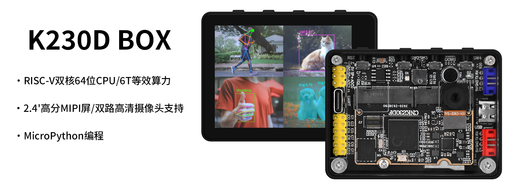

# 目录

- **入门指南**
  - [产品验收](./start-guide/product-acceptance)
  - [配套资料下载](./start-guide/download)
  - [固件烧录](./start-guide/firmware-flash)
  - [常见问题汇总（FAQ）](./start-guide/FAQ)

- **开发环境搭建**
  - [CanMV IDE安装](./set-up-development-environment/canmv-ide-install)
  - [CH342驱动安装](./set-up-development-environment/ch342-driver-install)

- **基础类实验**
  - [跑马灯实验](./example-base/led)
  - [蜂鸣器实验](./example-base/beep)
  - [按键输入实验](./example-base/key)
  - [看门狗实验](./example-base/wdt)
  - [定时器实验](./example-base/timer)
  - [呼吸灯实验](./example-base/breathing_lamp)
  - [RTC实验](./example-base/rtc)
  - [UART实验](./example-base/uart)
  - [Thread实验](./example-base/thread)
  - [LCD实验](./example-base/lcd)
  - [触摸屏实验](./example-base/touch)
  - [摄像头实验](./example-base/camera)
  - [文件读写实验](./example-base/file_system)
  - [录音机实验](./example-base/audio)
  - [照片拍摄实验](./example-base/photo)
  - [视频播放器实验](./example-base/video)

- **图像类实验**
  - [image元素绘制实验](./example-image/drawing)
  - [边缘检测实验](./example-image/edges)
  - [直线检测实验](./example-image/find_lines)
  - [线段检测实验](./example-image/find_segments)
  - [圆形检测实验](./example-image/find_circles)
  - [矩形检测实验](./example-image/find_rects)
  - [快速线性回归实验](./example-image/fast_linear_regression)
  - [单颜色识别实验](./example-image/single_color)
  - [多颜色识别实验](./example-image/mutli_color)
  - [色块计数实验](./example-image/color_count)
  - [色块追踪实验](./example-image/color_tracking)
  - [黑线循迹实验](./example-image/line_follow)
  - [二维码识别实验](./example-image/qrcodes)
  - [条形码识别实验](./example-image/barcode)
  - [AprilTags码识别实验](./example-image/apriltags)
  - [DM码识别实验](./example-image/data_matrices)

- **AI类实验**
  - [AI开发框架](./example-ai/development_framework)
  - [人脸检测实验](./example-ai/face_detection)
  - [人脸关键点检测实验](./example-ai/face_landmark)
  - [人脸姿态检测实验](./example-ai/face_pose)
  - [人脸识别实验](./example-ai/face_recognition)
  - [人体检测实验](./example-ai/person_detection)
  - [人体关键点检测实验](./example-ai/person_keypoint_detect)
  - [跌倒检测实验](./example-ai/falldown_detect)
  - [手掌检测实验](./example-ai/hand_detection)
  - [手势识别实验](./example-ai/hand_recognition)
  - [手掌关键点检测实验](./example-ai/hand_keypoint_detection)
  - [手掌关键点分类实验](./example-ai/hand_keypoint_class)
  - [动态手势识别实验](./example-ai/dynamic_gesture)
  - [局部放大器实验](./example-ai/space_resize)
  - [猜拳游戏实验](./example-ai/finger_guessing)
  - [物体检测实验](./example-ai/object_detect)
  - [物体分割实验](./example-ai/segment)
  - [车牌检测实验](./example-ai/licence_det)
  - [车牌号识别实验](./example-ai/licence_det_rec)
  - [关键词唤醒实验](./example-ai/keyword_spotting)
  - [自学习分类实验](./example-ai/self_learning)