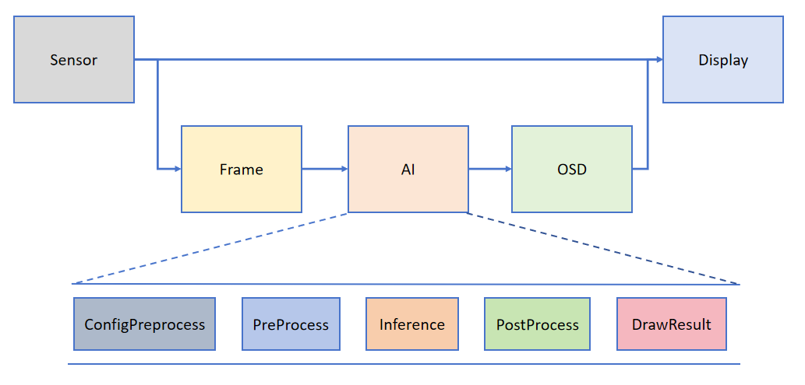

# CanMV AI开发框架

## 前言

在前面的章节中，我们已经学习了如何在CanMV下使用OpenMV库的一些方法来实现码类识别、颜色追踪、边缘检测等功能。这些功能的本质是将摄像头获取的图像通过OpenMV库中的特定函数进行简单的图像数学运算，最后对计算结果进行处理，从而实现相关功能。从本章开始，我们将通过人脸检测实验，介绍如何使用CanMV AI视觉开发框架和MicroPython编程实现单人或多个人脸检测功能。在本实验中，我们首先采集摄像头捕获的图像，然后经过图像预处理、模型推理和输出处理结果等一系列步骤，完成人脸检测的功能。最后，将检测结果绘制并显示在显示器上。通过本章的学习，读者将掌握如何在CanMV下使用CanMV AI视觉开发框架和MicroPython编程方法实现人脸检测功能。

## AI开发框架介绍

为了帮助用户简化AI部分的开发，基于K230D_CanMV提供的API接口，我们搭建了配套的AI开发框架。框架结构如下图所示：

根据框架图可知，Sensor默认输出两路图像：一路图像格式为YUV420SP(Sensor.YUV420SP)，直接提供给Display显示；另一路图像格式为RGBP888(Sensor.RGBP888)，则用于AI部分进行处理。AI主要负责任务的前处理、推理和后处理流程。处理完成后，结果将绘制在OSD图像实例上，并发送给Display进行叠加，最后在LCD和IDE缓冲区显示识别结果。

### API描述

在AI例程中，我们主要介绍图像识别相关的例程。图像识别类的AI程序较为复杂，需要使用K230D CanMV平台的多个硬件模块，如AI2D、KPU、Camera和Display等。此外，还需要使用多个软件接口协同工作。AI视觉开发框架的主要API接口包括：PineLine、Ai2d和AIBase。

#### 接口介绍

AI视觉识别的开发过程包括图像预处理、模型推理和输出后处理。我们将整个过程封装在Ai2D类和AIBase类中。要完成整个开发过程，主要使用以下四个类，这四个类分别提供了AI视觉识别开发过程中不同部分所需的功能。由于这四个类涉及的内容较多，这里不再展开详细讲述，详细介绍请参考对应链接。

- `PineLine`：由sensor模块、display模块二次封装的接口，用于设置摄像头图像采集、输出对应格式图像到AI处理和显示等。[点击查看详细介绍](https://developer.canaan-creative.com/k230_canmv/main/zh/example/ai/AI_Demo%E8%AF%B4%E6%98%8E%E6%96%87%E6%A1%A3.html#pipeline)

- `Ai2D`：图像预处理接口，提供crop/shift/pad/resize/affine等预处理方法。[点击查看详细介绍](https://developer.canaan-creative.com/k230_canmv/main/zh/example/ai/AI_Demo%E8%AF%B4%E6%98%8E%E6%96%87%E6%A1%A3.html#ai2d)
- `AIBase`：模型推理主要接口，也是进行AI开发主要关注的部分。[点击查看详细介绍](https://developer.canaan-creative.com/k230_canmv/main/zh/example/ai/AI_Demo%E8%AF%B4%E6%98%8E%E6%96%87%E6%A1%A3.html#aibase)
- `ScopedTiming`：测量代码块执行时间的上下文管理器。[点击查看详细介绍](https://developer.canaan-creative.com/k230_canmv/main/zh/example/ai/AI_Demo%E8%AF%B4%E6%98%8E%E6%96%87%E6%A1%A3.html#aibase)
