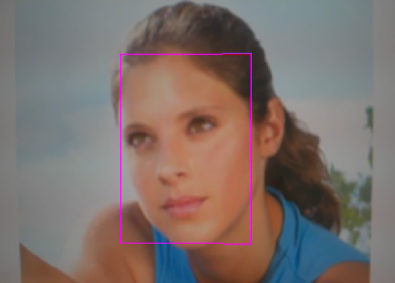
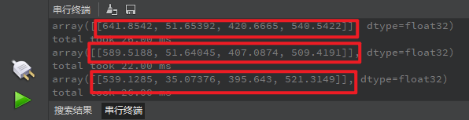

# 人脸检测实验

## 前言

在上一章节中，我们已经学习了如何在CanMV下使用CanMV AI视觉开发框架和MicroPython编程方法实现AI功能的开发。从本章开始，我们将通过人脸检测实验，介绍如何使用CanMV AI视觉开发框架和MicroPython编程实现单人或多个人脸检测功能。在本实验中，我们首先采集摄像头捕获的图像，然后经过图像预处理、模型推理和输出处理结果等一系列步骤，完成人脸检测的功能。最后，将检测结果绘制并显示在显示器上。通过本章的学习，读者将掌握如何在CanMV下使用CanMV AI视觉开发框架和MicroPython编程方法实现人脸检测功能。

## AI开发框架介绍

为了简化AI开发流程并降低AI开发难度，CanMV官方针对K230D专门搭建了AI开发框架，有关AI开发框架的介绍，请见[CanMV AI开发框架](development_framework.md)

## 硬件设计

### 例程功能

1. 获取摄像头输出的图像，通过CanMV K230D的AI推理能力检测图像中的人脸数据，并用矩形框进行标注，最后将图像显示在LCD上。

### 硬件资源

1. 本章实验内容主要讲解K230D的神经网络加速器KPU的使用，无需关注硬件资源。


### 原理图

1. 本章实验内容主要讲解K230D的神经网络加速器KPU的使用，无需关注原理图。

## 实验代码

``` python
from libs.PipeLine import PipeLine, ScopedTiming
from libs.AIBase import AIBase
from libs.AI2D import Ai2d
import os
import ujson
from media.media import *
from media.sensor import *
from time import *
import nncase_runtime as nn
import ulab.numpy as np
import time
import utime
import image
import random
import gc
import sys
import aidemo

# 自定义人脸检测类，继承自AIBase基类
class FaceDetectionApp(AIBase):
    def __init__(self, kmodel_path, model_input_size, anchors, confidence_threshold=0.5, nms_threshold=0.2, rgb888p_size=[224,224], display_size=[1920,1080], debug_mode=0):
        super().__init__(kmodel_path, model_input_size, rgb888p_size, debug_mode)  # 调用基类的构造函数
        self.kmodel_path = kmodel_path  # 模型文件路径
        self.model_input_size = model_input_size  # 模型输入分辨率
        self.confidence_threshold = confidence_threshold  # 置信度阈值
        self.nms_threshold = nms_threshold  # NMS（非极大值抑制）阈值
        self.anchors = anchors  # 锚点数据，用于目标检测
        self.rgb888p_size = [ALIGN_UP(rgb888p_size[0], 16), rgb888p_size[1]]  # sensor给到AI的图像分辨率，并对宽度进行16的对齐
        self.display_size = [ALIGN_UP(display_size[0], 16), display_size[1]]  # 显示分辨率，并对宽度进行16的对齐
        self.debug_mode = debug_mode  # 是否开启调试模式
        self.ai2d = Ai2d(debug_mode)  # 实例化Ai2d，用于实现模型预处理
        self.ai2d.set_ai2d_dtype(nn.ai2d_format.NCHW_FMT, nn.ai2d_format.NCHW_FMT, np.uint8, np.uint8)  # 设置Ai2d的输入输出格式和类型

    # 配置预处理操作，这里使用了pad和resize，Ai2d支持crop/shift/pad/resize/affine，具体代码请打开/sdcard/app/libs/AI2D.py查看
    def config_preprocess(self, input_image_size=None):
        with ScopedTiming("set preprocess config", self.debug_mode > 0):  # 计时器，如果debug_mode大于0则开启
            ai2d_input_size = input_image_size if input_image_size else self.rgb888p_size  # 初始化ai2d预处理配置，默认为sensor给到AI的尺寸，可以通过设置input_image_size自行修改输入尺寸
            top, bottom, left, right = self.get_padding_param()  # 获取padding参数
            self.ai2d.pad([0, 0, 0, 0, top, bottom, left, right], 0, [104, 117, 123])  # 填充边缘
            self.ai2d.resize(nn.interp_method.tf_bilinear, nn.interp_mode.half_pixel)  # 缩放图像
            self.ai2d.build([1,3,ai2d_input_size[1],ai2d_input_size[0]],[1,3,self.model_input_size[1],self.model_input_size[0]])  # 构建预处理流程

    # 自定义当前任务的后处理，results是模型输出array列表，这里使用了aidemo库的face_det_post_process接口
    def postprocess(self, results):
        with ScopedTiming("postprocess", self.debug_mode > 0):
            post_ret = aidemo.face_det_post_process(self.confidence_threshold, self.nms_threshold, self.model_input_size[1], self.anchors, self.rgb888p_size, results)
            if len(post_ret) == 0:
                return post_ret
            else:
                return post_ret[0]

    # 绘制检测结果到画面上
    def draw_result(self, pl, dets):
        with ScopedTiming("display_draw", self.debug_mode > 0):
            if dets:
                pl.osd_img.clear()  # 清除OSD图像
                for det in dets:
                    # 将检测框的坐标转换为显示分辨率下的坐标
                    x, y, w, h = map(lambda x: int(round(x, 0)), det[:4])
                    x = x * self.display_size[0] // self.rgb888p_size[0]
                    y = y * self.display_size[1] // self.rgb888p_size[1]
                    w = w * self.display_size[0] // self.rgb888p_size[0]
                    h = h * self.display_size[1] // self.rgb888p_size[1]
                    pl.osd_img.draw_rectangle(x, y, w, h, color=(255, 255, 0, 255), thickness=2)  # 绘制矩形框
            else:
                pl.osd_img.clear()

    # 获取padding参数
    def get_padding_param(self):
        dst_w = self.model_input_size[0]  # 模型输入宽度
        dst_h = self.model_input_size[1]  # 模型输入高度
        ratio_w = dst_w / self.rgb888p_size[0]  # 宽度缩放比例
        ratio_h = dst_h / self.rgb888p_size[1]  # 高度缩放比例
        ratio = min(ratio_w, ratio_h)  # 取较小的缩放比例
        new_w = int(ratio * self.rgb888p_size[0])  # 新宽度
        new_h = int(ratio * self.rgb888p_size[1])  # 新高度
        dw = (dst_w - new_w) / 2  # 宽度差
        dh = (dst_h - new_h) / 2  # 高度差
        top = int(round(0))
        bottom = int(round(dh * 2 + 0.1))
        left = int(round(0))
        right = int(round(dw * 2 - 0.1))
        return top, bottom, left, right

if __name__ == "__main__":
    # 显示模式，默认"lcd"
    display_mode="lcd"
    display_size=[640,480]
    # 设置模型路径和其他参数
    kmodel_path = "/sdcard/examples/kmodel/face_detection_320.kmodel"
    # 其它参数
    confidence_threshold = 0.5
    nms_threshold = 0.2
    anchor_len = 4200
    det_dim = 4
    anchors_path = "/sdcard/examples/utils/prior_data_320.bin"
    anchors = np.fromfile(anchors_path, dtype=np.float)
    anchors = anchors.reshape((anchor_len, det_dim))
    rgb888p_size = [640, 360]

    # 初始化PipeLine，用于图像处理流程
    sensor = Sensor(width=1280, height=960) # 构建摄像头对象
    pl = PipeLine(rgb888p_size=rgb888p_size, display_size=display_size, display_mode=display_mode)
    pl.create(sensor=sensor)  # 创建PipeLine实例
    # 初始化自定义人脸检测实例
    face_det = FaceDetectionApp(kmodel_path, model_input_size=[320, 320], anchors=anchors, confidence_threshold=confidence_threshold, nms_threshold=nms_threshold, rgb888p_size=rgb888p_size, display_size=display_size, debug_mode=0)
    face_det.config_preprocess()  # 配置预处理

    try:
        while True:
            os.exitpoint()                      # 检查是否有退出信号
            with ScopedTiming("total",1):
                img = pl.get_frame()            # 获取当前帧数据
                res = face_det.run(img)         # 推理当前帧
                # 当检测到人脸时，打印结果
#                if res:
#                    print(res)
                face_det.draw_result(pl, res)   # 绘制结果
                pl.show_image()                 # 显示结果
                gc.collect()                    # 垃圾回收
    except Exception as e:
        sys.print_exception(e)                  # 打印异常信息
    finally:
        face_det.deinit()                       # 反初始化
        pl.destroy()                            # 销毁PipeLine实例
```

可以看到首先是定义显示模式、图像大小、模型相关的一些变量。

接着是通过初始化PipeLine，这里主要初始化sensor和display模块，配置摄像头输出两路不同的格式和大小的图像，以及设置显示模式，完成创建PipeLine实例。

然后调用自定义FaceDetectionApp类完成对AIBase接口的初始化以及使用Ai2D接口的一些方法定义人脸检测模型输入图像的预处理方法。

最后在一个循环中不断地获取摄像头输出RGBP888格式的图像帧，并将其送入KPU中进行运算，推理图像中是否存在人脸信息，当图像中存在人脸时，会通过print打印人脸结果，接着将这些信息绘制到图像上后，在 LCD 上显示图像。

## 运行验证

实验原图如下所示：


将K230D BOX开发板连接CanMV IDE，点击CanMV IDE上的“开始(运行脚本)”按钮后，将摄像头对准人脸，让其采集到人脸图像，随后便能在LCD上看到摄像头输出的图像，同时图像中的人脸均被红色的矩形框框出，如下图所示：  



点击左下角“串行终端”，可以看到“串行终端”窗口中输出了一系列信息，如下图所示：



可以看到，二维数组array中存在一个元素，该元素是浮点类型。这个元素表示检测到图像中存在一个人脸。每个元素包含四个数据，可以表示为 [x, y, w, h] 的矩形框，其中x和y是矩形框的左上角坐标，w和h分别表示矩形框的宽度和高度。这样，我们就可以确定这个人脸在RGBP888图像中的位置和大小。为了准确地显示在屏幕上，我们需要将这些坐标和尺寸乘以一个缩放值（即LCD显示的分辨率与RGBP888图像尺寸的比值），从而获得在LCD显示器中人脸的区域。根据获得的值绘制矩形框，即可将人脸标注出来。
