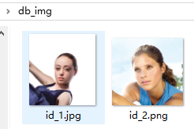
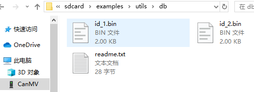
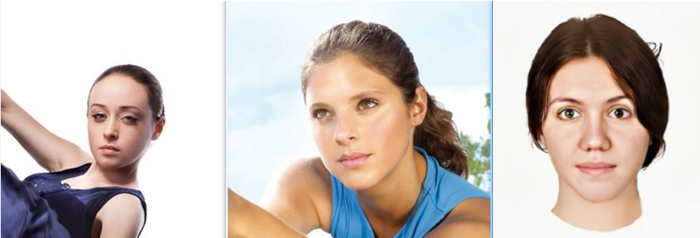
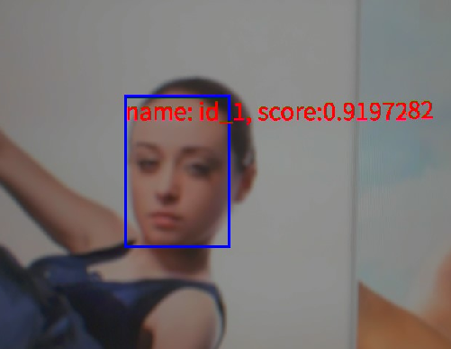
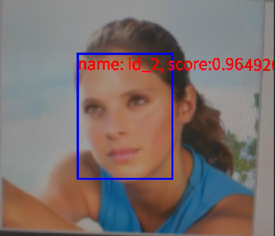
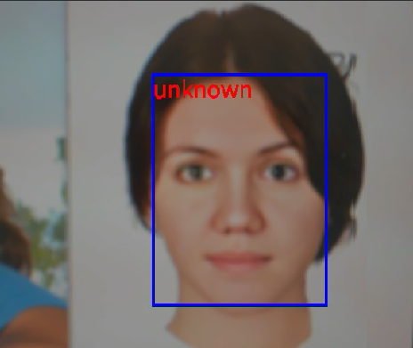

# 人脸识别实验

## 前言

在上一章节中，我们已经学习了如何在CanMV下使用CanMV AI视觉开发框架和MicroPython编程方法实现人脸姿态检测的功能，本章将通过人脸识别实验，介绍如何使用CanMV AI视觉开发框架和MicroPython编程实现人脸特征值的读取，并通过人脸特性比对的方法实现人脸识别。本实验一共分为两个部分，一个是进行人脸特征值读取并注册人脸信息到数据库的人脸注册程序，另一部分是根据已有的人脸特征信息进行人脸区分的人脸识别程序，人脸注册是人脸识别的前置任务，对人脸数据库中每一张包含人脸的图片进行特征化，并将人脸特征以bin文件的形式写入人脸数据库目录，以备人脸识别程序调用。人脸识别应用是基于人脸注册的信息对视频中的每一帧图片做人脸身份识别，如果识别到的人脸在注册数据库中，则标注识别人脸的身份信息，否则显示unknown。通过这两个步骤即可对人脸特征进行区分，从而实现人脸识别的功能。最后根据识别结果将人脸信息绘制并显示到显示器上。通过本章的学习，读者将掌握如何在CanMV下使用CanMV AI视觉开发框架和MicroPython编程方法实现人脸识别功能。

## AI开发框架介绍

为了帮助用户简化AI部分的开发，基于K230D_CanMV提供的API接口，我们搭建了配套的AI开发框架。框架结构如下图所示：


根据框架图可知，Sensor默认输出两路图像：一路图像格式为YUV420SP(Sensor.YUV420SP)，直接提供给Display显示；另一路图像格式为RGBP888(Sensor.RGBP888)，则用于AI部分进行处理。AI主要负责任务的前处理、推理和后处理流程。处理完成后，结果将绘制在OSD图像实例上，并发送给Display进行叠加，最后在LCD和IDE缓冲区显示识别结果。

### API描述

在AI例程中，我们主要介绍图像识别相关的例程。图像识别类的AI程序较为复杂，需要使用K230D CanMV平台的多个硬件模块，如AI2D、KPU、Camera和Display等。此外，还需要使用多个软件接口协同工作。AI视觉开发框架的主要API接口包括：PineLine、Ai2d和AIBase。

#### 接口介绍

AI视觉识别的开发过程包括图像预处理、模型推理和输出后处理。我们将整个过程封装在Ai2D类和AIBase类中。要完成整个开发过程，主要使用以下四个类，这四个类分别提供了AI视觉识别开发过程中不同部分所需的功能。由于这四个类涉及的内容较多，这里不再展开详细讲述，详细介绍请参考对应链接。

- `PineLine`：由sensor模块、display模块二次封装的接口，用于设置摄像头图像采集、输出对应格式图像到AI处理和显示等。[点击查看详细介绍](https://developer.canaan-creative.com/k230_canmv/main/zh/example/ai/AI_Demo%E8%AF%B4%E6%98%8E%E6%96%87%E6%A1%A3.html#pipeline)

- `Ai2D`：图像预处理接口，提供crop/shift/pad/resize/affine等预处理方法。[点击查看详细介绍](https://developer.canaan-creative.com/k230_canmv/main/zh/example/ai/AI_Demo%E8%AF%B4%E6%98%8E%E6%96%87%E6%A1%A3.html#ai2d)
- `AIBase`：模型推理主要接口，也是进行AI开发主要关注的部分。[点击查看详细介绍](https://developer.canaan-creative.com/k230_canmv/main/zh/example/ai/AI_Demo%E8%AF%B4%E6%98%8E%E6%96%87%E6%A1%A3.html#aibase)
- `ScopedTiming`：测量代码块执行时间的上下文管理器。[点击查看详细介绍](https://developer.canaan-creative.com/k230_canmv/main/zh/example/ai/AI_Demo%E8%AF%B4%E6%98%8E%E6%96%87%E6%A1%A3.html#aibase)

## 硬件设计

### 例程功能

1. 人脸注册程序，即main1.py：从"/sdcard/examples/utils/db_img/"路径读取注册人脸的图片进行人脸特征值读取，并将人脸特征信息以bin文件的形式写入人脸数据库（目录路径为："/sdcard/examples/utils/db/"），运行结束后即可供人脸识别程序调用，所以运行人脸识别程序前，一定要先运行人脸注册程序。
1. 人脸识别程序，即main2.py：获取摄像头输出的图像，然后将图像输入到CanMV K230D的AI模型进行推理，本实验使用了两个AI模型，一个是前面章节使用到的人脸检测模型，另一个是用于实现人脸特征比对的人脸识别模型。人脸检测模型负责找出图像中的人脸区域，然后将该区域传递给人脸识别模型进行人脸特征值提取，然后将提取的人脸与注册数据库的数据进行比对，如果识别到的人脸在注册数据库中，则标注识别人脸的身份信息，否则显示unknown，最后将图像显示在LCD上。

### 硬件资源

1. 本章实验内容主要讲解K230D的神经网络加速器KPU的使用，无需关注硬件资源。


### 原理图

1. 本章实验内容主要讲解K230D的神经网络加速器KPU的使用，无需关注原理图。

## 实验代码

### 人脸注册程序

``` python
from libs.PipeLine import PipeLine, ScopedTiming
from libs.AIBase import AIBase
from libs.AI2D import Ai2d
import os
import ujson
from media.media import *
from media.sensor import *
from time import *
import nncase_runtime as nn
import ulab.numpy as np
import time
import image
import aidemo
import random
import gc
import sys
import math

# 自定义人脸检测任务类
class FaceDetApp(AIBase):
    def __init__(self,kmodel_path,model_input_size,anchors,confidence_threshold=0.25,nms_threshold=0.3,rgb888p_size=[1280,720],display_size=[1920,1080],debug_mode=0):
        super().__init__(kmodel_path,model_input_size,rgb888p_size,debug_mode)
        # kmodel路径
        self.kmodel_path=kmodel_path
        # 检测模型输入分辨率
        self.model_input_size=model_input_size
        # 置信度阈值
        self.confidence_threshold=confidence_threshold
        # nms阈值
        self.nms_threshold=nms_threshold
        self.anchors=anchors
        # sensor给到AI的图像分辨率，宽16字节对齐
        self.rgb888p_size=[ALIGN_UP(rgb888p_size[0],16),rgb888p_size[1]]
        # 视频输出VO分辨率，宽16字节对齐
        self.display_size=[ALIGN_UP(display_size[0],16),display_size[1]]
        # debug模式
        self.debug_mode=debug_mode
        # 实例化Ai2d，用于实现模型预处理
        self.ai2d=Ai2d(debug_mode)
        # 设置Ai2d的输入输出格式和类型
        self.ai2d.set_ai2d_dtype(nn.ai2d_format.NCHW_FMT,nn.ai2d_format.NCHW_FMT,np.uint8, np.uint8)
        self.image_size=[]

    # 配置预处理操作，这里使用了pad和resize，Ai2d支持crop/shift/pad/resize/affine，具体代码请打开/sdcard/app/libs/AI2D.py查看
    def config_preprocess(self,input_image_size=None):
        with ScopedTiming("set preprocess config",self.debug_mode > 0):
            # 初始化ai2d预处理配置，默认为sensor给到AI的尺寸，可以通过设置input_image_size自行修改输入尺寸
            ai2d_input_size=input_image_size if input_image_size else self.rgb888p_size
            self.image_size=[input_image_size[1],input_image_size[0]]
            # 计算padding参数，并设置padding预处理
            self.ai2d.pad(self.get_pad_param(ai2d_input_size), 0, [104,117,123])
            # 设置resize预处理
            self.ai2d.resize(nn.interp_method.tf_bilinear, nn.interp_mode.half_pixel)
            # 构建预处理流程,参数为预处理输入tensor的shape和预处理输出的tensor的shape
            self.ai2d.build([1,3,ai2d_input_size[1],ai2d_input_size[0]],[1,3,self.model_input_size[1],self.model_input_size[0]])

    # 自定义后处理，results是模型输出的array列表，这里使用了aidemo库的face_det_post_process接口
    def postprocess(self,results):
        with ScopedTiming("postprocess",self.debug_mode > 0):
            res = aidemo.face_det_post_process(self.confidence_threshold,self.nms_threshold,self.model_input_size[0],self.anchors,self.image_size,results)
            if len(res)==0:
                return res
            else:
                return res[0],res[1]

    def get_pad_param(self,image_input_size):
        dst_w = self.model_input_size[0]
        dst_h = self.model_input_size[1]
        # 计算最小的缩放比例，等比例缩放
        ratio_w = dst_w / image_input_size[0]
        ratio_h = dst_h / image_input_size[1]
        if ratio_w < ratio_h:
            ratio = ratio_w
        else:
            ratio = ratio_h
        new_w = (int)(ratio * image_input_size[0])
        new_h = (int)(ratio * image_input_size[1])
        dw = (dst_w - new_w) / 2
        dh = (dst_h - new_h) / 2
        top = (int)(round(0))
        bottom = (int)(round(dh * 2 + 0.1))
        left = (int)(round(0))
        right = (int)(round(dw * 2 - 0.1))
        return [0,0,0,0,top, bottom, left, right]

# 自定义人脸注册任务类
class FaceRegistrationApp(AIBase):
    def __init__(self,kmodel_path,model_input_size,rgb888p_size=[1920,1080],display_size=[1920,1080],debug_mode=0):
        super().__init__(kmodel_path,model_input_size,rgb888p_size,debug_mode)
        # kmodel路径
        self.kmodel_path=kmodel_path
        # 人脸注册模型输入分辨率
        self.model_input_size=model_input_size
        # sensor给到AI的图像分辨率，宽16字节对齐
        self.rgb888p_size=[ALIGN_UP(rgb888p_size[0],16),rgb888p_size[1]]
        # 视频输出VO分辨率，宽16字节对齐
        self.display_size=[ALIGN_UP(display_size[0],16),display_size[1]]
        # debug模式
        self.debug_mode=debug_mode
        # 标准5官
        self.umeyama_args_112 = [
            38.2946 , 51.6963 ,
            73.5318 , 51.5014 ,
            56.0252 , 71.7366 ,
            41.5493 , 92.3655 ,
            70.7299 , 92.2041
        ]
        self.ai2d=Ai2d(debug_mode)
        self.ai2d.set_ai2d_dtype(nn.ai2d_format.NCHW_FMT,nn.ai2d_format.NCHW_FMT,np.uint8, np.uint8)

    # 配置预处理操作，这里使用了affine，Ai2d支持crop/shift/pad/resize/affine，具体代码请打开/sdcard/app/libs/AI2D.py查看
    def config_preprocess(self,landm,input_image_size=None):
        with ScopedTiming("set preprocess config",self.debug_mode > 0):
            ai2d_input_size=input_image_size if input_image_size else self.rgb888p_size
            # 计算affine矩阵，并设置仿射变换预处理
            affine_matrix = self.get_affine_matrix(landm)
            self.ai2d.affine(nn.interp_method.cv2_bilinear,0, 0, 127, 1,affine_matrix)
            # 构建预处理流程,参数为预处理输入tensor的shape和预处理输出的tensor的shape
            self.ai2d.build([1,3,ai2d_input_size[1],ai2d_input_size[0]],[1,3,self.model_input_size[1],self.model_input_size[0]])

    # 自定义后处理
    def postprocess(self,results):
        with ScopedTiming("postprocess",self.debug_mode > 0):
            return results[0][0]

    def svd22(self,a):
        # svd
        s = [0.0, 0.0]
        u = [0.0, 0.0, 0.0, 0.0]
        v = [0.0, 0.0, 0.0, 0.0]
        s[0] = (math.sqrt((a[0] - a[3]) ** 2 + (a[1] + a[2]) ** 2) + math.sqrt((a[0] + a[3]) ** 2 + (a[1] - a[2]) ** 2)) / 2
        s[1] = abs(s[0] - math.sqrt((a[0] - a[3]) ** 2 + (a[1] + a[2]) ** 2))
        v[2] = math.sin((math.atan2(2 * (a[0] * a[1] + a[2] * a[3]), a[0] ** 2 - a[1] ** 2 + a[2] ** 2 - a[3] ** 2)) / 2) if \
        s[0] > s[1] else 0
        v[0] = math.sqrt(1 - v[2] ** 2)
        v[1] = -v[2]
        v[3] = v[0]
        u[0] = -(a[0] * v[0] + a[1] * v[2]) / s[0] if s[0] != 0 else 1
        u[2] = -(a[2] * v[0] + a[3] * v[2]) / s[0] if s[0] != 0 else 0
        u[1] = (a[0] * v[1] + a[1] * v[3]) / s[1] if s[1] != 0 else -u[2]
        u[3] = (a[2] * v[1] + a[3] * v[3]) / s[1] if s[1] != 0 else u[0]
        v[0] = -v[0]
        v[2] = -v[2]
        return u, s, v

    def image_umeyama_112(self,src):
        # 使用Umeyama算法计算仿射变换矩阵
        SRC_NUM = 5
        SRC_DIM = 2
        src_mean = [0.0, 0.0]
        dst_mean = [0.0, 0.0]
        for i in range(0,SRC_NUM * 2,2):
            src_mean[0] += src[i]
            src_mean[1] += src[i + 1]
            dst_mean[0] += self.umeyama_args_112[i]
            dst_mean[1] += self.umeyama_args_112[i + 1]
        src_mean[0] /= SRC_NUM
        src_mean[1] /= SRC_NUM
        dst_mean[0] /= SRC_NUM
        dst_mean[1] /= SRC_NUM
        src_demean = [[0.0, 0.0] for _ in range(SRC_NUM)]
        dst_demean = [[0.0, 0.0] for _ in range(SRC_NUM)]
        for i in range(SRC_NUM):
            src_demean[i][0] = src[2 * i] - src_mean[0]
            src_demean[i][1] = src[2 * i + 1] - src_mean[1]
            dst_demean[i][0] = self.umeyama_args_112[2 * i] - dst_mean[0]
            dst_demean[i][1] = self.umeyama_args_112[2 * i + 1] - dst_mean[1]
        A = [[0.0, 0.0], [0.0, 0.0]]
        for i in range(SRC_DIM):
            for k in range(SRC_DIM):
                for j in range(SRC_NUM):
                    A[i][k] += dst_demean[j][i] * src_demean[j][k]
                A[i][k] /= SRC_NUM
        T = [[1, 0, 0], [0, 1, 0], [0, 0, 1]]
        U, S, V = self.svd22([A[0][0], A[0][1], A[1][0], A[1][1]])
        T[0][0] = U[0] * V[0] + U[1] * V[2]
        T[0][1] = U[0] * V[1] + U[1] * V[3]
        T[1][0] = U[2] * V[0] + U[3] * V[2]
        T[1][1] = U[2] * V[1] + U[3] * V[3]
        scale = 1.0
        src_demean_mean = [0.0, 0.0]
        src_demean_var = [0.0, 0.0]
        for i in range(SRC_NUM):
            src_demean_mean[0] += src_demean[i][0]
            src_demean_mean[1] += src_demean[i][1]
        src_demean_mean[0] /= SRC_NUM
        src_demean_mean[1] /= SRC_NUM
        for i in range(SRC_NUM):
            src_demean_var[0] += (src_demean_mean[0] - src_demean[i][0]) * (src_demean_mean[0] - src_demean[i][0])
            src_demean_var[1] += (src_demean_mean[1] - src_demean[i][1]) * (src_demean_mean[1] - src_demean[i][1])
        src_demean_var[0] /= SRC_NUM
        src_demean_var[1] /= SRC_NUM
        scale = 1.0 / (src_demean_var[0] + src_demean_var[1]) * (S[0] + S[1])
        T[0][2] = dst_mean[0] - scale * (T[0][0] * src_mean[0] + T[0][1] * src_mean[1])
        T[1][2] = dst_mean[1] - scale * (T[1][0] * src_mean[0] + T[1][1] * src_mean[1])
        T[0][0] *= scale
        T[0][1] *= scale
        T[1][0] *= scale
        T[1][1] *= scale
        return T

    def get_affine_matrix(self,sparse_points):
        # 获取affine变换矩阵
        with ScopedTiming("get_affine_matrix", self.debug_mode > 1):
            # 使用Umeyama算法计算仿射变换矩阵
            matrix_dst = self.image_umeyama_112(sparse_points)
            matrix_dst = [matrix_dst[0][0],matrix_dst[0][1],matrix_dst[0][2],
                          matrix_dst[1][0],matrix_dst[1][1],matrix_dst[1][2]]
            return matrix_dst

# 人脸注册任务类
class FaceRegistration:
    def __init__(self,face_det_kmodel,face_reg_kmodel,det_input_size,reg_input_size,database_dir,anchors,confidence_threshold=0.25,nms_threshold=0.3,rgb888p_size=[1280,720],display_size=[1920,1080],debug_mode=0):
        # 人脸检测模型路径
        self.face_det_kmodel=face_det_kmodel
        # 人脸注册模型路径
        self.face_reg_kmodel=face_reg_kmodel
        # 人脸检测模型输入分辨率
        self.det_input_size=det_input_size
        # 人脸注册模型输入分辨率
        self.reg_input_size=reg_input_size
        self.database_dir=database_dir
        # anchors
        self.anchors=anchors
        # 置信度阈值
        self.confidence_threshold=confidence_threshold
        # nms阈值
        self.nms_threshold=nms_threshold
        # sensor给到AI的图像分辨率，宽16字节对齐
        self.rgb888p_size=[ALIGN_UP(rgb888p_size[0],16),rgb888p_size[1]]
        # 视频输出VO分辨率，宽16字节对齐
        self.display_size=[ALIGN_UP(display_size[0],16),display_size[1]]
        # debug_mode模式
        self.debug_mode=debug_mode
        self.face_det=FaceDetApp(self.face_det_kmodel,model_input_size=self.det_input_size,anchors=self.anchors,confidence_threshold=self.confidence_threshold,nms_threshold=self.nms_threshold,debug_mode=0)
        self.face_reg=FaceRegistrationApp(self.face_reg_kmodel,model_input_size=self.reg_input_size,rgb888p_size=self.rgb888p_size)

    # run函数
    def run(self,input_np,img_file):
        self.face_det.config_preprocess(input_image_size=[input_np.shape[3],input_np.shape[2]])
        det_boxes,landms=self.face_det.run(input_np)
        if det_boxes:
            if det_boxes.shape[0] == 1:
                # 若是只检测到一张人脸，则将该人脸注册到数据库
                db_i_name = img_file.split('.')[0]
                for landm in landms:
                    self.face_reg.config_preprocess(landm,input_image_size=[input_np.shape[3],input_np.shape[2]])
                    reg_result = self.face_reg.run(input_np)
                    with open(self.database_dir+'{}.bin'.format(db_i_name), "wb") as file:
                        file.write(reg_result.tobytes())
                        print('Success!')
            else:
                print('Only one person in a picture when you sign up')
        else:
            print('No person detected')

    def image2rgb888array(self,img):   #4维
        # 将Image转换为rgb888格式
        with ScopedTiming("fr_kpu_deinit",self.debug_mode > 0):
            img_data_rgb888=img.to_rgb888()
            # hwc,rgb888
            img_hwc=img_data_rgb888.to_numpy_ref()
            shape=img_hwc.shape
            img_tmp = img_hwc.reshape((shape[0] * shape[1], shape[2]))
            img_tmp_trans = img_tmp.transpose()
            img_res=img_tmp_trans.copy()
            # chw,rgb888
            img_return=img_res.reshape((1,shape[2],shape[0],shape[1]))
        return  img_return


if __name__=="__main__":
    # 人脸检测模型路径
    face_det_kmodel_path="/sdcard/examples/kmodel/face_detection_320.kmodel"
    # 人脸注册模型路径
    face_reg_kmodel_path="/sdcard/examples/kmodel/face_recognition.kmodel"
    # 其它参数
    anchors_path="/sdcard/examples/utils/prior_data_320.bin"
    database_dir="/sdcard/examples/utils/db/"               # 人脸信息注册数据存放路径
    database_img_dir="/sdcard/examples/utils/db_img/"       # 需要注册的人脸图片存放位置
    face_det_input_size=[320,320]
    face_reg_input_size=[112,112]
    confidence_threshold=0.5
    nms_threshold=0.2
    anchor_len=4200
    det_dim=4
    anchors = np.fromfile(anchors_path, dtype=np.float)
    anchors = anchors.reshape((anchor_len,det_dim))
    max_register_face = 100              #数据库最多人脸个数
    feature_num = 128                    #人脸识别特征维度

    fr=FaceRegistration(face_det_kmodel_path,face_reg_kmodel_path,det_input_size=face_det_input_size,reg_input_size=face_reg_input_size,database_dir=database_dir,anchors=anchors,confidence_threshold=confidence_threshold,nms_threshold=nms_threshold)
    try:
        # 获取图像列表
        img_list = os.listdir(database_img_dir)
        for img_file in img_list:
            #本地读取一张图像
            full_img_file = database_img_dir + img_file
            print(full_img_file)
            img = image.Image(full_img_file)
            img.compress_for_ide()
            # 转rgb888的chw格式
            rgb888p_img_ndarry = fr.image2rgb888array(img)
            # 人脸注册
            fr.run(rgb888p_img_ndarry,img_file)
            gc.collect()
    except Exception as e:
        sys.print_exception(e)
    finally:
        fr.face_det.deinit()
        fr.face_reg.deinit()
```

可以看到首先定义了模型路径、人脸注册的图像文件路径、注册人脸数据库的路径等，然后调用自定义FaceRegistration类构建人脸姿态任务类，FaceRegistration类会通过调用FaceDetApp类和FaceRegistrationApp类完成对AIBase接口的初始化以及使用Ai2D接口的方法定义人脸检测模型和人脸注册模型输入图像的预处理方法。

接着依次从/sdcard/examples/utils/db_img/路径读取需要注册的人脸图像进行注册，然后注册的人脸特征信息以bin文件的形式存放于注册人脸数据库中。

### 人脸识别程序

``` python
from libs.PipeLine import PipeLine, ScopedTiming
from libs.AIBase import AIBase
from libs.AI2D import Ai2d
import os
import ujson
from media.media import *
from media.sensor import *
from time import *
import nncase_runtime as nn
import ulab.numpy as np
import time
import image
import aidemo
import random
import gc
import sys
import math

# 自定义人脸检测任务类
class FaceDetApp(AIBase):
    def __init__(self,kmodel_path,model_input_size,anchors,confidence_threshold=0.25,nms_threshold=0.3,rgb888p_size=[1920,1080],display_size=[1920,1080],debug_mode=0):
        super().__init__(kmodel_path,model_input_size,rgb888p_size,debug_mode)
        # kmodel路径
        self.kmodel_path=kmodel_path
        # 检测模型输入分辨率
        self.model_input_size=model_input_size
        # 置信度阈值
        self.confidence_threshold=confidence_threshold
        # nms阈值
        self.nms_threshold=nms_threshold
        self.anchors=anchors
        # sensor给到AI的图像分辨率，宽16字节对齐
        self.rgb888p_size=[ALIGN_UP(rgb888p_size[0],16),rgb888p_size[1]]
        # 视频输出VO分辨率，宽16字节对齐
        self.display_size=[ALIGN_UP(display_size[0],16),display_size[1]]
        # debug模式
        self.debug_mode=debug_mode
        # 实例化Ai2d，用于实现模型预处理
        self.ai2d=Ai2d(debug_mode)
        # 设置Ai2d的输入输出格式和类型
        self.ai2d.set_ai2d_dtype(nn.ai2d_format.NCHW_FMT,nn.ai2d_format.NCHW_FMT,np.uint8, np.uint8)

    # 配置预处理操作，这里使用了pad和resize，Ai2d支持crop/shift/pad/resize/affine，具体代码请打开/sdcard/app/libs/AI2D.py查看
    def config_preprocess(self,input_image_size=None):
        with ScopedTiming("set preprocess config",self.debug_mode > 0):
            # 初始化ai2d预处理配置，默认为sensor给到AI的尺寸，可以通过设置input_image_size自行修改输入尺寸
            ai2d_input_size=input_image_size if input_image_size else self.rgb888p_size
            # 计算padding参数，并设置padding预处理
            self.ai2d.pad(self.get_pad_param(), 0, [104,117,123])
            # 设置resize预处理
            self.ai2d.resize(nn.interp_method.tf_bilinear, nn.interp_mode.half_pixel)
            # 构建预处理流程,参数为预处理输入tensor的shape和预处理输出的tensor的shape
            self.ai2d.build([1,3,ai2d_input_size[1],ai2d_input_size[0]],[1,3,self.model_input_size[1],self.model_input_size[0]])

    # 自定义后处理，results是模型输出的array列表，这里使用了aidemo库的face_det_post_process接口
    def postprocess(self,results):
        with ScopedTiming("postprocess",self.debug_mode > 0):
            res = aidemo.face_det_post_process(self.confidence_threshold,self.nms_threshold,self.model_input_size[0],self.anchors,self.rgb888p_size,results)
            if len(res)==0:
                return res,res
            else:
                return res[0],res[1]

    def get_pad_param(self):
        dst_w = self.model_input_size[0]
        dst_h = self.model_input_size[1]
        # 计算最小的缩放比例，等比例缩放
        ratio_w = dst_w / self.rgb888p_size[0]
        ratio_h = dst_h / self.rgb888p_size[1]
        if ratio_w < ratio_h:
            ratio = ratio_w
        else:
            ratio = ratio_h
        new_w = (int)(ratio * self.rgb888p_size[0])
        new_h = (int)(ratio * self.rgb888p_size[1])
        dw = (dst_w - new_w) / 2
        dh = (dst_h - new_h) / 2
        top = (int)(round(0))
        bottom = (int)(round(dh * 2 + 0.1))
        left = (int)(round(0))
        right = (int)(round(dw * 2 - 0.1))
        return [0,0,0,0,top, bottom, left, right]

# 自定义人脸注册任务类
class FaceRegistrationApp(AIBase):
    def __init__(self,kmodel_path,model_input_size,rgb888p_size=[1920,1080],display_size=[1920,1080],debug_mode=0):
        super().__init__(kmodel_path,model_input_size,rgb888p_size,debug_mode)
        # kmodel路径
        self.kmodel_path=kmodel_path
        # 检测模型输入分辨率
        self.model_input_size=model_input_size
        # sensor给到AI的图像分辨率，宽16字节对齐
        self.rgb888p_size=[ALIGN_UP(rgb888p_size[0],16),rgb888p_size[1]]
        # 视频输出VO分辨率，宽16字节对齐
        self.display_size=[ALIGN_UP(display_size[0],16),display_size[1]]
        # debug模式
        self.debug_mode=debug_mode
        # 标准5官
        self.umeyama_args_112 = [
            38.2946 , 51.6963 ,
            73.5318 , 51.5014 ,
            56.0252 , 71.7366 ,
            41.5493 , 92.3655 ,
            70.7299 , 92.2041
        ]
        self.ai2d=Ai2d(debug_mode)
        self.ai2d.set_ai2d_dtype(nn.ai2d_format.NCHW_FMT,nn.ai2d_format.NCHW_FMT,np.uint8, np.uint8)

    # 配置预处理操作，这里使用了affine，Ai2d支持crop/shift/pad/resize/affine，具体代码请打开/sdcard/app/libs/AI2D.py查看
    def config_preprocess(self,landm,input_image_size=None):
        with ScopedTiming("set preprocess config",self.debug_mode > 0):
            ai2d_input_size=input_image_size if input_image_size else self.rgb888p_size
            # 计算affine矩阵，并设置仿射变换预处理
            affine_matrix = self.get_affine_matrix(landm)
            self.ai2d.affine(nn.interp_method.cv2_bilinear,0, 0, 127, 1,affine_matrix)
            # 构建预处理流程,参数为预处理输入tensor的shape和预处理输出的tensor的shape
            self.ai2d.build([1,3,ai2d_input_size[1],ai2d_input_size[0]],[1,3,self.model_input_size[1],self.model_input_size[0]])

    # 自定义后处理
    def postprocess(self,results):
        with ScopedTiming("postprocess",self.debug_mode > 0):
            return results[0][0]

    def svd22(self,a):
        # svd
        s = [0.0, 0.0]
        u = [0.0, 0.0, 0.0, 0.0]
        v = [0.0, 0.0, 0.0, 0.0]
        s[0] = (math.sqrt((a[0] - a[3]) ** 2 + (a[1] + a[2]) ** 2) + math.sqrt((a[0] + a[3]) ** 2 + (a[1] - a[2]) ** 2)) / 2
        s[1] = abs(s[0] - math.sqrt((a[0] - a[3]) ** 2 + (a[1] + a[2]) ** 2))
        v[2] = math.sin((math.atan2(2 * (a[0] * a[1] + a[2] * a[3]), a[0] ** 2 - a[1] ** 2 + a[2] ** 2 - a[3] ** 2)) / 2) if \
        s[0] > s[1] else 0
        v[0] = math.sqrt(1 - v[2] ** 2)
        v[1] = -v[2]
        v[3] = v[0]
        u[0] = -(a[0] * v[0] + a[1] * v[2]) / s[0] if s[0] != 0 else 1
        u[2] = -(a[2] * v[0] + a[3] * v[2]) / s[0] if s[0] != 0 else 0
        u[1] = (a[0] * v[1] + a[1] * v[3]) / s[1] if s[1] != 0 else -u[2]
        u[3] = (a[2] * v[1] + a[3] * v[3]) / s[1] if s[1] != 0 else u[0]
        v[0] = -v[0]
        v[2] = -v[2]
        return u, s, v

    def image_umeyama_112(self,src):
        # 使用Umeyama算法计算仿射变换矩阵
        SRC_NUM = 5
        SRC_DIM = 2
        src_mean = [0.0, 0.0]
        dst_mean = [0.0, 0.0]
        for i in range(0,SRC_NUM * 2,2):
            src_mean[0] += src[i]
            src_mean[1] += src[i + 1]
            dst_mean[0] += self.umeyama_args_112[i]
            dst_mean[1] += self.umeyama_args_112[i + 1]
        src_mean[0] /= SRC_NUM
        src_mean[1] /= SRC_NUM
        dst_mean[0] /= SRC_NUM
        dst_mean[1] /= SRC_NUM
        src_demean = [[0.0, 0.0] for _ in range(SRC_NUM)]
        dst_demean = [[0.0, 0.0] for _ in range(SRC_NUM)]
        for i in range(SRC_NUM):
            src_demean[i][0] = src[2 * i] - src_mean[0]
            src_demean[i][1] = src[2 * i + 1] - src_mean[1]
            dst_demean[i][0] = self.umeyama_args_112[2 * i] - dst_mean[0]
            dst_demean[i][1] = self.umeyama_args_112[2 * i + 1] - dst_mean[1]
        A = [[0.0, 0.0], [0.0, 0.0]]
        for i in range(SRC_DIM):
            for k in range(SRC_DIM):
                for j in range(SRC_NUM):
                    A[i][k] += dst_demean[j][i] * src_demean[j][k]
                A[i][k] /= SRC_NUM
        T = [[1, 0, 0], [0, 1, 0], [0, 0, 1]]
        U, S, V = self.svd22([A[0][0], A[0][1], A[1][0], A[1][1]])
        T[0][0] = U[0] * V[0] + U[1] * V[2]
        T[0][1] = U[0] * V[1] + U[1] * V[3]
        T[1][0] = U[2] * V[0] + U[3] * V[2]
        T[1][1] = U[2] * V[1] + U[3] * V[3]
        scale = 1.0
        src_demean_mean = [0.0, 0.0]
        src_demean_var = [0.0, 0.0]
        for i in range(SRC_NUM):
            src_demean_mean[0] += src_demean[i][0]
            src_demean_mean[1] += src_demean[i][1]
        src_demean_mean[0] /= SRC_NUM
        src_demean_mean[1] /= SRC_NUM
        for i in range(SRC_NUM):
            src_demean_var[0] += (src_demean_mean[0] - src_demean[i][0]) * (src_demean_mean[0] - src_demean[i][0])
            src_demean_var[1] += (src_demean_mean[1] - src_demean[i][1]) * (src_demean_mean[1] - src_demean[i][1])
        src_demean_var[0] /= SRC_NUM
        src_demean_var[1] /= SRC_NUM
        scale = 1.0 / (src_demean_var[0] + src_demean_var[1]) * (S[0] + S[1])
        T[0][2] = dst_mean[0] - scale * (T[0][0] * src_mean[0] + T[0][1] * src_mean[1])
        T[1][2] = dst_mean[1] - scale * (T[1][0] * src_mean[0] + T[1][1] * src_mean[1])
        T[0][0] *= scale
        T[0][1] *= scale
        T[1][0] *= scale
        T[1][1] *= scale
        return T

    def get_affine_matrix(self,sparse_points):
        # 获取affine变换矩阵
        with ScopedTiming("get_affine_matrix", self.debug_mode > 1):
            # 使用Umeyama算法计算仿射变换矩阵
            matrix_dst = self.image_umeyama_112(sparse_points)
            matrix_dst = [matrix_dst[0][0],matrix_dst[0][1],matrix_dst[0][2],
                          matrix_dst[1][0],matrix_dst[1][1],matrix_dst[1][2]]
            return matrix_dst

# 人脸识别任务类
class FaceRecognition:
    def __init__(self,face_det_kmodel,face_reg_kmodel,det_input_size,reg_input_size,database_dir,anchors,confidence_threshold=0.25,nms_threshold=0.3,face_recognition_threshold=0.75,rgb888p_size=[1280,720],display_size=[1920,1080],debug_mode=0):
        # 人脸检测模型路径
        self.face_det_kmodel=face_det_kmodel
        # 人脸识别模型路径
        self.face_reg_kmodel=face_reg_kmodel
        # 人脸检测模型输入分辨率
        self.det_input_size=det_input_size
        # 人脸识别模型输入分辨率
        self.reg_input_size=reg_input_size
        self.database_dir=database_dir
        # anchors
        self.anchors=anchors
        # 置信度阈值
        self.confidence_threshold=confidence_threshold
        # nms阈值
        self.nms_threshold=nms_threshold
        self.face_recognition_threshold=face_recognition_threshold
        # sensor给到AI的图像分辨率，宽16字节对齐
        self.rgb888p_size=[ALIGN_UP(rgb888p_size[0],16),rgb888p_size[1]]
        # 视频输出VO分辨率，宽16字节对齐
        self.display_size=[ALIGN_UP(display_size[0],16),display_size[1]]
        # debug_mode模式
        self.debug_mode=debug_mode
        self.max_register_face = 100                  # 数据库最多人脸个数
        self.feature_num = 128                        # 人脸识别特征维度
        self.valid_register_face = 0                  # 已注册人脸数
        self.db_name= []
        self.db_data= []
        self.face_det=FaceDetApp(self.face_det_kmodel,model_input_size=self.det_input_size,anchors=self.anchors,confidence_threshold=self.confidence_threshold,nms_threshold=self.nms_threshold,rgb888p_size=self.rgb888p_size,display_size=self.display_size,debug_mode=0)
        self.face_reg=FaceRegistrationApp(self.face_reg_kmodel,model_input_size=self.reg_input_size,rgb888p_size=self.rgb888p_size,display_size=self.display_size)
        self.face_det.config_preprocess()
        # 人脸数据库初始化
        self.database_init()

    # run函数
    def run(self,input_np):
        # 执行人脸检测
        det_boxes,landms=self.face_det.run(input_np)
        recg_res = []
        for landm in landms:
            # 针对每个人脸五官点，推理得到人脸特征，并计算特征在数据库中相似度
            self.face_reg.config_preprocess(landm)
            feature=self.face_reg.run(input_np)
            res = self.database_search(feature)
            recg_res.append(res)
        return det_boxes,recg_res

    def database_init(self):
        # 数据初始化，构建数据库人名列表和数据库特征列表
        with ScopedTiming("database_init", self.debug_mode > 1):
            db_file_list = os.listdir(self.database_dir)
            for db_file in db_file_list:
                if not db_file.endswith('.bin'):
                    continue
                if self.valid_register_face >= self.max_register_face:
                    break
                valid_index = self.valid_register_face
                full_db_file = self.database_dir + db_file
                with open(full_db_file, 'rb') as f:
                    data = f.read()
                feature = np.frombuffer(data, dtype=np.float)
                self.db_data.append(feature)
                name = db_file.split('.')[0]
                self.db_name.append(name)
                self.valid_register_face += 1

    def database_reset(self):
        # 数据库清空
        with ScopedTiming("database_reset", self.debug_mode > 1):
            print("database clearing...")
            self.db_name = []
            self.db_data = []
            self.valid_register_face = 0
            print("database clear Done!")

    def database_search(self,feature):
        # 数据库查询
        with ScopedTiming("database_search", self.debug_mode > 1):
            v_id = -1
            v_score_max = 0.0
            # 将当前人脸特征归一化
            feature /= np.linalg.norm(feature)
            # 遍历当前人脸数据库，统计最高得分
            for i in range(self.valid_register_face):
                db_feature = self.db_data[i]
                db_feature /= np.linalg.norm(db_feature)
                # 计算数据库特征与当前人脸特征相似度
                v_score = np.dot(feature, db_feature)/2 + 0.5
                if v_score > v_score_max:
                    v_score_max = v_score
                    v_id = i
            if v_id == -1:
                # 数据库中无人脸
                return 'unknown'
            elif v_score_max < self.face_recognition_threshold:
                # 小于人脸识别阈值，未识别
                return 'unknown'
            else:
                # 识别成功
                result = 'name: {}, score:{}'.format(self.db_name[v_id],v_score_max)
                return result

    # 绘制识别结果
    def draw_result(self,pl,dets,recg_results):
        pl.osd_img.clear()
        if dets:
            for i,det in enumerate(dets):
                # （1）画人脸框
                x1, y1, w, h = map(lambda x: int(round(x, 0)), det[:4])
                x1 = x1 * self.display_size[0]//self.rgb888p_size[0]
                y1 = y1 * self.display_size[1]//self.rgb888p_size[1]
                w =  w * self.display_size[0]//self.rgb888p_size[0]
                h = h * self.display_size[1]//self.rgb888p_size[1]
                pl.osd_img.draw_rectangle(x1,y1, w, h, color=(255,0, 0, 255), thickness = 4)
                # （2）写人脸识别结果
                recg_text = recg_results[i]
                pl.osd_img.draw_string_advanced(x1,y1,32,recg_text,color=(255, 255, 0, 0))


if __name__=="__main__":
    # 注意：执行人脸识别任务之前，需要先执行人脸注册任务进行人脸身份注册生成feature数据库
    # 显示模式，默认"lcd"
    display_mode="lcd"
    display_size=[640,480]
    # 人脸检测模型路径
    face_det_kmodel_path="/sdcard/examples/kmodel/face_detection_320.kmodel"
    # 人脸识别模型路径
    face_reg_kmodel_path="/sdcard/examples/kmodel/face_recognition.kmodel"
    # 其它参数
    anchors_path="/sdcard/examples/utils/prior_data_320.bin"
    database_dir ="/sdcard/examples/utils/db/"
    rgb888p_size=[1024,768]
    face_det_input_size=[320,320]
    face_reg_input_size=[112,112]
    confidence_threshold=0.5
    nms_threshold=0.2
    anchor_len=4200
    det_dim=4
    anchors = np.fromfile(anchors_path, dtype=np.float)
    anchors = anchors.reshape((anchor_len,det_dim))
    face_recognition_threshold = 0.75        # 人脸识别阈值

    # 初始化PipeLine，只关注传给AI的图像分辨率，显示的分辨率
    sensor = Sensor(width=1280, height=960) # 构建摄像头对象
    pl = PipeLine(rgb888p_size=rgb888p_size, display_size=display_size, display_mode=display_mode)
    pl.create(sensor=sensor)  # 创建PipeLine实例
    fr=FaceRecognition(face_det_kmodel_path,face_reg_kmodel_path,det_input_size=face_det_input_size,reg_input_size=face_reg_input_size,database_dir=database_dir,anchors=anchors,confidence_threshold=confidence_threshold,nms_threshold=nms_threshold,face_recognition_threshold=face_recognition_threshold,rgb888p_size=rgb888p_size,display_size=display_size)
    try:
        while True:
            os.exitpoint()
            with ScopedTiming("total", 1):
                img=pl.get_frame()                      # 获取当前帧
                det_boxes,recg_res=fr.run(img)          # 推理当前帧
#                print(det_boxes,recg_res)               # 打印结果
                fr.draw_result(pl,det_boxes,recg_res)   # 绘制推理结果
                pl.show_image()                         # 展示推理效果
                gc.collect()
    except Exception as e:
        sys.print_exception(e)
    finally:
        fr.face_det.deinit()
        fr.face_reg.deinit()
        pl.destroy()
```

可以看到一开始是先定义显示模式、图像大小、模型相关的一些变量。

接着是通过初始化PipeLine，这里主要初始化sensor和display模块，配置摄像头输出两路不同的格式和大小的图像，以及设置显示模式，完成创建PipeLine实例。

然后调用自定义FaceRecognition类构建人脸识别任务类，FaceRecognition类会通过调用FaceDetApp类和FaceRegistrationApp类完成对AIBase接口的初始化以及使用Ai2D接口的方法定义人脸检测模型和人脸识别模型输入图像的预处理方法。

最后在一个循环中不断地获取摄像头输出的RGBP888格式的图像帧，然后依次将图像输入到人脸检测模型、人脸识别检测模型进行推理，再将提取的特征值与注册人脸数据库的数据进行比对，然后将识别结果通过print打印，同时将人脸的身份信息绘制到图像上，并在LCD上显示图像。

## 运行验证

### 人脸信息注册

先运行人脸注册程序，人脸注册程序会对CanMV盘`\sdcard\examples\utils\db_img\`目录下的人脸图片进行特征值提取，可以看到此路径下系统默认预存了两张人脸图片，用户也可以把自己想识别的人脸图片放进去。



我们在CanMV IDE点击运行main1.py程序后，可以在`\sdcard\examples\utils\db\`目录下看到两个新生成的BIN文件，这两个BIN

文件储存着刚刚两个人脸信息，可以根据原图像的文件名称进行区分，如下图所示：



至此，人脸注册完成。接下来运行**人脸识别程序**

### 人脸识别

下面我们用两张刚刚录入的人脸和一张未录入的人脸图片进行测试，顺序如下图所示：



将K230D BOX开发板连接CanMV IDE，点击CanMV IDE上的“开始(运行脚本)”按钮后，将摄像头对准需要识别的人脸，让其采集到人脸图像，随后便能在LCD上看到摄像头输出的图像，以及经过人脸识别后的人脸身份信息，我们依次对上图人脸进行识别，首先是ID1的人脸，如下图所示：  



识别ID2的人脸，如下图所示：



当我们使用未注册的人脸，会提示unknown，如下图所示：


