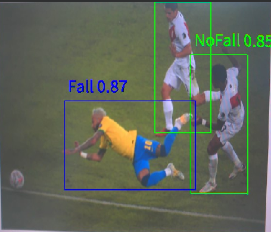
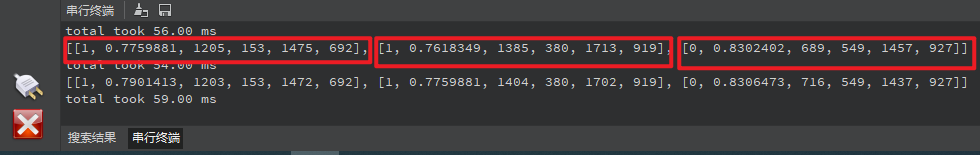

# 跌倒检测实验

## 前言

在上一章节中，我们已经学习了如何在CanMV下使用CanMV AI视觉开发框架和MicroPython编程方法实现人体关键点检测的功能，本章将通过跌倒检测实验，介绍如何使用CanMV AI视觉开发框架和MicroPython编程实现人体信息检测并识别是否跌倒。在本实验中，我们首先采集摄像头捕获的图像，然后经过图像预处理、模型推理和输出处理结果等一系列步骤，系统将检测图像中所有的人体信息并用矩形框进行标注，同时识别每个人体是否跌倒，并在对应的矩形框上方显示识别结果，实现跌倒检测的功能。最后，将检测结果绘制并显示在显示器上。通过本章的学习，读者将掌握如何在CanMV下使用CanMV AI视觉开发框架和MicroPython编程方法实现跌倒检测功能。

## AI开发框架介绍

为了简化AI开发流程并降低AI开发难度，CanMV官方针对K230D专门搭建了AI开发框架，有关AI开发框架的介绍，请见[CanMV AI开发框架](development_framework.md)

## 硬件设计

### 例程功能

1. 获取摄像头输出的图像，然后将图像输入到CanMV K230D的AI模型进行推理。本实验使用了一个基于YOLOv5n的跌倒检测模型，该模型用于检测图像中每个人体信息并判断是否跌倒，系统会用矩形框标注人体的区域，并在矩形框上方标识该人体是否跌倒，如果非跌倒则标识NoFall，如果跌倒则标识Fall，同时还使用不同颜色的线条对标记进行绘制。最后，将处理后的图像显示在LCD上。

### 硬件资源

1. 本章实验内容主要讲解K230D的神经网络加速器KPU的使用，无需关注硬件资源。


### 原理图

1. 本章实验内容主要讲解K230D的神经网络加速器KPU的使用，无需关注原理图。

## 实验代码

``` python
from libs.PipeLine import PipeLine, ScopedTiming
from libs.AIBase import AIBase
from libs.AI2D import Ai2d
import os
import ujson
from media.media import *
from media.sensor import *
from time import *
import nncase_runtime as nn
import ulab.numpy as np
import time
import utime
import image
import random
import gc
import sys
import aicube

# 自定义跌倒检测类，继承自AIBase基类
class FallDetectionApp(AIBase):
    def __init__(self, kmodel_path, model_input_size, labels, anchors, confidence_threshold=0.2, nms_threshold=0.5, nms_option=False, strides=[8,16,32], rgb888p_size=[224,224], display_size=[1920,1080], debug_mode=0):
        super().__init__(kmodel_path, model_input_size, rgb888p_size, debug_mode)  # 调用基类的构造函数
        self.kmodel_path = kmodel_path                      # 模型文件路径
        self.model_input_size = model_input_size            # 模型输入分辨率
        self.labels = labels                                # 分类标签
        self.anchors = anchors                              # 锚点数据，用于跌倒检测
        self.strides = strides                              # 步长设置
        self.confidence_threshold = confidence_threshold    # 置信度阈值
        self.nms_threshold = nms_threshold                  # NMS（非极大值抑制）阈值
        self.nms_option = nms_option                        # NMS选项
        self.rgb888p_size = [ALIGN_UP(rgb888p_size[0], 16), rgb888p_size[1]]  # sensor给到AI的图像分辨率，并对宽度进行16的对齐
        self.display_size = [ALIGN_UP(display_size[0], 16), display_size[1]]  # 显示分辨率，并对宽度进行16的对齐
        self.debug_mode = debug_mode                                          # 是否开启调试模式
        self.color = [(255,0, 0, 255), (255,0, 255, 0), (255,255,0, 0), (255,255,0, 255)]  # 用于绘制不同类别的颜色
        # Ai2d实例，用于实现模型预处理
        self.ai2d = Ai2d(debug_mode)
        # 设置Ai2d的输入输出格式和类型
        self.ai2d.set_ai2d_dtype(nn.ai2d_format.NCHW_FMT, nn.ai2d_format.NCHW_FMT, np.uint8, np.uint8)

    # 配置预处理操作，这里使用了pad和resize，Ai2d支持crop/shift/pad/resize/affine，具体代码请打开/sdcard/app/libs/AI2D.py查看
    def config_preprocess(self, input_image_size=None):
        with ScopedTiming("set preprocess config", self.debug_mode > 0):                    # 计时器，如果debug_mode大于0则开启
            ai2d_input_size = input_image_size if input_image_size else self.rgb888p_size   # 初始化ai2d预处理配置，默认为sensor给到AI的尺寸，可以通过设置input_image_size自行修改输入尺寸
            top, bottom, left, right = self.get_padding_param()                             # 获取padding参数
            self.ai2d.pad([0, 0, 0, 0, top, bottom, left, right], 0, [0,0,0])               # 填充边缘
            self.ai2d.resize(nn.interp_method.tf_bilinear, nn.interp_mode.half_pixel)       # 缩放图像
            self.ai2d.build([1,3,ai2d_input_size[1],ai2d_input_size[0]],[1,3,self.model_input_size[1],self.model_input_size[0]])  # 构建预处理流程

    # 自定义当前任务的后处理，results是模型输出array的列表，这里使用了aicube库的anchorbasedet_post_process接口
    def postprocess(self, results):
        with ScopedTiming("postprocess", self.debug_mode > 0):
            dets = aicube.anchorbasedet_post_process(results[0], results[1], results[2], self.model_input_size, self.rgb888p_size, self.strides, len(self.labels), self.confidence_threshold, self.nms_threshold, self.anchors, self.nms_option)
            return dets

    # 绘制检测结果到画面上
    def draw_result(self, pl, dets):
        with ScopedTiming("display_draw", self.debug_mode > 0):
            if dets:
                pl.osd_img.clear()  # 清除OSD图像
                for det_box in dets:
                    # 计算显示分辨率下的坐标
                    x1, y1, x2, y2 = det_box[2], det_box[3], det_box[4], det_box[5]
                    w = (x2 - x1) * self.display_size[0] // self.rgb888p_size[0]
                    h = (y2 - y1) * self.display_size[1] // self.rgb888p_size[1]
                    x1 = int(x1 * self.display_size[0] // self.rgb888p_size[0])
                    y1 = int(y1 * self.display_size[1] // self.rgb888p_size[1])
                    x2 = int(x2 * self.display_size[0] // self.rgb888p_size[0])
                    y2 = int(y2 * self.display_size[1] // self.rgb888p_size[1])
                    # 绘制矩形框和类别标签
                    pl.osd_img.draw_rectangle(x1, y1, int(w), int(h), color=self.color[det_box[0]], thickness=2)
                    pl.osd_img.draw_string_advanced(x1, y1-50, 32," " + self.labels[det_box[0]] + " " + str(round(det_box[1],2)), color=self.color[det_box[0]])
            else:
                pl.osd_img.clear()

    # 获取padding参数
    def get_padding_param(self):
        dst_w = self.model_input_size[0]
        dst_h = self.model_input_size[1]
        input_width = self.rgb888p_size[0]
        input_high = self.rgb888p_size[1]
        ratio_w = dst_w / input_width
        ratio_h = dst_h / input_high
        if ratio_w < ratio_h:
            ratio = ratio_w
        else:
            ratio = ratio_h
        new_w = int(ratio * input_width)
        new_h = int(ratio * input_high)
        dw = (dst_w - new_w) / 2
        dh = (dst_h - new_h) / 2
        top = int(round(dh - 0.1))
        bottom = int(round(dh + 0.1))
        left = int(round(dw - 0.1))
        right = int(round(dw - 0.1))
        return top, bottom, left, right

if __name__ == "__main__":
    # 显示模式，默认"lcd"
    display_mode="lcd"
    display_size=[640,480]
    # 设置模型路径和其他参数
    kmodel_path = "/sdcard/examples/kmodel/yolov5n-falldown.kmodel"
    confidence_threshold = 0.3
    nms_threshold = 0.45
    rgb888p_size = [1920, 1080]
    labels = ["Fall","NoFall"]  # 模型输出类别名称
    anchors = [10, 13, 16, 30, 33, 23, 30, 61, 62, 45, 59, 119, 116, 90, 156, 198, 373, 326]  # anchor设置

    # 初始化PipeLine，用于图像处理流程
    pl = PipeLine(rgb888p_size=rgb888p_size, display_size=display_size, display_mode=display_mode)
    pl.create()
    # 初始化自定义跌倒检测实例
    fall_det = FallDetectionApp(kmodel_path, model_input_size=[640, 640], labels=labels, anchors=anchors, confidence_threshold=confidence_threshold, nms_threshold=nms_threshold, nms_option=False, strides=[8,16,32], rgb888p_size=rgb888p_size, display_size=display_size, debug_mode=0)
    fall_det.config_preprocess()
    try:
        while True:
            os.exitpoint()                                  # 检查是否有退出信号
            with ScopedTiming("total",1):
                img = pl.get_frame()                        # 获取当前帧数据
                res = fall_det.run(img)                     # 推理当前帧
#                print(res)                                  # 打印结果
                fall_det.draw_result(pl, res)               # 绘制结果到PipeLine的osd图像
                pl.show_image()                             # 显示当前的绘制结果
                gc.collect()                                # 垃圾回收
    except Exception as e:
        sys.print_exception(e)                              # 打印异常信息
    finally:
        fall_det.deinit()                                   # 反初始化
        pl.destroy()                                        # 销毁PipeLine实例
```

可以看到一开始是先定义显示模式、图像大小、模型相关的一些变量。

接着是通过初始化PipeLine，这里主要初始化sensor和display模块，配置摄像头输出两路不同的格式和大小的图像，以及设置显示模式，完成创建PipeLine实例。

然后调用自定义FallDetectionApp类构建跌倒检测类，FallDetectionApp类会对AIBase接口的初始化以及使用Ai2D接口的方法定义人体跌倒检测模型输入图像的预处理方法。

最后在一个循环中不断地获取摄像头输出的RGBP888格式的图像帧，然后将图像输入到跌倒检测模型进行推理，并将推理结果通过print打印，然后根据结果信息用矩形框将图像中的人体区域进行标注，并在矩形框上方绘制判断是否跌倒的结果以及跌倒的可信度，还会根据识别结果用蓝色和绿色的线条绘制到图像上，并在LCD上显示图像。

## 运行验证

实验原图如下所示：


将K230D BOX开发板连接CanMV IDE，点击CanMV IDE上的“开始(运行脚本)”按钮后，将摄像头对准人体图，让其采集到人体图像，随后便能在LCD上看到摄像头输出的图像，可以看到，跌倒的人体用蓝色的矩形框标记，同时矩形框上方用同样的颜色标注Fall和跌倒的可信度，，非跌倒的人体则用绿色矩形框标记，如下图所示：  




点击左下角“串行终端”，可以看到“串行终端”窗口中输出了一系列信息，如下图所示：



可以看到，二维数组中存在三个元素，每个元素表示检测到图像中存在一个人体。每个元素包含6个数据，可以表示为 [label,prob,x1, y1, x2, y2] ，第一个label是标签，与输入模型的标签顺序有关，prob表示目标人体的可信度，跌倒检测模型有Fall和NoFall两个标签，序号分别为0和1，x1、y1、x2、y2表示人体在输入的RGBP888图像中的起点坐标和终点坐标。这样，我们就可以确定这个人体在RGBP888图像中的位置和跌倒的可信度。为了准确地显示在屏幕上，我们需要将这些坐标和尺寸乘以一个缩放值（即LCD显示的分辨率与RGBP888图像尺寸的比值），从而获得在LCD显示器中人体的区域，这个跟人体检测实验是一样的。最后根据获得的值绘制矩形框，即可将人体标注出来。
