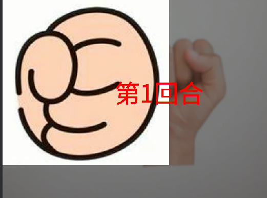
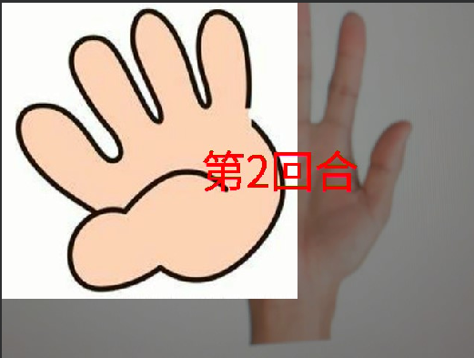
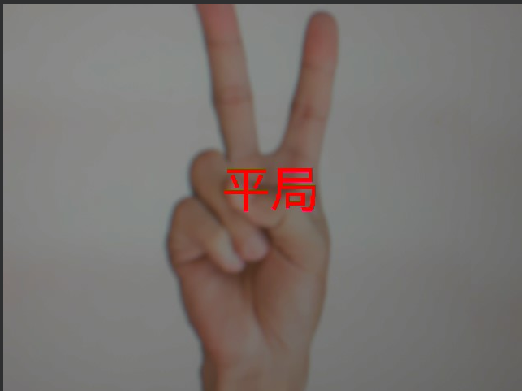

# 猜拳游戏实验

## 前言

在上一章节中，我们已经学习了如何在CanMV下使用CanMV AI视觉开发框架和MicroPython编程方法实现通过手指控制局部区域图像放大的功能，本章将通过猜拳游戏实验，介绍如何使用CanMV AI视觉开发框架和MicroPython编程实现对石头、剪刀、布等手势的识别，完成一个猜拳游戏实验。本实验由手掌关键点检测实验扩展而来，使用到的AI模型是一致的，我们首先采集摄像头捕获的图像，然后经过图像预处理、模型推理和输出处理结果等一系列步骤，完成手掌检测的功能，然后在检测到手掌的区域，进一步使用手掌关键点检测模型进行推理，从而得到每个手掌的21个手掌骨骼关键点位置，接着再根据手掌的21个骨骼关键点的分布判断手是石头、剪刀、布哪种手势，然后通过设定游戏规则和提示完成一个三局两胜的猜拳游戏实验。通过本章的学习，读者将掌握如何在CanMV下使用CanMV AI视觉开发框架和MicroPython编程方法实现一个猜拳游戏的方法。

## AI开发框架介绍

为了简化AI开发流程并降低AI开发难度，CanMV官方针对K230D专门搭建了AI开发框架，有关AI开发框架的介绍，请见[CanMV AI开发框架](development_framework.md)

## 硬件设计

### 例程功能

1. 获取摄像头输出的图像，然后将图像输入到CanMV K230D的AI模型进行推理。本实验使用了两个AI模型：一个是前面章节使用到的手掌检测模型，另一个是手掌关键点检测模型。手掌检测模型负责找出图像中的手掌区域，然后将该区域传递给手掌关键点检测模型进行手掌关键点位置的推理。手掌关键点检测模型能将输入模型的手掌图进行检测，然后对检测到的每一个手掌进行关键点回归得到21个手掌骨骼关键点位置，再根据手掌关键点判断手是石头、剪刀、布哪种手势。猜拳游戏是三局两胜制判断输赢，首先让屏幕中无任何手掌，然后一只手进入镜头出石头/剪刀/布，机器同时会随机出石头/剪刀/布，然后机器识别出我们出的手势判断输赢，通过三局两胜的方式决出最后胜负，最终分出胜负后游戏会重新开始。

### 硬件资源

1. 本章实验内容主要讲解K230D的神经网络加速器KPU的使用，无需关注硬件资源。


### 原理图

1. 本章实验内容主要讲解K230D的神经网络加速器KPU的使用，无需关注原理图。

## 实验代码

``` python
from libs.PipeLine import PipeLine, ScopedTiming
from libs.AIBase import AIBase
from libs.AI2D import Ai2d
from random import randint
import os
import ujson
from media.media import *
from media.sensor import *
from time import *
import nncase_runtime as nn
import ulab.numpy as np
import time
import image
import aicube
import random
import gc
import sys

# 自定义手掌检测任务类
class HandDetApp(AIBase):
    def __init__(self,kmodel_path,labels,model_input_size,anchors,confidence_threshold=0.2,nms_threshold=0.5,nms_option=False, strides=[8,16,32],rgb888p_size=[1920,1080],display_size=[1920,1080],debug_mode=0):
        super().__init__(kmodel_path,model_input_size,rgb888p_size,debug_mode)
        # kmodel路径
        self.kmodel_path=kmodel_path
        self.labels=labels
        # 检测模型输入分辨率
        self.model_input_size=model_input_size
        # 置信度阈值
        self.confidence_threshold=confidence_threshold
        # nms阈值
        self.nms_threshold=nms_threshold
        self.anchors=anchors            # 锚框，检测任务使用
        self.strides = strides          # 特征下采样倍数
        self.nms_option = nms_option    # NMS选项，如果为True做类间NMS,如果为False做类内NMS
        # sensor给到AI的图像分辨率，宽16字节对齐
        self.rgb888p_size=[ALIGN_UP(rgb888p_size[0],16),rgb888p_size[1]]
        # 视频输出VO分辨率，宽16字节对齐
        self.display_size=[ALIGN_UP(display_size[0],16),display_size[1]]
        # debug模式
        self.debug_mode=debug_mode
        # 实例化Ai2d，用于实现模型预处理
        self.ai2d=Ai2d(debug_mode)
        # 设置Ai2d的输入输出格式和类型
        self.ai2d.set_ai2d_dtype(nn.ai2d_format.NCHW_FMT,nn.ai2d_format.NCHW_FMT,np.uint8, np.uint8)

    # 配置预处理操作，这里使用了pad和resize，Ai2d支持crop/shift/pad/resize/affine，具体代码请打开/sdcard/app/libs/AI2D.py查看
    def config_preprocess(self,input_image_size=None):
        with ScopedTiming("set preprocess config",self.debug_mode > 0):
            # 初始化ai2d预处理配置，默认为sensor给到AI的尺寸，可以通过设置input_image_size自行修改输入尺寸
            ai2d_input_size = input_image_size if input_image_size else self.rgb888p_size
            # 计算padding参数并应用pad操作，以确保输入图像尺寸与模型输入尺寸匹配
            top, bottom, left, right = self.get_padding_param()
            self.ai2d.pad([0, 0, 0, 0, top, bottom, left, right], 0, [114, 114, 114])
            # 使用双线性插值进行resize操作，调整图像尺寸以符合模型输入要求
            self.ai2d.resize(nn.interp_method.tf_bilinear, nn.interp_mode.half_pixel)
            # 构建预处理流程，参数是ai2d预处理的输入tensor的shape和输出tensor的shape
            self.ai2d.build([1,3,ai2d_input_size[1],ai2d_input_size[0]],[1,3,self.model_input_size[1],self.model_input_size[0]])

    # 自定义当前任务的后处理，results是模型输出array的列表，这里使用了aicube库的anchorbasedet_post_process接口
    def postprocess(self,results):
        with ScopedTiming("postprocess",self.debug_mode > 0):
            dets = aicube.anchorbasedet_post_process(results[0], results[1], results[2], self.model_input_size, self.rgb888p_size, self.strides, len(self.labels), self.confidence_threshold, self.nms_threshold, self.anchors, self.nms_option)
            # 返回手掌检测结果
            return dets

    # 计算padding参数，确保输入图像尺寸与模型输入尺寸匹配
    def get_padding_param(self):
        # 根据目标宽度和高度计算比例因子
        dst_w = self.model_input_size[0]
        dst_h = self.model_input_size[1]
        input_width = self.rgb888p_size[0]
        input_high = self.rgb888p_size[1]
        ratio_w = dst_w / input_width
        ratio_h = dst_h / input_high
        # 选择较小的比例因子，以确保图像内容完整
        if ratio_w < ratio_h:
            ratio = ratio_w
        else:
            ratio = ratio_h
        # 计算新的宽度和高度
        new_w = int(ratio * input_width)
        new_h = int(ratio * input_high)
        # 计算宽度和高度的差值，并确定padding的位置
        dw = (dst_w - new_w) / 2
        dh = (dst_h - new_h) / 2
        top = int(round(dh - 0.1))
        bottom = int(round(dh + 0.1))
        left = int(round(dw - 0.1))
        right = int(round(dw + 0.1))
        return top, bottom, left, right

# 自定义手势关键点分类任务类
class HandKPClassApp(AIBase):
    def __init__(self,kmodel_path,model_input_size,rgb888p_size=[1920,1080],display_size=[1920,1080],debug_mode=0):
        super().__init__(kmodel_path,model_input_size,rgb888p_size,debug_mode)
        # kmodel路径
        self.kmodel_path=kmodel_path
        # 检测模型输入分辨率
        self.model_input_size=model_input_size
        # sensor给到AI的图像分辨率，宽16字节对齐
        self.rgb888p_size=[ALIGN_UP(rgb888p_size[0],16),rgb888p_size[1]]
        # 视频输出VO分辨率，宽16字节对齐
        self.display_size=[ALIGN_UP(display_size[0],16),display_size[1]]
        # crop参数列表
        self.crop_params=[]
        # debug模式
        self.debug_mode=debug_mode
        self.ai2d=Ai2d(debug_mode)
        self.ai2d.set_ai2d_dtype(nn.ai2d_format.NCHW_FMT,nn.ai2d_format.NCHW_FMT,np.uint8, np.uint8)

    # 配置预处理操作，这里使用了crop和resize，Ai2d支持crop/shift/pad/resize/affine，具体代码请打开/sdcard/app/libs/AI2D.py查看
    def config_preprocess(self,det,input_image_size=None):
        with ScopedTiming("set preprocess config",self.debug_mode > 0):
            # 初始化ai2d预处理配置，默认为sensor给到AI的尺寸，可以通过设置input_image_size自行修改输入尺寸
            ai2d_input_size=input_image_size if input_image_size else self.rgb888p_size
            # 计算crop参数并设置crop预处理
            self.crop_params = self.get_crop_param(det)
            self.ai2d.crop(self.crop_params[0],self.crop_params[1],self.crop_params[2],self.crop_params[3])
            # 设置resize预处理
            self.ai2d.resize(nn.interp_method.tf_bilinear, nn.interp_mode.half_pixel)
            # 构建预处理流程，参数是ai2d预处理的输入tensor的shape和输出tensor的shape
            self.ai2d.build([1,3,ai2d_input_size[1],ai2d_input_size[0]],[1,3,self.model_input_size[1],self.model_input_size[0]])

    # 自定义后处理，results是模型输出array的列表
    def postprocess(self,results):
        with ScopedTiming("postprocess",self.debug_mode > 0):
            results=results[0].reshape(results[0].shape[0]*results[0].shape[1])
            results_show = np.zeros(results.shape,dtype=np.int16)
            results_show[0::2] = results[0::2] * self.crop_params[3] + self.crop_params[0]
            results_show[1::2] = results[1::2] * self.crop_params[2] + self.crop_params[1]
            gesture=self.hk_gesture(results_show)
            results_show[0::2] = results_show[0::2] * (self.display_size[0] / self.rgb888p_size[0])
            results_show[1::2] = results_show[1::2] * (self.display_size[1] / self.rgb888p_size[1])
            return results_show,gesture

    # 计算crop参数
    def get_crop_param(self,det_box):
        x1, y1, x2, y2 = det_box[2],det_box[3],det_box[4],det_box[5]
        w,h= int(x2 - x1),int(y2 - y1)
        w_det = int(float(x2 - x1) * self.display_size[0] // self.rgb888p_size[0])
        h_det = int(float(y2 - y1) * self.display_size[1] // self.rgb888p_size[1])
        x_det = int(x1*self.display_size[0] // self.rgb888p_size[0])
        y_det = int(y1*self.display_size[1] // self.rgb888p_size[1])
        length = max(w, h)/2
        cx = (x1+x2)/2
        cy = (y1+y2)/2
        ratio_num = 1.26*length
        x1_kp = int(max(0,cx-ratio_num))
        y1_kp = int(max(0,cy-ratio_num))
        x2_kp = int(min(self.rgb888p_size[0]-1, cx+ratio_num))
        y2_kp = int(min(self.rgb888p_size[1]-1, cy+ratio_num))
        w_kp = int(x2_kp - x1_kp + 1)
        h_kp = int(y2_kp - y1_kp + 1)
        return [x1_kp, y1_kp, w_kp, h_kp]

    # 求两个vector之间的夹角
    def hk_vector_2d_angle(self,v1,v2):
        with ScopedTiming("hk_vector_2d_angle",self.debug_mode > 0):
            v1_x,v1_y,v2_x,v2_y = v1[0],v1[1],v2[0],v2[1]
            v1_norm = np.sqrt(v1_x * v1_x+ v1_y * v1_y)
            v2_norm = np.sqrt(v2_x * v2_x + v2_y * v2_y)
            dot_product = v1_x * v2_x + v1_y * v2_y
            cos_angle = dot_product/(v1_norm*v2_norm)
            angle = np.acos(cos_angle)*180/np.pi
            return angle

    # 根据手掌关键点检测结果判断手势类别
    def hk_gesture(self,results):
        with ScopedTiming("hk_gesture",self.debug_mode > 0):
            angle_list = []
            for i in range(5):
                angle = self.hk_vector_2d_angle([(results[0]-results[i*8+4]), (results[1]-results[i*8+5])],[(results[i*8+6]-results[i*8+8]),(results[i*8+7]-results[i*8+9])])
                angle_list.append(angle)
            thr_angle,thr_angle_thumb,thr_angle_s,gesture_str = 65.,53.,49.,None
            if 65535. not in angle_list:
                if (angle_list[0]>thr_angle_thumb)  and (angle_list[1]>thr_angle) and (angle_list[2]>thr_angle) and (angle_list[3]>thr_angle) and (angle_list[4]>thr_angle):
                    gesture_str = "fist"
                elif (angle_list[0]<thr_angle_s)  and (angle_list[1]<thr_angle_s) and (angle_list[2]<thr_angle_s) and (angle_list[3]<thr_angle_s) and (angle_list[4]<thr_angle_s):
                    gesture_str = "five"
                elif (angle_list[0]<thr_angle_s)  and (angle_list[1]<thr_angle_s) and (angle_list[2]>thr_angle) and (angle_list[3]>thr_angle) and (angle_list[4]>thr_angle):
                    gesture_str = "gun"
                elif (angle_list[0]<thr_angle_s)  and (angle_list[1]<thr_angle_s) and (angle_list[2]>thr_angle) and (angle_list[3]>thr_angle) and (angle_list[4]<thr_angle_s):
                    gesture_str = "love"
                elif (angle_list[0]>5)  and (angle_list[1]<thr_angle_s) and (angle_list[2]>thr_angle) and (angle_list[3]>thr_angle) and (angle_list[4]>thr_angle):
                    gesture_str = "one"
                elif (angle_list[0]<thr_angle_s)  and (angle_list[1]>thr_angle) and (angle_list[2]>thr_angle) and (angle_list[3]>thr_angle) and (angle_list[4]<thr_angle_s):
                    gesture_str = "six"
                elif (angle_list[0]>thr_angle_thumb)  and (angle_list[1]<thr_angle_s) and (angle_list[2]<thr_angle_s) and (angle_list[3]<thr_angle_s) and (angle_list[4]>thr_angle):
                    gesture_str = "three"
                elif (angle_list[0]<thr_angle_s)  and (angle_list[1]>thr_angle) and (angle_list[2]>thr_angle) and (angle_list[3]>thr_angle) and (angle_list[4]>thr_angle):
                    gesture_str = "thumbUp"
                elif (angle_list[0]>thr_angle_thumb)  and (angle_list[1]<thr_angle_s) and (angle_list[2]<thr_angle_s) and (angle_list[3]>thr_angle) and (angle_list[4]>thr_angle):
                    gesture_str = "yeah"
            return gesture_str

# 猜拳游戏任务类
class FingerGuess:
    def __init__(self,hand_det_kmodel,hand_kp_kmodel,det_input_size,kp_input_size,labels,anchors,confidence_threshold=0.25,nms_threshold=0.3,nms_option=False,strides=[8,16,32],guess_mode=3,rgb888p_size=[1280,720],display_size=[1920,1080],debug_mode=0):
        # 手掌检测模型路径
        self.hand_det_kmodel=hand_det_kmodel
        # 手掌关键点模型路径
        self.hand_kp_kmodel=hand_kp_kmodel
        # 手掌检测模型输入分辨率
        self.det_input_size=det_input_size
        # 手掌关键点模型输入分辨率
        self.kp_input_size=kp_input_size
        self.labels=labels
        # anchors
        self.anchors=anchors
        # 置信度阈值
        self.confidence_threshold=confidence_threshold
        # nms阈值
        self.nms_threshold=nms_threshold
        # nms选项
        self.nms_option=nms_option
        # 特征图针对输入的下采样倍数
        self.strides=strides
        # sensor给到AI的图像分辨率，宽16字节对齐
        self.rgb888p_size=[ALIGN_UP(rgb888p_size[0],16),rgb888p_size[1]]
        # 视频输出VO分辨率，宽16字节对齐
        self.display_size=[ALIGN_UP(display_size[0],16),display_size[1]]
        # debug_mode模式
        self.debug_mode=debug_mode
        self.guess_mode=guess_mode
        # 石头剪刀布的贴图array
        self.five_image = self.read_file("/sdcard/examples/utils/five.bin")
        self.fist_image = self.read_file("/sdcard/examples/utils/fist.bin")
        self.shear_image = self.read_file("/sdcard/examples/utils/shear.bin")
        self.counts_guess = -1                                                               # 猜拳次数 计数
        self.player_win = 0                                                                  # 玩家 赢次计数
        self.k230_win = 0                                                                    # k230 赢次计数
        self.sleep_end = False                                                               # 是否 停顿
        self.set_stop_id = True                                                              # 是否 暂停猜拳
        self.LIBRARY = ["fist","yeah","five"]                                                # 猜拳 石头剪刀布 三种方案的dict
        self.hand_det=HandDetApp(self.hand_det_kmodel,self.labels,model_input_size=self.det_input_size,anchors=self.anchors,confidence_threshold=self.confidence_threshold,nms_threshold=self.nms_threshold,nms_option=self.nms_option,strides=self.strides,rgb888p_size=self.rgb888p_size,display_size=self.display_size,debug_mode=0)
        self.hand_kp=HandKPClassApp(self.hand_kp_kmodel,model_input_size=self.kp_input_size,rgb888p_size=self.rgb888p_size,display_size=self.display_size)
        self.hand_det.config_preprocess()

    # run函数
    def run(self,input_np):
        # 先进行手掌检测
        det_boxes=self.hand_det.run(input_np)
        boxes=[]
        gesture_res=[]
        for det_box in det_boxes:
            # 对检测的手做手势识别
            x1, y1, x2, y2 = det_box[2],det_box[3],det_box[4],det_box[5]
            w,h= int(x2 - x1),int(y2 - y1)
            if (h<(0.1*self.rgb888p_size[1])):
                continue
            if (w<(0.25*self.rgb888p_size[0]) and ((x1<(0.03*self.rgb888p_size[0])) or (x2>(0.97*self.rgb888p_size[0])))):
                continue
            if (w<(0.15*self.rgb888p_size[0]) and ((x1<(0.01*self.rgb888p_size[0])) or (x2>(0.99*self.rgb888p_size[0])))):
                continue
            self.hand_kp.config_preprocess(det_box)
            results_show,gesture=self.hand_kp.run(input_np)
            boxes.append(det_box)
            gesture_res.append(gesture)
        return boxes,gesture_res

    # 绘制效果
    def draw_result(self,pl,dets,gesture_res):
        pl.osd_img.clear()
        # 手掌的手势分类得到用户的出拳，根据不同模式给出开发板的出拳，并将对应的贴图放到屏幕上显示
        if (len(dets) >= 2):
            pl.osd_img.draw_string_advanced( self.display_size[0]//2-50,self.display_size[1]//2-50,60, "请保证只有一只手入镜！", color=(255,255,0,0))
        elif (self.guess_mode == 0):
            draw_img_np = np.zeros((self.display_size[1],self.display_size[0],4),dtype=np.uint8)
            draw_img = image.Image(self.display_size[0], self.display_size[1], image.ARGB8888, alloc=image.ALLOC_REF,data = draw_img_np)
            if (gesture_res[0] == "fist"):
                draw_img_np[:400,:400,:] = self.shear_image
            elif (gesture_res[0] == "five"):
                draw_img_np[:400,:400,:] = self.fist_image
            elif (gesture_res[0] == "yeah"):
                draw_img_np[:400,:400,:] = self.five_image
            pl.osd_img.copy_from(draw_img)
        elif (self.guess_mode == 1):
            draw_img_np = np.zeros((self.display_size[1],self.display_size[0],4),dtype=np.uint8)
            draw_img = image.Image(self.display_size[0], self.display_size[1], image.ARGB8888, alloc=image.ALLOC_REF,data = draw_img_np)
            if (gesture_res[0] == "fist"):
                draw_img_np[:400,:400,:] = self.five_image
            elif (gesture_res[0] == "five"):
                draw_img_np[:400,:400,:] = self.shear_image
            elif (gesture_res[0] == "yeah"):
                draw_img_np[:400,:400,:] = self.fist_image
            pl.osd_img.copy_from(draw_img)
        else:
            draw_img_np = np.zeros((self.display_size[1],self.display_size[0],4),dtype=np.uint8)
            draw_img = image.Image(self.display_size[0], self.display_size[1], image.ARGB8888, alloc=image.ALLOC_REF,data = draw_img_np)
            if (self.sleep_end):
                time.sleep_ms(2000)
                self.sleep_end = False
            if (len(dets) == 0):
                self.set_stop_id = True
                return
            if (self.counts_guess == -1 and gesture_res[0] != "fist" and gesture_res[0] != "yeah" and gesture_res[0] != "five"):
                draw_img.draw_string_advanced( self.display_size[0]//2-50,self.display_size[1]//2-50,60, "游戏开始", color=(255,255,0,0))
                draw_img.draw_string_advanced( self.display_size[0]//2-50,self.display_size[1]//2-50,60, "第一回合", color=(255,255,0,0))
            elif (self.counts_guess == self.guess_mode):
                draw_img.clear()
                if (self.k230_win > self.player_win):
                    draw_img.draw_string_advanced( self.display_size[0]//2-50,self.display_size[1]//2-50,60, "你输了！", color=(255,255,0,0))
                elif (self.k230_win < self.player_win):
                    draw_img.draw_string_advanced( self.display_size[0]//2-50,self.display_size[1]//2-50,60, "你赢了！", color=(255,255,0,0))
                else:
                    draw_img.draw_string_advanced( self.display_size[0]//2-50,self.display_size[1]//2-50,60, "平局", color=(255,255,0,0))
                self.counts_guess = -1
                self.player_win = 0
                self.k230_win = 0
                self.sleep_end = True
            else:
                if (self.set_stop_id):
                    if (self.counts_guess == -1 and (gesture_res[0] == "fist" or gesture_res[0] == "yeah" or gesture_res[0] == "five")):
                        self.counts_guess = 0
                    if (self.counts_guess != -1 and (gesture_res[0] == "fist" or gesture_res[0] == "yeah" or gesture_res[0] == "five")):
                        k230_guess = randint(1,10000) % 3
                        if (gesture_res[0] == "fist" and self.LIBRARY[k230_guess] == "yeah"):
                            self.player_win += 1
                        elif (gesture_res[0] == "fist" and self.LIBRARY[k230_guess] == "five"):
                            self.k230_win += 1
                        if (gesture_res[0] == "yeah" and self.LIBRARY[k230_guess] == "fist"):
                            self.k230_win += 1
                        elif (gesture_res[0] == "yeah" and self.LIBRARY[k230_guess] == "five"):
                            self.player_win += 1
                        if (gesture_res[0] == "five" and self.LIBRARY[k230_guess] == "fist"):
                            self.player_win += 1
                        elif (gesture_res[0] == "five" and self.LIBRARY[k230_guess] == "yeah"):
                            self.k230_win += 1
                        if (self.LIBRARY[k230_guess] == "fist"):
                            draw_img_np[:400,:400,:] = self.fist_image
                        elif (self.LIBRARY[k230_guess] == "five"):
                            draw_img_np[:400,:400,:] = self.five_image
                        elif (self.LIBRARY[k230_guess] == "yeah"):
                            draw_img_np[:400,:400,:] = self.shear_image
                        self.counts_guess += 1
                        draw_img.draw_string_advanced(self.display_size[0]//2-50,self.display_size[1]//2-50,60,"第" + str(self.counts_guess) + "回合", color=(255,255,0,0))
                        self.set_stop_id = False
                        self.sleep_end = True
                    else:
                        draw_img.draw_string_advanced(self.display_size[0]//2-50,self.display_size[1]//2-50,60,"第" + str(self.counts_guess+1) + "回合", color=(255,255,0,0))
            pl.osd_img.copy_from(draw_img)

    # 读取石头剪刀布的bin文件方法
    def read_file(self,file_name):
        image_arr = np.fromfile(file_name,dtype=np.uint8)
        image_arr = image_arr.reshape((400,400,4))
        return image_arr


if __name__=="__main__":
    # 显示模式，默认"lcd"
    display_mode="lcd"
    display_size=[640,480]
    # 手掌检测模型路径
    hand_det_kmodel_path="/sdcard/examples/kmodel/hand_det.kmodel"
    # 手掌关键点模型路径
    hand_kp_kmodel_path="/sdcard/examples/kmodel/handkp_det.kmodel"
    # 其它参数
    anchors_path="/sdcard/examples/utils/prior_data_320.bin"
    rgb888p_size=[1024,768]
    hand_det_input_size=[512,512]
    hand_kp_input_size=[256,256]
    confidence_threshold=0.2
    nms_threshold=0.5
    labels=["hand"]
    anchors = [26,27, 53,52, 75,71, 80,99, 106,82, 99,134, 140,113, 161,172, 245,276]
    # 猜拳模式  0 玩家稳赢 ， 1 玩家必输 ， n > 2 多局多胜
    guess_mode = 3

    # 初始化PipeLine，只关注传给AI的图像分辨率，显示的分辨率
    sensor = Sensor(width=1280, height=960) # 构建摄像头对象
    pl = PipeLine(rgb888p_size=rgb888p_size, display_size=display_size, display_mode=display_mode)
    pl.create(sensor=sensor)  # 创建PipeLine实例
    hkc=FingerGuess(hand_det_kmodel_path,hand_kp_kmodel_path,det_input_size=hand_det_input_size,kp_input_size=hand_kp_input_size,labels=labels,anchors=anchors,confidence_threshold=confidence_threshold,nms_threshold=nms_threshold,nms_option=False,strides=[8,16,32],guess_mode=guess_mode,rgb888p_size=rgb888p_size,display_size=display_size)
    try:
        while True:
            os.exitpoint()
            with ScopedTiming("total",1):
                img=pl.get_frame()                          # 获取当前帧
                det_boxes,gesture_res=hkc.run(img)          # 推理当前帧
#                print(det_boxes, gesture_res)               # 打印结果
                hkc.draw_result(pl,det_boxes,gesture_res)   # 绘制推理结果
                pl.show_image()                             # 展示推理结果
                gc.collect()
    except Exception as e:
        sys.print_exception(e)
    finally:
        hkc.hand_det.deinit()
        hkc.hand_kp.deinit()
        pl.destroy()
```

可以看到首先是定义显示模式、图像大小、模型相关的一些变量。

接着是通过初始化PipeLine，这里主要初始化sensor和display模块，配置摄像头输出两路不同的格式和大小的图像，以及设置显示模式，完成创建PipeLine实例。

然后调用自定义SpaceResize类构建局部放大器的任务，SpaceResize类会通过调用HandDetApp类和HandKPClassApp类完成对AIBase接口的初始化以及使用Ai2D接口的方法定义手掌检测模型和手掌关键点检测模型输入图像的预处理方法。

最后在一个循环中不断地获取摄像头输出的RGBP888格式的图像帧，然后依次将图像输入到手掌检测模型、手掌关键点检测模型进行推理，然后通过21个手掌骨骼关键点判断手势，"fist"、"yeah"、"five"手势对应石头、剪刀、布，然后通过三局两胜的游戏设定实现游戏的开发，当完成最后胜负时，系统会重新开始下一局游戏。

## 运行验证

将K230D BOX开发板连接CanMV IDE，点击CanMV IDE上的“开始(运行脚本)”按钮后，首先保持镜头前无任何手，然后将一只手伸入镜头中，随机出一个手势，同时开发板的LCD面板显示第一回合，并在左上角显示系统的出拳手势。如下图所示：  



然后把手收回，重新按照上面流程，进行第二回合游戏，如下图所示：



第三回合游戏，如下图所示：


完成三局后，系统输出比赛结果，本轮游戏刚好平局，如下图所示：


