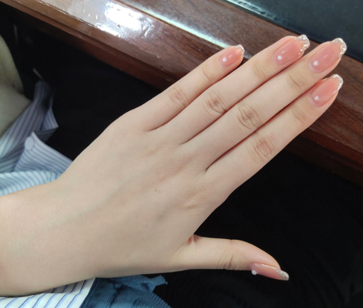
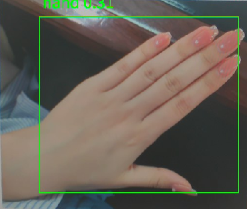
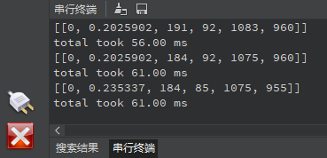

# 手掌检测实验

## 前言

在上一章节中，我们已经学习了如何在CanMV下使用CanMV AI视觉开发框架和MicroPython编程方法实现跌倒检测的功能，本章将通过手掌检测实验，介绍如何使用CanMV AI视觉开发框架和MicroPython编程实现手掌检测并将检测的可信度绘制出来。在本实验中，我们首先采集摄像头捕获的图像，然后经过图像预处理、模型推理和输出处理结果等一系列步骤，系统会输出图像中的所有的手掌信息，完成手掌检测的功能。最后，将检测结果绘制并显示在显示器上。通过本章的学习，读者将掌握如何在CanMV下使用CanMV AI视觉开发框架和MicroPython编程方法实现手掌检测功能。

## AI开发框架介绍

为了简化AI开发流程并降低AI开发难度，CanMV官方针对K230D专门搭建了AI开发框架，有关AI开发框架的介绍，请见[CanMV AI开发框架](development_framework.md)

## 硬件设计

### 例程功能

1. 获取摄像头输出的图像，然后将图像输入到CanMV K230D的AI模型进行推理。本实验使用了一个手掌检测模型，该模型用于检测图像中的手掌位置并输出其可信度。通过AI推理出图像中人的手掌的坐标，然后根据坐标在图像中绘制矩形框进行标注，并在矩形框的上方显示手掌检测的可信度。最后，将处理后的图像显示在LCD上。

### 硬件资源

1. 本章实验内容主要讲解K230D的神经网络加速器KPU的使用，无需关注硬件资源。


### 原理图

1. 本章实验内容主要讲解K230D的神经网络加速器KPU的使用，无需关注原理图。

## 实验代码

``` python
from libs.PipeLine import PipeLine, ScopedTiming
from libs.AIBase import AIBase
from libs.AI2D import Ai2d
import os
import ujson
from media.media import *
from media.sensor import *
from time import *
import nncase_runtime as nn
import ulab.numpy as np
import time
import utime
import image
import random
import gc
import sys
import aicube

# 自定义手掌检测类，继承自AIBase基类
class HandDetectionApp(AIBase):
    def __init__(self, kmodel_path, model_input_size, labels, anchors, confidence_threshold=0.2, nms_threshold=0.5, nms_option=False, strides=[8,16,32], rgb888p_size=[224,224], display_size=[1920,1080], debug_mode=0):
        super().__init__(kmodel_path, model_input_size, rgb888p_size, debug_mode)  # 调用基类的构造函数，初始化模型文件路径、模型输入分辨率、RGB图像分辨率和调试模式
        self.kmodel_path = kmodel_path  # 模型文件路径
        self.model_input_size = model_input_size  # 模型输入分辨率
        self.labels = labels  # 模型输出的类别标签列表
        self.anchors = anchors  # 用于目标检测的锚点尺寸列表
        self.strides = strides  # 特征下采样倍数
        self.confidence_threshold = confidence_threshold  # 置信度阈值，用于过滤低置信度的检测结果
        self.nms_threshold = nms_threshold  # NMS（非极大值抑制）阈值，用于去除重叠的检测框
        self.nms_option = nms_option  # NMS选项，可能影响NMS的具体实现
        self.rgb888p_size = [ALIGN_UP(rgb888p_size[0], 16), rgb888p_size[1]]  # sensor给到AI的图像分辨率，对齐到最近的16的倍数
        self.display_size = [ALIGN_UP(display_size[0], 16), display_size[1]]  # 显示分辨率，对齐到最近的16的倍数
        self.debug_mode = debug_mode  # 调试模式，用于输出调试信息
        self.ai2d = Ai2d(debug_mode)  # 实例化Ai2d类，用于实现模型预处理
        # 设置Ai2d的输入输出格式和类型，这里使用NCHW格式，数据类型为uint8
        self.ai2d.set_ai2d_dtype(nn.ai2d_format.NCHW_FMT, nn.ai2d_format.NCHW_FMT, np.uint8, np.uint8)

    # 配置预处理操作，这里使用了pad和resize
    def config_preprocess(self, input_image_size=None):
        with ScopedTiming("set preprocess config", self.debug_mode > 0):  # 使用ScopedTiming装饰器来测量预处理配置的时间
            # 初始化ai2d预处理配置，默认为sensor给到AI的尺寸，可以通过设置input_image_size自行修改输入尺寸
            ai2d_input_size = input_image_size if input_image_size else self.rgb888p_size
            # 计算padding参数并应用pad操作，以确保输入图像尺寸与模型输入尺寸匹配
            top, bottom, left, right = self.get_padding_param()
            self.ai2d.pad([0, 0, 0, 0, top, bottom, left, right], 0, [0, 0, 0])
            # 使用双线性插值进行resize操作，调整图像尺寸以符合模型输入要求
            self.ai2d.resize(nn.interp_method.tf_bilinear, nn.interp_mode.half_pixel)
            # 构建预处理流程
            self.ai2d.build([1,3,ai2d_input_size[1],ai2d_input_size[0]],[1,3,self.model_input_size[1],self.model_input_size[0]])

    # 自定义当前任务的后处理，用于处理模型输出结果
    def postprocess(self, results):
        with ScopedTiming("postprocess", self.debug_mode > 0):  # 使用ScopedTiming装饰器来测量后处理的时间
            # 使用aicube库的函数进行后处理，得到最终的检测结果
            dets = aicube.anchorbasedet_post_process(results[0], results[1], results[2], self.model_input_size, self.rgb888p_size, self.strides, len(self.labels), self.confidence_threshold, self.nms_threshold, self.anchors, self.nms_option)
            return dets

    # 绘制检测结果到屏幕上
    def draw_result(self, pl, dets):
        with ScopedTiming("display_draw", self.debug_mode > 0):  # 使用ScopedTiming装饰器来测量绘制结果的时间
            if dets:  # 如果存在检测结果
                pl.osd_img.clear()  # 清除屏幕上的旧内容
                for det_box in dets:  # 遍历每个检测框
                    # 根据模型输出计算检测框的像素坐标，并调整大小以适应显示分辨率
                    x1, y1, x2, y2 = det_box[2], det_box[3], det_box[4], det_box[5]
                    w = float(x2 - x1) * self.display_size[0] // self.rgb888p_size[0]
                    h = float(y2 - y1) * self.display_size[1] // self.rgb888p_size[1]
                    x1 = int(x1 * self.display_size[0] // self.rgb888p_size[0])
                    y1 = int(y1 * self.display_size[1] // self.rgb888p_size[1])
                    x2 = int(x2 * self.display_size[0] // self.rgb888p_size[0])
                    y2 = int(y2 * self.display_size[1] // self.rgb888p_size[1])
                    # 过滤掉太小或者位置不合理的检测框
                    if (h < (0.1 * self.display_size[0])):
                        continue
                    if (w < (0.25 * self.display_size[0]) and ((x1 < (0.03 * self.display_size[0])) or (x2 > (0.97 * self.display_size[0])))):
                        continue
                    if (w < (0.15 * self.display_size[0]) and ((x1 < (0.01 * self.display_size[0])) or (x2 > (0.99 * self.display_size[0])))):
                        continue
                    # 绘制矩形框和类别标签
                    pl.osd_img.draw_rectangle(x1, y1, int(w), int(h), color=(255, 0, 255, 0), thickness=2)
                    pl.osd_img.draw_string_advanced(x1, y1-50,32, " " + self.labels[det_box[0]] + " " + str(round(det_box[1], 2)), color=(255, 0, 255, 0))
            else:
                pl.osd_img.clear()  # 如果没有检测结果，清空屏幕

    # 计算padding参数，确保输入图像尺寸与模型输入尺寸匹配
    def get_padding_param(self):
        # 根据目标宽度和高度计算比例因子
        dst_w = self.model_input_size[0]
        dst_h = self.model_input_size[1]
        input_width = self.rgb888p_size[0]
        input_high = self.rgb888p_size[1]
        ratio_w = dst_w / input_width
        ratio_h = dst_h / input_high
        # 选择较小的比例因子，以确保图像内容完整
        if ratio_w < ratio_h:
            ratio = ratio_w
        else:
            ratio = ratio_h
        # 计算新的宽度和高度
        new_w = int(ratio * input_width)
        new_h = int(ratio * input_high)
        # 计算宽度和高度的差值，并确定padding的位置
        dw = (dst_w - new_w) / 2
        dh = (dst_h - new_h) / 2
        top = int(round(dh - 0.1))
        bottom = int(round(dh + 0.1))
        left = int(round(dw - 0.1))
        right = int(round(dw + 0.1))
        return top, bottom, left, right

if __name__=="__main__":
    # 显示模式，默认"lcd"
    display_mode="lcd"
    display_size=[640,480]
    # 模型路径
    kmodel_path="/sdcard/examples/kmodel/hand_det.kmodel"
    # 其它参数设置
    confidence_threshold = 0.2
    nms_threshold = 0.5
    rgb888p_size=[640,360]
    labels = ["hand"]
    anchors = [26,27, 53,52, 75,71, 80,99, 106,82, 99,134, 140,113, 161,172, 245,276]   #anchor设置

    # 初始化PipeLine
    sensor = Sensor(width=1280, height=960) # 构建摄像头对象
    pl = PipeLine(rgb888p_size=rgb888p_size, display_size=display_size, display_mode=display_mode)
    pl.create(sensor=sensor)  # 创建PipeLine实例
    # 初始化自定义手掌检测实例
    hand_det=HandDetectionApp(kmodel_path,model_input_size=[512,512],labels=labels,anchors=anchors,confidence_threshold=confidence_threshold,nms_threshold=nms_threshold,nms_option=False,strides=[8,16,32],rgb888p_size=rgb888p_size,display_size=display_size,debug_mode=0)
    hand_det.config_preprocess()
    try:
        while True:
            os.exitpoint()                              # 检查是否有退出信号
            with ScopedTiming("total",1):
                img=pl.get_frame()                      # 获取当前帧数据
                res=hand_det.run(img)                   # 推理当前帧
#                print(res)                              # 打印结果
                hand_det.draw_result(pl,res)            # 绘制结果到PipeLine的osd图像
                pl.show_image()                         # 显示当前的绘制结果
                gc.collect()                            # 垃圾回收
    except Exception as e:
        sys.print_exception(e)
    finally:
        hand_det.deinit()                               # 反初始化
        pl.destroy()                                    # 销毁PipeLine实例
```

可以看到一开始是先定义显示模式、图像大小、模型相关的一些变量。

接着是通过初始化PipeLine，这里主要初始化sensor和display模块，配置摄像头输出两路不同的格式和大小的图像，以及设置显示模式，完成创建PipeLine实例。

然后调用自定义HandDetectionApp类构建人体检测任务类，HandDetectionApp类会对AIBase接口的初始化以及使用Ai2D接口的方法定义手掌检测模型输入图像的预处理方法。

最后在一个循环中不断地获取摄像头输出的RGBP888格式的图像帧，然后将图像输入到手掌检测模型进行推理，然后将推理结果通过print打印，同时通过结果信息将手掌信息通过矩形框绘制到图像上，并在LCD上显示图像。

## 运行验证

实验原图如下所示：



将K230D BOX开发板连接CanMV IDE，点击CanMV IDE上的“开始(运行脚本)”按钮后，将摄像头对准手掌，让其采集到手掌图像，随后便能在LCD上看到摄像头输出的图像，图像中的手掌区域用矩形框标注并在矩形框上方显示手掌的可信度，如下图所示：  



点击左下角“串行终端”，可以看到“串行终端”窗口中输出了一系列信息，如下图所示：



可以看到，输出的数据格式和上一章实验相似，这里就不在详叙了，需要对结果数据进一步应用的请参考上一章内容。
