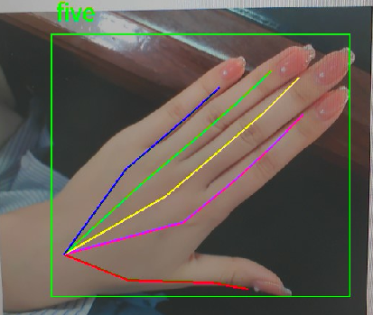
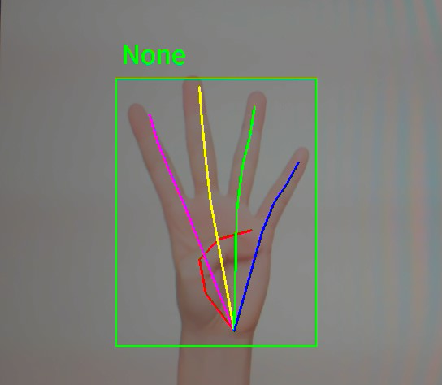

# 手掌关键点分类实验

## 前言

在上一章节中，我们已经学习了如何在CanMV下使用CanMV AI视觉开发框架和MicroPython编程方法实现手掌关键点检测的功能，本章将通过手掌关键点分类实验，介绍如何使用CanMV AI视觉开发框架和MicroPython编程完成根据手掌关键点的位置分布实现手势分类的功能。本实验由上个实验优化和扩展而来，所以使用的模型是一样的，代码相似度也非常高，我们首先采集摄像头捕获的图像，然后经过图像预处理、模型推理和输出处理结果等一系列步骤，完成手掌检测的功能，然后在检测到手掌的区域，进一步使用手掌关键点检测模型进行推理，从而得到每个手掌的21个手掌骨骼关键点位置，接着再根据手掌的21个骨骼关键点的分布判断手掌的手势，最后，将手指关键点信息和手势分类信息绘制并显示到显示器上。通过本章的学习，读者将掌握如何在CanMV下使用CanMV AI视觉开发框架和MicroPython编程方法实现手掌关键点分类的方法。

## AI开发框架介绍

为了简化AI开发流程并降低AI开发难度，CanMV官方针对K230D专门搭建了AI开发框架，有关AI开发框架的介绍，请见[CanMV AI开发框架](development_framework.md)

## 硬件设计

### 例程功能

1. 获取摄像头输出的图像，然后将图像输入到CanMV K230D的AI模型进行推理。本实验使用了两个AI模型：一个是前面章节使用到的手掌检测模型，另一个是手掌关键点检测模型。手掌检测模型负责找出图像中的手掌区域，然后将该区域传递给手掌关键点检测模型进行手掌关键点位置的推理。手掌关键点检测模型能将输入模型的手掌图进行检测，然后对检测到的每一个手掌进行关键点回归得到21个手掌骨骼关键点位置，再根据手掌关键点判断手掌是什么手势，本实验能区分9种手势，分别是"fist"、"five"、"gun"、"love"、"one"、"six"、"three"、"thumbUp"和"yeah"，接着在图像上绘手掌关键点信息和手势分类信息。最后，将处理后的图像显示在LCD上。

### 硬件资源

1. 本章实验内容主要讲解K230D的神经网络加速器KPU的使用，无需关注硬件资源。


### 原理图

1. 本章实验内容主要讲解K230D的神经网络加速器KPU的使用，无需关注原理图。

## 实验代码

``` python
from libs.PipeLine import PipeLine, ScopedTiming
from libs.AIBase import AIBase
from libs.AI2D import Ai2d
from random import randint
import os
import ujson
from media.media import *
from media.sensor import *
from time import *
import nncase_runtime as nn
import ulab.numpy as np
import time
import image
import aicube
import random
import gc
import sys

# 自定义手掌检测任务类
class HandDetApp(AIBase):
    def __init__(self,kmodel_path,labels,model_input_size,anchors,confidence_threshold=0.2,nms_threshold=0.5,nms_option=False, strides=[8,16,32],rgb888p_size=[1920,1080],display_size=[1920,1080],debug_mode=0):
        super().__init__(kmodel_path,model_input_size,rgb888p_size,debug_mode)
        # kmodel路径
        self.kmodel_path=kmodel_path
        # 检测标签
        self.labels=labels
        # 检测模型输入分辨率
        self.model_input_size=model_input_size
        # 置信度阈值
        self.confidence_threshold=confidence_threshold
        # nms阈值
        self.nms_threshold=nms_threshold
        # 检测锚框
        self.anchors=anchors
        self.strides = strides  # 特征下采样倍数
        self.nms_option = nms_option  # NMS选项，如果为True做类间NMS,如果为False做类内NMS
        # sensor给到AI的图像分辨率，宽16字节对齐
        self.rgb888p_size=[ALIGN_UP(rgb888p_size[0],16),rgb888p_size[1]]
        # 视频输出VO分辨率，宽16字节对齐
        self.display_size=[ALIGN_UP(display_size[0],16),display_size[1]]
        # debug模式
        self.debug_mode=debug_mode
        # Ai2d实例，用于实现模型预处理
        self.ai2d=Ai2d(debug_mode)
        # 设置Ai2d的输入输出格式和类型
        self.ai2d.set_ai2d_dtype(nn.ai2d_format.NCHW_FMT,nn.ai2d_format.NCHW_FMT,np.uint8, np.uint8)

    # 配置预处理操作，这里使用了padding和resize，Ai2d支持crop/shift/pad/resize/affine，具体代码请打开/sdcard/app/libs/AI2D.py查看
    def config_preprocess(self,input_image_size=None):
        with ScopedTiming("set preprocess config",self.debug_mode > 0):
            # 初始化ai2d预处理配置，默认为sensor给到AI的尺寸，可以通过设置input_image_size自行修改输入尺寸
            ai2d_input_size = input_image_size if input_image_size else self.rgb888p_size
            # 计算padding参数并应用pad操作，以确保输入图像尺寸与模型输入尺寸匹配
            top, bottom, left, right = self.get_padding_param()
            self.ai2d.pad([0, 0, 0, 0, top, bottom, left, right], 0, [114, 114, 114])
            # 使用双线性插值进行resize操作，调整图像尺寸以符合模型输入要求
            self.ai2d.resize(nn.interp_method.tf_bilinear, nn.interp_mode.half_pixel)
            # 构建预处理流程,参数为预处理输入tensor的shape和预处理输出的tensor的shape
            self.ai2d.build([1,3,ai2d_input_size[1],ai2d_input_size[0]],[1,3,self.model_input_size[1],self.model_input_size[0]])

    # 自定义后处理过程，这里使用了aicube的anchorbasedet_post_process接口
    def postprocess(self,results):
        with ScopedTiming("postprocess",self.debug_mode > 0):
            dets = aicube.anchorbasedet_post_process(results[0], results[1], results[2], self.model_input_size, self.rgb888p_size, self.strides, len(self.labels), self.confidence_threshold, self.nms_threshold, self.anchors, self.nms_option)
            # 返回手掌检测结果
            return dets

    # 计算padding参数，确保输入图像尺寸与模型输入尺寸匹配
    def get_padding_param(self):
        # 根据目标宽度和高度计算比例因子
        dst_w = self.model_input_size[0]
        dst_h = self.model_input_size[1]
        input_width = self.rgb888p_size[0]
        input_high = self.rgb888p_size[1]
        ratio_w = dst_w / input_width
        ratio_h = dst_h / input_high
        # 选择较小的比例因子，以确保图像内容完整
        if ratio_w < ratio_h:
            ratio = ratio_w
        else:
            ratio = ratio_h
        # 计算新的宽度和高度
        new_w = int(ratio * input_width)
        new_h = int(ratio * input_high)
        # 计算宽度和高度的差值，并确定padding的位置
        dw = (dst_w - new_w) / 2
        dh = (dst_h - new_h) / 2
        top = int(round(dh - 0.1))
        bottom = int(round(dh + 0.1))
        left = int(round(dw - 0.1))
        right = int(round(dw + 0.1))
        return top, bottom, left, right

# 自定义手势关键点分类任务类
class HandKPClassApp(AIBase):
    def __init__(self,kmodel_path,model_input_size,rgb888p_size=[1920,1080],display_size=[1920,1080],debug_mode=0):
        super().__init__(kmodel_path,model_input_size,rgb888p_size,debug_mode)
        # kmodel路径
        self.kmodel_path=kmodel_path
        # 手掌关键点模型输入分辨率
        self.model_input_size=model_input_size
        # sensor给到AI的图像分辨率，宽16字节对齐
        self.rgb888p_size=[ALIGN_UP(rgb888p_size[0],16),rgb888p_size[1]]
        # 视频输出VO分辨率，宽16字节对齐
        self.display_size=[ALIGN_UP(display_size[0],16),display_size[1]]
        # crop参数列表
        self.crop_params=[]
        # debug模式
        self.debug_mode=debug_mode
        # Ai2d实例，用于实现模型预处理
        self.ai2d=Ai2d(debug_mode)
        # 设置Ai2d的输入输出格式和类型
        self.ai2d.set_ai2d_dtype(nn.ai2d_format.NCHW_FMT,nn.ai2d_format.NCHW_FMT,np.uint8, np.uint8)

    # 配置预处理操作，这里使用了crop和resize，Ai2d支持crop/shift/pad/resize/affine，具体代码请打开/sdcard/app/libs/AI2D.py查看
    def config_preprocess(self,det,input_image_size=None):
        with ScopedTiming("set preprocess config",self.debug_mode > 0):
            # 如果input_image_size为None,使用视频出图大小，否则按照自定义设置
            ai2d_input_size=input_image_size if input_image_size else self.rgb888p_size
            # 计算crop参数
            self.crop_params = self.get_crop_param(det)
            # 设置crop预处理过程
            self.ai2d.crop(self.crop_params[0],self.crop_params[1],self.crop_params[2],self.crop_params[3])
            # 设置resize预处理过程
            self.ai2d.resize(nn.interp_method.tf_bilinear, nn.interp_mode.half_pixel)
            # build预处理过程，参数为输入tensor的shape和输出tensor的shape
            self.ai2d.build([1,3,ai2d_input_size[1],ai2d_input_size[0]],[1,3,self.model_input_size[1],self.model_input_size[0]])

    # 自定义后处理，results是模型输出的array列表
    def postprocess(self,results):
        with ScopedTiming("postprocess",self.debug_mode > 0):
            results=results[0].reshape(results[0].shape[0]*results[0].shape[1])
            results_show = np.zeros(results.shape,dtype=np.int16)
            results_show[0::2] = results[0::2] * self.crop_params[3] + self.crop_params[0]
            results_show[1::2] = results[1::2] * self.crop_params[2] + self.crop_params[1]
            # 根据输出计算手势
            gesture=self.hk_gesture(results_show)
            return results_show,gesture

    # 计算crop参数
    def get_crop_param(self,det_box):
        x1, y1, x2, y2 = det_box[2],det_box[3],det_box[4],det_box[5]
        w,h= int(x2 - x1),int(y2 - y1)
        w_det = int(float(x2 - x1) * self.display_size[0] // self.rgb888p_size[0])
        h_det = int(float(y2 - y1) * self.display_size[1] // self.rgb888p_size[1])
        x_det = int(x1*self.display_size[0] // self.rgb888p_size[0])
        y_det = int(y1*self.display_size[1] // self.rgb888p_size[1])
        length = max(w, h)/2
        cx = (x1+x2)/2
        cy = (y1+y2)/2
        ratio_num = 1.26*length
        x1_kp = int(max(0,cx-ratio_num))
        y1_kp = int(max(0,cy-ratio_num))
        x2_kp = int(min(self.rgb888p_size[0]-1, cx+ratio_num))
        y2_kp = int(min(self.rgb888p_size[1]-1, cy+ratio_num))
        w_kp = int(x2_kp - x1_kp + 1)
        h_kp = int(y2_kp - y1_kp + 1)
        return [x1_kp, y1_kp, w_kp, h_kp]

    # 求两个vector之间的夹角
    def hk_vector_2d_angle(self,v1,v2):
        with ScopedTiming("hk_vector_2d_angle",self.debug_mode > 0):
            v1_x,v1_y,v2_x,v2_y = v1[0],v1[1],v2[0],v2[1]
            v1_norm = np.sqrt(v1_x * v1_x+ v1_y * v1_y)
            v2_norm = np.sqrt(v2_x * v2_x + v2_y * v2_y)
            dot_product = v1_x * v2_x + v1_y * v2_y
            cos_angle = dot_product/(v1_norm*v2_norm)
            angle = np.acos(cos_angle)*180/np.pi
            return angle

    # 根据手掌关键点检测结果判断手势类别
    def hk_gesture(self,results):
        with ScopedTiming("hk_gesture",self.debug_mode > 0):
            angle_list = []
            for i in range(5):
                angle = self.hk_vector_2d_angle([(results[0]-results[i*8+4]), (results[1]-results[i*8+5])],[(results[i*8+6]-results[i*8+8]),(results[i*8+7]-results[i*8+9])])
                angle_list.append(angle)
            thr_angle,thr_angle_thumb,thr_angle_s,gesture_str = 65.,53.,49.,None
            if 65535. not in angle_list:
                if (angle_list[0]>thr_angle_thumb)  and (angle_list[1]>thr_angle) and (angle_list[2]>thr_angle) and (angle_list[3]>thr_angle) and (angle_list[4]>thr_angle):
                    gesture_str = "fist"
                elif (angle_list[0]<thr_angle_s)  and (angle_list[1]<thr_angle_s) and (angle_list[2]<thr_angle_s) and (angle_list[3]<thr_angle_s) and (angle_list[4]<thr_angle_s):
                    gesture_str = "five"
                elif (angle_list[0]<thr_angle_s)  and (angle_list[1]<thr_angle_s) and (angle_list[2]>thr_angle) and (angle_list[3]>thr_angle) and (angle_list[4]>thr_angle):
                    gesture_str = "gun"
                elif (angle_list[0]<thr_angle_s)  and (angle_list[1]<thr_angle_s) and (angle_list[2]>thr_angle) and (angle_list[3]>thr_angle) and (angle_list[4]<thr_angle_s):
                    gesture_str = "love"
                elif (angle_list[0]>5)  and (angle_list[1]<thr_angle_s) and (angle_list[2]>thr_angle) and (angle_list[3]>thr_angle) and (angle_list[4]>thr_angle):
                    gesture_str = "one"
                elif (angle_list[0]<thr_angle_s)  and (angle_list[1]>thr_angle) and (angle_list[2]>thr_angle) and (angle_list[3]>thr_angle) and (angle_list[4]<thr_angle_s):
                    gesture_str = "six"
                elif (angle_list[0]>thr_angle_thumb)  and (angle_list[1]<thr_angle_s) and (angle_list[2]<thr_angle_s) and (angle_list[3]<thr_angle_s) and (angle_list[4]>thr_angle):
                    gesture_str = "three"
                elif (angle_list[0]<thr_angle_s)  and (angle_list[1]>thr_angle) and (angle_list[2]>thr_angle) and (angle_list[3]>thr_angle) and (angle_list[4]>thr_angle):
                    gesture_str = "thumbUp"
                elif (angle_list[0]>thr_angle_thumb)  and (angle_list[1]<thr_angle_s) and (angle_list[2]<thr_angle_s) and (angle_list[3]>thr_angle) and (angle_list[4]>thr_angle):
                    gesture_str = "yeah"
            return gesture_str

# 自定义动态手势识别任务类
class DynamicGestureApp(AIBase):
    def __init__(self,kmodel_path,model_input_size,rgb888p_size=[1920,1080],display_size=[1920,1080],debug_mode=0):
        super().__init__(kmodel_path,model_input_size,rgb888p_size,debug_mode)
        # kmodel路径
        self.kmodel_path=kmodel_path
        # 检测模型输入分辨率
        self.model_input_size=model_input_size
        # sensor给到AI的图像分辨率，宽16字节对齐
        self.rgb888p_size=[ALIGN_UP(rgb888p_size[0],16),rgb888p_size[1]]
        # 视频输出VO分辨率，宽16字节对齐
        self.display_size=[ALIGN_UP(display_size[0],16),display_size[1]]
        # debug模式
        self.debug_mode=debug_mode
        # 注意：ai2d设置多个预处理时执行的顺序为：crop->shift->resize/affine->pad，如果不符合该顺序，需要配置多个ai2d对象;
        # 如下模型预处理要先做resize再做crop，因此要配置两个Ai2d对象
        self.ai2d_resize=Ai2d(debug_mode)
        self.ai2d_resize.set_ai2d_dtype(nn.ai2d_format.NCHW_FMT,nn.ai2d_format.NCHW_FMT,np.uint8, np.uint8)

        self.ai2d_crop=Ai2d(debug_mode)
        self.ai2d_crop.set_ai2d_dtype(nn.ai2d_format.NCHW_FMT,nn.ai2d_format.NCHW_FMT,np.uint8, np.uint8)

        # 动态手势识别模型输入tensors列表
        self.input_tensors=[]
        # 动态手势识别模型的输入tensor的shape
        self.gesture_kmodel_input_shape = [[1, 3, 224, 224],                     # 动态手势识别kmodel输入分辨率
                                           [1,3,56,56],
                                           [1,4,28,28],
                                           [1,4,28,28],
                                           [1,8,14,14],
                                           [1,8,14,14],
                                           [1,8,14,14],
                                           [1,12,14,14],
                                           [1,12,14,14],
                                           [1,20,7,7],
                                           [1,20,7,7]]
        # 预处理参数
        self.resize_shape = 256
        self.mean_values = np.array([0.485, 0.456, 0.406]).reshape((3,1,1))      # 动态手势识别预处理均值
        self.std_values = np.array([0.229, 0.224, 0.225]).reshape((3,1,1))       # 动态手势识别预处理方差
        self.first_data=None
        self.max_hist_len=20
        self.crop_params=self.get_crop_param()

    # 配置预处理
    def config_preprocess(self,input_image_size=None):
        with ScopedTiming("set preprocess config",self.debug_mode > 0):
            # 初始化ai2d预处理配置
            ai2d_input_size=input_image_size if input_image_size else self.rgb888p_size
            # 配置resize和crop预处理
            self.ai2d_resize.resize(nn.interp_method.tf_bilinear, nn.interp_mode.half_pixel)
            self.ai2d_resize.build([1,3,ai2d_input_size[1],ai2d_input_size[0]],[1,3,self.crop_params[1],self.crop_params[0]])
            self.ai2d_crop.crop(self.crop_params[2],self.crop_params[3],self.crop_params[4],self.crop_params[5])
            self.ai2d_crop.build([1,3,self.crop_params[1],self.crop_params[0]],[1,3,self.model_input_size[1],self.model_input_size[0]])
            # 初始化动态手势识别模型输入列表
            inputs_num=self.get_kmodel_inputs_num()
            self.first_data = np.ones(self.gesture_kmodel_input_shape[0], dtype=np.float)
            for i in range(inputs_num):
                data = np.zeros(self.gesture_kmodel_input_shape[i], dtype=np.float)
                self.input_tensors.append(nn.from_numpy(data))

    # 重写预处理，因为该部分不是单纯的走一个ai2d做预处理，所以该函数需要重写
    def preprocess(self,input_np):
        # 先走resize，再走crop
        resize_tensor=self.ai2d_resize.run(input_np)
        crop_output_tensor=self.ai2d_crop.run(resize_tensor.to_numpy())
        ai2d_output = crop_output_tensor.to_numpy()
        self.first_data[0] = ai2d_output[0].copy()
        self.first_data[0] = (self.first_data[0]*1.0/255 -self.mean_values)/self.std_values
        self.input_tensors[0]=nn.from_numpy(self.first_data)
        return

    # run函数重写
    def run(self,input_np,his_logit,history):
        # 预处理
        self.preprocess(input_np)
        # 推理
        outputs=self.inference(self.input_tensors)
        # 使用当前帧的输出更新下一帧的输入列表
        outputs_num=self.get_kmodel_outputs_num()
        for i in range(1,outputs_num):
            self.input_tensors[i]=nn.from_numpy(outputs[i])
        # 返回后处理结果
        return self.postprocess(outputs,his_logit,history)

    # 自定义后处理
    def postprocess(self,results,his_logit, history):
        with ScopedTiming("postprocess",self.debug_mode > 0):
            his_logit.append(results[0])
            avg_logit = sum(np.array(his_logit))
            idx_ = np.argmax(avg_logit)
            idx = self.gesture_process_output(idx_, history)
            if (idx_ != idx):
                his_logit_last = his_logit[-1]
                his_logit = []
                his_logit.append(his_logit_last)
            return idx, avg_logit

    # 手势处理函数
    def gesture_process_output(self,pred,history):
        if (pred == 7 or pred == 8 or pred == 21 or pred == 22 or pred == 3 ):
            pred = history[-1]
        if (pred == 0 or pred == 4 or pred == 6 or pred == 9 or pred == 14 or pred == 1 or pred == 19 or pred == 20 or pred == 23 or pred == 24) :
            pred = history[-1]
        if (pred == 0) :
            pred = 2
        if (pred != history[-1]) :
            if (len(history)>= 2) :
                if (history[-1] != history[len(history)-2]) :
                    pred = history[-1]
        history.append(pred)
        if (len(history) > self.max_hist_len) :
            history = history[-self.max_hist_len:]
        return history[-1]

    # 计算crop参数
    def get_crop_param(self):
        ori_w = self.rgb888p_size[0]
        ori_h = self.rgb888p_size[1]
        width = self.model_input_size[0]
        height = self.model_input_size[1]
        ratiow = float(self.resize_shape) / ori_w
        ratioh = float(self.resize_shape) / ori_h
        if ratiow < ratioh:
            ratio = ratioh
        else:
            ratio = ratiow
        new_w = int(ratio * ori_w)
        new_h = int(ratio * ori_h)
        top = int((new_h-height)/2)
        left = int((new_w-width)/2)
        return new_w,new_h,left,top,width,height

    # 重写逆初始化
    def deinit(self):
        with ScopedTiming("deinit",self.debug_mode > 0):
            del self.kpu
            del self.ai2d_resize
            del self.ai2d_crop
            self.tensors.clear()
            del self.tensors
            gc.collect()
            nn.shrink_memory_pool()
            os.exitpoint(os.EXITPOINT_ENABLE_SLEEP)
            time.sleep_ms(100)

# 自定义动态手势识别任务
class DynamicGesture:
    def __init__(self,hand_det_kmodel,hand_kp_kmodel,gesture_kmodel,det_input_size,kp_input_size,gesture_input_size,labels,anchors,confidence_threshold=0.25,nms_threshold=0.3,nms_option=False,strides=[8,16,32],rgb888p_size=[1280,720],display_size=[1920,1080],debug_mode=0):
        # 手掌检测模型路径
        self.hand_det_kmodel=hand_det_kmodel
        # 手掌关键点模型路径
        self.hand_kp_kmodel=hand_kp_kmodel
        # 动态手势识别路径
        self.gesture_kmodel=gesture_kmodel
        # 手掌检测模型输入分辨率
        self.det_input_size=det_input_size
        # 手掌关键点模型输入分辨率
        self.kp_input_size=kp_input_size
        # 动态手势识别模型输入分辨率
        self.gesture_input_size=gesture_input_size
        self.labels=labels
        # anchors
        self.anchors=anchors
        # 置信度阈值
        self.confidence_threshold=confidence_threshold
        # nms阈值
        self.nms_threshold=nms_threshold
        self.nms_option=nms_option
        self.strides=strides
        # sensor给到AI的图像分辨率，宽16字节对齐
        self.rgb888p_size=[ALIGN_UP(rgb888p_size[0],16),rgb888p_size[1]]
        # 视频输出VO分辨率，宽16字节对齐
        self.display_size=[ALIGN_UP(display_size[0],16),display_size[1]]
        # 动态手势识别贴图
        self.bin_width = 150                                                     # 动态手势识别屏幕坐上角标志状态文件的短边尺寸
        self.bin_height = 216                                                    # 动态手势识别屏幕坐上角标志状态文件的长边尺寸
        shang_argb = np.fromfile("/sdcard/examples/utils/shang.bin", dtype=np.uint8)
        self.shang_argb = shang_argb.reshape((self.bin_height, self.bin_width, 4))
        xia_argb = np.fromfile("/sdcard/examples/utils/xia.bin", dtype=np.uint8)
        self.xia_argb = xia_argb.reshape((self.bin_height, self.bin_width, 4))
        zuo_argb = np.fromfile("/sdcard/examples/utils/zuo.bin", dtype=np.uint8)
        self.zuo_argb = zuo_argb.reshape((self.bin_width, self.bin_height, 4))
        you_argb = np.fromfile("/sdcard/examples/utils/you.bin", dtype=np.uint8)
        self.you_argb = you_argb.reshape((self.bin_width, self.bin_height, 4))
        #其他参数
        self.TRIGGER = 0                                                         # 动态手势识别应用的结果状态
        self.MIDDLE = 1
        self.UP = 2
        self.DOWN = 3
        self.LEFT = 4
        self.RIGHT = 5
        self.max_hist_len = 20                                                   # 最多存储多少帧的结果
        # debug_mode模式
        self.debug_mode=debug_mode
        self.cur_state = self.TRIGGER
        self.pre_state = self.TRIGGER
        self.draw_state = self.TRIGGER
        self.vec_flag = []
        self.his_logit = []
        self.history = [2]
        self.s_start = time.time_ns()
        self.m_start=None
        self.hand_det=HandDetApp(self.hand_det_kmodel,self.labels,model_input_size=self.det_input_size,anchors=self.anchors,confidence_threshold=self.confidence_threshold,nms_threshold=self.nms_threshold,nms_option=self.nms_option,strides=self.strides,rgb888p_size=self.rgb888p_size,display_size=self.display_size,debug_mode=0)
        self.hand_kp=HandKPClassApp(self.hand_kp_kmodel,model_input_size=self.kp_input_size,rgb888p_size=self.rgb888p_size,display_size=self.display_size)
        self.dg=DynamicGestureApp(self.gesture_kmodel,model_input_size=self.gesture_input_size,rgb888p_size=self.rgb888p_size,display_size=self.display_size)
        self.hand_det.config_preprocess()
        self.dg.config_preprocess()

    # run函数
    def run(self,input_np):
        if self.cur_state == self.TRIGGER:
            # 手掌检测
            det_boxes=self.hand_det.run(input_np)
            boxes=[]
            gesture_res=[]
            for det_box in det_boxes:
                # 筛选检测框
                x1, y1, x2, y2 = det_box[2],det_box[3],det_box[4],det_box[5]
                w,h= int(x2 - x1),int(y2 - y1)
                if (h<(0.1*self.rgb888p_size[1])):
                    continue
                if (w<(0.25*self.rgb888p_size[0]) and ((x1<(0.03*self.rgb888p_size[0])) or (x2>(0.97*self.rgb888p_size[0])))):
                    continue
                if (w<(0.15*self.rgb888p_size[0]) and ((x1<(0.01*self.rgb888p_size[0])) or (x2>(0.99*self.rgb888p_size[0])))):
                    continue
                # 手掌关键点预处理配置
                self.hand_kp.config_preprocess(det_box)
                # 手掌关键点检测
                hk_results,gesture_str=self.hand_kp.run(input_np)
                boxes.append(det_box)
                gesture_res.append((hk_results,gesture_str))
            return boxes,gesture_res
        else:
            # 动态手势识别
            idx, avg_logit = self.dg.run(input_np, self.his_logit, self.history)
            return idx,avg_logit

    # 根据输出结果绘制效果
    def draw_result(self,pl,output1,output2):
        pl.osd_img.clear()
        draw_img_np = np.zeros((self.display_size[1],self.display_size[0],4),dtype=np.uint8)
        draw_img=image.Image(self.display_size[0], self.display_size[1], image.ARGB8888,alloc=image.ALLOC_REF,data=draw_img_np)
        if self.cur_state == self.TRIGGER:
            for i in range(len(output1)):
                hk_results,gesture=output2[i][0],output2[i][1]
                if ((gesture == "five") or (gesture == "yeah")):
                    v_x = hk_results[24]-hk_results[0]
                    v_y = hk_results[25]-hk_results[1]
                    angle = self.hand_kp.hk_vector_2d_angle([v_x,v_y],[1.0,0.0])
                    if (v_y>0):
                        angle = 360-angle
                    if ((70.0<=angle) and (angle<110.0)):                                                   # 手指朝上
                        if ((self.pre_state != self.UP) or (self.pre_state != self.MIDDLE)):
                            self.vec_flag.append(self.pre_state)
                        if ((len(self.vec_flag)>10)or(self.pre_state == self.UP) or (self.pre_state == self.MIDDLE) or(self.pre_state == self.TRIGGER)):
                            draw_img_np[:self.bin_height,:self.bin_width,:] = self.shang_argb
                            self.cur_state = self.UP
                    elif ((110.0<=angle) and (angle<225.0)):                                                # 手指向右(实际方向)
                        if (self.pre_state != self.RIGHT):
                            self.vec_flag.append(self.pre_state)
                        if ((len(self.vec_flag)>10)or(self.pre_state == self.RIGHT)or(self.pre_state == self.TRIGGER)):
                            draw_img_np[:self.bin_width,:self.bin_height,:] = self.you_argb
                            self.cur_state = self.RIGHT
                    elif((225.0<=angle) and (angle<315.0)):                                                 # 手指向下
                        if (self.pre_state != self.DOWN):
                            self.vec_flag.append(self.pre_state)
                        if ((len(self.vec_flag)>10)or(self.pre_state == self.DOWN)or(self.pre_state == self.TRIGGER)):
                            draw_img_np[:self.bin_height,:self.bin_width,:] = self.xia_argb
                            self.cur_state = self.DOWN
                    else:                                                                                   # 手指向左(实际方向)
                        if (self.pre_state != self.LEFT):
                            self.vec_flag.append(self.pre_state)
                        if ((len(self.vec_flag)>10)or(self.pre_state == self.LEFT)or(self.pre_state == self.TRIGGER)):
                            draw_img_np[:self.bin_width,:self.bin_height,:] = self.zuo_argb
                            self.cur_state = self.LEFT
                    self.m_start = time.time_ns()
            self.his_logit = []
        else:
            idx,avg_logit=output1,output2[0]
            if (self.cur_state == self.UP):
                draw_img_np[:self.bin_height,:self.bin_width,:] = self.shang_argb
                if ((idx==15) or (idx==10)):
                    self.vec_flag.clear()
                    if (((avg_logit[idx] >= 0.7) and (len(self.his_logit) >= 2)) or ((avg_logit[idx] >= 0.3) and (len(self.his_logit) >= 4))):
                        self.s_start = time.time_ns()
                        self.cur_state = self.TRIGGER
                        self.draw_state = self.DOWN
                        self.history = [2]
                    self.pre_state = self.UP
                elif ((idx==25)or(idx==26)) :
                    self.vec_flag.clear()
                    if (((avg_logit[idx] >= 0.4) and (len(self.his_logit) >= 2)) or ((avg_logit[idx] >= 0.3) and (len(self.his_logit) >= 3))):
                        self.s_start = time.time_ns()
                        self.cur_state = self.TRIGGER
                        self.draw_state = self.MIDDLE
                        self.history = [2]
                    self.pre_state = self.MIDDLE
                else:
                    self.his_logit.clear()
            elif (self.cur_state == self.RIGHT):
                draw_img_np[:self.bin_width,:self.bin_height,:] = self.you_argb
                if  ((idx==16)or(idx==11)) :
                    self.vec_flag.clear()
                    if (((avg_logit[idx] >= 0.4) and (len(self.his_logit) >= 2)) or ((avg_logit[idx] >= 0.3) and (len(self.his_logit) >= 3))):
                        self.s_start = time.time_ns()
                        self.cur_state = self.TRIGGER
                        self.draw_state = self.RIGHT
                        self.history = [2]
                    self.pre_state = self.RIGHT
                else:
                    self.his_logit.clear()
            elif (self.cur_state == self.DOWN):
                draw_img_np[:self.bin_height,:self.bin_width,:] = self.xia_argb
                if  ((idx==18)or(idx==13)):
                    self.vec_flag.clear()
                    if (((avg_logit[idx] >= 0.4) and (len(self.his_logit) >= 2)) or ((avg_logit[idx] >= 0.3) and (len(self.his_logit) >= 3))):
                        self.s_start = time.time_ns()
                        self.cur_state = self.TRIGGER
                        self.draw_state = self.UP
                        self.history = [2]
                    self.pre_state = self.DOWN
                else:
                    self.his_logit.clear()
            elif (self.cur_state == self.LEFT):
                draw_img_np[:self.bin_width,:self.bin_height,:] = self.zuo_argb
                if ((idx==17)or(idx==12)):
                    self.vec_flag.clear()
                    if (((avg_logit[idx] >= 0.4) and (len(self.his_logit) >= 2)) or ((avg_logit[idx] >= 0.3) and (len(self.his_logit) >= 3))):
                        self.s_start = time.time_ns()
                        self.cur_state = self.TRIGGER
                        self.draw_state = self.LEFT
                        self.history = [2]
                    self.pre_state = self.LEFT
                else:
                    self.his_logit.clear()

            self.elapsed_time = round((time.time_ns() - self.m_start)/1000000)

            if ((self.cur_state != self.TRIGGER) and (self.elapsed_time>2000)):
                self.cur_state = self.TRIGGER
                self.pre_state = self.TRIGGER

        self.elapsed_ms_show = round((time.time_ns()-self.s_start)/1000000)
        if (self.elapsed_ms_show<1000):
            if (self.draw_state == self.UP):
                draw_img.draw_arrow(1068,330,1068,130, (255,170,190,230), thickness=13)                             # 判断为向上挥动时，画一个向上的箭头
                draw_img.draw_string_advanced(self.display_size[0]//2-50,self.display_size[1]//2-50,32,"向下")
            elif (self.draw_state == self.RIGHT):
                draw_img.draw_arrow(1290,540,1536,540, (255,170,190,230), thickness=13)                             # 判断为向右挥动时，画一个向右的箭头
                draw_img.draw_string_advanced(self.display_size[0]//2-50,self.display_size[1]//2-50,32,"向左")
            elif (self.draw_state == self.DOWN):
                draw_img.draw_arrow(1068,750,1068,950, (255,170,190,230), thickness=13)                             # 判断为向下挥动时，画一个向下的箭头
                draw_img.draw_string_advanced(self.display_size[0]//2-50,self.display_size[1]//2-50,32,"向上")
            elif (self.draw_state == self.LEFT):
                draw_img.draw_arrow(846,540,600,540, (255,170,190,230), thickness=13)                               # 判断为向左挥动时，画一个向左的箭头
                draw_img.draw_string_advanced(self.display_size[0]//2-50,self.display_size[1]//2-50,32,"向右")
            elif (self.draw_state == self.MIDDLE):
                draw_img.draw_circle(1068,540,100, (255,170,190,230), thickness=2, fill=True)                       # 判断为五指捏合手势时，画一个实心圆
                draw_img.draw_string_advanced(self.display_size[0]//2-50,self.display_size[1]//2-50,32,"中间")
        else:
            self.draw_state = self.TRIGGER
        pl.osd_img.copy_from(draw_img)


if __name__=="__main__":
    # 显示模式，默认"lcd"
    display_mode="lcd"
    display_size=[640,480]
    # 手掌检测模型路径
    hand_det_kmodel_path="/sdcard/examples/kmodel/hand_det.kmodel"
    # 手部关键点模型路径
    hand_kp_kmodel_path="/sdcard/examples/kmodel/handkp_det.kmodel"
    # 动态手势识别模型路径
    gesture_kmodel_path="/sdcard/examples/kmodel/gesture.kmodel"
    # 其他参数
    rgb888p_size=[1024,768]
    hand_det_input_size=[512,512]
    hand_kp_input_size=[256,256]
    gesture_input_size=[224,224]
    confidence_threshold=0.2
    nms_threshold=0.5
    labels=["hand"]
    anchors = [26,27, 53,52, 75,71, 80,99, 106,82, 99,134, 140,113, 161,172, 245,276]

    # 初始化PipeLine，只关注传给AI的图像分辨率，显示的分辨率
    sensor = Sensor(width=1280, height=960) # 构建摄像头对象
    pl = PipeLine(rgb888p_size=rgb888p_size, display_size=display_size, display_mode=display_mode)
    pl.create(sensor=sensor)  # 创建PipeLine实例
    # 自定义动态手势识别任务实例
    dg=DynamicGesture(hand_det_kmodel_path,hand_kp_kmodel_path,gesture_kmodel_path,det_input_size=hand_det_input_size,kp_input_size=hand_kp_input_size,gesture_input_size=gesture_input_size,labels=labels,anchors=anchors,confidence_threshold=confidence_threshold,nms_threshold=nms_threshold,nms_option=False,strides=[8,16,32],rgb888p_size=rgb888p_size,display_size=display_size)
    try:
        while True:
            os.exitpoint()
            with ScopedTiming("total",1):
                img=pl.get_frame()                 # 获取当前帧
                output1,output2=dg.run(img)        # 推理当前帧
#                print(output1, output2)            # 打印结果
                dg.draw_result(pl,output1,output2) # 绘制推理结果
                pl.show_image()                    # 展示推理结果
                gc.collect()
    except Exception as e:
        sys.print_exception(e)
    finally:
        dg.hand_det.deinit()
        dg.hand_kp.deinit()
        dg.dg.deinit()
        pl.destroy()
```

可以看到首先是定义显示模式、图像大小、模型相关的一些变量。

接着是通过初始化PipeLine，这里主要初始化sensor和display模块，配置摄像头输出两路不同的格式和大小的图像，以及设置显示模式，完成创建PipeLine实例。

然后调用自定义HandKeyPointClass类构建手掌关键点分类的任务，HandKeyPointClass类会通过调用HandDetApp类和HandKPClassApp类完成对AIBase接口的初始化以及使用Ai2D接口的方法定义手掌检测模型和手掌关键点检测模型输入图像的预处理方法。

最后在一个循环中不断地获取摄像头输出的RGBP888格式的图像帧，然后依次将图像输入到手掌检测模型、手掌关键点检测模型进行推理，然后将推理结果通过print打印，同时根据结果信息将手掌关键点信息和手势分类信息绘制图像上，并在LCD上显示图像。

## 运行验证

手掌关键点分类可分为以下9种手势，分别"fist"、"five"、"gun"、"love"、"one"、"six"、"three"、"thumbUp"和"yeah"，其他手势将输出"other"，9种手势图如下所示：


将K230D BOX开发板连接CanMV IDE，点击CanMV IDE上的“开始(运行脚本)”按钮后，将摄像头对准手掌，让其采集到手掌图像，随后，在LCD屏幕上可以看到摄像头输出的图像，其中，手掌会被一个矩形框标记出来，而矩形框内五个手指则会根据21个手掌骨骼的关键点，使用五种不同颜色的线条有序连接，矩形框上方标注手势分类结果。如下图所示：  



当识别到其他手势时，矩形框上方显示"None"，如下图所示：




