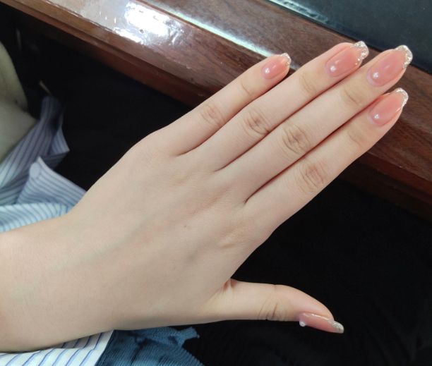

# 手掌关键点检测实验

## 前言

在上一章节中，我们已经学习了如何在CanMV下使用CanMV AI视觉开发框架和MicroPython编程方法实现手势识别的功能，本章将通过手掌关键点检测实验，介绍如何使用CanMV AI视觉开发框架和MicroPython编程完成手掌检测，并进一步使用手掌关键点检测模型将检测到的每一个手掌进行关键点回归得到21个手掌骨骼关键点位置，然后用不同颜色的线条连接21个关键点并绘制出来。在本实验中，我们首先采集摄像头捕获的图像，然后经过图像预处理、模型推理和输出处理结果等一系列步骤，完成手掌检测的功能，然后在检测到手掌的区域，进一步使用手掌关键点检测模型进行推理，从而得到每个手掌的21个手掌骨骼关键点位置，最后，将21个手掌关键点用不同颜色线段绘制并显示到显示器上。通过本章的学习，读者将掌握如何在CanMV下使用CanMV AI视觉开发框架和MicroPython编程方法实现手掌关键点检测功能。

## AI开发框架介绍

为了简化AI开发流程并降低AI开发难度，CanMV官方针对K230D专门搭建了AI开发框架，有关AI开发框架的介绍，请见[CanMV AI开发框架](development_framework.md)

## 硬件设计

### 例程功能

1. 获取摄像头输出的图像，然后将图像输入到CanMV K230D的AI模型进行推理。本实验使用了两个AI模型：一个是前面章节使用到的手掌检测模型，另一个是手掌关键点检测模型。手掌检测模型负责找出图像中的手掌区域，然后将该区域传递给手掌关键点检测模型进行手掌关键点位置的推理。手掌关键点检测模型能将输入模型的手掌图进行检测，然后对检测到的每一个手掌进行关键点回归得到21个手掌骨骼关键点位置，接着在图像上用不同颜色的线段将关键点和关键点的连线标识出来。最后，将处理后的图像显示在LCD上。

### 硬件资源

1. 本章实验内容主要讲解K230D的神经网络加速器KPU的使用，无需关注硬件资源。


### 原理图

1. 本章实验内容主要讲解K230D的神经网络加速器KPU的使用，无需关注原理图。

## 实验代码

``` python
from libs.PipeLine import PipeLine, ScopedTiming
from libs.AIBase import AIBase
from libs.AI2D import Ai2d
import os
import ujson
from media.media import *
from media.sensor import *
from time import *
import nncase_runtime as nn
import ulab.numpy as np
import time
import image
import aicube
import random
import gc
import sys

# 自定义手掌检测任务类
class HandDetApp(AIBase):
    def __init__(self,kmodel_path,labels,model_input_size,anchors,confidence_threshold=0.2,nms_threshold=0.5,nms_option=False, strides=[8,16,32],rgb888p_size=[1920,1080],display_size=[1920,1080],debug_mode=0):
        super().__init__(kmodel_path,model_input_size,rgb888p_size,debug_mode)
        # kmodel路径
        self.kmodel_path=kmodel_path
        self.labels=labels
        # 检测模型输入分辨率
        self.model_input_size=model_input_size
        # 置信度阈值
        self.confidence_threshold=confidence_threshold
        # nms阈值
        self.nms_threshold=nms_threshold
        # 锚框,目标检测任务使用
        self.anchors=anchors
        # 特征下采样倍数
        self.strides = strides
        # NMS选项，如果为True做类间NMS,如果为False做类内NMS
        self.nms_option = nms_option
        # sensor给到AI的图像分辨率，宽16字节对齐
        self.rgb888p_size=[ALIGN_UP(rgb888p_size[0],16),rgb888p_size[1]]
        # 视频输出VO分辨率，宽16字节对齐
        self.display_size=[ALIGN_UP(display_size[0],16),display_size[1]]
        # debug模式
        self.debug_mode=debug_mode
        # Ai2d实例用于实现预处理
        self.ai2d=Ai2d(debug_mode)
        # 设置ai2d的输入输出的格式和数据类型
        self.ai2d.set_ai2d_dtype(nn.ai2d_format.NCHW_FMT,nn.ai2d_format.NCHW_FMT,np.uint8, np.uint8)

    # 配置预处理操作，这里使用了pad和resize，Ai2d支持crop/shift/pad/resize/affine，具体代码请打开/sdcard/libs/AI2D.py查看
    def config_preprocess(self,input_image_size=None):
        with ScopedTiming("set preprocess config",self.debug_mode > 0):
            # 初始化ai2d预处理配置，默认为sensor给到AI的尺寸，可以通过设置input_image_size自行修改输入尺寸
            ai2d_input_size = input_image_size if input_image_size else self.rgb888p_size
            # 计算padding参数并应用pad操作，以确保输入图像尺寸与模型输入尺寸匹配
            top, bottom, left, right = self.get_padding_param()
            self.ai2d.pad([0, 0, 0, 0, top, bottom, left, right], 0, [114, 114, 114])
            # 使用双线性插值进行resize操作，调整图像尺寸以符合模型输入要求
            self.ai2d.resize(nn.interp_method.tf_bilinear, nn.interp_mode.half_pixel)
            # 构建预处理流程,参数为预处理输入tensor的shape和预处理输出的tensor的shape
            self.ai2d.build([1,3,ai2d_input_size[1],ai2d_input_size[0]],[1,3,self.model_input_size[1],self.model_input_size[0]])

    # 自定义当前任务的后处理，用于处理模型输出结果，这里使用了aicube库的anchorbasedet_post_process接口
    def postprocess(self,results):
        with ScopedTiming("postprocess",self.debug_mode > 0):
            dets = aicube.anchorbasedet_post_process(results[0], results[1], results[2], self.model_input_size, self.rgb888p_size, self.strides, len(self.labels), self.confidence_threshold, self.nms_threshold, self.anchors, self.nms_option)
            # 返回手掌检测结果
            return dets

    # 计算padding参数，确保输入图像尺寸与模型输入尺寸匹配
    def get_padding_param(self):
        # 根据目标宽度和高度计算比例因子
        dst_w = self.model_input_size[0]
        dst_h = self.model_input_size[1]
        input_width = self.rgb888p_size[0]
        input_high = self.rgb888p_size[1]
        ratio_w = dst_w / input_width
        ratio_h = dst_h / input_high
        # 选择较小的比例因子，以确保图像内容完整
        if ratio_w < ratio_h:
            ratio = ratio_w
        else:
            ratio = ratio_h
        # 计算新的宽度和高度
        new_w = int(ratio * input_width)
        new_h = int(ratio * input_high)
        # 计算宽度和高度的差值，并确定padding的位置
        dw = (dst_w - new_w) / 2
        dh = (dst_h - new_h) / 2
        top = int(round(dh - 0.1))
        bottom = int(round(dh + 0.1))
        left = int(round(dw - 0.1))
        right = int(round(dw + 0.1))
        return top, bottom, left, right

# 自定义手势关键点检测任务类
class HandKPDetApp(AIBase):
    def __init__(self,kmodel_path,model_input_size,rgb888p_size=[1920,1080],display_size=[1920,1080],debug_mode=0):
        super().__init__(kmodel_path,model_input_size,rgb888p_size,debug_mode)
        # kmodel路径
        self.kmodel_path=kmodel_path
        # 检测模型输入分辨率
        self.model_input_size=model_input_size
        # sensor给到AI的图像分辨率，宽16字节对齐
        self.rgb888p_size=[ALIGN_UP(rgb888p_size[0],16),rgb888p_size[1]]
        # 视频输出VO分辨率，宽16字节对齐
        self.display_size=[ALIGN_UP(display_size[0],16),display_size[1]]
        self.crop_params=[]
        # debug模式
        self.debug_mode=debug_mode
        # Ai2d实例用于实现预处理
        self.ai2d=Ai2d(debug_mode)
        # 设置ai2d的输入输出的格式和数据类型
        self.ai2d.set_ai2d_dtype(nn.ai2d_format.NCHW_FMT,nn.ai2d_format.NCHW_FMT,np.uint8, np.uint8)

    # 配置预处理操作，这里使用了crop和resize，Ai2d支持crop/shift/pad/resize/affine，具体代码请打开/sdcard/libs/AI2D.py查看
    def config_preprocess(self,det,input_image_size=None):
        with ScopedTiming("set preprocess config",self.debug_mode > 0):
            ai2d_input_size=input_image_size if input_image_size else self.rgb888p_size
            self.crop_params = self.get_crop_param(det)
            self.ai2d.crop(self.crop_params[0],self.crop_params[1],self.crop_params[2],self.crop_params[3])
            self.ai2d.resize(nn.interp_method.tf_bilinear, nn.interp_mode.half_pixel)
            self.ai2d.build([1,3,ai2d_input_size[1],ai2d_input_size[0]],[1,3,self.model_input_size[1],self.model_input_size[0]])

    # 自定义后处理，results是模型输出的array列表
    def postprocess(self,results):
        with ScopedTiming("postprocess",self.debug_mode > 0):
            results=results[0].reshape(results[0].shape[0]*results[0].shape[1])
            results_show = np.zeros(results.shape,dtype=np.int16)
            results_show[0::2] = results[0::2] * self.crop_params[3] + self.crop_params[0]
            results_show[1::2] = results[1::2] * self.crop_params[2] + self.crop_params[1]
            results_show[0::2] = results_show[0::2] * (self.display_size[0] / self.rgb888p_size[0])
            results_show[1::2] = results_show[1::2] * (self.display_size[1] / self.rgb888p_size[1])
            return results_show

    # 计算crop参数
    def get_crop_param(self,det_box):
        x1, y1, x2, y2 = det_box[2],det_box[3],det_box[4],det_box[5]
        w,h= int(x2 - x1),int(y2 - y1)
        w_det = int(float(x2 - x1) * self.display_size[0] // self.rgb888p_size[0])
        h_det = int(float(y2 - y1) * self.display_size[1] // self.rgb888p_size[1])
        x_det = int(x1*self.display_size[0] // self.rgb888p_size[0])
        y_det = int(y1*self.display_size[1] // self.rgb888p_size[1])
        length = max(w, h)/2
        cx = (x1+x2)/2
        cy = (y1+y2)/2
        ratio_num = 1.26*length
        x1_kp = int(max(0,cx-ratio_num))
        y1_kp = int(max(0,cy-ratio_num))
        x2_kp = int(min(self.rgb888p_size[0]-1, cx+ratio_num))
        y2_kp = int(min(self.rgb888p_size[1]-1, cy+ratio_num))
        w_kp = int(x2_kp - x1_kp + 1)
        h_kp = int(y2_kp - y1_kp + 1)
        return [x1_kp, y1_kp, w_kp, h_kp]

# 手掌关键点检测任务
class HandKeyPointDet:
    def __init__(self,hand_det_kmodel,hand_kp_kmodel,det_input_size,kp_input_size,labels,anchors,confidence_threshold=0.25,nms_threshold=0.3,nms_option=False,strides=[8,16,32],rgb888p_size=[1280,720],display_size=[1920,1080],debug_mode=0):
        # 手掌检测模型路径
        self.hand_det_kmodel=hand_det_kmodel
        # 手掌关键点模型路径
        self.hand_kp_kmodel=hand_kp_kmodel
        # 手掌检测模型输入分辨率
        self.det_input_size=det_input_size
        # 手掌关键点模型输入分辨率
        self.kp_input_size=kp_input_size
        self.labels=labels
        # anchors
        self.anchors=anchors
        # 置信度阈值
        self.confidence_threshold=confidence_threshold
        # nms阈值
        self.nms_threshold=nms_threshold
        # nms选项
        self.nms_option=nms_option
        # 特征图对于输入的下采样倍数
        self.strides=strides
        # sensor给到AI的图像分辨率，宽16字节对齐
        self.rgb888p_size=[ALIGN_UP(rgb888p_size[0],16),rgb888p_size[1]]
        # 视频输出VO分辨率，宽16字节对齐
        self.display_size=[ALIGN_UP(display_size[0],16),display_size[1]]
        # debug_mode模式
        self.debug_mode=debug_mode
        self.hand_det=HandDetApp(self.hand_det_kmodel,self.labels,model_input_size=self.det_input_size,anchors=self.anchors,confidence_threshold=self.confidence_threshold,nms_threshold=self.nms_threshold,nms_option=self.nms_option,strides=self.strides,rgb888p_size=self.rgb888p_size,display_size=self.display_size,debug_mode=0)
        self.hand_kp=HandKPDetApp(self.hand_kp_kmodel,model_input_size=self.kp_input_size,rgb888p_size=self.rgb888p_size,display_size=self.display_size)
        self.hand_det.config_preprocess()

    # run函数
    def run(self,input_np):
        # 手掌检测
        det_boxes=self.hand_det.run(input_np)
        hand_res=[]
        boxes=[]
        for det_box in det_boxes:
            # 对检测到的每个手掌执行手势关键点识别
            x1, y1, x2, y2 = det_box[2],det_box[3],det_box[4],det_box[5]
            w,h= int(x2 - x1),int(y2 - y1)
            # 丢弃不合理的框
            if (h<(0.1*self.rgb888p_size[1])):
                continue
            if (w<(0.25*self.rgb888p_size[0]) and ((x1<(0.03*self.rgb888p_size[0])) or (x2>(0.97*self.rgb888p_size[0])))):
                continue
            if (w<(0.15*self.rgb888p_size[0]) and ((x1<(0.01*self.rgb888p_size[0])) or (x2>(0.99*self.rgb888p_size[0])))):
                continue
            self.hand_kp.config_preprocess(det_box)
            results_show=self.hand_kp.run(input_np)
            boxes.append(det_box)
            hand_res.append(results_show)
        return boxes,hand_res

    # 绘制效果，绘制手掌关键点、检测框
    def draw_result(self,pl,dets,hand_res):
        pl.osd_img.clear()
        if dets:
            for k in range(len(dets)):
                det_box=dets[k]
                x1, y1, x2, y2 = det_box[2],det_box[3],det_box[4],det_box[5]
                w,h= int(x2 - x1),int(y2 - y1)
                w_det = int(float(x2 - x1) * self.display_size[0] // self.rgb888p_size[0])
                h_det = int(float(y2 - y1) * self.display_size[1] // self.rgb888p_size[1])
                x_det = int(x1*self.display_size[0] // self.rgb888p_size[0])
                y_det = int(y1*self.display_size[1] // self.rgb888p_size[1])
                pl.osd_img.draw_rectangle(x_det, y_det, w_det, h_det, color=(255, 0, 255, 0), thickness = 2)

                results_show=hand_res[k]
                for i in range(len(results_show)/2):
                    pl.osd_img.draw_circle(results_show[i*2], results_show[i*2+1], 1, color=(255, 0, 255, 0),fill=False)
                for i in range(5):
                    j = i*8
                    if i==0:
                        R = 255; G = 0; B = 0
                    if i==1:
                        R = 255; G = 0; B = 255
                    if i==2:
                        R = 255; G = 255; B = 0
                    if i==3:
                        R = 0; G = 255; B = 0
                    if i==4:
                        R = 0; G = 0; B = 255
                    pl.osd_img.draw_line(results_show[0], results_show[1], results_show[j+2], results_show[j+3], color=(255,R,G,B), thickness = 3)
                    pl.osd_img.draw_line(results_show[j+2], results_show[j+3], results_show[j+4], results_show[j+5], color=(255,R,G,B), thickness = 3)
                    pl.osd_img.draw_line(results_show[j+4], results_show[j+5], results_show[j+6], results_show[j+7], color=(255,R,G,B), thickness = 3)
                    pl.osd_img.draw_line(results_show[j+6], results_show[j+7], results_show[j+8], results_show[j+9], color=(255,R,G,B), thickness = 3)


if __name__=="__main__":
    # 显示模式，默认"lcd"
    display_mode="lcd"
    display_size=[640,480]
    # 手掌检测模型路径
    hand_det_kmodel_path="/sdcard/examples/kmodel/hand_det.kmodel"
    # 手部关键点模型路径
    hand_kp_kmodel_path="/sdcard/examples/kmodel/handkp_det.kmodel"
    # 其它参数
    anchors_path="/sdcard/examples/utils/prior_data_320.bin"
    rgb888p_size=[1280,960]
    hand_det_input_size=[512,512]
    hand_kp_input_size=[256,256]
    confidence_threshold=0.2
    nms_threshold=0.5
    labels=["hand"]
    anchors = [26,27, 53,52, 75,71, 80,99, 106,82, 99,134, 140,113, 161,172, 245,276]

    # 初始化PipeLine，只关注传给AI的图像分辨率，显示的分辨率
    sensor = Sensor(width=1280, height=960) # 构建摄像头对象
    pl = PipeLine(rgb888p_size=rgb888p_size, display_size=display_size, display_mode=display_mode)
    pl.create(sensor=sensor)  # 创建PipeLine实例
    hkd=HandKeyPointDet(hand_det_kmodel_path,hand_kp_kmodel_path,det_input_size=hand_det_input_size,kp_input_size=hand_kp_input_size,labels=labels,anchors=anchors,confidence_threshold=confidence_threshold,nms_threshold=nms_threshold,nms_option=False,strides=[8,16,32],rgb888p_size=rgb888p_size,display_size=display_size)
    try:
        while True:
            os.exitpoint()
            with ScopedTiming("total",1):
                img=pl.get_frame()                      # 获取当前帧
                det_boxes,hand_res=hkd.run(img)         # 推理当前帧
#                print(det_boxes, hand_res)              # 打印结果
                hkd.draw_result(pl,det_boxes,hand_res)  # 绘制推理结果
                pl.show_image()                         # 展示推理结果
                gc.collect()
    except Exception as e:
        sys.print_exception(e)
    finally:
        hkd.hand_det.deinit()
        hkd.hand_kp.deinit()
        pl.destroy()
```

可以看到首先是定义显示模式、图像大小、模型相关的一些变量。

接着是通过初始化PipeLine，这里主要初始化sensor和display模块，配置摄像头输出两路不同的格式和大小的图像，以及设置显示模式，完成创建PipeLine实例。

然后调用自定义HandKeyPointDet类构建手掌关键点检测的任务，HandKeyPointDet类会通过调用HandDetApp类和HandKPDetApp类完成对AIBase接口的初始化以及使用Ai2D接口的方法定义手掌检测模型和手掌关键点检测模型输入图像的预处理方法。

最后在一个循环中不断地获取摄像头输出的RGBP888格式的图像帧，然后依次将图像输入到手掌检测模型、手掌关键点检测模型进行推理，然后将推理结果通过print打印，同时根据结果信息用不同颜色线段将手掌和手掌的21个关键点绘制到图像上，并在LCD上显示图像。

## 运行验证

实验原图如下所示：



将K230D BOX开发板连接CanMV IDE，点击CanMV IDE上的“开始(运行脚本)”按钮后，将摄像头对准手掌，让其采集到手掌图像，随后，在LCD屏幕上可以看到摄像头输出的图像，其中，手掌会被一个矩形框标记出来，而矩形框内五个手指则会根据21个手掌骨骼的关键点，使用五种不同颜色的线条有序连接。如下图所示：  


