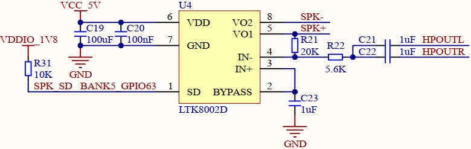
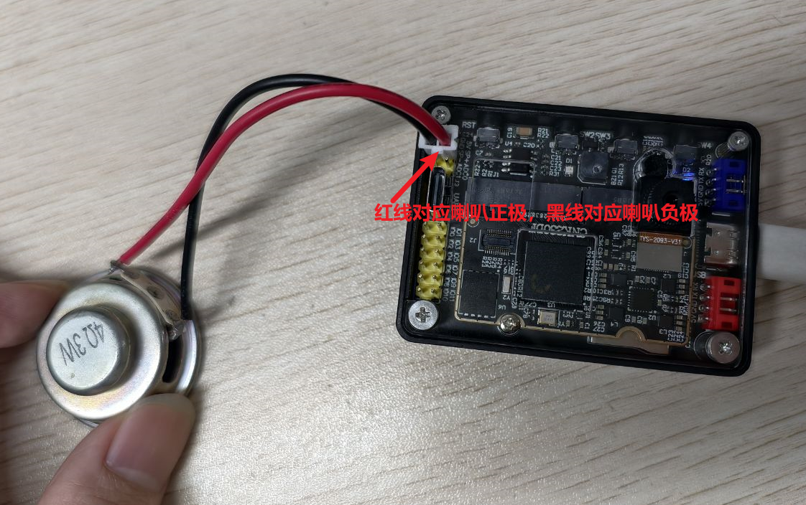
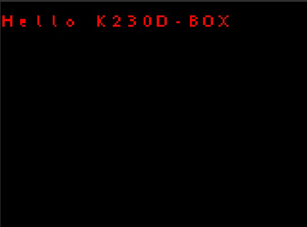

# 关键词唤醒实验

## 前言

在上一章节中，我们已经学习了如何在CanMV下使用CanMV AI视觉开发框架和MicroPython编程方法实现车牌号识别的功能，本章将通过关键词唤醒实验，介绍如何使用CanMV AI视觉开发框架和MicroPython编程语音识别的关键词唤醒功能。在本实验中，我们初始化音频模块，启用麦克风和扬声器功能，系统便可通过麦克风不断采集外界音频信息，然后再把音频信息输入到模型进行匹配，当识别的匹配度达到较高水平时，即视为识别成功。通过本章的学习，读者将掌握如何在CanMV下使用CanMV AI视觉开发框架和MicroPython编程方法实现关键词唤醒的功能。

## AI开发框架介绍

为了简化AI开发流程并降低AI开发难度，CanMV官方针对K230D专门搭建了AI开发框架，有关AI开发框架的介绍，请见[CanMV AI开发框架](development_framework.md)

## 硬件设计

### 例程功能

1. 初始化系统的麦克风和扬声器功能，系统便可不断获取外界输入的音频信息，然后将音频信息输入到关键词唤醒模型进行匹配，当识别到语音指令为”小楠，小楠!“时，语音关键词匹配成功，系统输出唤醒成功的结果，我们可根据结果信息播放反馈语音“我在”以及将屏幕点亮，表示语音关键词唤醒成功。


### 硬件资源

1. LTK8002D - IO63


### 原理图

1. 本章实验内容，可以通过连接开发板的喇叭接口，从而能够听到关键词唤醒后喇叭播放的声音，通过喇叭播放声音需要使用音频功放芯片，正点原子K230D BOX开发板上音频功放的连接原理图，如下图所示：



可以看到，开发板使用的是LTK8002D这片功放芯片，根据芯片手册介绍，当拉低SD引脚时，使能音频输出，使能音频输出又便可连接喇叭播放声音，SPK-和SPK+分别连接喇叭的负极和正极，具体连接示意图看[运行验证](#运行验证)

## 实验代码

``` python
from libs.PipeLine import ScopedTiming
from libs.AIBase import AIBase
from libs.AI2D import Ai2d
from media.pyaudio import *                     # 音频模块
from media.media import *
from media.display import *                     # 导入display模块，使用display相关接口
from media.sensor import *                      # 软件抽象模块，主要封装媒体数据链路以及媒体缓冲区
from machine import Pin
from machine import FPIOA
import media.wave as wave                       # wav音频处理模块
import nncase_runtime as nn                     # nncase运行模块，封装了kpu（kmodel推理）和ai2d（图片预处理加速）操作
import ulab.numpy as np                         # 类似python numpy操作，但也会有一些接口不同
import aidemo                                   # aidemo模块，封装ai demo相关前处理、后处理等操作
import time                                     # 时间统计
import struct                                   # 字节字符转换模块
import gc                                       # 垃圾回收模块
import os,sys                                   # 操作系统接口模块

DISPLAY_WIDTH = ALIGN_UP(640, 16)
DISPLAY_HEIGHT = 480

# 自定义关键词唤醒类，继承自AIBase基类
class KWSApp(AIBase):
    def __init__(self, kmodel_path, threshold, debug_mode=0):
        super().__init__(kmodel_path)  # 调用基类的构造函数
        self.kmodel_path = kmodel_path  # 模型文件路径
        self.threshold=threshold
        self.debug_mode = debug_mode  # 是否开启调试模式
        self.cache_np = np.zeros((1, 256, 105), dtype=np.float)

    # 自定义预处理，返回模型输入tensor列表
    def preprocess(self,pcm_data):
        pcm_data_list=[]
        # 获取音频流数据
        for i in range(0, len(pcm_data), 2):
            # 每两个字节组织成一个有符号整数，然后将其转换为浮点数，即为一次采样的数据，加入到当前一帧（0.3s）的数据列表中
            int_pcm_data = struct.unpack("<h", pcm_data[i:i+2])[0]
            float_pcm_data = float(int_pcm_data)
            pcm_data_list.append(float_pcm_data)
        # 将pcm数据处理为模型输入的特征向量
        mp_feats = aidemo.kws_preprocess(fp, pcm_data_list)[0]
        mp_feats_np = np.array(mp_feats).reshape((1, 30, 40))
        audio_input_tensor = nn.from_numpy(mp_feats_np)
        cache_input_tensor = nn.from_numpy(self.cache_np)
        return [audio_input_tensor,cache_input_tensor]

    # 自定义当前任务的后处理，results是模型输出array列表
    def postprocess(self, results):
        with ScopedTiming("postprocess", self.debug_mode > 0):
            logits_np = results[0]
            self.cache_np= results[1]
            max_logits = np.max(logits_np, axis=1)[0]
            max_p = np.max(max_logits)
            idx = np.argmax(max_logits)
            # 如果分数大于阈值，且idx==1(即包含唤醒词)，播放回复音频
            if max_p > self.threshold and idx == 1:
                return 1
            else:
                return 0


if __name__ == "__main__":
    # 实例化FPIOA
    fpioa = FPIOA()
    # 设置Pin63为GPIO63
    fpioa.set_function(63, FPIOA.GPIO63)
    # 实例化功放控制引脚
    spk_sd = Pin(63, Pin.OUT, pull=Pin.PULL_NONE, drive=7)
    # 拉低使能
    spk_sd.value(0)

    os.exitpoint(os.EXITPOINT_ENABLE)
    nn.shrink_memory_pool()
    # 设置模型路径和其他参数
    kmodel_path = "/sdcard/examples/kmodel/kws.kmodel"
    # 其它参数
    THRESH = 0.5                # 检测阈值
    SAMPLE_RATE = 16000         # 采样率16000Hz,即每秒采样16000次
    CHANNELS = 1                # 通道数 1为单声道，2为立体声
    FORMAT = paInt16            # 音频输入输出格式 paInt16
    CHUNK = int(0.3 * 16000)    # 每次读取音频数据的帧数，设置为0.3s的帧数16000*0.3=4800
    reply_wav_file = "/sdcard/examples/utils/wozai.wav"         # kws唤醒词回复音频路径

    img = image.Image(DISPLAY_WIDTH, DISPLAY_HEIGHT, image.RGB888)
    # 初始化LCD
    Display.init(Display.ST7701, width = DISPLAY_WIDTH, height = DISPLAY_HEIGHT, to_ide = True)
    # 初始化音频预处理接口
    fp = aidemo.kws_fp_create()
    # 初始化音频流
    p = PyAudio()
    p.initialize(CHUNK)
    MediaManager.init()    #vb buffer初始化
    # 用于采集实时音频数据
    input_stream = p.open(format=FORMAT,channels=CHANNELS,rate=SAMPLE_RATE,input=True,frames_per_buffer=CHUNK)
    # 用于播放回复音频，K230D BOX无扬声器，需要外接扬声器
    output_stream = p.open(format=FORMAT,channels=CHANNELS,rate=SAMPLE_RATE,output=True,frames_per_buffer=CHUNK)
    # 初始化自定义关键词唤醒实例
    kws = KWSApp(kmodel_path,threshold=THRESH,debug_mode=0)

    try:
        while True:
            os.exitpoint()                      # 检查是否有退出信号
            with ScopedTiming("total",1):
                pcm_data=input_stream.read()
                res=kws.run(pcm_data)
                if res:
                    print("====Detected XiaonanXiaonan!====")
                    wf = wave.open(reply_wav_file, "rb")
                    wav_data = wf.read_frames(CHUNK)
                    while wav_data:
                        output_stream.write(wav_data)
                        wav_data = wf.read_frames(CHUNK)
                    time.sleep(1) # 时间缓冲，用于播放回复声音
                    wf.close()
                    img.clear()
                    time.sleep_ms(100)
                    img.draw_string(0, 20, "Hello K230D-BOX\r\n", color=(255, 0, 0), scale=4)
                    Display.show_image(img)
                else:
                    print("Deactivated!")
                gc.collect()                    # 垃圾回收
    except Exception as e:
        sys.print_exception(e)                  # 打印异常信息
    except KeyboardInterrupt as e:
        print("user stop: ", e)
    except BaseException as e:
        print(f"Exception {e}")

    finally:
        input_stream.stop_stream()
        output_stream.stop_stream()
        input_stream.close()
        output_stream.close()
        p.terminate()
        # deinit display
        Display.deinit()
        os.exitpoint(os.EXITPOINT_ENABLE_SLEEP)
        MediaManager.deinit()              #释放vb buffer
        aidemo.kws_fp_destroy(fp)
        kws.deinit()                       # 反初始化
```

可以看到首先初始化SPK_SD引脚，将其拉低，这样就能使能功放，就可以连接喇叭播放声音了，然后定义音频模块相关参数、配置音频输入与输出通道、模型相关的一些变量。

接着是通过初始化初始化音频接口，设置采集的音频数据和播放的音频信息，播放的音频用于关键词唤醒应答，然后初始化唤醒实例。

最后，在一个循环中不断获取音频采集的数据，然后将音频数据输入到模型中进行推理，当关键词识别成功时，播放响应的音频，同时唤醒LCD显示器，并在LCD显示器上绘制字符串"Hello K230D-BOX"。

## 运行验证

 K230D BOX开发板连接喇叭后可以听到语音唤醒的响应指令。如果没有喇叭，这一步可以跳过，也可以通过观察屏幕是否点亮来判断是否成功通过关键词唤醒，喇叭的连接示例图如下图所示：



将K230D BOX开发板连接CanMV IDE，点击CanMV IDE上的“开始(运行脚本)”按钮后，然后在靠近麦克风的区域使用唤醒关键词”小楠！小楠！“唤醒，系统收到语音指令后回复”我在“语音，同时LCD屏幕被点亮，屏幕上显示"Hello K230D-BOX"，如下图所示：




