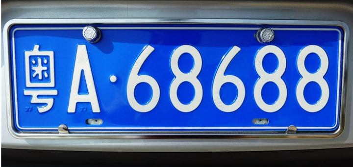
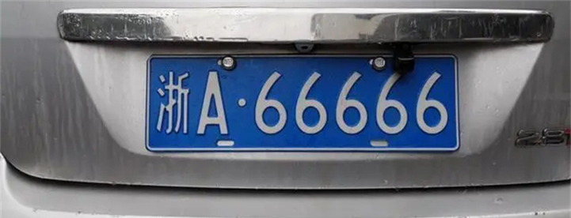
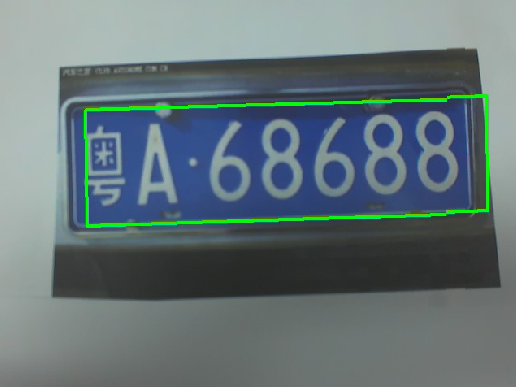
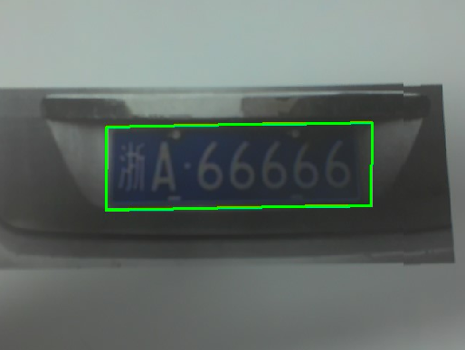
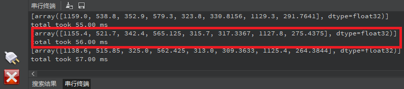

# 车牌检测实验

## 前言

在上一章节中，我们已经学习了如何在CanMV下使用CanMV AI视觉开发框架和MicroPython编程方法实现物体分割的功能，本章将通过车牌检测实验，介绍如何使用CanMV AI视觉开发框架和MicroPython编程实现车牌区域的检测。在本实验中，我们首先采集摄像头捕获的图像，然后经过图像预处理、模型推理和输出处理结果等一系列步骤，系统将识别到图像中存在车牌的区域，并绘制绿色的矩形框将车牌区域包围，最后，将结果绘制并显示在显示器上。通过本章的学习，读者将掌握如何在CanMV下使用CanMV AI视觉开发框架和MicroPython编程方法实现车牌检测的功能。

## AI开发框架介绍

为了简化AI开发流程并降低AI开发难度，CanMV官方针对K230D专门搭建了AI开发框架，有关AI开发框架的介绍，请见[CanMV AI开发框架](development_framework.md)

## 硬件设计

### 例程功能

1. 获取摄像头输出的图像，然后将图像输入到CanMV K230D的AI模型进行推理。本实验使用了一个车牌检测模型，该模型用于检测图像中所有的车牌，当图像中存在车牌时，系统能够识别出车牌在图像中的区域，并绘制绿色矩形框将车牌区域包围。最后，将处理后的图像显示在LCD上。


### 硬件资源

1. 本章实验内容主要讲解K230D的神经网络加速器KPU的使用，无需关注硬件资源。


### 原理图

1. 本章实验内容主要讲解K230D的神经网络加速器KPU的使用，无需关注原理图。

## 实验代码

``` python
from libs.PipeLine import PipeLine, ScopedTiming
from libs.AIBase import AIBase
from libs.AI2D import Ai2d
import os
import ujson
from media.media import *
from media.sensor import *
from time import *
import nncase_runtime as nn
import ulab.numpy as np
import time
import utime
import image
import random
import gc
import sys
import aidemo

# 自定义车牌检测类
class LicenceDetectionApp(AIBase):
    # 初始化函数，设置车牌检测应用的参数
    def __init__(self, kmodel_path, model_input_size, confidence_threshold=0.5, nms_threshold=0.2, rgb888p_size=[224,224], display_size=[1920,1080], debug_mode=0):
        super().__init__(kmodel_path, model_input_size, rgb888p_size, debug_mode)  # 调用基类的初始化函数
        self.kmodel_path = kmodel_path  # 模型路径
        # 模型输入分辨率
        self.model_input_size = model_input_size
        # 分类阈值
        self.confidence_threshold = confidence_threshold
        self.nms_threshold = nms_threshold
        # sensor给到AI的图像分辨率
        self.rgb888p_size = [ALIGN_UP(rgb888p_size[0], 16), rgb888p_size[1]]
        # 显示分辨率
        self.display_size = [ALIGN_UP(display_size[0], 16), display_size[1]]
        self.debug_mode = debug_mode
        # Ai2d实例，用于实现模型预处理
        self.ai2d = Ai2d(debug_mode)
        # 设置Ai2d的输入输出格式和类型
        self.ai2d.set_ai2d_dtype(nn.ai2d_format.NCHW_FMT, nn.ai2d_format.NCHW_FMT, np.uint8, np.uint8)

    # 配置预处理操作，这里使用了pad和resize，Ai2d支持crop/shift/pad/resize/affine
    def config_preprocess(self, input_image_size=None):
        with ScopedTiming("set preprocess config", self.debug_mode > 0):
            # 初始化ai2d预处理配置，默认为sensor给到AI的尺寸，可以通过设置input_image_size自行修改输入尺寸
            ai2d_input_size = input_image_size if input_image_size else self.rgb888p_size
            self.ai2d.resize(nn.interp_method.tf_bilinear, nn.interp_mode.half_pixel)
            self.ai2d.build([1,3,ai2d_input_size[1],ai2d_input_size[0]],[1,3,self.model_input_size[1],self.model_input_size[0]])

    # 自定义当前任务的后处理
    def postprocess(self, results):
        with ScopedTiming("postprocess", self.debug_mode > 0):
            # 对检测结果进行后处理
            det_res = aidemo.licence_det_postprocess(results, [self.rgb888p_size[1], self.rgb888p_size[0]], self.model_input_size, self.confidence_threshold, self.nms_threshold)
            return det_res

    # 绘制检测结果到屏幕上
    def draw_result(self, pl, dets):
        with ScopedTiming("display_draw", self.debug_mode > 0):
            if dets:
                pl.osd_img.clear()  # 清除屏幕
                point_8 = np.zeros((8), dtype=np.int16)
                for det in dets:
                    # 将检测框坐标从sensor图像分辨率转换为显示分辨率
                    for i in range(4):
                        x = det[i * 2 + 0] / self.rgb888p_size[0] * self.display_size[0]
                        y = det[i * 2 + 1] / self.rgb888p_size[1] * self.display_size[1]
                        point_8[i * 2 + 0] = int(x)
                        point_8[i * 2 + 1] = int(y)
                    # 在屏幕上绘制检测框
                    for i in range(4):
                        pl.osd_img.draw_line(point_8[i * 2 + 0], point_8[i * 2 + 1], point_8[(i + 1) % 4 * 2 + 0], point_8[(i + 1) % 4 * 2 + 1], color=(255, 0, 255, 0), thickness=4)
            else:
                pl.osd_img.clear()  # 如果没有检测结果，则清空屏幕

if __name__=="__main__":
    # 显示模式，默认"lcd"
    display_mode="lcd"
    display_size=[640,480]
    # 模型路径
    kmodel_path="/sdcard/examples/kmodel/LPD_640.kmodel"
    # 其它参数设置
    confidence_threshold = 0.2
    nms_threshold = 0.2
    rgb888p_size=[640,360]

    # 初始化PipeLine
    sensor = Sensor(width=1280, height=960) # 构建摄像头对象
    pl = PipeLine(rgb888p_size=rgb888p_size, display_size=display_size, display_mode=display_mode)
    pl.create(sensor=sensor)  # 创建PipeLine实例
    # 初始化自定义车牌检测实例
    licence_det=LicenceDetectionApp(kmodel_path,model_input_size=[640,640],confidence_threshold=confidence_threshold,nms_threshold=nms_threshold,rgb888p_size=rgb888p_size,display_size=display_size,debug_mode=0)
    licence_det.config_preprocess()
    try:
        while True:
            os.exitpoint()
            with ScopedTiming("total",1):
                # 获取当前帧数据
                img=pl.get_frame()
                # 推理当前帧
                res=licence_det.run(img)
                # 打印结果
#                print(res)
                # 绘制结果到PipeLine的osd图像
                licence_det.draw_result(pl,res)
                # 显示当前的绘制结果
                pl.show_image()
                gc.collect()
    except Exception as e:
        sys.print_exception(e)
    finally:
        licence_det.deinit()
        pl.destroy()
```

可以看到一开始是先定义显示模式、图像大小、模型相关的一些变量。

接着是通过初始化PipeLine，这里主要初始化sensor和display模块，配置摄像头输出两路不同的格式和大小的图像，以及设置显示模式，完成创建PipeLine实例。

然后调用自定义LicenceDetectionApp类构建车牌检测类，LicenceDetectionApp类会对AIBase接口的初始化以及使用Ai2D接口的方法定义物体分割模型输入图像的预处理方法。

最后，在一个循环中不断获取摄像头输出的RGB888格式图像帧，然后将图像输入到车牌检测模型进行推理。推理结果通过print打印出来，系统会根据检测的结果绘制绿色矩形框将车牌区域包围，并在LCD上显示处理后的图像。

## 运行验证

实验原图如下所示：





将K230D BOX开发板连接CanMV IDE，点击CanMV IDE上的“开始(运行脚本)”按钮后，将摄像头对准含有车牌的区域，让其采集到需识别的车牌，随后便能在LCD上看到摄像头输出的图像，可以看到，图像中的车牌区域会被绿色的矩形框框出，如下图所示：  





点击左下角“串行终端”，可以看到“串行终端”窗口中输出了一系列信息，如下图所示：



可以看到，系统每次打印输出一组数据，表示图像中存在一张车牌，这组数据一共有8个数据，表示[x1,y1,x2,y2,x3,y3,x4,y4]，每两个数据表示车牌区域的4个顶点的坐标，这样就能准确定位到图像中车牌的区域。为了准确地显示在屏幕上，我们需要将这些坐标和尺寸乘以一个缩放值（即LCD显示的分辨率与RGBP888图像尺寸的比值），从而获得在LCD显示器中车牌的区域。根据获得的值绘制矩形框，即可将车牌标注出来。

