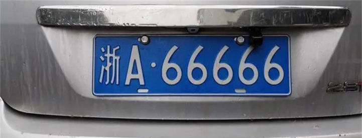

# 车牌号识别实验

## 前言

在上一章节中，我们已经学习了如何在CanMV下使用CanMV AI视觉开发框架和MicroPython编程方法实现车牌检测的功能，本章将通过车牌号识别实验，介绍如何使用CanMV AI视觉开发框架和MicroPython编程实现车牌号识别的功能。在本实验中，我们首先采集摄像头捕获的图像，然后经过图像预处理、模型推理和输出处理结果等一系列步骤，系统将识别到图像中存在车牌的区域，然后将该区域的图像输入到车牌号识别模型进行推理，从而将车牌号识别出来。最后，将结果绘制并显示在显示器上。通过本章的学习，读者将掌握如何在CanMV下使用CanMV AI视觉开发框架和MicroPython编程方法实现车牌号识别的功能。

## AI开发框架介绍

为了简化AI开发流程并降低AI开发难度，CanMV官方针对K230D专门搭建了AI开发框架，有关AI开发框架的介绍，请见[CanMV AI开发框架](development_framework.md)

## 硬件设计

### 例程功能

1. 获取摄像头输出的图像，然后将图像输入到CanMV K230D的AI模型进行推理。本实验使用了两个AI模型，一个是上个实验使用到的车牌检测模型，该模型可以获取图像中车牌所在的位置，另外一个是车牌号识别模型，车牌号识别模型可以将车牌的车牌号解析出来。通过这两个模型的配合使用，能够准确的获取图像中的车牌区域并画矩形框进行标注，同时在矩形框上方绘制识别到的车牌号。最后，将处理后的图像显示在LCD上。


### 硬件资源

1. 本章实验内容主要讲解K230D的神经网络加速器KPU的使用，无需关注硬件资源。


### 原理图

1. 本章实验内容主要讲解K230D的神经网络加速器KPU的使用，无需关注原理图。

## 实验代码

``` python
from libs.PipeLine import PipeLine, ScopedTiming
from libs.AIBase import AIBase
from libs.AI2D import Ai2d
import os
import ujson
from media.media import *
from media.sensor import *
from time import *
import nncase_runtime as nn
import ulab.numpy as np
import time
import image
import aidemo
import random
import gc
import sys

# 自定义车牌检测类
class LicenceDetectionApp(AIBase):
    # 初始化函数，设置车牌检测应用的参数
    def __init__(self, kmodel_path, model_input_size, confidence_threshold=0.5, nms_threshold=0.2, rgb888p_size=[224,224], display_size=[1920,1080], debug_mode=0):
        super().__init__(kmodel_path, model_input_size, rgb888p_size, debug_mode)  # 调用基类的初始化函数
        self.kmodel_path = kmodel_path  # 模型路径
        # 模型输入分辨率
        self.model_input_size = model_input_size
        # 分类阈值
        self.confidence_threshold = confidence_threshold
        self.nms_threshold = nms_threshold
        # sensor给到AI的图像分辨率
        self.rgb888p_size = [ALIGN_UP(rgb888p_size[0], 16), rgb888p_size[1]]
        # 显示分辨率
        self.display_size = [ALIGN_UP(display_size[0], 16), display_size[1]]
        self.debug_mode = debug_mode
        # Ai2d实例，用于实现模型预处理
        self.ai2d = Ai2d(debug_mode)
        # 设置Ai2d的输入输出格式和类型
        self.ai2d.set_ai2d_dtype(nn.ai2d_format.NCHW_FMT, nn.ai2d_format.NCHW_FMT, np.uint8, np.uint8)

    # 配置预处理操作，这里使用了pad和resize，Ai2d支持crop/shift/pad/resize/affine
    def config_preprocess(self, input_image_size=None):
        with ScopedTiming("set preprocess config", self.debug_mode > 0):
            # 初始化ai2d预处理配置，默认为sensor给到AI的尺寸，可以通过设置input_image_size自行修改输入尺寸
            ai2d_input_size = input_image_size if input_image_size else self.rgb888p_size
            self.ai2d.resize(nn.interp_method.tf_bilinear, nn.interp_mode.half_pixel)
            self.ai2d.build([1,3,ai2d_input_size[1],ai2d_input_size[0]],[1,3,self.model_input_size[1],self.model_input_size[0]])

    # 自定义当前任务的后处理
    def postprocess(self, results):
        with ScopedTiming("postprocess", self.debug_mode > 0):
            # 对检测结果进行后处理
            det_res = aidemo.licence_det_postprocess(results, [self.rgb888p_size[1], self.rgb888p_size[0]], self.model_input_size, self.confidence_threshold, self.nms_threshold)
            return det_res

# 自定义车牌识别任务类
class LicenceRecognitionApp(AIBase):
    def __init__(self,kmodel_path,model_input_size,rgb888p_size=[1920,1080],display_size=[1920,1080],debug_mode=0):
        super().__init__(kmodel_path,model_input_size,rgb888p_size,debug_mode)
        # kmodel路径
        self.kmodel_path=kmodel_path
        # 检测模型输入分辨率
        self.model_input_size=model_input_size
        # sensor给到AI的图像分辨率，宽16字节对齐
        self.rgb888p_size=[ALIGN_UP(rgb888p_size[0],16),rgb888p_size[1]]
        # 视频输出VO分辨率，宽16字节对齐
        self.display_size=[ALIGN_UP(display_size[0],16),display_size[1]]
        # debug模式
        self.debug_mode=debug_mode
        # 车牌字符字典
        self.dict_rec = ["挂", "使", "领", "澳", "港", "皖", "沪", "津", "渝", "冀", "晋", "蒙", "辽", "吉", "黑", "苏", "浙", "京", "闽", "赣", "鲁", "豫", "鄂", "湘", "粤", "桂", "琼", "川", "贵", "云", "藏", "陕", "甘", "青", "宁", "新", "警", "学", "0", "1", "2", "3", "4", "5", "6", "7", "8", "9", "A", "B", "C", "D", "E", "F", "G", "H", "J", "K", "L", "M", "N", "P", "Q", "R", "S", "T", "U", "V", "W", "X", "Y", "Z", "_", "-"]
        self.dict_size = len(self.dict_rec)
        self.ai2d=Ai2d(debug_mode)
        self.ai2d.set_ai2d_dtype(nn.ai2d_format.NCHW_FMT,nn.ai2d_format.NCHW_FMT,np.uint8, np.uint8)

    # 配置预处理操作，这里使用了resize，Ai2d支持crop/shift/pad/resize/affine
    def config_preprocess(self,input_image_size=None):
        with ScopedTiming("set preprocess config",self.debug_mode > 0):
            ai2d_input_size=input_image_size if input_image_size else self.rgb888p_size
            self.ai2d.resize(nn.interp_method.tf_bilinear, nn.interp_mode.half_pixel)
            self.ai2d.build([1,3,ai2d_input_size[1],ai2d_input_size[0]],[1,3,self.model_input_size[1],self.model_input_size[0]])

    # 自定义后处理，results是模型输出的array列表
    def postprocess(self,results):
        with ScopedTiming("postprocess",self.debug_mode > 0):
            output_data=results[0].reshape((-1,self.dict_size))
            max_indices = np.argmax(output_data, axis=1)
            result_str = ""
            for i in range(max_indices.shape[0]):
                index = max_indices[i]
                if index > 0 and (i == 0 or index != max_indices[i - 1]):
                    result_str += self.dict_rec[index - 1]
            return result_str

# 车牌识别任务类
class LicenceRec:
    def __init__(self,licence_det_kmodel,licence_rec_kmodel,det_input_size,rec_input_size,confidence_threshold=0.25,nms_threshold=0.3,rgb888p_size=[1920,1080],display_size=[1920,1080],debug_mode=0):
        # 车牌检测模型路径
        self.licence_det_kmodel=licence_det_kmodel
        # 车牌识别模型路径
        self.licence_rec_kmodel=licence_rec_kmodel
        # 人脸检测模型输入分辨率
        self.det_input_size=det_input_size
        # 人脸姿态模型输入分辨率
        self.rec_input_size=rec_input_size
        # 置信度阈值
        self.confidence_threshold=confidence_threshold
        # nms阈值
        self.nms_threshold=nms_threshold
        # sensor给到AI的图像分辨率，宽16字节对齐
        self.rgb888p_size=[ALIGN_UP(rgb888p_size[0],16),rgb888p_size[1]]
        # 视频输出VO分辨率，宽16字节对齐
        self.display_size=[ALIGN_UP(display_size[0],16),display_size[1]]
        # debug_mode模式
        self.debug_mode=debug_mode
        self.licence_det=LicenceDetectionApp(self.licence_det_kmodel,model_input_size=self.det_input_size,confidence_threshold=self.confidence_threshold,nms_threshold=self.nms_threshold,rgb888p_size=self.rgb888p_size,display_size=self.display_size,debug_mode=0)
        self.licence_rec=LicenceRecognitionApp(self.licence_rec_kmodel,model_input_size=self.rec_input_size,rgb888p_size=self.rgb888p_size)
        self.licence_det.config_preprocess()

    # run函数
    def run(self,input_np):
        # 执行车牌检测
        det_boxes=self.licence_det.run(input_np)
        # 将车牌部分抠出来
        imgs_array_boxes = aidemo.ocr_rec_preprocess(input_np,[self.rgb888p_size[1],self.rgb888p_size[0]],det_boxes)
        imgs_array = imgs_array_boxes[0]
        boxes = imgs_array_boxes[1]
        rec_res = []
        for img_array in imgs_array:
            # 对每一个检测到的车牌进行识别
            self.licence_rec.config_preprocess(input_image_size=[img_array.shape[3],img_array.shape[2]])
            licence_str=self.licence_rec.run(img_array)
            rec_res.append(licence_str)
            gc.collect()
        return det_boxes,rec_res

    # 绘制车牌检测识别效果
    def draw_result(self,pl,det_res,rec_res):
        pl.osd_img.clear()
        if det_res:
            point_8 = np.zeros((8),dtype=np.int16)
            for det_index in range(len(det_res)):
                for i in range(4):
                    x = det_res[det_index][i * 2 + 0]/self.rgb888p_size[0]*self.display_size[0]
                    y = det_res[det_index][i * 2 + 1]/self.rgb888p_size[1]*self.display_size[1]
                    point_8[i * 2 + 0] = int(x)
                    point_8[i * 2 + 1] = int(y)
                for i in range(4):
                    pl.osd_img.draw_line(point_8[i * 2 + 0],point_8[i * 2 + 1],point_8[(i+1) % 4 * 2 + 0],point_8[(i+1) % 4 * 2 + 1],color=(255, 0, 255, 0),thickness=4)
                pl.osd_img.draw_string_advanced( point_8[6], point_8[7] + 20, 40,rec_res[det_index] , color=(255,255,153,18))


if __name__=="__main__":
    # 显示模式，默认"lcd"
    display_mode="lcd"
    display_size=[640,480]
    # 车牌检测模型路径
    licence_det_kmodel_path="/sdcard/examples/kmodel/LPD_640.kmodel"
    # 车牌识别模型路径
    licence_rec_kmodel_path="/sdcard/examples/kmodel/licence_reco.kmodel"
    # 其它参数
    rgb888p_size=[640,360]
    licence_det_input_size=[640,640]
    licence_rec_input_size=[220,32]
    confidence_threshold=0.2
    nms_threshold=0.2

    # 初始化PipeLine，只关注传给AI的图像分辨率，显示的分辨率
    sensor = Sensor(width=1280, height=960) # 构建摄像头对象
    pl = PipeLine(rgb888p_size=rgb888p_size, display_size=display_size, display_mode=display_mode)
    pl.create(sensor=sensor)  # 创建PipeLine实例
    lr=LicenceRec(licence_det_kmodel_path,licence_rec_kmodel_path,det_input_size=licence_det_input_size,rec_input_size=licence_rec_input_size,confidence_threshold=confidence_threshold,nms_threshold=nms_threshold,rgb888p_size=rgb888p_size,display_size=display_size)
    try:
        while True:
            os.exitpoint()
            with ScopedTiming("total",1):
                img=pl.get_frame()                  # 获取当前帧
                det_res,rec_res=lr.run(img)         # 推理当前帧
                # print(det_res, rec_res)             # 打印结果
                lr.draw_result(pl,det_res,rec_res)  # 绘制当前帧推理结果
                pl.show_image()                     # 展示推理结果
                gc.collect()
    except Exception as e:
        sys.print_exception(e)
    finally:
        lr.licence_det.deinit()
        lr.licence_rec.deinit()
        pl.destroy()

```

可以看到一开始是先定义显示模式、图像大小、模型相关的一些变量。

接着是通过初始化PipeLine，这里主要初始化sensor和display模块，配置摄像头输出两路不同的格式和大小的图像，以及设置显示模式，完成创建PipeLine实例。

然后调用自定义LicenceRec类构建车牌号识别类，LicenceRec类会对AIBase接口的初始化以及使用Ai2D接口的方法定义车牌检测模型和车牌号识别模型输入图像的预处理方法。

最后，在一个循环中不断获取摄像头输出的RGB888格式图像帧，然后将图像依次输入到车牌检测模型和车牌号识别模型进行推理。推理结果通过print打印出来，系统会根据模型输出的结果使用绿色矩形框将车牌区域框出，同时在矩形框上方绘制识别到的车牌号信息，最后在LCD上显示处理后的图像。

## 运行验证

实验原图如下所示：




将K230D BOX开发板连接CanMV IDE，点击CanMV IDE上的“开始(运行脚本)”按钮后，将摄像头对准含有车牌的区域，让其采集到需识别的车牌，随后便能在LCD上看到摄像头输出的图像，可以看到，图像中的车牌区域会被绿色的矩形框框出，车牌号在矩形框上方显示，如下图所示：  


点击左下角“串行终端”，可以看到“串行终端”窗口中输出了一系列信息，如下图所示：


可以看到，系统每次打印输出两组数据，第一组是上个实验使用的车牌检测模型推理输出的，表示车牌所在区域的4个顶点的坐标，这里不再叙述，第二个数组是一组字符串，由车牌号识别模型推理输出，字符串为**`u7ca4A68688`**，u7ca4是”粤“字的中文字符编码，A68688是车牌号编码，通过这两组数据，便可获得图像中车牌的区域以及车牌号。

