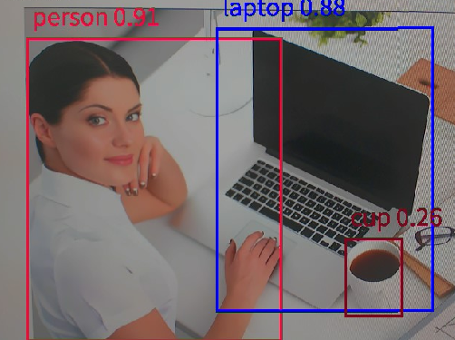
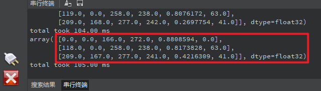

# 物体检测实验

## 前言

在上一章节中，我们已经学习了如何在CanMV下使用CanMV AI视觉开发框架和MicroPython编程方法实现一个三局两胜制的猜拳游戏的功能，本章将通过物体检测实验，介绍如何使用CanMV AI视觉开发框架和MicroPython编程实现对80种物体的识别。在本实验中，我们首先采集摄像头捕获的图像，然后经过图像预处理、模型推理和输出处理结果等一系列步骤，系统将识别图像中所有的物体，该模型会对COCO的80个类别进行检测，当识别到目标物体时，系统会绘制一个矩形框将目标物体框住，并在对应的矩形框上方显示检测结果和可信度，实现物体检测的功能。最后，将结果绘制并显示在显示器上。通过本章的学习，读者将掌握如何在CanMV下使用CanMV AI视觉开发框架和MicroPython编程方法实现物体检测的功能。

## AI开发框架介绍

为了简化AI开发流程并降低AI开发难度，CanMV官方针对K230D专门搭建了AI开发框架，有关AI开发框架的介绍，请见[CanMV AI开发框架](development_framework.md)

## 硬件设计

### 例程功能

1. 获取摄像头输出的图像，然后将图像输入到CanMV K230D的AI模型进行推理。本实验使用了一个基于YOLOv8n的目标检测模型，该模型用于检测图像中的所有物体，系统一共能识别80种物体，分别是：["person", "bicycle", "car", "motorcycle", "airplane", "bus", "train", "truck", "boat", "traffic light", "fire hydrant", "stop sign", "parking meter", "bench", "bird", "cat", "dog", "horse", "sheep", "cow", "elephant", "bear", "zebra", "giraffe", "backpack", "umbrella", "handbag", "tie", "suitcase", "frisbee", "skis", "snowboard", "sports ball", "kite", "baseball bat", "baseball glove", "skateboard", "surfboard", "tennis racket", "bottle", "wine glass", "cup", "fork", "knife", "spoon", "bowl", "banana", "apple", "sandwich", "orange", "broccoli", "carrot", "hot dog", "pizza", "donut", "cake", "chair", "couch", "potted plant", "bed", "dining table", "toilet", "tv", "laptop", "mouse", "remote", "keyboard", "cell phone", "microwave", "oven", "toaster", "sink", "refrigerator", "book", "clock", "vase", "scissors", "teddy bear", "hair drier", "toothbrush"]

   对应的中文名称是：[“人”、“自行车”、“汽车”、“摩托车”、“飞机”、“公共汽车”、“火车”、“卡车”、“船”、“交通灯”、“消防栓”、“停车标志”、“停车收费表”、“长凳”、“鸟”、“猫”、“狗”、“马”、“羊”、“牛”、“大象”、“熊”、“斑马”、“长颈鹿”、“背包”、“雨伞”、“手提包”、“领带”、“手提箱”、“飞盘”、“滑雪板”、“滑雪板”、“运动球”、“风筝”、“棒球棒”、“棒球手套”、“滑板”、“冲浪板”、“网球拍”、“瓶子”、“酒杯”、“杯子”、“叉子”、“刀子”、“勺子”、“碗”、“香蕉”、“苹果”、“三明治”、“橙子”、“西兰花”、“胡萝卜”、“热狗”、“披萨”、“甜甜圈”、“蛋糕”、“椅子”、“沙发“盆栽”、“床”、“餐桌”、“马桶”、“电视”、“笔记本电脑”、“鼠标”、“遥控器”、“键盘”、“手机”、“微波炉”、“烤箱”、“烤面包机”、“水槽”、“冰箱”、“书”、“钟表”、“花瓶”、“剪刀”、“泰迪熊”、“吹风机”、“牙刷”]，当检测到图像中存在目标物体时，系统会用矩形框标注图像中目标物体的区域，并在矩形框上方绘制物体检测结果和可信度。最后，将处理后的图像显示在LCD上。

### 硬件资源

1. 本章实验内容主要讲解K230D的神经网络加速器KPU的使用，无需关注硬件资源。


### 原理图

1. 本章实验内容主要讲解K230D的神经网络加速器KPU的使用，无需关注原理图。

## 实验代码

``` python
from libs.PipeLine import PipeLine, ScopedTiming
from libs.AIBase import AIBase
from libs.AI2D import Ai2d
import os
import ujson
from media.media import *
from media.sensor import *
from time import *
import nncase_runtime as nn
import ulab.numpy as np
import time
import utime
import image
import random
import gc
import sys
import aidemo

# 自定义YOLOv8检测类
class ObjectDetectionApp(AIBase):
    def __init__(self,kmodel_path,labels,model_input_size,max_boxes_num,confidence_threshold=0.5,nms_threshold=0.2,rgb888p_size=[224,224],display_size=[1920,1080],debug_mode=0):
        super().__init__(kmodel_path,model_input_size,rgb888p_size,debug_mode)
        self.kmodel_path=kmodel_path
        self.labels=labels
        # 模型输入分辨率
        self.model_input_size=model_input_size
        # 阈值设置
        self.confidence_threshold=confidence_threshold
        self.nms_threshold=nms_threshold
        self.max_boxes_num=max_boxes_num
        # sensor给到AI的图像分辨率
        self.rgb888p_size=[ALIGN_UP(rgb888p_size[0],16),rgb888p_size[1]]
        # 显示分辨率
        self.display_size=[ALIGN_UP(display_size[0],16),display_size[1]]
        self.debug_mode=debug_mode
        # 检测框预置颜色值
        self.color_four=[(255, 220, 20, 60), (255, 119, 11, 32), (255, 0, 0, 142), (255, 0, 0, 230),
                         (255, 106, 0, 228), (255, 0, 60, 100), (255, 0, 80, 100), (255, 0, 0, 70),
                         (255, 0, 0, 192), (255, 250, 170, 30), (255, 100, 170, 30), (255, 220, 220, 0),
                         (255, 175, 116, 175), (255, 250, 0, 30), (255, 165, 42, 42), (255, 255, 77, 255),
                         (255, 0, 226, 252), (255, 182, 182, 255), (255, 0, 82, 0), (255, 120, 166, 157)]
        # 宽高缩放比例
        self.x_factor = float(self.rgb888p_size[0])/self.model_input_size[0]
        self.y_factor = float(self.rgb888p_size[1])/self.model_input_size[1]
        # Ai2d实例，用于实现模型预处理
        self.ai2d=Ai2d(debug_mode)
        # 设置Ai2d的输入输出格式和类型
        self.ai2d.set_ai2d_dtype(nn.ai2d_format.NCHW_FMT,nn.ai2d_format.NCHW_FMT,np.uint8, np.uint8)

    # 配置预处理操作，这里使用了resize，Ai2d支持crop/shift/pad/resize/affine，具体代码请打开/sdcard/app/libs/AI2D.py查看
    def config_preprocess(self,input_image_size=None):
        with ScopedTiming("set preprocess config",self.debug_mode > 0):
            # 初始化ai2d预处理配置，默认为sensor给到AI的尺寸，您可以通过设置input_image_size自行修改输入尺寸
            ai2d_input_size=input_image_size if input_image_size else self.rgb888p_size
            self.ai2d.resize(nn.interp_method.tf_bilinear, nn.interp_mode.half_pixel)
            self.ai2d.build([1,3,ai2d_input_size[1],ai2d_input_size[0]],[1,3,self.model_input_size[1],self.model_input_size[0]])

    # 自定义当前任务的后处理
    def postprocess(self,results):
        with ScopedTiming("postprocess",self.debug_mode > 0):
            result=results[0]
            result = result.reshape((result.shape[0] * result.shape[1], result.shape[2]))
            output_data = result.transpose()
            boxes_ori = output_data[:,0:4]
            scores_ori = output_data[:,4:]
            confs_ori = np.max(scores_ori,axis=-1)
            inds_ori = np.argmax(scores_ori,axis=-1)
            boxes,scores,inds = [],[],[]
            for i in range(len(boxes_ori)):
                if confs_ori[i] > confidence_threshold:
                    scores.append(confs_ori[i])
                    inds.append(inds_ori[i])
                    x = boxes_ori[i,0]
                    y = boxes_ori[i,1]
                    w = boxes_ori[i,2]
                    h = boxes_ori[i,3]
                    left = int((x - 0.5 * w) * self.x_factor)
                    top = int((y - 0.5 * h) * self.y_factor)
                    right = int((x + 0.5 * w) * self.x_factor)
                    bottom = int((y + 0.5 * h) * self.y_factor)
                    boxes.append([left,top,right,bottom])
            if len(boxes)==0:
                return []
            boxes = np.array(boxes)
            scores = np.array(scores)
            inds = np.array(inds)
            # NMS过程
            keep = self.nms(boxes,scores,nms_threshold)
            dets = np.concatenate((boxes, scores.reshape((len(boxes),1)), inds.reshape((len(boxes),1))), axis=1)
            dets_out = []
            for keep_i in keep:
                dets_out.append(dets[keep_i])
            dets_out = np.array(dets_out)
            dets_out = dets_out[:self.max_boxes_num, :]
            return dets_out

    # 绘制结果
    def draw_result(self,pl,dets):
        with ScopedTiming("display_draw",self.debug_mode >0):
            if dets:
                pl.osd_img.clear()
                for det in dets:
                    x1, y1, x2, y2 = map(lambda x: int(round(x, 0)), det[:4])
                    x= x1*self.display_size[0] // self.rgb888p_size[0]
                    y= y1*self.display_size[1] // self.rgb888p_size[1]
                    w = (x2 - x1) * self.display_size[0] // self.rgb888p_size[0]
                    h = (y2 - y1) * self.display_size[1] // self.rgb888p_size[1]
                    pl.osd_img.draw_rectangle(x,y, w, h, color=self.get_color(int(det[5])),thickness=4)
                    pl.osd_img.draw_string_advanced( x , y-50,32," " + self.labels[int(det[5])] + " " + str(round(det[4],2)) , color=self.get_color(int(det[5])))
            else:
                pl.osd_img.clear()


    # 多目标检测 非最大值抑制方法实现
    def nms(self,boxes,scores,thresh):
        """Pure Python NMS baseline."""
        x1,y1,x2,y2 = boxes[:, 0],boxes[:, 1],boxes[:, 2],boxes[:, 3]
        areas = (x2 - x1 + 1) * (y2 - y1 + 1)
        order = np.argsort(scores,axis = 0)[::-1]
        keep = []
        while order.size > 0:
            i = order[0]
            keep.append(i)
            new_x1,new_y1,new_x2,new_y2,new_areas = [],[],[],[],[]
            for order_i in order:
                new_x1.append(x1[order_i])
                new_x2.append(x2[order_i])
                new_y1.append(y1[order_i])
                new_y2.append(y2[order_i])
                new_areas.append(areas[order_i])
            new_x1 = np.array(new_x1)
            new_x2 = np.array(new_x2)
            new_y1 = np.array(new_y1)
            new_y2 = np.array(new_y2)
            xx1 = np.maximum(x1[i], new_x1)
            yy1 = np.maximum(y1[i], new_y1)
            xx2 = np.minimum(x2[i], new_x2)
            yy2 = np.minimum(y2[i], new_y2)
            w = np.maximum(0.0, xx2 - xx1 + 1)
            h = np.maximum(0.0, yy2 - yy1 + 1)
            inter = w * h
            new_areas = np.array(new_areas)
            ovr = inter / (areas[i] + new_areas - inter)
            new_order = []
            for ovr_i,ind in enumerate(ovr):
                if ind < thresh:
                    new_order.append(order[ovr_i])
            order = np.array(new_order,dtype=np.uint8)
        return keep

    # 根据当前类别索引获取框的颜色
    def get_color(self, x):
        idx=x%len(self.color_four)
        return self.color_four[idx]


if __name__=="__main__":
    # 显示模式，默认"lcd"
    display_mode="lcd"
    display_size=[640,480]
    # 模型路径
    kmodel_path="/sdcard/examples/kmodel/yolov8n_320.kmodel"
    labels = ["person", "bicycle", "car", "motorcycle", "airplane", "bus", "train", "truck", "boat", "traffic light", "fire hydrant", "stop sign", "parking meter", "bench", "bird", "cat", "dog", "horse", "sheep", "cow", "elephant", "bear", "zebra", "giraffe", "backpack", "umbrella", "handbag", "tie", "suitcase", "frisbee", "skis", "snowboard", "sports ball", "kite", "baseball bat", "baseball glove", "skateboard", "surfboard", "tennis racket", "bottle", "wine glass", "cup", "fork", "knife", "spoon", "bowl", "banana", "apple", "sandwich", "orange", "broccoli", "carrot", "hot dog", "pizza", "donut", "cake", "chair", "couch", "potted plant", "bed", "dining table", "toilet", "tv", "laptop", "mouse", "remote", "keyboard", "cell phone", "microwave", "oven", "toaster", "sink", "refrigerator", "book", "clock", "vase", "scissors", "teddy bear", "hair drier", "toothbrush"]
    # 其它参数设置
    confidence_threshold = 0.2
    nms_threshold = 0.2
    max_boxes_num = 50
    rgb888p_size=[320,320]

    # 初始化PipeLine
    sensor = Sensor(width=1280, height=960) # 构建摄像头对象
    pl = PipeLine(rgb888p_size=rgb888p_size, display_size=display_size, display_mode=display_mode)
    pl.create(sensor=sensor)  # 创建PipeLine实例
    # 初始化自定义目标检测实例
    ob_det=ObjectDetectionApp(kmodel_path,labels=labels,model_input_size=[320,320],max_boxes_num=max_boxes_num,confidence_threshold=confidence_threshold,nms_threshold=nms_threshold,rgb888p_size=rgb888p_size,display_size=display_size,debug_mode=0)
    ob_det.config_preprocess()
    try:
        while True:
            os.exitpoint()
            with ScopedTiming("total",1):
                # 获取当前帧数据
                img=pl.get_frame()
                # 推理当前帧
                res=ob_det.run(img)
                # 打印结果
#                print(res)
                # 绘制结果到PipeLine的osd图像
                ob_det.draw_result(pl,res)
                # 显示当前的绘制结果
                pl.show_image()
                gc.collect()
    except Exception as e:
        sys.print_exception(e)
    finally:
        ob_det.deinit()
        pl.destroy()
```

可以看到一开始是先定义显示模式、图像大小、模型相关的一些变量。

接着是通过初始化PipeLine，这里主要初始化sensor和display模块，配置摄像头输出两路不同的格式和大小的图像，以及设置显示模式，完成创建PipeLine实例。

然后调用自定义ObjectDetectionApp类构建目标物体检测类，ObjectDetectionApp类会对AIBase接口的初始化以及使用Ai2D接口的方法定义物体检测模型输入图像的预处理方法。

最后在一个循环中不断地获取摄像头输出的RGBP888格式的图像帧，然后将图像输入到目标检测模型进行推理，并将推理结果通过print打印，然后根据结果信息用矩形框将图像中的目标物体区域进行标注，并在矩形框上方绘制识别结果以及结果的可信度，并在LCD上显示图像。

## 运行验证

实验原图如下所示：


将K230D BOX开发板连接CanMV IDE，点击CanMV IDE上的“开始(运行脚本)”按钮后，将摄像头对准需要识别的区域，让其采集到需识别的物体信息，随后便能在LCD上看到摄像头输出的图像，可以看到，系统会用不同颜色的矩形框标记不同的目标物体，矩形框上方显示识别的物体信息及其可信度，如下图所示：  




点击左下角“串行终端”，可以看到“串行终端”窗口中输出了一系列信息，如下图所示：



可以看到，二维数组中存在三个元素，每个元素表示检测到图像中存在一个目标物体。每个元素包含6个数据，可以表示为 [x1, y1, x2, y2,prob,label] ，x1、y1、x2、y2表示目标物体在输入的RGBP888图像中的起点坐标和终点坐标，label是标签，与输入模型的标签顺序有关，prob表示对应标签的可信度，物体检测模型有80种标签，可在定义的列表labels查看80种物体的名称。通过这些数据，我们就可以确定这个目标物体在RGBP888图像中的位置和分类及其可信度。为了准确地显示在屏幕上，我们需要将这些坐标和尺寸乘以一个缩放值（即LCD显示的分辨率与RGBP888图像尺寸的比值），从而获得在LCD显示器中目标物体的区域，最后根据获得的值绘制矩形框，即可将目标物体标注出来。
