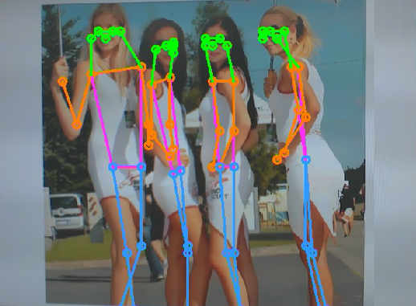

# 人体关键点检测实验

## 前言

在上一章节中，我们已经学习了如何在CanMV下使用CanMV AI视觉开发框架和MicroPython编程方法实现人体检测的功能，本章将通过人体关键点检测实验，介绍如何使用CanMV AI视觉开发框架和MicroPython编程实现人体关键点检测并将17个人体骨骼关键点绘制出来。在本实验中，我们首先采集摄像头捕获的图像，然后经过图像预处理、模型推理和输出处理结果等一系列步骤，系统将检测图像中所有的人体信息并将人体的17个骨骼关键点用不同颜色的线段连接，实现人体关键点检测的功能。最后，将检测结果绘制并显示在显示器上。通过本章的学习，读者将掌握如何在CanMV下使用CanMV AI视觉开发框架和MicroPython编程方法实现人体关键点检测功能。

## AI开发框架介绍

为了简化AI开发流程并降低AI开发难度，CanMV官方针对K230D专门搭建了AI开发框架，有关AI开发框架的介绍，请见[CanMV AI开发框架](development_framework.md)

## 硬件设计

### 例程功能

1. 获取摄像头输出的图像，然后将图像输入到CanMV K230D的AI模型进行推理。本实验使用了一个基于YOLOv8n的人体关键点检测模型，该模型用于检测图像中每个人体的17个骨骼关键点。通过AI推理出每个人体的17个骨骼关键点，我们再根据每个人体的17个骨骼关键点使用不同颜色的线条进行有序的连接并绘制到图像上。最后，将处理后的图像显示在LCD上。

### 硬件资源

1. 本章实验内容主要讲解K230D的神经网络加速器KPU的使用，无需关注硬件资源。


### 原理图

1. 本章实验内容主要讲解K230D的神经网络加速器KPU的使用，无需关注原理图。

## 实验代码

``` python
from libs.PipeLine import PipeLine, ScopedTiming
from libs.AIBase import AIBase
from libs.AI2D import Ai2d
import os
import ujson
from media.media import *
from media.sensor import *
from time import *
import nncase_runtime as nn
import ulab.numpy as np
import time
import utime
import image
import random
import gc
import sys
import aidemo

# 自定义人体关键点检测类
class PersonKeyPointApp(AIBase):
    def __init__(self,kmodel_path,model_input_size,confidence_threshold=0.2,nms_threshold=0.5,rgb888p_size=[1280,720],display_size=[1920,1080],debug_mode=0):
        super().__init__(kmodel_path,model_input_size,rgb888p_size,debug_mode)
        self.kmodel_path=kmodel_path
        # 模型输入分辨率
        self.model_input_size=model_input_size
        # 置信度阈值设置
        self.confidence_threshold=confidence_threshold
        # nms阈值设置
        self.nms_threshold=nms_threshold
        # sensor给到AI的图像分辨率
        self.rgb888p_size=[ALIGN_UP(rgb888p_size[0],16),rgb888p_size[1]]
        # 显示分辨率
        self.display_size=[ALIGN_UP(display_size[0],16),display_size[1]]
        self.debug_mode=debug_mode
        #骨骼信息
        self.SKELETON = [(16, 14),(14, 12),(17, 15),(15, 13),(12, 13),(6,  12),(7,  13),(6,  7),(6,  8),(7,  9),(8,  10),(9,  11),(2,  3),(1,  2),(1,  3),(2,  4),(3,  5),(4,  6),(5,  7)]
        #肢体颜色
        self.LIMB_COLORS = [(255, 51,  153, 255),(255, 51,  153, 255),(255, 51,  153, 255),(255, 51,  153, 255),(255, 255, 51,  255),(255, 255, 51,  255),(255, 255, 51,  255),(255, 255, 128, 0),(255, 255, 128, 0),(255, 255, 128, 0),(255, 255, 128, 0),(255, 255, 128, 0),(255, 0,   255, 0),(255, 0,   255, 0),(255, 0,   255, 0),(255, 0,   255, 0),(255, 0,   255, 0),(255, 0,   255, 0),(255, 0,   255, 0)]
        #关键点颜色，共17个
        self.KPS_COLORS = [(255, 0,   255, 0),(255, 0,   255, 0),(255, 0,   255, 0),(255, 0,   255, 0),(255, 0,   255, 0),(255, 255, 128, 0),(255, 255, 128, 0),(255, 255, 128, 0),(255, 255, 128, 0),(255, 255, 128, 0),(255, 255, 128, 0),(255, 51,  153, 255),(255, 51,  153, 255),(255, 51,  153, 255),(255, 51,  153, 255),(255, 51,  153, 255),(255, 51,  153, 255)]

        # Ai2d实例，用于实现模型预处理
        self.ai2d=Ai2d(debug_mode)
        # 设置Ai2d的输入输出格式和类型
        self.ai2d.set_ai2d_dtype(nn.ai2d_format.NCHW_FMT,nn.ai2d_format.NCHW_FMT,np.uint8, np.uint8)

    # 配置预处理操作，这里使用了pad和resize，Ai2d支持crop/shift/pad/resize/affine，具体代码请打开/sdcard/app/libs/AI2D.py查看
    def config_preprocess(self,input_image_size=None):
        with ScopedTiming("set preprocess config",self.debug_mode > 0):
            # 初始化ai2d预处理配置，默认为sensor给到AI的尺寸，您可以通过设置input_image_size自行修改输入尺寸
            ai2d_input_size=input_image_size if input_image_size else self.rgb888p_size
            top,bottom,left,right=self.get_padding_param()
            self.ai2d.pad([0,0,0,0,top,bottom,left,right], 0, [0,0,0])
            self.ai2d.resize(nn.interp_method.tf_bilinear, nn.interp_mode.half_pixel)
            self.ai2d.build([1,3,ai2d_input_size[1],ai2d_input_size[0]],[1,3,self.model_input_size[1],self.model_input_size[0]])

    # 自定义当前任务的后处理
    def postprocess(self,results):
        with ScopedTiming("postprocess",self.debug_mode > 0):
            # 这里使用了aidemo库的person_kp_postprocess接口
            results = aidemo.person_kp_postprocess(results[0],[self.rgb888p_size[1],self.rgb888p_size[0]],self.model_input_size,self.confidence_threshold,self.nms_threshold)
            return results

    #绘制结果，绘制人体关键点
    def draw_result(self,pl,res):
        with ScopedTiming("display_draw",self.debug_mode >0):
            if res[0]:
                pl.osd_img.clear()
                kpses = res[1]
                for i in range(len(res[0])):
                    for k in range(17+2):
                        if (k < 17):
                            kps_x,kps_y,kps_s = round(kpses[i][k][0]),round(kpses[i][k][1]),kpses[i][k][2]
                            kps_x1 = int(float(kps_x) * self.display_size[0] // self.rgb888p_size[0])
                            kps_y1 = int(float(kps_y) * self.display_size[1] // self.rgb888p_size[1])
                            if (kps_s > 0):
                                pl.osd_img.draw_circle(kps_x1,kps_y1,5,self.KPS_COLORS[k],4)
                        ske = self.SKELETON[k]
                        pos1_x,pos1_y= round(kpses[i][ske[0]-1][0]),round(kpses[i][ske[0]-1][1])
                        pos1_x_ = int(float(pos1_x) * self.display_size[0] // self.rgb888p_size[0])
                        pos1_y_ = int(float(pos1_y) * self.display_size[1] // self.rgb888p_size[1])

                        pos2_x,pos2_y = round(kpses[i][(ske[1] -1)][0]),round(kpses[i][(ske[1] -1)][1])
                        pos2_x_ = int(float(pos2_x) * self.display_size[0] // self.rgb888p_size[0])
                        pos2_y_ = int(float(pos2_y) * self.display_size[1] // self.rgb888p_size[1])

                        pos1_s,pos2_s = kpses[i][(ske[0] -1)][2],kpses[i][(ske[1] -1)][2]
                        if (pos1_s > 0.0 and pos2_s >0.0):
                            pl.osd_img.draw_line(pos1_x_,pos1_y_,pos2_x_,pos2_y_,self.LIMB_COLORS[k],4)
                    gc.collect()
            else:
                pl.osd_img.clear()

    # 计算padding参数
    def get_padding_param(self):
        dst_w = self.model_input_size[0]
        dst_h = self.model_input_size[1]
        input_width = self.rgb888p_size[0]
        input_high = self.rgb888p_size[1]
        ratio_w = dst_w / input_width
        ratio_h = dst_h / input_high
        if ratio_w < ratio_h:
            ratio = ratio_w
        else:
            ratio = ratio_h
        new_w = (int)(ratio * input_width)
        new_h = (int)(ratio * input_high)
        dw = (dst_w - new_w) / 2
        dh = (dst_h - new_h) / 2
        top = int(round(dh - 0.1))
        bottom = int(round(dh + 0.1))
        left = int(round(dw - 0.1))
        right = int(round(dw - 0.1))
        return  top, bottom, left, right

if __name__=="__main__":
    # 显示模式，默认"lcd"
    display_mode="lcd"
    display_size=[640,480]
    # 模型路径
    kmodel_path="/sdcard/examples/kmodel/yolov8n-pose.kmodel"
    # 其它参数设置
    confidence_threshold = 0.2
    nms_threshold = 0.5
    rgb888p_size=[1280,960]
    # 初始化PipeLine
    sensor = Sensor(width=1280, height=960) # 构建摄像头对象
    pl = PipeLine(rgb888p_size=rgb888p_size, display_size=display_size, display_mode=display_mode)
    pl.create(sensor=sensor)  # 创建PipeLine实例
    # 初始化自定义人体关键点检测实例
    person_kp=PersonKeyPointApp(kmodel_path,model_input_size=[320,320],confidence_threshold=confidence_threshold,nms_threshold=nms_threshold,rgb888p_size=rgb888p_size,display_size=display_size,debug_mode=0)
    person_kp.config_preprocess()
    try:
        while True:
            os.exitpoint()
            with ScopedTiming("total",1):
                # 获取当前帧数据
                img=pl.get_frame()
                # 推理当前帧
                res=person_kp.run(img)
                # 打印结果
#                print(res)
                # 绘制结果到PipeLine的osd图像
                person_kp.draw_result(pl,res)
                # 显示当前的绘制结果
                pl.show_image()
                gc.collect()
    except Exception as e:
        sys.print_exception(e)
    finally:
        person_kp.deinit()
        pl.destroy()
```

可以看到一开始是先定义显示模式、图像大小、模型相关的一些变量。

接着是通过初始化PipeLine，这里主要初始化sensor和display模块，配置摄像头输出两路不同的格式和大小的图像，以及设置显示模式，完成创建PipeLine实例。

然后调用自定义PersonKeyPointApp类构建人体关键点检测类，PersonKeyPointApp类会对AIBase接口的初始化以及使用Ai2D接口的方法定义人体关键点检测模型输入图像的预处理方法。

最后在一个循环中不断地获取摄像头输出的RGBP888格式的图像帧，然后将图像输入到人体关键点检测模型进行推理，然后将推理结果通过print打印，同时通过结果信息将人体的17个骨骼关键点用不同颜色的线条有序连接并绘制到图像上，并在LCD上显示图像。

## 运行验证

实验原图如下所示：


将K230D BOX开发板连接CanMV IDE，点击CanMV IDE上的“开始(运行脚本)”按钮后，将摄像头对准人体图，让其采集到人体图像，随后便能在LCD上看到摄像头输出的图像，同时图像中的包含了每个人体的17个骨骼关键点和关键点的有序连线，如下图所示：  


