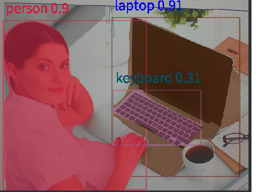

# 物体分割实验

## 前言

在上一章节中，我们已经学习了如何在CanMV下使用CanMV AI视觉开发框架和MicroPython编程方法实现物体检测的功能，本章将通过物体分割实验，介绍如何使用CanMV AI视觉开发框架和MicroPython编程实现对80种物体的图像分割。在本实验中，我们首先采集摄像头捕获的图像，然后经过图像预处理、模型推理和输出处理结果等一系列步骤，系统将识别图像中所有的物体，该模型会对COCO的80个类别的目标物体进行检测，当识别到目标物体时，系统会在目标物体上使用一定透明度的颜色进行填充，并在物体上方显示识别信息和识别的可信度，不同类别的物体会用不同颜色进行填充，最后，将结果绘制并显示在显示器上。通过本章的学习，读者将掌握如何在CanMV下使用CanMV AI视觉开发框架和MicroPython编程方法实现物体分割的功能。

## AI开发框架介绍

为了简化AI开发流程并降低AI开发难度，CanMV官方针对K230D专门搭建了AI开发框架，有关AI开发框架的介绍，请见[CanMV AI开发框架](development_framework.md)

## 硬件设计

### 例程功能

1. 本实验的功能和上一章非常相似，首先获取摄像头输出的图像，然后将图像输入到CanMV K230D的AI模型进行推理。本实验使用了一个基于YOLOv8n的物体分割模型，该模型用于检测图像中的所有物体，支持识别80种物体，可根据识别结果进行图像分割，这80种物体分别是：["person", "bicycle", "car", "motorcycle", "airplane", "bus", "train", "truck", "boat", "traffic light", "fire hydrant", "stop sign", "parking meter", "bench", "bird", "cat", "dog", "horse", "sheep", "cow", "elephant", "bear", "zebra", "giraffe", "backpack", "umbrella", "handbag", "tie", "suitcase", "frisbee", "skis", "snowboard", "sports ball", "kite", "baseball bat", "baseball glove", "skateboard", "surfboard", "tennis racket", "bottle", "wine glass", "cup", "fork", "knife", "spoon", "bowl", "banana", "apple", "sandwich", "orange", "broccoli", "carrot", "hot dog", "pizza", "donut", "cake", "chair", "couch", "potted plant", "bed", "dining table", "toilet", "tv", "laptop", "mouse", "remote", "keyboard", "cell phone", "microwave", "oven", "toaster", "sink", "refrigerator", "book", "clock", "vase", "scissors", "teddy bear", "hair drier", "toothbrush"]

   对应的中文名称是：[“人”、“自行车”、“汽车”、“摩托车”、“飞机”、“公共汽车”、“火车”、“卡车”、“船”、“交通灯”、“消防栓”、“停车标志”、“停车收费表”、“长凳”、“鸟”、“猫”、“狗”、“马”、“羊”、“牛”、“大象”、“熊”、“斑马”、“长颈鹿”、“背包”、“雨伞”、“手提包”、“领带”、“手提箱”、“飞盘”、“滑雪板”、“滑雪板”、“运动球”、“风筝”、“棒球棒”、“棒球手套”、“滑板”、“冲浪板”、“网球拍”、“瓶子”、“酒杯”、“杯子”、“叉子”、“刀子”、“勺子”、“碗”、“香蕉”、“苹果”、“三明治”、“橙子”、“西兰花”、“胡萝卜”、“热狗”、“披萨”、“甜甜圈”、“蛋糕”、“椅子”、“沙发“盆栽”、“床”、“餐桌”、“马桶”、“电视”、“笔记本电脑”、“鼠标”、“遥控器”、“键盘”、“手机”、“微波炉”、“烤箱”、“烤面包机”、“水槽”、“冰箱”、“书”、“钟表”、“花瓶”、“剪刀”、“泰迪熊”、“吹风机”、“牙刷”]，当检测到图像中存在目标物体时，系统会对每种物体填充不同颜色进行图像分割，并在物体上方绘制物体识别结果和可信度。最后，将处理后的图像显示在LCD上。

### 硬件资源

1. 本章实验内容主要讲解K230D的神经网络加速器KPU的使用，无需关注硬件资源。


### 原理图

1. 本章实验内容主要讲解K230D的神经网络加速器KPU的使用，无需关注原理图。

## 实验代码

``` python
from libs.PipeLine import PipeLine, ScopedTiming
from libs.AIBase import AIBase
from libs.AI2D import Ai2d
import os
import ujson
from media.media import *
from media.sensor import *
from time import *
import nncase_runtime as nn
import ulab.numpy as np
import time
import utime
import image
import random
import gc
import sys
import aidemo

# 自定义YOLOv8分割类
class SegmentationApp(AIBase):
    def __init__(self,kmodel_path,labels,model_input_size,confidence_threshold=0.2,nms_threshold=0.5,mask_threshold=0.5,rgb888p_size=[224,224],display_size=[1920,1080],debug_mode=0):
        super().__init__(kmodel_path,model_input_size,rgb888p_size,debug_mode)
        # 模型路径
        self.kmodel_path=kmodel_path
        # 分割类别标签
        self.labels=labels
        # 模型输入分辨率
        self.model_input_size=model_input_size
        # 置信度阈值
        self.confidence_threshold=confidence_threshold
        # nms阈值
        self.nms_threshold=nms_threshold
        # mask阈值
        self.mask_threshold=mask_threshold
        # sensor给到AI的图像分辨率
        self.rgb888p_size=[ALIGN_UP(rgb888p_size[0],16),rgb888p_size[1]]
        # 显示分辨率
        self.display_size=[ALIGN_UP(display_size[0],16),display_size[1]]
        self.debug_mode=debug_mode
        # 检测框预置颜色值
        self.color_four=[(255, 220, 20, 60), (255, 119, 11, 32), (255, 0, 0, 142), (255, 0, 0, 230),
                         (255, 106, 0, 228), (255, 0, 60, 100), (255, 0, 80, 100), (255, 0, 0, 70),
                         (255, 0, 0, 192), (255, 250, 170, 30), (255, 100, 170, 30), (255, 220, 220, 0),
                         (255, 175, 116, 175), (255, 250, 0, 30), (255, 165, 42, 42), (255, 255, 77, 255),
                         (255, 0, 226, 252), (255, 182, 182, 255), (255, 0, 82, 0), (255, 120, 166, 157)]
        # 分割结果的numpy.array，用于给到aidemo后处理接口
        self.masks=np.zeros((1,self.display_size[1],self.display_size[0],4))
        # Ai2d实例，用于实现模型预处理
        self.ai2d=Ai2d(debug_mode)
        # 设置Ai2d的输入输出格式和类型
        self.ai2d.set_ai2d_dtype(nn.ai2d_format.NCHW_FMT,nn.ai2d_format.NCHW_FMT,np.uint8, np.uint8)

    # 配置预处理操作，这里使用了pad和resize，Ai2d支持crop/shift/pad/resize/affine，具体代码请打开/sdcard/app/libs/AI2D.py查看
    def config_preprocess(self,input_image_size=None):
        with ScopedTiming("set preprocess config",self.debug_mode > 0):
            # 初始化ai2d预处理配置，默认为sensor给到AI的尺寸，您可以通过设置input_image_size自行修改输入尺寸
            ai2d_input_size=input_image_size if input_image_size else self.rgb888p_size
            top,bottom,left,right=self.get_padding_param()
            self.ai2d.pad([0,0,0,0,top,bottom,left,right], 0, [114,114,114])
            self.ai2d.resize(nn.interp_method.tf_bilinear, nn.interp_mode.half_pixel)
            self.ai2d.build([1,3,ai2d_input_size[1],ai2d_input_size[0]],[1,3,self.model_input_size[1],self.model_input_size[0]])

    # 自定义当前任务的后处理
    def postprocess(self,results):
        with ScopedTiming("postprocess",self.debug_mode > 0):
            # 这里使用了aidemo的segment_postprocess接口
            seg_res = aidemo.segment_postprocess(results,[self.rgb888p_size[1],self.rgb888p_size[0]],self.model_input_size,[self.display_size[1],self.display_size[0]],self.confidence_threshold,self.nms_threshold,self.mask_threshold,self.masks)
            return seg_res

    # 绘制结果
    def draw_result(self,pl,seg_res):
        with ScopedTiming("display_draw",self.debug_mode >0):
            if seg_res[0]:
                pl.osd_img.clear()
                mask_img=image.Image(self.display_size[0], self.display_size[1], image.ARGB8888,alloc=image.ALLOC_REF,data=self.masks)
                pl.osd_img.copy_from(mask_img)
                dets,ids,scores = seg_res[0],seg_res[1],seg_res[2]
                for i, det in enumerate(dets):
                    x1, y1, w, h = map(lambda x: int(round(x, 0)), det)
                    pl.osd_img.draw_string_advanced(x1,y1-50,32, " " + self.labels[int(ids[i])] + " " + str(round(scores[i],2)) , color=self.get_color(int(ids[i])))
            else:
                pl.osd_img.clear()

    # 计算padding参数
    def get_padding_param(self):
        dst_w = self.model_input_size[0]
        dst_h = self.model_input_size[1]
        ratio_w = float(dst_w) / self.rgb888p_size[0]
        ratio_h = float(dst_h) / self.rgb888p_size[1]
        if ratio_w < ratio_h:
            ratio = ratio_w
        else:
            ratio = ratio_h
        new_w = (int)(ratio * self.rgb888p_size[0])
        new_h = (int)(ratio * self.rgb888p_size[1])
        dw = (dst_w - new_w) / 2
        dh = (dst_h - new_h) / 2
        top = (int)(round(dh - 0.1))
        bottom = (int)(round(dh + 0.1))
        left = (int)(round(dw - 0.1))
        right = (int)(round(dw + 0.1))
        return  top, bottom, left, right

    # 根据当前类别索引获取框的颜色
    def get_color(self, x):
        idx=x%len(self.color_four)
        return self.color_four[idx]


if __name__=="__main__":
    # 显示模式，默认"hdmi",可以选择"hdmi"和"lcd"
    display_mode="lcd"
    if display_mode=="hdmi":
        display_size=[1920,1080]
    else:
        display_size=[640,480]
    # 模型路径
    kmodel_path="/sdcard/examples/kmodel/yolov8n_seg_320.kmodel"
    labels = ["person", "bicycle", "car", "motorcycle", "airplane", "bus", "train", "truck", "boat", "traffic light", "fire hydrant", "stop sign", "parking meter", "bench", "bird", "cat", "dog", "horse", "sheep", "cow", "elephant", "bear", "zebra", "giraffe", "backpack", "umbrella", "handbag", "tie", "suitcase", "frisbee", "skis", "snowboard", "sports ball", "kite", "baseball bat", "baseball glove", "skateboard", "surfboard", "tennis racket", "bottle", "wine glass", "cup", "fork", "knife", "spoon", "bowl", "banana", "apple", "sandwich", "orange", "broccoli", "carrot", "hot dog", "pizza", "donut", "cake", "chair", "couch", "potted plant", "bed", "dining table", "toilet", "tv", "laptop", "mouse", "remote", "keyboard", "cell phone", "microwave", "oven", "toaster", "sink", "refrigerator", "book", "clock", "vase", "scissors", "teddy bear", "hair drier", "toothbrush"]
    #其它参数设置
    confidence_threshold = 0.2
    nms_threshold = 0.5
    mask_threshold=0.5
    rgb888p_size=[320,320]

    # 初始化PipeLine
    sensor = Sensor(width=1280, height=960) # 构建摄像头对象
    pl = PipeLine(rgb888p_size=rgb888p_size, display_size=display_size, display_mode=display_mode)
    pl.create(sensor=sensor)  # 创建PipeLine实例
    # 初始化自定义YOLOV8分割示例
    seg=SegmentationApp(kmodel_path,labels=labels,model_input_size=[320,320],confidence_threshold=confidence_threshold,nms_threshold=nms_threshold,mask_threshold=mask_threshold,rgb888p_size=rgb888p_size,display_size=display_size,debug_mode=0)
    seg.config_preprocess()
    try:
        while True:
            os.exitpoint()
            with ScopedTiming("total",1):
                # 获取当前帧数据
                img=pl.get_frame()
                # 推理当前帧
                seg_res=seg.run(img)
                # 打印结果
                # print(seg_res)
                # 绘制结果到PipeLine的osd图像
                seg.draw_result(pl,seg_res)
                # 显示当前的绘制结果
                pl.show_image()
                gc.collect()
    except Exception as e:
        sys.print_exception(e)
    finally:
        seg.deinit()
        pl.destroy()
```

可以看到一开始是先定义显示模式、图像大小、模型相关的一些变量。

接着是通过初始化PipeLine，这里主要初始化sensor和display模块，配置摄像头输出两路不同的格式和大小的图像，以及设置显示模式，完成创建PipeLine实例。

然后调用自定义SegmentationApp类构建物体分割类，SegmentationApp类会对AIBase接口的初始化以及使用Ai2D接口的方法定义物体分割模型输入图像的预处理方法。

最后，在一个循环中不断获取摄像头输出的RGB888格式图像帧，然后将图像输入到物体分割模型进行推理。推理结果通过print打印出来，根据识别的信息使用具有一定透明度的不同颜色进行填充，不同类别的物体填充的颜色各不相同。在矩形框上方绘制检测结果及其可信度，并在LCD上显示处理后的图像。

## 运行验证

实验原图如下所示：


将K230D BOX开发板连接CanMV IDE，点击CanMV IDE上的“开始(运行脚本)”按钮后，将摄像头对准需要识别的区域，让其采集到需识别的物体信息，随后便能在LCD上看到摄像头输出的图像，可以看到，系统会用不同颜色填充不同的物体，物体上方显示识别的物体信息及其可信度，如下图所示：  


