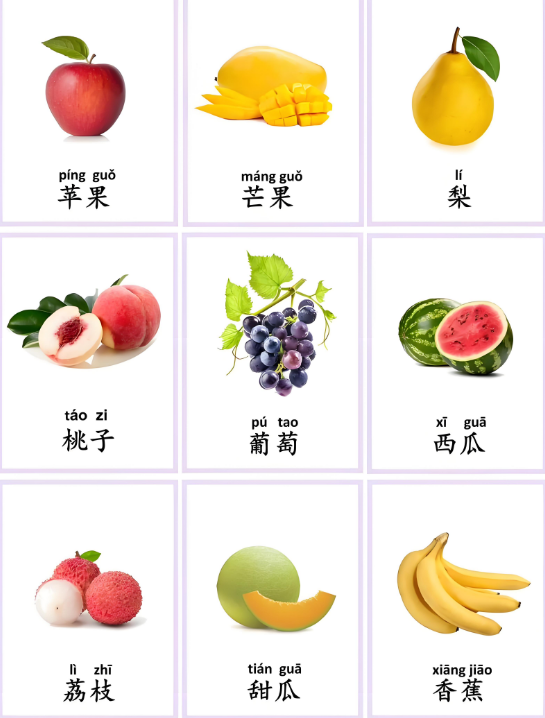
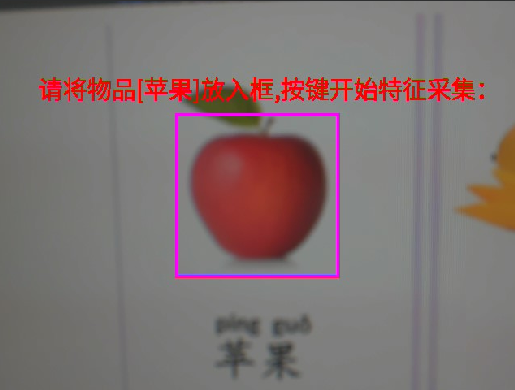
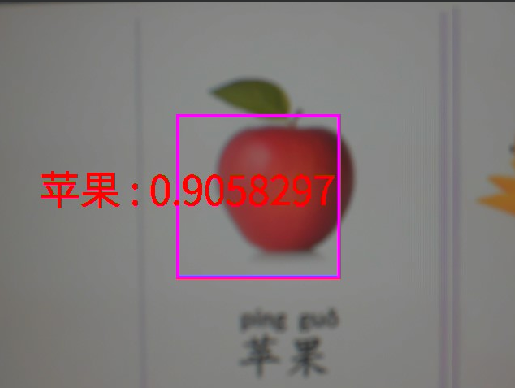
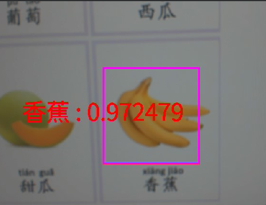
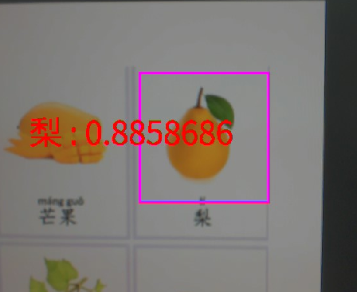

# 自学习分类实验

## 前言

在上一章节中，我们已经学习了如何在CanMV下使用CanMV AI视觉开发框架和MicroPython编程方法实现语音关键词唤醒的功能，本章将通过自学习分类实验，介绍如何使用CanMV AI视觉开发框架和MicroPython编程实现基于特征识别的自学习分类的方法。在本实验中，我们首先采集摄像头捕获的图像，然后经过图像预处理、模型推理和输出处理结果等一系列步骤，系统便可获得物体的特征，自分类学习功能就是基于物体特征读取这个原理。我们首先设置待分类的标签，然后根据标签顺序逐个读取需要分类的物体特征，完成每个标签的特征值读取后进入识别和分类状态，将摄像头采集到的物体图进行特征值读取，然后与所有标签的特征值进行比对，比对完成后将相似度高的标签名以及相似度输出，最后，将分类结果和相似度绘制并显示到显示器上。通过本章的学习，读者将掌握如何在CanMV下使用CanMV AI视觉开发框架和MicroPython编程方法实现自学习分类的方法。

## AI开发框架介绍

为了简化AI开发流程并降低AI开发难度，CanMV官方针对K230D专门搭建了AI开发框架，有关AI开发框架的介绍，请见[CanMV AI开发框架](development_framework.md)

## 硬件设计

### 例程功能

1. 获取摄像头输出的图像，然后将图像输入到CanMV K230D的AI模型进行推理。本实验使用了一个能够进行特征值读取的自分类学习模型，该模型能够对输入的图像进行特征值解析。首先，设置需要分类的标签，然后根据标签的顺序依次录入物体的特征值，当所有标签录入完毕后，进入识别和分类状态，将摄像头对准需要分类的物体，让系统采集到特征值并与每个标签的特征值进行匹配，然后将匹配结果输出，从而实现自分类学习的功能，最后，将分类结果和相似度显示在LCD上。

### 硬件资源

1. 本章实验内容主要讲解K230D的神经网络加速器KPU的使用，无需关注硬件资源。


### 原理图

1. 本章实验内容主要讲解K230D的神经网络加速器KPU的使用，无需关注原理图。

## 实验代码

``` python
from libs.PipeLine import PipeLine, ScopedTiming
from libs.AIBase import AIBase
from libs.AI2D import Ai2d
from machine import Pin
from machine import FPIOA
import os
import ujson
from media.media import *
from media.sensor import *
from time import *
import nncase_runtime as nn
import ulab.numpy as np
import time
import utime
import image
import random
import gc
import sys
import aicube

# 将GPIO0配置为普通GPIO模式
fpioa = FPIOA()
fpioa.set_function(34, FPIOA.GPIO34)
key0 = Pin(34, Pin.IN, pull=Pin.PULL_UP,drive=7) #构建key0对象
key_node = 0 #按键标志位

# 自定义自学习类
class SelfLearningApp(AIBase):
    def __init__(self,kmodel_path,model_input_size,labels,top_k,threshold,database_path,rgb888p_size=[224,224],display_size=[1920,1080],debug_mode=0):
        super().__init__(kmodel_path,model_input_size,rgb888p_size,debug_mode)
        self.kmodel_path=kmodel_path
        # 模型输入分辨率
        self.model_input_size=model_input_size
        self.labels=labels
        self.database_path=database_path
        # sensor给到AI的图像分辨率
        self.rgb888p_size=[ALIGN_UP(rgb888p_size[0],16),rgb888p_size[1]]
        # 显示分辨率
        self.display_size=[ALIGN_UP(display_size[0],16),display_size[1]]
        self.debug_mode=debug_mode
        # 识别阈值
        self.threshold = threshold
        # 选择top_k个相似度大于阈值的结果类别
        self.top_k = top_k
        #对应类别注册特征数量
        self.features= [2 for i in range(len(labels))]
        #注册单个特征中途间隔帧数
        self.time_one=60
        self.time_all = 0
        self.time_now = 0
        # 类别索引
        self.category_index = 0
        # 特征化部分剪切宽高
        self.crop_w = 400
        self.crop_h = 400
        # crop的位置
        self.crop_x = self.rgb888p_size[0] / 2.0 - self.crop_w / 2.0
        self.crop_y = self.rgb888p_size[1] / 2.0 - self.crop_h / 2.0
        self.crop_x_osd=0
        self.crop_y_osd=0
        self.crop_w_osd=0
        self.crop_h_osd=0
        # Ai2d实例，用于实现模型预处理
        self.ai2d=Ai2d(debug_mode)
        # 设置Ai2d的输入输出格式和类型
        self.ai2d.set_ai2d_dtype(nn.ai2d_format.NCHW_FMT,nn.ai2d_format.NCHW_FMT,np.uint8, np.uint8)
        self.data_init()

    # 配置预处理操作，这里使用了crop和resize，Ai2d支持crop/shift/pad/resize/affine，具体代码请打开/sdcard/app/libs/AI2D.py查看
    def config_preprocess(self,input_image_size=None):
        with ScopedTiming("set preprocess config",self.debug_mode > 0):
            # 初始化ai2d预处理配置，默认为sensor给到AI的尺寸，您可以通过设置input_image_size自行修改输入尺寸
            ai2d_input_size=input_image_size if input_image_size else self.rgb888p_size
            self.ai2d.crop(int(self.crop_x),int(self.crop_y),int(self.crop_w),int(self.crop_h))
            self.ai2d.resize(nn.interp_method.tf_bilinear, nn.interp_mode.half_pixel)
            self.ai2d.build([1,3,ai2d_input_size[1],ai2d_input_size[0]],[1,3,self.model_input_size[1],self.model_input_size[0]])

    # 自定义当前任务的后处理
    def postprocess(self,results):
        with ScopedTiming("postprocess",self.debug_mode > 0):
            return results[0][0]

    # 绘制结果，绘制特征采集框和特征分类框
    def draw_result(self,pl,feature):
        global key_node
        pl.osd_img.clear()
        with ScopedTiming("display_draw",self.debug_mode >0):
            pl.osd_img.draw_rectangle(self.crop_x_osd,self.crop_y_osd, self.crop_w_osd, self.crop_h_osd, color=(255, 255, 0, 255), thickness = 4)
            if (self.category_index < len(self.labels)):
                if key_node == 0:
                    pl.osd_img.draw_string_advanced(50, self.crop_y_osd-50, 30,"请将物品["+self.labels[self.category_index]+"]放入框,按键开始特征采集：", color=(255,255,0,0))
                if key_node == 1:
                    self.time_now += 1
                    pl.osd_img.draw_string_advanced(50, self.crop_y_osd-50, 30,"请将待添加类别放入框内进行特征采集："+self.labels[self.category_index] + "_" + str(int(self.time_now-1) // self.time_one) + ".bin", color=(255,255,0,0))
                    with open(self.database_path + self.labels[self.category_index] + "_" + str(int(self.time_now-1) // self.time_one) + ".bin", 'wb') as f:
                        f.write(feature.tobytes())
                    if (self.time_now // self.time_one == self.features[self.category_index]):
                        self.category_index += 1
                        self.time_all -= self.time_now
                        self.time_now = 0
                        key_node = 0 # 第一个物品识别完成，清空按键标志位
            else:
                results_learn = []
                list_features = os.listdir(self.database_path)
                for feature_name in list_features:
                    with open(self.database_path + feature_name, 'rb') as f:
                        data = f.read()
                    save_vec = np.frombuffer(data, dtype=np.float)
                    score = self.getSimilarity(feature, save_vec)
                    if (score > self.threshold):
                        res = feature_name.split("_")
                        is_same = False
                        for r in results_learn:
                            if (r["category"] ==  res[0]):
                                if (r["score"] < score):
                                    r["bin_file"] = feature_name
                                    r["score"] = score
                                is_same = True
                        if (not is_same):
                            if(len(results_learn) < self.top_k):
                                evec = {}
                                evec["category"] = res[0]
                                evec["score"] = score
                                evec["bin_file"] = feature_name
                                results_learn.append( evec )
                                results_learn = sorted(results_learn, key=lambda x: -x["score"])
                            else:
                                if( score <= results_learn[self.top_k-1]["score"] ):
                                    continue
                                else:
                                    evec = {}
                                    evec["category"] = res[0]
                                    evec["score"] = score
                                    evec["bin_file"] = feature_name
                                    results_learn.append( evec )
                                    results_learn = sorted(results_learn, key=lambda x: -x["score"])
                                    results_learn.pop()
                draw_y = 200
                for r in results_learn:
                    pl.osd_img.draw_string_advanced( 50 , draw_y,50,r["category"] + " : " + str(r["score"]), color=(255,255,0,0))
                    draw_y += 50

    #数据初始化
    def data_init(self):
        try:
            os.mkdir(self.database_path)
        except Exception as e:
            pass
        self.crop_x_osd = int(self.crop_x / self.rgb888p_size[0] * self.display_size[0])
        self.crop_y_osd = int(self.crop_y / self.rgb888p_size[1] * self.display_size[1])
        self.crop_w_osd = int(self.crop_w / self.rgb888p_size[0] * self.display_size[0])
        self.crop_h_osd = int(self.crop_h / self.rgb888p_size[1] * self.display_size[1])
        for i in range(len(self.labels)):
            for j in range(self.features[i]):
                self.time_all += self.time_one

    # 获取两个特征向量的相似度
    def getSimilarity(self,output_vec,save_vec):
        tmp = sum(output_vec * save_vec)
        mold_out = np.sqrt(sum(output_vec * output_vec))
        mold_save = np.sqrt(sum(save_vec * save_vec))
        return tmp / (mold_out * mold_save)


if __name__=="__main__":
    # 显示模式，默认"lcd"
    display_mode="lcd"
    display_size=[640,480]
    # 模型路径
    kmodel_path="/sdcard/examples/kmodel/recognition.kmodel"
    database_path="/sdcard/examples/utils/features/"
    # 其它参数设置
    rgb888p_size=[1280,960]
    model_input_size=[224,224]
    labels=["苹果","香蕉","梨"]
    top_k=3
    threshold=0.5

    # 初始化PipeLine
    sensor = Sensor(width=1280, height=960) # 构建摄像头对象
    pl = PipeLine(rgb888p_size=rgb888p_size, display_size=display_size, display_mode=display_mode)
    pl.create(sensor=sensor)  # 创建PipeLine实例
    # 初始化自学习实例
    sl=SelfLearningApp(kmodel_path,model_input_size=model_input_size,labels=labels,top_k=top_k,threshold=threshold,database_path=database_path,rgb888p_size=rgb888p_size,display_size=display_size,debug_mode=0)
    sl.config_preprocess()
    try:
        while True:
            os.exitpoint()
            with ScopedTiming("total",1):
                #检测按键
                if key0.value()==0:   # 按键被按下
                    time.sleep_ms(10) # 消除抖动
                    if key0.value()==0: # 确认按键被按下
                        print('key0被按下')
                        key_node = 1
                        while not key0.value(): #检测按键是否松开
                            pass
                # 获取当前帧数据
                img=pl.get_frame()
                # 推理当前帧
                res=sl.run(img)
                # 打印结果
                # print(res)
                # 绘制结果到PipeLine的osd图像
                sl.draw_result(pl,res)
                # 显示当前的绘制结果
                pl.show_image()
                gc.collect()
    except Exception as e:
        sys.print_exception(e)
    finally:
        # 删除features文件夹
        stat_info = os.stat(database_path)
        if (stat_info[0] & 0x4000):
            list_files = os.listdir(database_path)
            for l in list_files:
                os.remove(database_path + l)
        os.rmdir(database_path)
        sl.deinit()
        pl.destroy()
```

可以看到首先是定义显示模式、图像大小、模型相关的变量以及分类的标签。

接着是通过初始化PipeLine，这里主要初始化sensor和display模块，配置摄像头输出两路不同的格式和大小的图像，以及设置显示模式，完成创建PipeLine实例。

然后调用自定义SelfLearningApp类构建自学习的任务，SelfLearningApp类会通过调用AIBase接口的初始化以及使用Ai2D接口的方法定义自学习分类测模型输入图像的预处理方法。

最后在一个循环中不断地获取摄像头输出的RGBP888格式的图像帧，然后依次将图像输入到自学习分类模型进行推理，然后将推理结果通过print打印，同时将分类的结果和相似度绘制到图像上，并在LCD上显示图像。系统在特征采集状态下可以通过按键key0控制每个标签的特征值采集。

## 运行验证

实验原图如下所示：



将K230D BOX开发板连接CanMV IDE，点击CanMV IDE上的“开始(运行脚本)”按钮后，首先进入分类物体的特征采集状态，我们设置了三种标签，依次是苹果、香蕉和梨，首先将摄像头对准苹果区域，让其采集到的苹果区域在方框内，然后按下按键key0，开始采集苹果的特征值。如下图所示：  



苹果特征采集完后，我们用同样方式采集香蕉和梨的特征值，完成采集后，进入物体分类状态，将摄像头依次对准苹果。香蕉和梨的图片，系统能够识别出来，并将所属分类显示到屏幕上，如下图所示：








