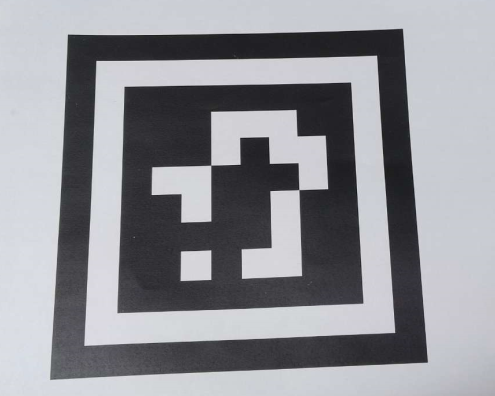
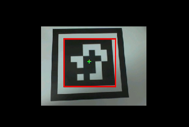

# AprilTags码识别实验

## 前言

在上个章节中，已经了解了如何在CanMV下使用image模块实现条形码识别的方法，本章将通过AprilTag码识别实验，介绍如何使用CanMV的find_apriltags()方法实现AprilTag码识别功能。在本实验中，我们将摄像头捕获的图像进行处理，查找图像中所有的AprilTag码，并将结果绘制并显示到显示器上。通过本章的学习，读者将学习到如何在CanMV下使用find_apriltags()方法实现AprilTag码识别的功能。

AprilTag是一种非常有用的视觉基准标记系统，类似与二维码QR codes（Quick Response Code；全称为快速响应矩阵图码）。可以利用AprilTag来获取标签相对摄像机的位置、距离以及坐标。

AprilTag有非常多种类，叫做家族(family)。默认的是：TAG36H11，常见的有：

- TAG16H5家族，共有30个AprilTag标签，编号ID分别是从0到29
- TAG25H7家族 ，编号ID从0到241
- TAG25H9家族， 编号ID从0到34
- TAG36H10家族，编号ID从0到2319
- TAG36H11家族，这个家族的ID数量非常多，从0到586（CanMV默认）
- ARTOOLKIT家族，编号ID从0到511

不同的AprilTag家族在数量和信息容量上有所不同。例如，TAG16H5是4x4的方形标签，而TAG36H11是6x6的方形标签。由于TAG16H5家族包含的标签数量较少，因此TAG16H5标签可以在更远的距离被识别。然而，TAG36H11家族的标签包含更多的信息位，提供更高的准确性和更低的错误率，因此在一般情况下推荐使用TAG36H11。

## Image模块介绍

### 概述

`Image`类是机器视觉处理中的基础对象。此类支持从Micropython GC、MMZ、系统堆、VB区域等内存区域创建图像对象。此外，还可以通过引用外部内存直接创建图像（ALLOC_REF）。未使用的图像对象会在垃圾回收时自动释放，也可以手动释放内存。

支持的图像格式如下：

- BINARY
- GRAYSCALE
- RGB565
- BAYER
- YUV422
- JPEG
- PNG
- ARGB8888（新增）
- RGB888（新增）
- RGBP888（新增）
- YUV420（新增）

支持的内存分配区域：

- **ALLOC_MPGC**：Micropython管理的内存
- **ALLOC_HEAP**：系统堆内存
- **ALLOC_MMZ**：多媒体内存
- **ALLOC_VB**：视频缓冲区
- **ALLOC_REF**：使用引用对象的内存，不分配新内存

### API描述

‌Python中的Image模块是一个强大的图像处理工具，它提供了一系列函数和方法，可以用于图像元素绘制、图像滤波、图像特征检测、色块追踪、图像对比和码识别等。由于image模块功能强大，需要介绍的内容也比较多，因此本章仅介绍image模块中find_apriltags()方法的使用。

#### find_apriltags

```python
image.find_apriltags([roi[, families=image.TAG36H11[, fx[, fy[, cx[, cy]]]]]])
```

该函数查找指定ROI内的所有AprilTag，并返回一个包含`image.apriltag`对象的列表。有关更多信息，请参考`image.apriltag`对象的相关文档。

与二维码相比，AprilTags可以在更远的距离、较差的光照条件和更扭曲的图像环境下被有效检测。AprilTags能够应对各种图像失真问题，而二维码则不能。因此，AprilTags仅将数字ID编码作为其有效载荷。

此外，AprilTags还可用于定位。每个`image.apriltag`对象将返回其三维位置信息和旋转角度。位置信息由fx、fy、cx和cy决定，分别表示图像在X和Y方向上的焦距和中心点。

注意：可以使用CanMV IDE内置的标签生成器工具创建AprilTags。该工具可生成可打印的8.5”x11”格式的AprilTags。

【参数】

- roi：是用于指定感兴趣区域的矩形元组(x, y, w, h)。若未指定，ROI默认为整个图像。操作范围仅限于该区域内的像素。

- families：是要解码的标签家族的位掩码，以逻辑或形式表示：

  - image.TAG16H5
  - image.TAG25H7
  - image.TAG25H9
  - image.TAG36H10
  - image.TAG36H11
  - image.ARTOOLKIT

  默认设置为最常用的image.TAG36H11标签家族。请注意，启用每个标签家族都会稍微降低find_apriltags()的速度。

- fx：是以像素为单位的相机X方向的焦距。标准OpenMV Cam的值为((2.8 / 3.984)\times656)，该值通过毫米计的焦距值除以X方向上感光元件的长度，再乘以X方向上感光元件的像素数量（针对OV7725感光元件）。

- fy：是以像素为单位的相机Y方向的焦距。标准OpenMV Cam的值为((2.8 / 2.952)\times 488)，该值通过毫米计的焦距值除以Y方向上感光元件的长度，再乘以Y方向上感光元件的像素数量（针对OV7725感光元件）。

- cx：是图像的中心，即image.width()/2，而非roi.w()/2。

- cy：是图像的中心，即image.height()/2，而非roi.h()/2。

注意：不支持压缩图像和Bayer格式图像。

更多用法请阅读官方API手册：

https://developer.canaan-creative.com/k230_canmv/dev/zh/api/openmv/image.html#image

## 硬件设计

### 例程功能

1. 系统会获取摄像头输出的图像，并使用image模块中的find_apriltags()方法查找图像中所有的AprilTag码。当识别到AprilTag码时，系统会在AprilTag码周围绘制一个矩形框和一个十字标记。最后，处理后的图像将显示在LCD屏幕上。

### 硬件资源

1. 本章实验内容，主要讲解image模块的使用，无需关注硬件资源。  


### 原理图

本章实验内容，主要讲解image模块的使用，无需关注原理图。  

## 实验代码

``` python
import time, math, os, gc
from media.sensor import *  # 导入sensor模块，使用摄像头相关接口
from media.display import * # 导入display模块，使用display相关接口
from media.media import *   # 导入media模块，使用meida相关接口

# AprilTag代码支持多达6个标签族，可以同时处理。
# 返回的标记对象将具有其标记族和标记族中的ID。
tag_families = 0
tag_families |= image.TAG16H5 # 注释掉，禁用此家族
tag_families |= image.TAG25H7 # 注释掉，禁用此家族
tag_families |= image.TAG25H9 # 注释掉，禁用此家族
tag_families |= image.TAG36H10 # 注释掉，禁用此家族
tag_families |= image.TAG36H11 # 注释掉，禁用此家族 (默认家族)
tag_families |= image.ARTOOLKIT # 注释掉，禁用此家族
# 标签系列有什么区别？例如，TAG16H5家族实际上是一个4x4方形标签。
# 所以，这意味着可以看到它比6x6的TAG36H11标签有更长的距离。
# 然而，较低的H值（H5对H11），意味着4x4标签的假阳性率远高于6x6标签。
# 所以，除非你有特殊需求需要使用其他标签系列，否则使用默认族TAG36H11。

def family_name(tag):
    if(tag.family() == image.TAG16H5):
        return "TAG16H5"
    if(tag.family() == image.TAG25H7):
        return "TAG25H7"
    if(tag.family() == image.TAG25H9):
        return "TAG25H9"
    if(tag.family() == image.TAG36H10):
        return "TAG36H10"
    if(tag.family() == image.TAG36H11):
        return "TAG36H11"
    if(tag.family() == image.ARTOOLKIT):
        return "ARTOOLKIT"
    
try:
    sensor = Sensor(width=640, height=480) # 构建摄像头对象
    sensor.reset() # 复位和初始化摄像头
    sensor.set_framesize(Sensor.QVGA)   # 设置帧大小QVGA(320x240)，默认通道0
    sensor.set_pixformat(Sensor.RGB565) # 设置输出图像格式，默认通道0

    # 初始化LCD显示器，同时IDE缓冲区输出图像,显示的数据来自于sensor通道0。
    Display.init(Display.ST7701, width=800, height=480, fps=90, to_ide=True)
    MediaManager.init() # 初始化media资源管理器
    sensor.run() # 启动sensor
    clock = time.clock() # 构造clock对象

    while True:
        os.exitpoint() # 检测IDE中断
        clock.tick()   # 记录开始时间（ms）
        img = sensor.snapshot() # 从通道0捕获一张图

        for tag in img.find_apriltags(families=tag_families):
            img.draw_rectangle([v for v in tag.rect()], color=(255, 0, 0), thickness=4)
            img.draw_cross(tag.cx(), tag.cy(), color=(0, 255, 0), thickness=2)
            #打印AprilTag码信息
            print_args = (family_name(tag), tag.id(), (180 * tag.rotation()) / math.pi)
            print("Tag Family %s, Tag ID %d, rotation %f (degrees)" % print_args)

        # 显示图片
        Display.show_image(img, x=round((800-sensor.width())/2), y=round((480-sensor.height())/2))
        print(clock.fps()) # 打印FPS

# IDE中断释放资源代码
except KeyboardInterrupt as e:
    print("user stop: ", e)
except BaseException as e:
    print(f"Exception {e}")
finally:
    # sensor stop run
    if isinstance(sensor, Sensor):
        sensor.stop()
    # deinit display
    Display.deinit()
    os.exitpoint(os.EXITPOINT_ENABLE_SLEEP)
    time.sleep_ms(100)
    # release media buffer
    MediaManager.deinit()
```

可以看到一开始是先初始化了LCD和摄像头。接着在一个循环中不断地获取摄像头输出的图像，因为获取到的图像就是Image对象，因此可以直接调用image模块为Image对象提供的各种方法，然后就是对图像中的AprilTag码进行检测和识别，并在LCD绘制矩形框和十字标记，最后在 LCD 显示图像。

## 运行验证

实物原图如下图所示：



将DNK230D开发板连接CanMV IDE，并点击CanMV IDE上的“开始(运行脚本)”按钮后，可以看到LCD上实时地显示这摄像头采集到的画面，如下图所示：


