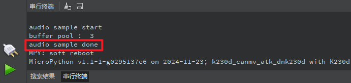

# 录音机实验

## 前言

本章将介绍CanMV下录音机的使用，能通过K230D BOX开发板板载的麦克风采集音频数据，然后将音频以wav格式保存到SD卡。通过本章的学习，读者将掌握如何在CanMV下使用音频模块接口实现录音机的功能。

## 音频模块介绍

### 概述

本实验主要介绍CanMV音频模块的使用，因为相关内容比较多，这里仅介绍如何通过调用Python API接口实现音频的采集。

### API描述

`Wave_write`类提供设置WAV文件的元数据（如采样率、采样点、声道数和采样精度）以及保存PCM音频数据到WAV文件的方法

#### set_channels

【描述】

设置声道数。

```python
def set_channels(self, nchannels)
```

【参数】

- nchannels：声道数

【返回值】

无

#### set_sampwidth

【描述】

设置采样字节长度。

```python
def set_sampwidth(self, sampwidth)
```

【参数】

- sampwidth：采样字节长度，有效范围[1, 2, 3, 4]分别对应采样精度[8, 16, 24, 32]

【返回值】

无

##### set_framerate

设置采样频率。

```python
def set_framerate(self, framerate)
```

设置引脚的功能

【参数】

framerate：采样频率[8000~192000]

【返回值】

无

##### write_frames

【描述】

写入音频数据。

```python
def write_frames(self, data)
```

【参数】

- data：音频数据（bytes字节序列）

【返回值】

无

更多用法请阅读官方API手册：

[链接](https://www.kendryte.com/k230_canmv/zh/main/zh/api/mpp/K230_CanMV_Audio%E6%A8%A1%E5%9D%97API%E6%89%8B%E5%86%8C.html)

## 硬件设计

### 例程功能

1. 初始化麦克风功能，通过音频模块接口录制一段15秒的音频，并通过wav文件形式保存到SD卡中。

### 硬件资源

1. 麦克风 - MICNR与MICPR

### 原理图

正点原子K230D BOX开发板上的麦克风连接原理图，如下图所示：  


## 实验代码

``` python
import os
from media.media import *   #导入media模块，用于初始化vb buffer
from media.pyaudio import * #导入pyaudio模块，用于采集和播放音频
import media.wave as wave   #导入wav模块，用于保存和加载wav音频文件


def exit_check():
    try:
        os.exitpoint()
    except KeyboardInterrupt as e:
        print("user stop: ", e)
        return True
    return False

def record_audio(filename, duration):
    CHUNK = int(44100/25)  #设置音频chunk值
    FORMAT = paInt16       #设置采样精度
    CHANNELS = 2           #设置声道数
    RATE = 44100           #设置采样率
    try:
        p = PyAudio()
        p.initialize(CHUNK)    #初始化PyAudio对象
        MediaManager.init()    #vb buffer初始化

        #创建音频输入流
        stream = p.open(format=FORMAT,
                        channels=CHANNELS,
                        rate=RATE,
                        input=True,
                        frames_per_buffer=CHUNK)

        frames = []
        #采集音频数据并存入列表
        for i in range(0, int(RATE / CHUNK * duration)):
            data = stream.read()
            frames.append(data)
            if exit_check():
                break
        #将列表中的数据保存到wav文件中
        wf = wave.open(filename, 'w') #创建wav 文件
        wf.set_channels(CHANNELS) #设置wav 声道数
        wf.set_sampwidth(p.get_sample_size(FORMAT))  #设置wav 采样精度
        wf.set_framerate(RATE)  #设置wav 采样率
        wf.write_frames(b''.join(frames)) #存储wav音频数据
        wf.close() #关闭wav文件
    except BaseException as e:
            print(f"Exception {e}")
    finally:
        stream.stop_stream() #停止采集音频数据
        stream.close()#关闭音频输入流
        p.terminate()#释放音频对象
        MediaManager.deinit() #释放vb buffer

if __name__ == "__main__":
    os.exitpoint(os.EXITPOINT_ENABLE)
    print("audio sample start")
    record_audio('/sdcard/app/output.wav', 15)  #录制wav文件
    print("audio sample done")
```

可以看到，首先导入相关的模块，创建个音频录制APP程序record_audio()，在record_audio()函数中初始化PyAudio对象，接着在创建音频输入流，设置采样率、声道数等，然后不断地采集音频数据保存到SD卡中。

我们只需要在主函数中调用record_audio()函数并传入音频的存储路径和录制时长即可完成音频的录制。

## 运行验证

将K230D BOX开发板连接CanMV IDE，并点击CanMV IDE上的“开始(运行脚本)”按钮后，系统开始进行音频录制，我们点击打开’串行终端‘，约15秒后，串口输出’“audio sample done”，表示音频录制成功：



将K230D BOX连接到电脑，可以在电脑上查看录制的音频，如下图所示：


我们可以使用电脑的播放器播放音频。

K230D BOX开发板连接喇叭后也能够实现音频的播放，具体方法可以参考AI例程：关键词唤醒实验。
