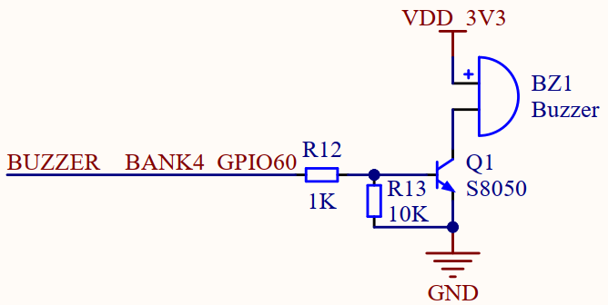

# 蜂鸣器实验

## 前言

本章实验将介绍如何使用CanMV让Kendryte K230D控制板载的蜂鸣器发声。通过本章的学习，读者将学习到在CanMV下控制Kendryte K230D的PWM引脚输出方波。  

## PWM模块介绍

### 概述

K230D内部包含两个PWM硬件模块，每个模块有3个输出通道，模块输出频率可调，但3通道共用，通道占空比独立可调。因此通道0、1、2共用频率，通道3、4、5共用频率。通道输出IO配置参考IOMUX模块。

### API描述

PWM类位于machine模块下

#### 构造函数

```python
pwm = PWM(channel, freq, duty=50, enable=False)
```

【参数】

- channel：PWM通道号，取值：[0,5]
- freq：PWM通道输出频率
- duty：PWM通道输出占空比，指高电平占整个周期的百分比，取值：[0,100]，可选参数，默认50
- enable：PWM通道输出立即使能，可选参数，默认False

### duty

```python
PWM.duty([duty])
```

获取或设置PWM通道输出占空比

【参数】

- duty：PWM通道输出占空比，可选参数，如果不传参数则返回当前占空比

【返回值】

返回空或当前PWM通道输出占空比

更多用法请阅读官方API手册：

https://developer.canaan-creative.com/k230_canmv/dev/zh/api/canmv_spec.html

## 硬件设计

### 例程功能

1. 控制板载蜂鸣器间歇发声

### 硬件资源

1. 蜂鸣器 - IO60

### 原理图

本章实验内容，需要控制板载蜂鸣器发声，正点原子K230D BOX开发板上蜂鸣器的连接原理图，如下图所示：  



通过以上原理图可以看出，蜂鸣器的发声与否由IO60控制，K230D BOX板载的是无源蜂鸣器，当输入震荡频率约为4KHz时，蜂鸣器正常发声，否则发声异常或者不发声。

```python
from machine import PWM
from machine import FPIOA
import time

# 实例化FPIOA
fpioa = FPIOA()

# 设置Pin60为PWM0
fpioa.set_function(60,FPIOA.PWM0)

# 实例化PWM0输出4KHz占空比为50的震荡频率
pwm0 = PWM(0, 4000, duty=50, enable=True)

while True:
    pass
```

可以看到，首先通过FPIOA构造函数构造了fpioa对象，然后通过set_function函数为控制蜂鸣器的IO分配了PWM0的功能，再通过PWM模块的构造函数构造蜂鸣器对象，并配置PWM0的输出频率为4000，占空比为50%，最后使用一个空循环让程序运行，这样PWM0就能持续输出对应频率的矩形波，从而能听到板载的蜂鸣器持续发声。  

## 运行验证

将K230D BOX开发板连接CanMV IDE，并点击CanMV IDE上的“开始(运行脚本)”按钮后，可以听到板载的蜂鸣器持续发声，这与理论推断的结果一致。
