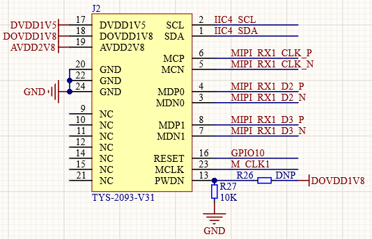
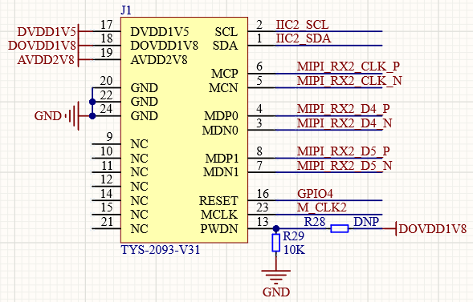

# 摄像头实验

## 前言

本章将介绍CanMV下摄像头的使用，能通过摄像头实时地采集摄像头捕获到的图像数据，从而进行进一步的处理。通过本章的学习，读者将学习到通过CanMV驱动摄像头实时捕获图像数据。

## Sensor模块介绍

### 概述

K230D CanMV平台sensor模块负责图像采集处理任务。本模块提供了一系列Highe Levl的API，应用开发者可以不用关注底层硬件细节，仅通过该模块提供的API即可获取不同格式和尺寸的图像。

K230D CanMV平台sensor模块包括三个独立的能力完全相同的sensor设备，每个sensor设备均可独立完成图像数据采集捕获处理，并可以同时输出3路图像数据。如下图所示：


sensor 0，sensor 1，sensor 2表示三个图像传感器；Camera Device 0，Camera Device 1，Camera Device 2表示三个sensor设备；output channel 0，output channel 1，output channel 2表示sensor设备的三个输出通道。三个图像传感器可以通过软件配置映射到不同的sensor 设备。

### API描述

FPIOA类位于machine模块下

#### 构造函数

【描述】

根据`csi id`和摄像头类型构建`Sensor`对象

用户需要先构建`Sensor`对象再继续操作

目前已实现自动探测摄像头，用户可选择输出图像的最大分辨率和帧率，参考[摄像头列表](https://developer.canaan-creative.com/k230_canmv/dev/zh/api/mpp/K230_CanMV_Sensor%E6%A8%A1%E5%9D%97API%E6%89%8B%E5%86%8C.html#id4)

用户设置目标分辨率和帧率之后，如果底层驱动不支持该设置，则会进行自动匹配出最佳配置

具体使用的配置可参考日志，如`use sensor 23, output 640x480@90`

```python
sensor = Sensor(id, [width, height, fps])
```

【参数】

- id：csi端口，取值：[0,2]，可选参数
- width：sensor最大输出图像宽度，可选参数，默认1920
- height：sensor最大输出图像高度，可选参数，默认1080
- fps：sensor最大输出图像帧率，可选参数，默认30

【返回值】

Sensor对象

#### sensor.reset

复位`sensor`

```python
sensor.reset()
```

设置引脚的功能

【参数】

无

【返回值】

无

#### sensor.set_framesize

设置指定通道的输出图像尺寸

注意：宽度会自动对齐到16像素宽

```python
sensor.set_framesize(framesize = FRAME_SIZE_INVAILD, chn = CAM_CHN_ID_0, alignment=0, **kwargs)
```

【参数】

- framesize：sensor输出图像尺寸
- chn：sensor输出通道号
- width：输出图像宽度
- height：输出图像高度

【返回值】

无

注意：输出图像尺寸不能超过摄像头实际输出。

不同输出通道最大可输出图像尺寸由硬件限制。

#### sensor.set_pixformat

设置指定`sensor`设备和通道的输出图像格式

```python
sensor.set_pixformat(pix_format, chn = CAM_CHN_ID_0)
```

【参数】

- pix_format：sensor输出图像格式
- chn：sensor输出通道号

【返回值】

无

#### sensor.bind_info

在`Display.bind_layer`时使用，获取绑定信息

```python
sensor.bind_info(x = 0, y = 0, chn = CAM_CHN_ID_0)
```

【参数】

- x：将sensor指定通道输出图像绑定到Display或Venc模块的指定坐标
- y：将sensor指定通道输出图像绑定到Display或Venc模块的指定坐标
- chn：sensor输出通道号

【返回值】

无

#### sensor.snapshot

从指定sensor设备的支持输出通道中捕获一帧图像数据

```python
sensor.snapshot(chn = CAM_CHN_ID_0)
```

【参数】

- chn：sensor输出通道号

【返回值】

image对象：成功

其他： 失败

#### sensor.run

摄像头开始输出

```python
sensor.run()
```

【参数】

无

【返回值】

无

注意：如果同时使用多个摄像头(最多3个)，只需要其中一个执行run即可

#### sensor.stop

停止sensor输出

```python
sensor.stop()
```

【参数】

无

【返回值】

无

注意：如果同时使用多个摄像头(最多3个)，**需要每一个都执行`stop`**

更多用法请阅读官方API手册：

https://developer.canaan-creative.com/k230_canmv/dev/zh/api/image_video.html

## 硬件设计

### 例程功能

1. 使用`sensor`模块初始化板载的摄像头，并对摄像头的输出帧大小以及输出格式等进行配置，最后获取摄像头采集到的图像数据，并在LCD以及CanMV IDE软件的“帧缓冲区”窗口进行显示。

### 硬件资源

1. 摄像头 - MIPI CSI0

2. LCD - MIPI DSI

### 原理图

本章实验内容，需要使用到板载的摄像头接口，在正点原子K230D BOX开发板上有两处MIPI摄像头接口位于正点原子CNK230DF核心板，该接口可以直接连接K230D BOX开发板自带的GC2093摄像头模组使用，但需要特别注意的是，我们的例程默认是使用MIPI CSI1接口使用的，即CNK230DF核心板上的J2接口处（摄像头默认连接处）。

正点原子K230D BOX开发板上的GC2093摄像头模块接口的连接原理图，如下图所示：  



同时正点原子CNK230DF核心板也提供了MIPI CSI2摄像头接口，同时支持两路摄像头输入（K230D最多支持3路），MIPI摄像头接口的连接原理图，如下图所示：



## 实验代码

``` python
import time, os, sys
from media.sensor import *  #导入sensor模块，使用摄像头相关接口
from media.display import * #导入display模块，使用display相关接口
from media.media import *   #导入media模块，使用meida相关接口


try:
    sensor = Sensor(width=1280, height = 960) #构建摄像头对象
    sensor.reset() #复位和初始化摄像头

    sensor.set_framesize(Sensor.VGA)      #设置帧大小VGA(640x480)，默认通道0
    sensor.set_pixformat(Sensor.YUV420SP) #设置输出图像格式，默认通道0

    # 将通道0图像绑定到视频输出
    bind_info = sensor.bind_info()
    Display.bind_layer(**bind_info, layer=Display.LAYER_VIDEO1)

    #使用IDE缓冲区输出图像,显示尺寸和sensor配置一致。
    Display.init(Display.ST7701, sensor.width(), sensor.height(), fps=90, to_ide=True)
    MediaManager.init() #初始化media资源管理器
    sensor.run() #启动sensor

    while True:
        os.exitpoint() #检测IDE中断

# IDE中断释放资源代码
except KeyboardInterrupt as e:
    print("user stop: ", e)
except BaseException as e:
    print(f"Exception {e}")
finally:
    # sensor stop run
    if isinstance(sensor, Sensor):
        sensor.stop()
    # deinit display
    Display.deinit()
    os.exitpoint(os.EXITPOINT_ENABLE_SLEEP)
    time.sleep_ms(100)
    # release media buffer
    MediaManager.deinit()
```

可以看到，首先导入相关的模块，然后使用try-except-finally用于异常捕获的处理，在try块编写可能引发异常的代码，我们首先构建Sensor的对象，然后进行复位（手册中说明在构造Sensor对象之后，必须调用复位函数才能继续其他操作），接着使用sensor.bind_info函数和Display.bind_layer函数将通道0的图像数据持续输出到屏幕，然后启动sensor，这样摄像头输出的一路数据就能持续的输出到LCD显示器上，无需在while循环中再进行操作。

except块负责采集异常信息，我们这里有KeyboardInterrupt和BaseException这两个不同异常类型的except块，当发生异常时将异常信息打印出来。

finally块是无论是否发生异常，finally块中的代码都会执行，我们这里主要用于模块停止和资源释放。

## 运行验证

将K230D BOX开发板连接CanMV IDE，并点击CanMV IDE上的“开始(运行脚本)”按钮后，可以看到LCD上实时地显示这摄像头采集到的画面，如下图所示：


也可以在CanMV IDE看到摄像头采集的画面，如下图所示：


