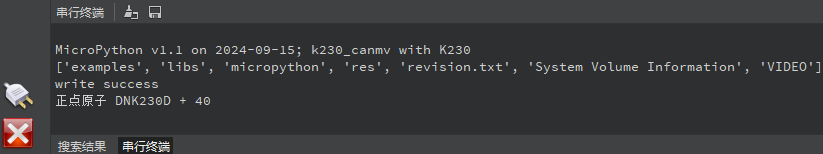

# 文件读写实验

## 前言

本章将介绍MicroPython自带的文件系统。通过本章的学习，读者将学习到使用MicroPython自带的文件系统实现文件读写功能。  

## 文件操作API介绍

### 概述

在MicroPython中，文件的读写是一个常见的操作。f.write()、f.read()、open()均是是Python内置函数之一，用于进行文件读写操作。

### API描述

MicroPython自带的文件系统常用的读写操作属于Python的内置函数，因此我们可以直接使用Python编程来实现文件读写。

#### open

```python
open(file, mode='r', buffering=-1, encoding=None, errors=None, newline=None, closefd=True, opener=None)
```

用于打开文件并返回一个文件对象

【参数】

- mode：mode是一个可选字符串，用于指定打开文件的模式。
- buffering：是一个可选的整数，用于设置缓冲策略。
- encoding：是用于解码或编码文件的编码的名称。
- errors：是一个可选的字符串参数，用于指定如何处理编码和解码错误-这不能在二进制模式下使用。
- newline： 控制universal newlines模式如何生效（它仅适用于文本模式）。
- closefd：如果closefd是False并且给出了文件描述符而不是文件名，那么当文件关闭时，底层文件描述符将保持打开状态。如果给出文件名则closefd必须为True（默认值），否则将引发错误。
- opener：可以通过传递可调用的opener来使用自定义开启器。

【返回值】

打开file并返回对应的[file object](https://docs.python.org/zh-cn/3.5/glossary.html#term-file-object)。如果该文件不能打开，则触发OSError异常

#### read

```python
read(size=-1)
```

读取并返回最多size个字节。 

【参数】

- size：读取数据长度，如果此参数被省略、为None或为负值，则读取并返回所有数据直到EOF。如果流已经到达EOF则返回一个空的[`bytes`](https://docs.python.org/zh-cn/3.5/library/functions.html#bytes)对象。

【返回值】

读取的数据

#### write

```python
write(b)
```

将给定的字符串b写入到指定文件中。

【参数】

- b：写入的字符串数据。

【返回值】

实际写入的字节数

更多用法请阅读官方手册的os或io部分：

https://docs.python.org/3.4/library/functions.html#open

## 硬件设计

### 例程功能

1. 实现文本文件的写入和读取。

### 硬件资源

1. 独立按键

   ​	KEY0按键 - IO2

   ​	KEY1按键 - IO5

   ​	KEY2按键 - IO0


### 原理图

本章实验内容，主要讲解MicroPython内置的文件系统的使用，无需关注原理图。

##  实验代码

``` python
from machine import Pin
from machine import FPIOA
import time
import uos

# 实例化FPIOA
fpioa = FPIOA()

# 为IO分配相应的硬件功能
fpioa.set_function(52, FPIOA.GPIO52)
fpioa.set_function(53, FPIOA.GPIO53)
fpioa.set_function(0, FPIOA.GPIO0)

# 构造GPIO对象
key0 = Pin(52, Pin.IN, pull=Pin.PULL_UP, drive=7)
key1 = Pin(53, Pin.IN, pull=Pin.PULL_UP, drive=7)
key2 = Pin(0, Pin.IN, pull=Pin.PULL_UP, drive=7)

i = 0
print(uos.listdir("/sdcard/"))

while True:
    # 读取按键状态，并做相应的按键解释
    if key0.value() == 0:
        f = open('/sdcard/test.txt', 'w') #以写的方式打开一个文件，没有该文件就自动新建
        wr_data = "正点原子 DNK230D + {}".format(i)
        f.write(wr_data) #写入数据
        f.close() #每次操作完记得关闭文件
        print("write success") #读取数据并在终端打印
        time.sleep_ms(50)
    if key1.value() == 0:
        f = open('/sdcard/test.txt', 'r') #以读方式打开一个文件
        text = f.read()
        print(text) #读取数据并在终端打印
        f.close() #每次操作完记得关闭文件
        time.sleep_ms(50)
    if key2.value() == 0:
        print(uos.listdir("/sdcard/"))
        time.sleep_ms(50)
    time.sleep_ms(200)
    i = i + 1
```

可以看到，首先为使用到的IO分配相应的硬件功能，接着是构造GPIO对象，特别的，独立按键相关的GPIO对象都被初始化为上拉输入模式，以读取独立按键的状态，然后打印CanMV K230D盘符对应的目录为`/sdcard/`路径的文件目录，最后在一个while循环中读取三个按键状态，当KEY0按下时，以写的方式打开`/sdcard/`路径的`test.txt`文本文件，不存在则自动创建，然后写入数据，当KEY1按下时，读取`/sdcard/`路径的`test.txt`文本文件的内容并打印出来，当KEY2按下时，将`/sdcard/`路径的目录打印出来。

## 运行验证

将DNK230D开发板连接CanMV IDE，并点击CanMV IDE上的“开始(运行脚本)”按钮后，系统启动后打印CanMV K230D盘符对应的目录为`/sdcard/`路径的目录，当按下KEY0时，串口打印提示写入数据成功，当按下KEY1时，读取刚写入的数据并通过串口打印出来，当按下KEY2时，打印`/sdcard/`路径的目录，如下图所示：



