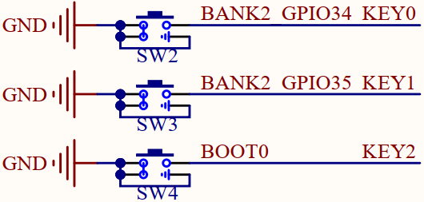

# 按键输入实验

## 前言

K230D内部包含64个GPIO Pin，每个Pin可配置为输入或输出，可配置上下拉，可配置驱动能力。

本章实验将介绍如何使用CanMV让Kendryte K230D获取板载按键的状态。通过本章的学习，读者将学习到在CanMV下读取Kendryte K230D的GPIO上的高低电平状态。 

## FPIOA模块介绍

有关FPIOA模块的介绍，请见[跑马灯实验的FPIOA模块介绍](led.md#fpioa模块介绍)

## Pin模块介绍

有关Pin模块的介绍，请见[跑马灯实验的Pin模块介绍](led.md#pin模块介绍)

## 硬件设计

### 例程功能

1. 当KEY0按键被按下后，双色LED的红灯亮起，反之熄灭

2. 当KEY1按键被按下后，双色LED的蓝色亮起，反之熄灭

3. 当KEY2按键被按下后，蜂鸣器发声，反之不发声

### 硬件资源

1. 双色LED

​	LEDR - IO61

​	LEDB - IO59

2. 蜂鸣器 - IO60

3. 独立按键

​	KEY0按键 - IO34

​	KEY1按键 - IO35

​	KEY2按键 - IO0

### 原理图

本章实验内容，需要读取独立按键连接IO上的电平状态 ，正点原子DNK230D-BOX开发板上独立按键的连接原理图，如下图所示：  



通过以上原理图可以看出，KEY0按键、KEY1按键和KEY2按键对应的IO编号分别为IO34、IO35和IO0，当独立按键没有被按下时，其对应的IO将处于悬空状态，此时读取到的电平将由IO的上下拉决定，当独立按键被按下后，其对应IO的电平将被拉低。

## 实验代码

``` python
from machine import Pin,PWM
from machine import FPIOA
import time

# 实例化FPIOA
fpioa = FPIOA()

# 为IO分配相应的硬件功能
fpioa.set_function(59, FPIOA.GPIO59)
fpioa.set_function(61, FPIOA.GPIO61)
fpioa.set_function(60, FPIOA.PWM0)
fpioa.set_function(34, FPIOA.GPIO34)
fpioa.set_function(35, FPIOA.GPIO35)
fpioa.set_function(0, FPIOA.GPIO0)

# 构造GPIO对象
ledb = Pin(59, Pin.OUT, pull=Pin.PULL_NONE, drive=7)
ledr = Pin(61, Pin.OUT, pull=Pin.PULL_NONE, drive=7)
beep = PWM(0, 4000, duty=50, enable=False)
key0 = Pin(34, Pin.IN, pull=Pin.PULL_UP, drive=7)
key1 = Pin(35, Pin.IN, pull=Pin.PULL_UP, drive=7)
key2 = Pin(0, Pin.IN, pull=Pin.PULL_UP, drive=7)

while True:
    # 读取按键状态，并做相应的按键解释
    if key0.value() == 0:
        ledr.value(0)
    else:
        ledr.value(1)
    if key1.value() == 0:
        ledb.value(0)
    else:
        ledb.value(1)
    if key2.value() == 0:
        beep.enable(True)
    else:
        beep.enable(False)
```

可以看到，首先为使用到的IO分配相应的硬件功能，接着是构造GPIO对象，特别的，独立按键相关的GPIO对象都被初始化为上拉输入模式，以读取独立按键的状态，最后在一个循环分别读取KEY0按键、KEY1按键和KEY2按键对应的GPIO输入电平，以判断独立按键是否被按下，若KEY0按键被按下，则控制对应的GPIO输出低电平以控制红色LED亮起，反之则控制对应的GPIO输出高电平以控制红色LED熄灭，KEY1按键和KEY2按键的读取和按键解释同理。

## 运行验证

将K230D BOX开发板连接CanMV IDE，并点击CanMV IDE上的“开始(运行脚本)”按钮后，此时，若按下板载的KEY0按键，则能看到双色LED的红色亮起，释放KEY0 按键后，双色LED的红色熄灭，若按下KEY1按键，则能看到双色LED的蓝色亮起，释放KEY1按键后，双色LED的蓝色熄灭，若按下KEY2按键，则能听到蜂鸣器发声，释放KEY2按键后，蜂鸣器不发声，这与理论推断的结果一致。  
