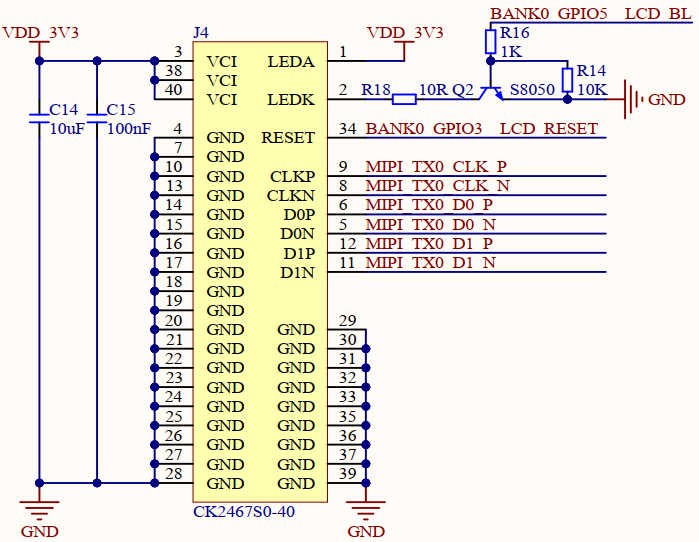
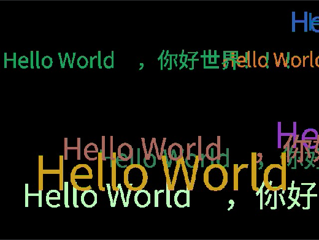

# LCD实验

## 前言

本章将介绍CanMV下LCD显示器的使用，通过MIPI接口驱动板载LCD实现简单的字符串显示功能。通过本章的学习，读者将学习到通过CanMV驱动板载LCD的简单使用。

# Display模块介绍

### 概述

介绍使用Micro Python API调用CanMV Display模块，实现图像显示功能。

### API描述

FPIOA类位于machine模块下

#### init

【描述】

初始化Display通路，包括VO模块、DSI模块和LCD/HDMI。
**必须在MediaManager.init()之前调用**

```python
init(type=None, width=None, height=None, osd_num=1, to_ide=False, fps=None, quality=90)
```

【参数】

- type：显示设备类型，必选参数：LT9611/HX8377/ST7701/VIRT
- width： 分辨率宽度，可选参数，默认值根据 `type` 决定
- height：分辨率高度，可选参数，默认值根据 `type` 决定
- osd_num：在show_image时支持的LAYER数量
- to_ide：是否将屏幕显示传输到IDE显示
- fps：显示帧率，仅支持`VIRT`类型
- quality：设置Jpeg压缩质量，仅在to_ide=True时有效，范围 [10-100]

【返回值】

无

#### show_image

在屏幕上显示图像。

```python
show_image(img, x=0, y=0, layer=None, alpha=255, flag=0)
```

设置引脚的功能

【参数】

- img：显示的图像
- x：起始坐标的x值
- y：起始坐标的y值
- layer：显示到指定层，仅支持`OSD`层，若需要多层请在`init`中设置`osd_num`
- alpha：图层混合alpha
- flag：显示标志

【返回值】

无

#### deinit

执行反初始化， deinit 方法会关闭整个 Display 通路，包括 VO 模块、 DSI 模块和 LCD/HDMI。
**必须在MediaManager.deinit()之前调用**
**必须在sensor.stop()之后调用**

```python
deinit()
```

【参数】

无

【返回值】

无

#### bind_layer

将`sensor`或`vdec`模块的输出绑定到屏幕显示。无需用户手动干预即可持续显示图像。
**必须在init之前调用**

```python
bind_layer(src=(mod, dev, layer), dstlayer, rect=(x, y, w, h), pix_format, alpha, flag)
```

【参数】

- src：`sensor`或`vdec`的输出信息，可通过`sensor.bind_info()`获取
- dstlayer：绑定到Display的显示层，可绑定到`video`或`osd`层
- rect：显示区域，可通过`sensor.bind_info()`获取
- pix_format：图像像素格式，可通过`sensor.bind_info()`获取
- alpha：图层混合alpha
- flag：显示标志

【返回值】

无

#### sensor.bind_info

在`Display.bind_layer`时使用，获取绑定信息，属于sensor模块的方法

```python
sensor.bind_info(x = 0, y = 0, chn = CAM_CHN_ID_0)
```

【参数】

- x：将sensor指定通道输出图像绑定到Display或Venc模块的指定坐标
- y：将sensor指定通道输出图像绑定到Display或Venc模块的指定坐标
- chn：sensor输出通道号

【返回值】

无

注意：如果同时使用多个摄像头(最多3个)，**需要每一个都执行`stop`**

更多用法请阅读官方API手册：

[链接](https://www.kendryte.com/k230_canmv/zh/main/zh/api/mpp/K230_CanMV_Display%E6%A8%A1%E5%9D%97API%E6%89%8B%E5%86%8C.html)

## 硬件设计

### 例程功能

1. 使用`Display`模块初始化板载的LCD显示器，K230D BOX板载的LCD分辨率大小为640 * 480，然后连续在图像中绘制10条"Hello World!，你好世界！！！"字样，显示位置、字符串大小和颜色均会随机改变，最后将图像绘制到LCD显示器上，可以在LCD显示器或CanMV IDE软件的“帧缓冲区”窗口进行观察。

### 硬件资源

1. LCD - MIPI DSI

### 原理图

正点原子K230D BOX开发板上的LCD模块接口的连接原理图，如下图所示：



## 实验代码

``` python
import time, os, urandom, sys
from media.display import *
from media.media import *

def display_test():
    img = image.Image(640, 480, image.RGB888)
    Display.init(Display.ST7701, width=640, height=480, to_ide=True)
    MediaManager.init()

    try:
        while True:
            img.clear()
            for i in range(10):
                x = (urandom.getrandbits(11) % img.width())
                y = (urandom.getrandbits(11) % img.height())
                r = (urandom.getrandbits(8))
                g = (urandom.getrandbits(8))
                b = (urandom.getrandbits(8))
                size = (urandom.getrandbits(30) % 64) + 32
                # 在不同位置刷新不同大小、颜色的字符串
                img.draw_string_advanced(x,y,size, "Hello World!，你好世界！！！", color=(r, g, b),)

            # 刷新到显示器上
            Display.show_image(img)

            time.sleep(1)
            os.exitpoint()
    except KeyboardInterrupt as e:
        print("user stop: ", e)
    except BaseException as e:
        print(f"Exception {e}")

    # deinit display
    Display.deinit()
    os.exitpoint(os.EXITPOINT_ENABLE_SLEEP)
    time.sleep_ms(100)
    # release media buffer
    MediaManager.deinit()

if __name__ == "__main__":
    os.exitpoint(os.EXITPOINT_ENABLE)
    display_test()
```

可以看到，先用image.Image()方法创建image对象，图像格式为RGB888，然后初始化Display模块，设备类型为ST7701（LCD的驱动IC），分辨率大小为640 * 480，开启IDE显示。

最后在一个循环中，随机在图像中绘制十个字符串，每个字符串的位置、显示大小和显示颜色都是随机生成的，最后显示到LCD显示器上。

## 运行验证

将K230D BOX开发板连接CanMV IDE，并点击CanMV IDE上的“开始(运行脚本)”按钮后，可以看到LCD上实时地显示这摄像头采集到的画面，如下图所示：


