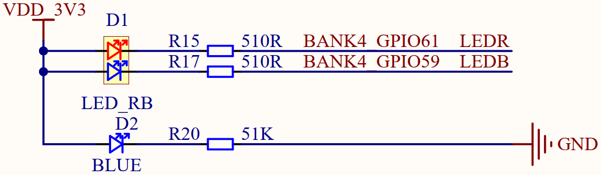

# 跑马灯实验

## 前言

本章实验将介绍如何使用CanMV让Kendryte K230D控制板载的双色LED闪烁，以实现跑马灯的效果。通过本章的学习，读者将学习到在CanMV下控制Kendryte K230D的GPIO输出高低电平。  

## FPIOA模块介绍

### 概述

IOMUX主要配置物理PAD(管脚)的功能，由于soc功能多管脚(pads)少，多个功能共享同一个I/O管脚(pads)，但是一个pads同一时间只能使用其中一个功能，所以需要IOMUX进行功能选择。IOMUX也叫FPIOA，Pin multiplexing，管脚功能选择等。

### API描述

FPIOA类位于machine模块下

#### 构造函数

```python
fpioa = FPIOA()
```

【参数】

无

#### set_function

```python
FPIOA.set_function(pin, func, ie=-1, oe=-1, pu=-1, pd=-1, st=-1, sl=-1, ds=-1)
```

设置引脚的功能

【参数】

- pin：引脚号，取值：[0,63]
- func：功能号
- ie：重新设置输入使能，可选参数
- oe：重新设置输出使能，可选参数
- pu：重新设置上拉使能，可选参数
- pd：重新设置下拉使能，可选参数
- st：重新设置st使能，可选参数
- sl：重新设置sl使能，可选参数
- ds：重新设置驱动能力，可选参数

【返回值】

无

更多用法请阅读官方API手册：

https://developer.canaan-creative.com/k230_canmv/dev/zh/api/canmv_spec.html

## Pin模块介绍

### 概述

K230D内部包含64个GPIO Pin，每个Pin可配置为输入或输出，可配置上下拉，可配置驱动能力。

### API描述

Pin类位于machine模块下

#### 构造函数

```python
pin = Pin(index, mode, pull=Pin.PULL_NONE, drive=7)
```

【参数】

- index：引脚号，取值：[0,63]
- mode：输入或输出模式
- pull：上下拉配置，可选参数，默认PULL_NONE
- drive：驱动能力配置，可选参数，默认7

#### value

```python
Pin.value([value])
```

获取引脚输入或设置引脚输出

【参数】

- value：输出值，可选参数，如果不传参数则返回输入值

【返回值】

返回空或当前引脚输入值

#### mode

```python
Pin.mode([mode])
```

获取或设置引脚输入输出模式

【参数】

- mode：输入输出模式，可选参数，如果不传参数则返回当前输入输出模式

【返回值】

返回空或当前引脚输入输出模式

#### pull

```python
Pin.pull([pull])
```

获取或设置引脚上下拉配置

【参数】

- pull：上下拉配置，可选参数，如果不传参数则返回当前上下拉配置

【返回值】

返回空或当前引脚上下拉配置

#### drive

```python
Pin.drive([drive])
```

获取或设置引脚驱动能力

【参数】

- drive：驱动能力，可选参数，如果不传参数则返回当前驱动能力

【返回值】

返回空或当前引脚驱动能力

#### on

```python
Pin.on()
```

设置输出高

【参数】

无

【返回值】

无

#### off

```python
Pin.off()
```

设置输出低

【参数】

无

【返回值】

无

#### high

```python
Pin.high()
```

设置输出高

【参数】

无

【返回值】

无

#### low

```python
Pin.low()
```

设置输出低

【参数】

无

【返回值】

无

更多用法请阅读官方API手册：

https://developer.canaan-creative.com/k230_canmv/dev/zh/api/canmv_spec.html

## 硬件设计

### 例程功能

1. 控制板载双色LED轮流闪烁，实现跑马灯的效果  

### 硬件资源

1. 双色LED

​	LEDR - IO61

​	LEDB - IO59

### 原理图

本章实验内容，需要控制板载双色LED轮流闪烁，以实现跑马灯的效果，正点原子K230D BOX开发板上双色LED的连接原理图，如下图所示：  



通过以上原理图可以看出，双色LED中红色和蓝色LED对应的IO编号分别为IO61和IO59，且都是当IO输出低电平时LED亮起，当IO输出高电平时LED熄灭。  

##  实验代码

``` python
from machine import Pin
from machine import FPIOA
import time

# 实例化FPIOA
fpioa = FPIOA()

# 设置Pin59为GPIO59，Pin61为GPIO61
fpioa.set_function(59, FPIOA.GPIO59)
fpioa.set_function(61, FPIOA.GPIO61)

# 实例化蓝色LED灯和红色LED灯引脚为输出
ledb = Pin(59, Pin.OUT, pull=Pin.PULL_NONE, drive=7)
ledr = Pin(61, Pin.OUT, pull=Pin.PULL_NONE, drive=7)

# 设置输出为高
ledb.value(1)
# pin.on()
# pin.high()
# 设置输出为低
ledb.value(0)
# pin.off()
# pin.low()

while True:
    # 设置LED对应的GPIO对象输出对应的高低电平
    ledb.value(1)
    ledr.value(0)
    time.sleep_ms(200)
    ledb.value(0)
    ledr.value(1)
    time.sleep_ms(200)
```

可以看到，首先通过FPIOA构造函数构造了fpioa对象，然后通过set_function函数为控制双色LED的两个IO分别分配了GPIO59和GPIO61的功能，再通过Pin模块的构造函数构造两个LED灯对象，均配置为输出模式并配置驱动能力，最后在一个循环中轮流设置这两个GPIO对象输出不同的高低电平并延时一段时间，从而应该能看到板载的双色LED轮流亮起、熄灭，实现跑马灯的效果。 

## 运行验证

将K230D BOX开发板连接CanMV IDE，并点击CanMV IDE上的“开始(运行脚本)”按钮后，可以看到板载的双色LED轮流亮起、熄灭，实现跑马灯的效果，这与理论推断的结果一致。  

