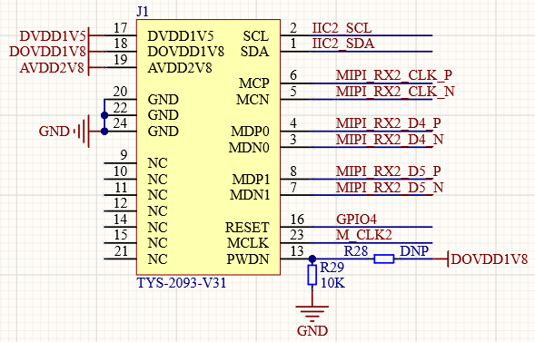
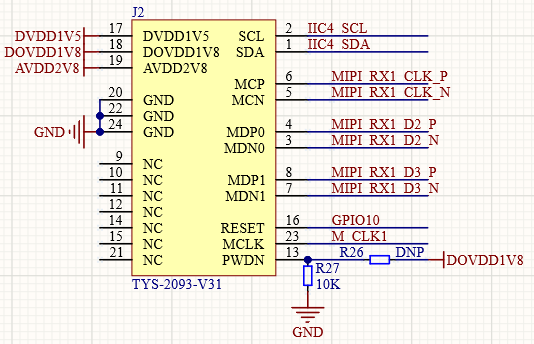
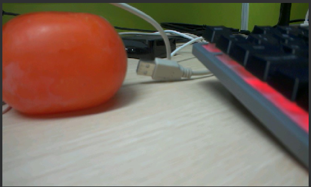
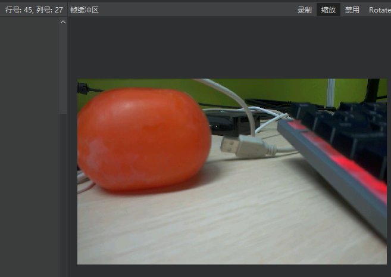
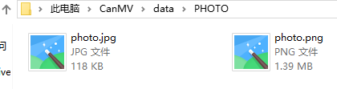

# 照片拍摄实验

## 前言

在前面的章节中，已经了解了如何在CanMV下获取摄像头输出的图像数据并在LCD上进行显示，本章将通过照片拍摄实验，介绍如何通过CanMV将摄像头输出的图像数据进行图像编码保存到文件系统中。通过本章的学习，读者将学习到CanMV下图像数据的编码保存。

## Image模块介绍

### 概述

`Image` 类是机器视觉处理中的基础对象。此类支持从Micropython GC、MMZ、系统堆、VB 区域等内存区域创建图像对象。此外，还可以通过引用外部内存直接创建图像（ALLOC_REF）。未使用的图像对象会在垃圾回收时自动释放，也可以手动释放内存。

支持的图像格式如下：

- BINARY
- GRAYSCALE
- RGB565
- BAYER
- YUV422
- JPEG
- PNG
- ARGB8888（新增）
- RGB888（新增）
- RGBP888（新增）
- YUV420（新增）

支持的内存分配区域：

- **ALLOC_MPGC**：Micropython 管理的内存
- **ALLOC_HEAP**：系统堆内存
- **ALLOC_MMZ**：多媒体内存
- **ALLOC_VB**：视频缓冲区
- **ALLOC_REF**：使用引用对象的内存，不分配新内存

### API描述

‌Python中的Image模块是一个强大的图像处理工具，它提供了一系列函数和方法，可以对图像进行读取、处理、保存等操作，这里我们仅介绍image模块为Image对象提供了save()方法，用于保存我们拍摄的图片，其他功能我们后续再介绍。

#### save

```python
image.save(path[, roi[, quality=50]])
```

将图像保存到指定路径 `path`

【参数】

- path：保存的路径
- roi：写入的字符串数据。
- quality：JPEG压缩质量

【返回值】

无

更多用法请阅读官方API手册：

https://developer.canaan-creative.com/k230_canmv/dev/zh/api/openmv/image.html#save

## 硬件设计

### 例程功能

1. 使用`sensor`模块初始化板载的摄像头，并配置两路摄像头的输出不同的帧大小以及输出格式，一路用于LCD屏幕显示，大小为屏幕的分辨率，另外一路输出的分辨率大小为1280 * 960的RGB565数据，作为拍摄的照片的数据源，能获得更清晰的照片，我们可以通过KEY选择照片的保存格式，按下KEY0，照片保存为JPG格式，按下KEY1，照片保存为BMP格式，实时图像信息在LCD显示器和CanMV IDE软件的“帧缓冲区”窗口进行显示。

### 硬件资源

1. 摄像头 - MIPI CSI1

2. LCD - MIPI DSI

3. 独立按键

   ​	KEY0按键 - IO34

   ​	KEY1按键 - IO35

### 原理图

本章实验内容，需要使用到板载的摄像头接口，在正点原子K230D BOX开发板上有两处MIPI摄像头接口位于正点原子CNK230DF核心板，该接口可以直接连接K230D BOX开发板自带的GC2093摄像头模组使用，但需要特别注意的是，我们的例程默认是使用MIPI CSI2接口使用的，即CNK230DF核心板上的J1接口处（摄像头默认连接处）。

正点原子K230D BOX开发板上的GC2093摄像头模块接口的连接原理图，如下图所示：  



同时正点原子CNK230DF核心板也提供了MIPI CSI1摄像头接口，同时支持两路摄像头输入（K230D最多支持3路），MIPI摄像头接口的连接原理图，如下图所示：



## 实验代码

``` python
import time, os, sys
from machine import Pin
from machine import FPIOA
from media.sensor import *  #导入sensor模块，使用摄像头相关接口
from media.display import * #导入display模块，使用display相关接口
from media.media import *   #导入media模块，使用meida相关接口
import image                #导入Image模块，使用Image相关接口

# 实例化FPIOA
fpioa = FPIOA()

# 为IO分配相应的硬件功能
fpioa.set_function(34, FPIOA.GPIO34)
fpioa.set_function(35, FPIOA.GPIO35)

# 构造GPIO对象
key0 = Pin(34, Pin.IN, pull=Pin.PULL_UP, drive=7)
key1 = Pin(35, Pin.IN, pull=Pin.PULL_UP, drive=7)

try:
    try:
        os.mkdir("/data/PHOTO")
    except Exception:
        pass
    sensor = Sensor(width=1280, height=960) # 构建摄像头对象
    sensor.reset() # 复位和初始化摄像头

    sensor.set_framesize(Sensor.VGA)      # 设置帧大小VGA(640x480)，默认通道0
    sensor.set_pixformat(Sensor.YUV420SP) # 设置输出图像格式，默认通道0

    # 将通道0图像绑定到视频输出
    bind_info = sensor.bind_info()
    Display.bind_layer(**bind_info, layer=Display.LAYER_VIDEO1)

    # 设置通道1输出格式，用于图像保存
    sensor.set_framesize(Sensor.SXGAM, chn=CAM_CHN_ID_1)  # 输出帧大小SXGAM(1280x960)
    sensor.set_pixformat(Sensor.RGB565, chn=CAM_CHN_ID_1) # 设置输出图像格式，选择通道1

    # 初始化LCD显示器，同时IDE缓冲区输出图像,显示的数据来自于sensor通道0。
    Display.init(Display.ST7701, width = 640, height = 480, to_ide = False)
    MediaManager.init()  # 初始化media资源管理器

    sensor.run()  # 启动sensor

    while True:
        os.exitpoint() # 检测IDE中断
        # 读取按键状态，并做相应的按键解释
        if key0.value() == 0:
            img = sensor.snapshot(chn=CAM_CHN_ID_1) # 从通道1捕获一张图
            img.save("/data/PHOTO/photo.jpg")
            print("snapshot success") # 提示照片保存成功
            time.sleep_ms(50)
        if key1.value() == 0:
            img = sensor.snapshot(chn=CAM_CHN_ID_1) # 从通道1捕获一张图
            img.save("/data/PHOTO/photo.bmp")
            print("snapshot success") # 提示照片保存成功
            time.sleep_ms(50)
        time.sleep_ms(10)
# IDE中断释放资源代码
except KeyboardInterrupt as e:
    print("user stop: ", e)
except BaseException as e:
    print(f"Exception {e}")
finally:
    # sensor stop run
    if isinstance(sensor, Sensor):
        sensor.stop()
    # deinit display
    Display.deinit()
    os.exitpoint(os.EXITPOINT_ENABLE_SLEEP)
    time.sleep_ms(100)
    # release media buffer
    MediaManager.deinit()
```

可以看到，首先为使用到的IO分配相应的硬件功能，接着是构造GPIO对象，特别的，独立按键相关的GPIO对象都被初始化为上拉输入模式，以读取独立按键的状态，接着启用MIPI CSI1的摄像头，设置两路输出不同的帧大小以及输出格式的图像，一路用于LCD显示，另外一路用于保存为照片，另外我们可以通过独立按键KEY0和KEY1选择将照片保存为不同的格式，当KEY0按下时，照片保存为JPG格式，当KEY1按下时，照片保存为PNG格式。

## 运行验证

将K230D BOX开发板连接CanMV IDE，并点击CanMV IDE上的“开始(运行脚本)”按钮后，可以看到LCD上实时地显示这摄像头采集到的画面，如下图所示：



也可以在CanMV IDE看到摄像头采集的画面，如下图所示：



将K230D BOX开发板连接到电脑，可以在电脑上查看拍摄的照片，如下图所示：


