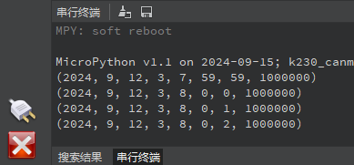

# RTC实验

## 前言

本章将介绍machine模块中的RTC类，即RTC时钟类。通过本章的学习，读者将学习到machine模块中RTC类的使用。  

## RTC模块介绍

### 概述

当前CanMV K230D提供了一个类RTC模块，用户可以设置和获取当前系统时间

### API描述

RTC类位于machine模块下

#### 构造函数

```python
rtc = RTC()
```

【参数】

无

### datetime

```python
print(rtc.datetime())
```

【参数】

无

【返回值】

- year：年
- mon：月
- day：日
- hour：时
- min：分
- sec：秒
- microsec：微秒

更多用法请阅读官方API手册：

https://developer.canaan-creative.com/k230_canmv/dev/zh/api/canmv_spec.html

## 硬件设计

### 例程功能

1. 创建一个RTC对象，并设置RTC时间
2. 最后进入一个while循环中不断打印RTC时间

### 硬件资源

1. 本章实验内容，主要讲解CanMV K230D内置RTC模块的使用，无需关注硬件资源。


### 原理图

本章实验内容，主要讲解RTC模块的使用，无需关注原理图。

##  实验代码

``` python
from machine import RTC
import time

# 构建RTC对象
rtc = RTC()

# 设置RTC日期和时间。(2024, 9, 12, 3, 8, 0, 0, 0)按顺序分别表示（年，月，日，星期，时，分，秒，微妙），
# 其中星期使用0-6表示星期一到星期日。

rtc.datetime((2024, 9, 12, 3, 8, 0, 0, 0))

while True:
    print(rtc.datetime()) #打印时间
    time.sleep(1) #延时1秒
```

可以看到，首先是构造了一个RTC对象，并将时间设置为2024年9月12日8时0分0秒，最后在一个while循环里每隔1秒读取一次RTC时钟并通过串口打印。

## 运行验证

将K230D BOX开发板连接CanMV IDE，并点击CanMV IDE上的“开始(运行脚本)”按钮后，此时，串行终端每隔1秒打印一次RTC时间，如下图所示：




