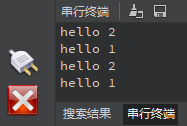

# Thread实验

## 前言

本章将介绍MicroPython固件中的_thread线程模块。通过本章的学习，读者将学习到MicroPython中 _thread线程模块的使用。  

## _thread模块介绍

### 概述

该模块提供了操作多个线程（也被称为 轻量级进程或任务）的底层原语 —— 多个控制线程共享全局数据空间。为了处理同步问题，也提供了简单的锁机制（也称为互斥锁或二进制信号）。

### API描述

_thread线程模块衍生于python3

#### start_new_thread

```
_thread.start_new_thread(function, args[, kwargs])
```

启动一个线程，并返回其标识符。

【参数】

- function: 功能函数
- args: 参数（必须是元组）
- kwargs: 使用字典来指定有名参数，可选参数

【返回值】

无

更多用法请阅读官方手册：

https://docs.python.org/zh-cn/3.5/library/_thread.html#module-thread

## 硬件设计

### 例程功能

1. 实现多线程同时运行任务。

### 硬件资源

1. 本章实验内容，主要讲解CanMV K230D使用_thread线程模块实现多线程同时运行任务，无需关注硬件资源。


### 原理图

本章实验内容，主要讲解_thread线程模块的使用，无需关注原理图。

##  实验代码

``` python
import _thread
import time

def func(name):
    while 1:
        print("hello {}".format(name))
        time.sleep(1)

_thread.start_new_thread(func,("1",))
_thread.start_new_thread(func,("2",))

while 1:
    pass
```

可以看到，首先创建func()函数带有一个输入参数，函数的功能是在一个while循环每个1秒将输入的参数打印出来。

接着是创建两个线程均调用func()函数，分别以“1”和“2”作为参数。

## 运行验证

将DNK230D开发板连接CanMV IDE，并点击CanMV IDE上的“开始(运行脚本)”按钮后，此时，串行终端每隔1秒打印一次数据，如下图所示：



可以看到串口每隔1秒同时打印两个不同的数据，提示两个线程在同时进行。


