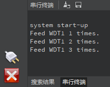
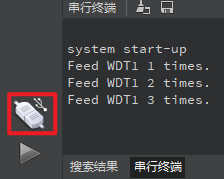

# 定时器实验

## 前言

本章将介绍machine模块中的Timer类，即定时器类。通过本章的学习，读者将学习到machine模块中Timer类的使用。

## Timer模块介绍

### 概述

K230D内部包含6个Timer硬件模块，最小定时周期为1us。

### API描述

Timer类位于machine模块下

#### 构造函数

```python
timer = Timer(index, mode=Timer.PERIODIC, freq=-1, period=-1, callback=None, arg=None)
```

【参数】

- index：Timer号，取值：[-1,5]，-1代表软件定时器
- mode：运行模式，单次或周期，可选参数
- freq：Timer运行频率，支持浮点，单位Hz，可选参数，优先级高于`period`
- period：Timer运行周期，单位ms，可选参数
- callback：超时回调函数，必须设置，要带一个参数
- arg：超时回调函数参数，可选参数

**注意：** [0-5]硬件Timer暂不可用

#### init

```python
Timer.init(mode=Timer.PERIODIC, freq=-1, period=-1, callback=None, arg=None)
```

初始化定时器参数

【参数】

- mode：运行模式，单次或周期，可选参数
- freq：Timer运行频率，支持浮点，单位Hz，可选参数，优先级高于`period`
- period：Timer运行周期，单位ms，可选参数
- callback：超时回调函数，必须设置，要带一个参数
- arg：超时回调函数参数，可选参数

【返回值】

无

#### deinit

```python
Timer.deinit()
```

释放Timer资源

【参数】

无

【返回值】

无

更多用法请阅读官方API手册：

https://developer.canaan-creative.com/k230_canmv/dev/zh/api/canmv_spec.html

## 硬件设计

### 例程功能

1. 创建一个超时周期为1000毫秒的周期定时器，并再其超时回调函数中控制红色LED切换亮灭状态
2. 按下KEY0按键后释放Timer资源，红色LED不再切换亮灭状态

### 硬件资源

1. 双色LED

   ​	LEDR - IO59

2. 独立按键

   ​	KEY0按键 - IO2

### 原理图

本章实验内容，主要讲解Timer模块的使用，无需关注原理图。

##  实验代码

``` python
from machine import Pin
from machine import FPIOA
from machine import Timer
import time

# 实例化FPIOA
fpioa = FPIOA()

# 为IO分配相应的硬件功能
fpioa.set_function(2, FPIOA.GPIO2)
fpioa.set_function(59, FPIOA.GPIO59)

# 构造GPIO对象
key0 = Pin(2, Pin.IN, pull=Pin.PULL_UP, drive=7)
ledr = Pin(59, Pin.OUT, pull=Pin.PULL_NONE, drive=7)

count = 0

# Timer超时回调函数
def timer_timeout_cb(timer):
    global count
    count = count + 1
    ledr.value(count % 2)

# 实例化一个软定时器
tim = Timer(-1)
tim.init(period=1000, mode=Timer.PERIODIC, callback = timer_timeout_cb)

while True:
    if key0.value() == 0:
        time.sleep_ms(20)
        if key0.value() == 0:
            # 释放Timer资源
            tim.deinit()
            while key0.value() == 0:
                pass
    time.sleep_ms(10)
```

可以看到，首先是初始化使用到独立按键和LED的IO，然后定义了一个函数作为Timer的超时回调函数，函数主要实现了变更红色LED状态的功能。

接着便构造了一个Timer对象，Timer对象使用的是软件定时器，并初始化为每间隔1000毫秒超时一次的周期定时器。

最后就是在一个循环中读取按键的状态，当读取到KEY0按键被按下，释放Timer资源，此时红色LED灯不再闪烁。

## 运行验证

将DNK230D开发板连接CanMV IDE，并点击CanMV IDE上的“开始(运行脚本)”按钮后，此时，若连续在3秒间隔内按下板载的KEY0按键进行喂狗操作，则能看到“串行终端”窗口打印输出WDT1被喂狗的次数提示，如下图所示：



若喂狗次数达到5次，则脚本程序运行完毕。

但若没有在3秒内按下板载的KEY0按键进行喂狗操作，则WDT1将对Kendryte K230D进行系统复位，此时通过CanMV IDE软件能观察到，原本处于“已连接”状态的Kendryte K230D设备变为了“未连接”状态，如下图所示：



