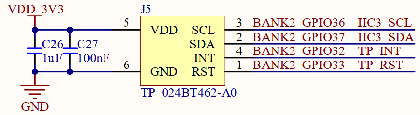

# 触摸屏实验

## 前言

本章将介绍CanMV下触控功能的使用，能通过LCD上的触摸屏获取手指触控的位置，然后把对应的点绘制到LCD屏幕上。通过本章的学习，读者将掌握如何在CanMV下使用触摸驱动模块实现手写画板的功能。

# TOUCH模块介绍

### 概述

触摸模块基于RTT的触摸框架，支持单点和多点电容触摸屏及电阻触摸屏。

### API描述

TOUCH类位于machine模块下

#### 构造函数

【描述】

构建TOUCH对象

```python
touch = TOUCH(index, rotation)
```

【参数】

- index：TOUCH设备号，取值范围为 [0, 9]，实际值取决于存在的触摸设备数量。
- rotation：面板输出坐标与屏幕坐标的旋转，取值范围为 [0-3]，

【返回值】

TOUCH对象

### read

```python
TOUCH.read([count])
```

获取触摸数据。

【参数】

count：最多读取的触摸点数量，取值范围为[0:10]，K230D BOX最高支持5点触控

【返回值】

返回触摸点数据，类型为元组`([tp[, tp...]])`，其中每个`tp`是一个`touch_info`类实例。

### deinit

释放TOUCH资源。

```python
TOUCH.deinit()
```

【参数】

无

【返回值】

无

更多用法请阅读官方API手册：

https://developer.canaan-creative.com/k230_canmv/dev/zh/api/canmv_spec.html

## 硬件设计

### 例程功能

1. 初始化LCD模块和触控模块，系统能够实时获取手指触摸触控板的位置，同时绘制对应的点到屏幕上，实现一个画板的功能。

### 硬件资源

1. LCD - MIPI DSI

2. 触摸模块

   SCL - IO36

   SDA - IO37

   INT - IO32

   EST - IO33

### 原理图

正点原子K230D BOX开发板上的触摸模块接口的连接原理图，如下图所示：  



## 实验代码

``` python
import time, os, urandom, sys
from media.display import *
from media.media import *
from machine import TOUCH

# 实例化TOUCH设备0
tp = TOUCH(0)

def load_draw_dialog():
    img.clear()
    img.draw_string_advanced(640 - 52, 0, 30, "RST", color = (255, 0, 0))


"""
 * @brief       画粗线
 * @param       x1,y1: 起点坐标
 * @param       x2,y2: 终点坐标
 * @param       size : 线条粗细程度
 * @param       color: 线的颜色
 * @retval      无
"""
def lcd_draw_bline(x1,y1,x2,y2,size,color):

    t = 0
    xerr = 0
    yerr = 0
    delta_x = 0
    delta_y = 0
    distance = 0
    incx = 0
    incy = 0
    row = 0
    col = 0

    delta_x = x2 - x1                       # 计算坐标增量
    delta_y = y2 - y1
    row = x1
    col = y1

    if delta_x > 0:
        incx = 1                            # 置单步方向
    elif delta_x == 0:
        incx = 0                            #垂直线
    else:
        incx = -1
        delta_x = -delta_x

    if delta_y > 0:
        incy = 1
    elif delta_y == 0:
        incy = 0                            # 水平线
    else:
        incy = -1
        delta_y = -delta_y

    if delta_x > delta_y:
        distance = delta_x;                 # 选取基本增量坐标轴
    else:
        distance = delta_y

    for t in range(0,distance + 1):         # 画线输出
        img.draw_circle(row, col, size, color)   # 画点
        xerr += delta_x
        yerr += delta_y

        if xerr > distance:
            xerr -= distance
            row += incx

        if yerr > distance:
            yerr -= distance
            col += incy

if __name__ == "__main__":
    os.exitpoint(os.EXITPOINT_ENABLE)
    img = image.Image(640, 480, image.RGB888)
    Display.init(Display.ST7701, width=640, height=480, to_ide=True)
    MediaManager.init()

    lastpos = [[0, 0], [0, 0], [0, 0], [0, 0], [0, 0]]    #最后一次的数据
    # 清空屏幕并在右上角显示"RST"
    load_draw_dialog()
    Display.show_image(img, 640, 480)
    try:
        while True:
            # 获取TOUCH数据
            p = tp.read(5)

            if p == ():  # 发生触摸事件
                lastpos = [[0, 0], [0, 0], [0, 0], [0, 0], [0, 0]]  # 重新清空所有点

            for i in range(len(p)): # 打印每个点坐标信息，最大5点。
                if (p[i].x < 640 and p[i].y < 480):

                    if lastpos[i][0] == 0x0 and lastpos[i][1] == 0x0:

                        lastpos[i][0] = p[i].x
                        lastpos[i][1] = p[i].y

                    lcd_draw_bline(lastpos[i][0], lastpos[i][1], p[i].x, p[i].y, 2, color=(255, 0, 0));
                    lastpos[i][0] = p[i].x
                    lastpos[i][1] = p[i].y

                    if (p[i].x > (640 - 50) and p[i].y < 30):

                        load_draw_dialog()
                        lastpos[i][0] = 0
                        lastpos[i][1] = 0
                else:
                    lastpos[i][0] = 0x0
                    lastpos[i][1] = 0x0

            # 刷新到显示器上
            Display.show_image(img)
            time.sleep_ms(5)
            os.exitpoint()

    except KeyboardInterrupt as e:
        print("user stop: ", e)
    except BaseException as e:
        print(f"Exception {e}")

    # deinit display
    Display.deinit()
    os.exitpoint(os.EXITPOINT_ENABLE_SLEEP)
    time.sleep_ms(100)
    # release media buffer
    MediaManager.deinit()
```

可以看到，首先导入相关的模块，然后初始化LCD显示模块和触摸模块，接着创建一个image对象，图像格式为RGB888，通过调用load_draw_dialog()函数实现清屏并在图像的右上角绘制“RST”字样，然后显示到LCD显示器上。

最后在一个循环中不断读取触控点的坐标，并在该坐标上绘制一个点到图像上，该触控模块最高支持5点触控，最后显示到LCD显示器上，我们通过点击屏幕右上方的RST区域，程序能够实现清屏的功能，从而实现一个简单的手写画板的功能。

## 运行验证

将K230D BOX开发板连接CanMV IDE，并点击CanMV IDE上的“开始(运行脚本)”按钮后，可以看到LCD上看到右上角显示“RST”的字样，我们可以通过触控屏幕进行图像的绘制，如下图所示：


