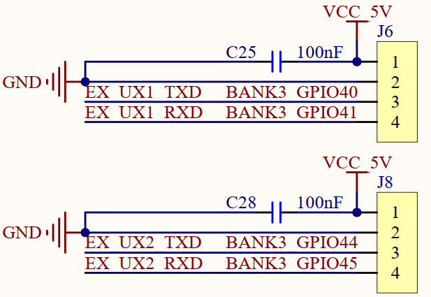
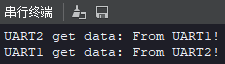

# UART实验

## 前言

本章将介绍machine模块中的UART类。通过本章的学习，读者将学习到machine模块中UART类的使用。

## UART模块介绍

### 概述

K230D内部包含五个UART硬件模块，其中UART0被小核sh占用，UART3被大核sh占用，剩余UART1，UART2，UART4可供用户使用。 UART IO配置参考IOMUX模块。。

### API描述

UART类位于machine模块下

#### 构造函数

```
uart = UART(id, baudrate=115200, bits=UART.EIGHTBITS, parity=UART.PARITY_NONE, stop=UART.STOPBITS_ONE)
```

【参数】

- id: UART号，有效值 UART1、UART2、UART4
- baudrate: UART波特率，可选参数，默认115200
- bits: 每个字符的位数，有效值 FIVEBITS、SIXBITS、SEVENBITS、EIGHTBITS，可选参数，默认EIGHTBITS
- parity: 奇偶校验，有效值 PARITY_NONE、PARITY_ODD、PARITY_EVEN，可选参数，默认PARITY_NONE
- stop: 停止位的数目，有效值 STOPBITS_ONE、STOPBITS_TWO，可选参数，默认STOPBITS_ONE

### read

```
UART.read([nbytes])
```

读取字符。若指定nbytes，则最多读取该数量的字节。否则可读取尽可能多的数据。

【参数】

- nbytes: 最多读取nbytes字节，可选参数

【返回值】

一个包括读入字节的字节对象

### write

```
UART.write(buf)
```

将字节缓冲区写入UART。

【参数】

- buf: 一个buffer对象

【返回值】

写入的字节数

更多用法请阅读官方API手册：

https://developer.canaan-creative.com/k230_canmv/dev/zh/api/canmv_spec.html

## 硬件设计

### 例程功能

1. 创建两个UART对象，两个UART对象除了UART编号使用相同的配置参数。
2. 当KEY0按键被按下后，使用UART1往UART2发送数据，并将UART2接收到的数据通过print()打印输出。
3. 当KEY1按键被按下后，使用UATY2往UART1发送数据，并将UART1接收到的数据通过printf()打印输出。

### 硬件资源

1. 独立按键

   ​	KEY0按键 - IO2

2. 扩展串口接口1

   ​	UART1_TXD - IO40

   ​	UART1_RXD - IO41

3. 扩展串口接口2

   ​	UART2_TXD - IO44

​    	   UART2_RXD - IO45

### 原理图

本章实验内容，需要使用到DNK230D板载的扩展串口接口1和扩展串口接口2，正点原子DNK230D开发板上的扩展串口接口连接原理图，如下图所示：



由于需要让这两个串口扩展接口相互通信，因此需要使用杜邦线或其他线材从物理上连接这这两个接口，连接时需要注意串口线路的连接需要将TXD信号和RXD信号交叉连接。

##  实验代码

``` python
from machine import Pin
from machine import UART
from machine import FPIOA
import time

# 实例化FPIOA
fpioa = FPIOA()

# 为IO分配相应的硬件功能
fpioa.set_function(2, FPIOA.GPIO2)
fpioa.set_function(5, FPIOA.GPIO5)
fpioa.set_function(40,FPIOA.UART1_TXD)
fpioa.set_function(41,FPIOA.UART1_RXD)
fpioa.set_function(44,FPIOA.UART2_TXD)
fpioa.set_function(45,FPIOA.UART2_RXD)

# 构造UART对象
key0 = Pin(2, Pin.IN, pull=Pin.PULL_UP, drive=7)
key1 = Pin(5, Pin.IN, pull=Pin.PULL_UP, drive=7)
uart1 = UART(UART.UART1, baudrate=115200, bits=UART.EIGHTBITS, parity=UART.PARITY_NONE, stop=UART.STOPBITS_ONE)
uart2 = UART(UART.UART2, baudrate=115200, bits=UART.EIGHTBITS, parity=UART.PARITY_NONE, stop=UART.STOPBITS_ONE)

while True:
    if key0.value() == 0:
        time.sleep_ms(20)
        if key0.value() == 0:
            # UART发送数据
            uart1.write("From UART1!")
            while key0.value() == 0:
                pass
    elif key1.value() == 0:
        time.sleep_ms(20)
        if key1.value() == 0:
            # UART发送数据
            uart2.write("From UART2!")
            while key1.value() == 0:
                pass

    # UART接收数据
    data = uart1.read(128)
    if data != b'':
        print("UART1 get data:", data.decode())

    # UART接收数据
    data = uart2.read(128)
    if data != b'':
        print("UART2 get data:", data.decode())
```

可以看到首先就是构造了两个UART对象，并且配置了相同的通信波特率。

接着便在一个循环中读取按键状态和两个UART的数据接收状态，如果KEY0按键被按下，则通过UART1对象发送“From UART1！”的数据，如果KEY1按键被按下，则通过UART2对象发送“From UART2！”的数据，如果UART1对象或UART2对象接收到数据，并将接收到的数据加上UART对象编号后通过print()打印输出。

由于本章实验要求板载的两个扩展串口接口通过线材进行连接，因此当KEY0按键被按下后，UART1对象发出的数据将被UART2对象接收，并会被通过print()打印输出，当KEY1按键被按下后，UART2对象发出的数据将被UART1对象接收，并会通过print()打印输出。

## 运行验证

将DNK230D开发板连接CanMV IDE，并点击CanMV IDE上的“开始(运行脚本)”按钮后，同时将板载的两个扩展串口接口通过线材按照要求进行相互连接。

此时，若分别按下KEY0按键和KEY1按键，CanMV IDE软件的“串行中断”将依次输出UART2对象和UART1对象接收到的数据，如下图所示：	



可以看到，首先UART2对象接收到了来自UART1对象发送的数据，然后UART1对象接收到了来自UART2发送的数据，这与理论推断的结果一致。

