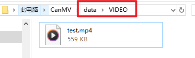
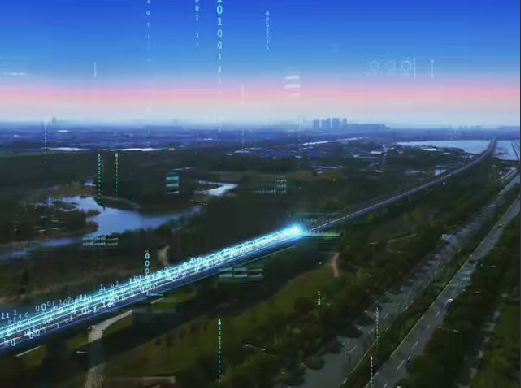

# 视频播放器实验

## 前言

本章将介绍CanMV下视频播放功能的使用，实现播放分辨率小于640 * 480的MP4视频。通过本章的学习，读者将掌握如何在CanMV下使用视频播放器模块实现MP4视频播放的方法。

# 播放器模块介绍

### 概述

详细介绍K230_CanMV播放器模块API，旨在支持MP4格式文件的播放。该模块能够同时播放音频与视频，音频格式支持G.711A/U，视频格式支持H.264/H.265编码。

### API描述

该模块提供了`Player`类，包含以下方法：

#### 构造函数

【描述】

根据指定的`display_type`构造`Player`对象。用户需先创建`Player`对象以进行后续操作。

```python
player = Player(Display.VIRT, [display_to_ide])touch = TOUCH(index, rotation)
```

【参数】

- display_type：显示设备类型
- display_to_ide：是否同时输出到IDE虚拟屏

【返回值】

Player对象

### Player.load

【描述】

加载指定文件，目前版本仅支持MP4格式文件。

```python
player = Player()
player.load("test.mp4")
```

【参数】

filename： 文件名称

【返回值】

0：成功  

非0：失败

**注意：**当前版本仅支持播放MP4格式文件。

### Player.start

开始播放音视频内容。

```python
player = Player()
player.start()
```

【参数】

无

【返回值】

0：成功  

非0：失败

### Player.pause

暂停当前播放。

```python
player = Player()
player.pause()
```

【参数】

无

【返回值】

0：成功  

非0：失败

### Player.resume

恢复播放。

```python
player = Player()
player.resume()
```

【参数】

无

【返回值】

0：成功  

非0：失败

### Player.stop

停止播放。

```python
player = Player()
player.stop()
```

【参数】

无

【返回值】

0：成功  

非0：失败

### Player.set_event_callback

设置播放事件的回调函数。

```python
def player_event(event, data):
    pass

player = Player()
player.set_event_callback(callback=player_event)
```

【参数】

callback：回调函数名称

【返回值】

0：成功  

非0：失败

更多用法请阅读官方API手册：

[链接](https://www.kendryte.com/k230_canmv/zh/main/zh/api/mpp/K230_CanMV_%E6%92%AD%E6%94%BE%E5%99%A8%E6%A8%A1%E5%9D%97API%E6%89%8B%E5%86%8C.html)

## 硬件设计

### 例程功能

1. 初始化视频播放器模块，播放`/data/VIDEO/test.mp4`路径的MP4视频，我们可以通过按键KEY0暂停视频的播放，KEY1恢复视频播放。

### 硬件资源

1. LCD - MIPI DSI

2. 独立按键

​     KEY0按键 - IO34

​     KEY1按键 - IO35

### 原理图

1. 本章实验内容主要讲解K230D的视频播放器模块的使用，无需关注原理图。

## 实验代码

``` python
from machine import Pin
from machine import FPIOA
from media.display import * #导入display模块，使用display相关接口
from media.media import *   #导入media模块，使用meida相关接口
from media.player import *
import os

# 实例化FPIOA
fpioa = FPIOA()

# 为IO分配相应的硬件功能
fpioa.set_function(34, FPIOA.GPIO34)
fpioa.set_function(35, FPIOA.GPIO35)

# 构造GPIO对象
key0 = Pin(34, Pin.IN, pull=Pin.PULL_UP, drive=7)
key1 = Pin(35, Pin.IN, pull=Pin.PULL_UP, drive=7)

start_play = False
def player_event(event,data):
    global start_play
    if(event == K_PLAYER_EVENT_EOF):
        start_play = False

def play_mp4_test(filename):
    global start_play

    # 使用LCD作为输出显示
    player=Player(Display.ST7701, display_to_ide=True)
    player.load(filename)
    player.set_event_callback(player_event)
    player.start()
    start_play = True

    try:
        while(start_play):
            # 读取按键状态，并做相应的按键解释
            if key0.value() == 0:
                player.pause()
                print("play pause")
            if key1.value() == 0:
                player.resume()
                print("play resume")
            time.sleep(0.1)
            os.exitpoint()
    except KeyboardInterrupt as e:
        print("user stop: ", e)
    except BaseException as e:
        import sys
        sys.print_exception(e)

    player.stop() #停止播放
    print("play over")


if __name__ == "__main__":
    os.exitpoint(os.EXITPOINT_ENABLE)
    play_mp4_test("/data/VIDEO/test.mp4")
```

可以看到，首先导入相关的模块，同时构建KEY0和KEY1对象，用于视频播放控制，然后初始化视频播放器模块，初始化完成后自动播放对应路径的MP4视频，播放过程中可以通过按键KEY0暂停播放，按键KEY1恢复视频播放。

## 运行验证

将K230D BOX开发板连接到电脑，先将该实验文件夹下的test.mp4文件拷贝到CanMV U盘的`/data/VIDEO/test.mp4`路径下，如下图所示：



拷贝完成后打开CanMV IDE，并点击CanMV IDE上的“开始(运行脚本)”按钮后，可以看到LCD上显示视频播放内容，如下图所示：



