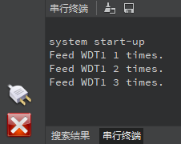
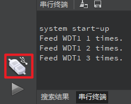

# 看门狗实验

## 前言

本章将介绍machine模块中的WDT类，即看门狗类。通过本章的学习，读者将学习到machine模块中WDT类的使用。  

## WDT模块介绍

### 概述

K230D内部包含两个WDT硬件模块，用于在应用程序崩溃且最终进入不可恢复状态时重启系统。一旦开始，当硬件运行期间没有定期进行喂狗（feed）就会在超时后自动复位。

### API描述

WDT类位于machine模块下

#### 构造函数

```python
wdt = WDT(id=1, timeout=5)
```

【参数】

- id：WDT号，取值：[0,1]，默认1
- timeout：超时值，单位s，默认5

**注意：** WDT0暂不可用

#### feed

```python
WDT.feed()
```

喂狗操作

【参数】

无

【返回值】

无

更多用法请阅读官方API手册：

https://developer.canaan-creative.com/k230_canmv/dev/zh/api/canmv_spec.html

## 硬件设计

### 例程功能

1. 创建一个WDT对象，并配置其超时时间为3秒
2. 按下KEY0按键可对WDT对象进行喂狗操作
3. 若喂狗次数达5次，则停止WDT对象并退出

### 硬件资源

1. 独立按键

   ​	KEY0按键 - IO2

2. 看门狗1

### 原理图

本章实验内容，主要讲解WDT模块的使用，无需关注原理图。

##  实验代码

``` python
from machine import WDT
from machine import Pin
from machine import FPIOA
import time
# 实例化FPIOA
fpioa = FPIOA()

# 为IO分配相应的硬件功能
fpioa.set_function(2, FPIOA.GPIO2)

# 构造GPIO对象
key0 = Pin(2, Pin.IN, pull=Pin.PULL_UP, drive=7)

# 实例化wdt1，timeout为3s
wdt1 = WDT(1,3)

print("system start-up")

feed_times = 0

while feed_times < 5:
    if key0.value() == 0:
        time.sleep_ms(20)
        if key0.value() == 0:
            # 对WDT喂狗
            wdt1.feed()
            feed_times += 1
            print("Feed WDT0 %d times." % (feed_times))
            while key0.value() == 0:
                pass
    time.sleep_ms(10)
```

可以看到，首先是初始化使用的独立按键IO，然后是构造了WDT对象，WDT对象使用的是WDT1，且超时时间为3秒，接着是打印开机系统启动提示，再接着就是根据本实验需要实现的功能，在一个while循环里读取按键状态，并在按键被按下时，对WDT对象进行喂狗操作，当未及时喂狗或者喂狗达到5次后，系统自动复位。

## 运行验证

将DNK230D开发板连接CanMV IDE，并点击CanMV IDE上的“开始(运行脚本)”按钮后，此时，若连续在3秒间隔内按下板载的KEY0按键进行喂狗操作，则能看到“串行终端”窗口打印输出WDT1被喂狗的次数提示，如下图所示：



若喂狗次数达到5次，则脚本程序运行完毕。

但若没有在3秒内按下板载的KEY0按键进行喂狗操作，则WDT1将对Kendryte K230D进行系统复位，此时通过CanMV IDE软件能观察到，原本处于“已连接”状态的Kendryte K230D设备变为了“未连接”状态，如下图所示：



