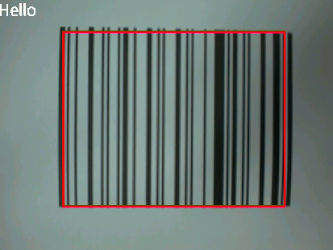

# 条形码识别实验

## 前言

在上个章节中，已经了解了如何在CanMV下使用image模块实现二维码识别的方法，本章将通过条形码识别实验，介绍如何使用CanMV的find_barcodes()方法实现条形码识别功能。在本实验中，我们将摄像头捕获的图像进行处理，查找图像中所有的条形码，并将结果绘制并显示到显示器上。通过本章的学习，读者将学习到如何在CanMV下使用find_barcodes()方法实现条形码识别的功能。

条形码是由宽度不同、反射率不同的条和空，按照一定的编码规则（码制）编制成的，用以表达一组数字或字母符号信息的图形标识符，即条形码是一组粗细不同，按照一定的规则安排间距的平行线条图形．常见的条形码是由反射率相差很大的黑条（简称条）和白条（简称空）组成的。

近年来，随着计算机应用的不断普及，条形码的应用得到了很大的发展，条形码可以标出商品的生产国、制造厂家、商品名称、生产日期、图书分类号、邮件起止地点、类别、日期等信息，因而在商品流通、图书管理、邮电管理、银行系统等许多领域都得到了广泛的应用。

## Image模块介绍

### 概述

`Image`类是机器视觉处理中的基础对象。此类支持从Micropython GC、MMZ、系统堆、VB区域等内存区域创建图像对象。此外，还可以通过引用外部内存直接创建图像（ALLOC_REF）。未使用的图像对象会在垃圾回收时自动释放，也可以手动释放内存。

支持的图像格式如下：

- BINARY
- GRAYSCALE
- RGB565
- BAYER
- YUV422
- JPEG
- PNG
- ARGB8888（新增）
- RGB888（新增）
- RGBP888（新增）
- YUV420（新增）

支持的内存分配区域：

- **ALLOC_MPGC**：Micropython管理的内存
- **ALLOC_HEAP**：系统堆内存
- **ALLOC_MMZ**：多媒体内存
- **ALLOC_VB**：视频缓冲区
- **ALLOC_REF**：使用引用对象的内存，不分配新内存

### API描述

‌Python中的Image模块是一个强大的图像处理工具，它提供了一系列函数和方法，可以用于图像元素绘制、图像滤波、图像特征检测、色块追踪、图像对比和码识别等。由于image模块功能强大，需要介绍的内容也比较多，因此本章仅介绍image模块中find_barcodes()方法的使用。

#### find_barcodes

```python
image.find_barcodes([roi])
```

该函数查找指定ROI内的所有一维条形码，并返回一个包含`image.barcode`对象的列表。有关更多信息，请参考`image.barcode`对象的相关文档。

为了获得最佳效果，建议使用长为640像素、宽为40/80/160像素的窗口。窗口的垂直程度越低，运行速度越快。由于条形码是线性一维图像，因此在一个方向上需具有较高分辨率，而在另一个方向上可具有较低分辨率。请注意，该函数会进行水平和垂直扫描，因此您可以使用宽为40/80/160像素、长为480像素的窗口。请务必调整镜头，使条形码位于焦距最清晰的区域。模糊的条形码无法解码。

该函数支持以下所有一维条形码：

- image.EAN2
- image.EAN5
- image.EAN8
- image.UPCE
- image.ISBN10
- image.UPCA
- image.EAN13
- image.ISBN13
- image.I25
- image.DATABAR (RSS-14)
- image.DATABAR_EXP (RSS-Expanded)
- image.CODABAR
- image.CODE39
- image.PDF417
- image.CODE93
- image.CODE128

【参数】

- roi：是用于指定感兴趣区域的矩形元组(x, y, w, h)。若未指定，ROI默认为整个图像。操作范围仅限于该区域内的像素。

注意：不支持压缩图像和Bayer格式图像。

更多用法请阅读官方API手册：

https://developer.canaan-creative.com/k230_canmv/dev/zh/api/openmv/image.html#image

## 硬件设计

### 例程功能

1. 系统会获取摄像头输出的图像，并使用image模块中的find_barcodes()方法查找图像中所有的条形码。当识别到条形码时，系统会在条形码周围绘制一个矩形框，并在图像的左上角显示条形码的识别结果。最后，处理后的图像将显示在LCD屏幕上。

### 硬件资源

1. 本章实验内容，主要讲解image模块的使用，无需关注硬件资源。  


### 原理图

本章实验内容，主要讲解image模块的使用，无需关注原理图。  

## 实验代码

``` python
import time, math, os, gc
from media.sensor import *  # 导入sensor模块，使用摄像头相关接口
from media.display import * # 导入display模块，使用display相关接口
from media.media import *   # 导入media模块，使用meida相关接口

# 定义条形码类型
def barcode_name(code):
    if(code.type() == image.EAN2):
        return "EAN2"
    if(code.type() == image.EAN5):
        return "EAN5"
    if(code.type() == image.EAN8):
        return "EAN8"
    if(code.type() == image.UPCE):
        return "UPCE"
    if(code.type() == image.ISBN10):
        return "ISBN10"
    if(code.type() == image.UPCA):
        return "UPCA"
    if(code.type() == image.EAN13):
        return "EAN13"
    if(code.type() == image.ISBN13):
        return "ISBN13"
    if(code.type() == image.I25):
        return "I25"
    if(code.type() == image.DATABAR):
        return "DATABAR"
    if(code.type() == image.DATABAR_EXP):
        return "DATABAR_EXP"
    if(code.type() == image.CODABAR):
        return "CODABAR"
    if(code.type() == image.CODE39):
        return "CODE39"
    if(code.type() == image.PDF417):
        return "PDF417"
    if(code.type() == image.CODE93):
        return "CODE93"
    if(code.type() == image.CODE128):
        return "CODE128"

try:
    sensor = Sensor(width=1280, height=960) # 构建摄像头对象
    sensor.reset()    # 复位和初始化摄像头
    sensor.set_framesize(Sensor.VGA)    # 设置帧大小VGA(640x480)，默认通道0
    sensor.set_pixformat(Sensor.RGB565) # 设置输出图像格式，默认通道0

    # 初始化LCD显示器，同时IDE缓冲区输出图像,显示的数据来自于sensor通道0。
    Display.init(Display.ST7701, width=640, height=480, fps=90, to_ide=True)
    MediaManager.init()    # 初始化media资源管理器
    sensor.run()  # 启动sensor
    clock = time.clock() # 构造clock对象

    while True:
        os.exitpoint() # 检测IDE中断
        clock.tick()   # 记录开始时间（ms）
        img = sensor.snapshot() # 从通道0捕获一张图

        #遍历图像中所有条形码
        for code in img.find_barcodes():
            img.draw_rectangle([v for v in code.rect()], color=(255, 0, 0), thickness=4)
            #打印相关信息
            print_args = (barcode_name(code), code.payload(), (180 * code.rotation()) / math.pi, code.quality(), clock.fps())
            print("Barcode %s, Payload \"%s\", rotation %f (degrees), quality %d, FPS %f" % print_args)
            img.draw_string_advanced(0, 0, 30, code.payload(), color = (255, 255, 255)) #图像显示条码信息

        # 显示图片
        Display.show_image(img)
        print(clock.fps()) # 打印FPS

# IDE中断释放资源代码
except KeyboardInterrupt as e:
    print("user stop: ", e)
except BaseException as e:
    print(f"Exception {e}")
finally:
    # sensor stop run
    if isinstance(sensor, Sensor):
        sensor.stop()
    # deinit display
    Display.deinit()
    os.exitpoint(os.EXITPOINT_ENABLE_SLEEP)
    time.sleep_ms(100)
    # release media buffer
    MediaManager.deinit()
```

可以看到一开始是先初始化了LCD和摄像头。接着在一个循环中不断地获取摄像头输出的图像，因为获取到的图像就是Image对象，因此可以直接调用image模块为Image对象提供的各种方法，然后就是对图像中的条形码进行检测和识别，并在LCD左上角绘制识别到的条形码信息，最后在 LCD 显示图像。

## 运行验证

实物原图如下图所示：


将K230D BOX开发板连接CanMV IDE，并点击CanMV IDE上的“开始(运行脚本)”按钮后，可以看到LCD上实时地显示这摄像头采集到的画面，如下图所示：


