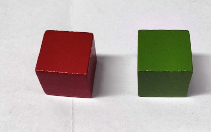
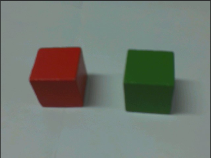
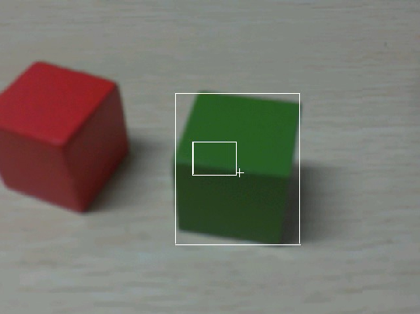
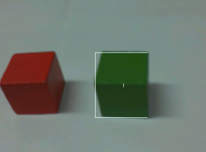

# 色块追踪实验

## 前言

在上一章节中，已经了解了如何在CanMV下使用image模块实现色块计数的方法，本章将通过色块追踪实验，介绍如何使用CanMV的find_blobs()方法实现色块追踪的功能。在本实验中，我们通过按键读取需要追踪的颜色值，然后将摄像头捕获的图像进行处理，查找图像中所有符合目标颜色值的色块，并进行画框标记，然后将结果绘制并显示到显示器上。通过本章的学习，读者将学习到如何在CanMV下使用find_blobs()方法实现色块追踪的功能。

## Image模块介绍

### 概述

`Image`类是机器视觉处理中的基础对象。此类支持从Micropython GC、MMZ、系统堆、VB区域等内存区域创建图像对象。此外，还可以通过引用外部内存直接创建图像（ALLOC_REF）。未使用的图像对象会在垃圾回收时自动释放，也可以手动释放内存。

支持的图像格式如下：

- BINARY
- GRAYSCALE
- RGB565
- BAYER
- YUV422
- JPEG
- PNG
- ARGB8888（新增）
- RGB888（新增）
- RGBP888（新增）
- YUV420（新增）

支持的内存分配区域：

- **ALLOC_MPGC**：Micropython管理的内存
- **ALLOC_HEAP**：系统堆内存
- **ALLOC_MMZ**：多媒体内存
- **ALLOC_VB**：视频缓冲区
- **ALLOC_REF**：使用引用对象的内存，不分配新内存

### API描述

‌Python中的Image模块是一个强大的图像处理工具，它提供了一系列函数和方法，可以用于图像元素绘制、图像滤波、图像特征检测、色块追踪、图像对比和码识别等。由于image模块功能强大，需要介绍的内容也比较多，因此本章仅介绍image模块中色块追踪实验使用到的find_blobs()方法和get_histogram()方法。

有关find_blobs()方法的介绍，请见[单颜色识别实验的find_blobs()方法介绍](single_color.md#api描述)

#### get_histogram

```python
image.get_histogram([thresholds[, invert=False[, roi[, bins[, l_bins[, a_bins[, b_bins]]]]]]])
```

此方法在ROI的所有颜色通道上进行标准化直方图运算，并返回histogram对象。有关histogram对象的详细信息，请参阅相应文档。用户也可以使用`image.get_hist`或`image.histogram`调用此方法。

【参数】

- thresholds：元组列表，定义要追踪的颜色范围。对于灰度图像，每个元组需要包含两个值（最小和最大灰度值）；对于RGB565图像，每个元组需要包含六个值（l_lo，l_hi，a_lo，a_hi，b_lo，b_hi）。
- invert：布尔值，默认为False。若设置为True，则反转阈值操作，像素将在已知颜色范围之外进行匹配。
- roi：感兴趣区域的矩形元组(x, y, w, h)，如果未指定，则为整个图像。
- bins：用于灰度图像的箱数，或用于RGB565图像的各个通道的箱数。

注意：此功能不支持压缩图像和Bayer图像。

#### get_percentile

```python
histogram.get_percentile(percentile)
```

计算直方图通道的累计分布函数（CDF），并返回指定百分位数（0.0-1.0）对应的直方图值。

例如，如果传入0.1，该方法将指示在累加过程中，哪个二进制值使累加器超过0.1。在未出现异常效用干扰自适应色跟踪结果的情况下，此方法对确定颜色分布的最小值（0.1）和最大值（0.9）尤为有效。

更多用法请阅读官方API手册：

https://developer.canaan-creative.com/k230_canmv/dev/zh/api/openmv/image.html

## 硬件设计

### 例程功能

1. 运行程序后，系统获取摄像头输出的图像并显示，此时，系统并不会进行色块追踪（画框标记），当我们按下KEY0后，LCD显示器出现两个矩形框和一个十字标记，其中50 * 50的小矩形框是用于读取追踪的颜色值，另外一个矩形框和十字标记用于追踪色块，系统默认追踪读取LCD显示器中心的色块，我们保持小方框对准我们需要追踪的色块，一段时间后小方框消失，此时我们就可以移动色块，系统就能识别出色块的位置并用矩形框和标记绘制到图像上，最后将图像显示在LCD上。

### 硬件资源

1. 本章实验内容，主要讲解image模块的使用，无需关注硬件资源。


### 原理图

本章实验内容，主要讲解image模块的使用，无需关注原理图。

## 实验代码

``` python
import time, os, sys
from media.sensor import *  # 导入sensor模块，使用摄像头相关接口
from media.display import * # 导入display模块，使用display相关接口
from media.media import *   # 导入media模块，使用meida相关接口
from machine import Pin
from machine import FPIOA

# 实例化FPIOA
fpioa = FPIOA()

# 为IO分配相应的硬件功能
fpioa.set_function(34, FPIOA.GPIO34)

# 构造GPIO对象
key0 = Pin(34, Pin.IN, pull=Pin.PULL_UP, drive=7)

try:
    sensor = Sensor(width=1280, height=960) # 构建摄像头对象
    sensor.reset() # 复位和初始化摄像头
    sensor.set_framesize(Sensor.VGA)    # 设置帧大小VGA(640x480)，默认通道0
    sensor.set_pixformat(Sensor.RGB565) # 设置输出图像格式，默认通道0

    # 初始化LCD显示器，同时IDE缓冲区输出图像,显示的数据来自于sensor通道0。
    Display.init(Display.ST7701, width=640, height=480, fps=90, to_ide=True)
    MediaManager.init() # 初始化media资源管理器
    sensor.run() # 启动sensor
    clock = time.clock() # 构造clock对象

    frame_count = 0
    threshold_flag = 0  # 捕获颜色LAB值的标记
    threshold = [50, 50, 0, 0, 0, 0] # 中间的 L, A, B 值.
    # 捕捉图像中心的颜色阈值。
    r = [(640//2) - (50//2), (480//2) - (50//2), 50, 50] # 50x50 center of QVGA.

    while True:
        os.exitpoint() # 检测IDE中断
        clock.tick()  # 记录开始时间（ms）
        img = sensor.snapshot() # 从通道0捕获一张图

        if key0.value() == 0:
            frame_count = 0
            threshold_flag = 1
        if frame_count < 60 & threshold_flag == 1:
            if frame_count == 0:
                print("Letting auto algorithms run. Don't put anything in front of the camera!")
                print("Auto algorithms done. Hold the object you want to track in front of the camera in the box.")
                print("MAKE SURE THE COLOR OF THE OBJECT YOU WANT TO TRACK IS FULLY ENCLOSED BY THE BOX!")
            img.draw_rectangle([v for v in r])
            frame_count = frame_count + 1
        elif (frame_count < 120) & threshold_flag == 1:
            if frame_count == 60:
                print("Learning thresholds...")
            elif frame_count == 119:
                print("Thresholds learned...")
                print("Tracking colors...")
                threshold_flag = 0 # 解除标记
            hist = img.get_histogram(roi=r)
            lo = hist.get_percentile(0.01) # Get the CDF of the histogram at the 1% range (ADJUST AS NECESSARY)!
            hi = hist.get_percentile(0.99) # Get the CDF of the histogram at the 99% range (ADJUST AS NECESSARY)!
            # 取平均值
            threshold[0] = (threshold[0] + lo.l_value()) // 2
            threshold[1] = (threshold[1] + hi.l_value()) // 2
            threshold[2] = (threshold[2] + lo.a_value()) // 2
            threshold[3] = (threshold[3] + hi.a_value()) // 2
            threshold[4] = (threshold[4] + lo.b_value()) // 2
            threshold[5] = (threshold[5] + hi.b_value()) // 2
            for blob in img.find_blobs([threshold], pixels_threshold=100, area_threshold=100, merge=True, margin=10):
                img.draw_rectangle([v for v in blob.rect()])
                img.draw_cross(blob.cx(), blob.cy())
                img.draw_rectangle([v for v in r])
            frame_count = frame_count + 1
            del hist
        else:
            for blob in img.find_blobs([threshold], pixels_threshold=100, area_threshold=100, merge=True, margin=10):
                img.draw_rectangle([v for v in blob.rect()])
                img.draw_cross(blob.cx(), blob.cy())
        # 显示图片
        Display.show_image(img)
        print(clock.fps()) # 打印FPS

# IDE中断释放资源代码
except KeyboardInterrupt as e:
    print("user stop: ", e)
except BaseException as e:
    print(f"Exception {e}")
finally:
    # sensor stop run
    if isinstance(sensor, Sensor):
        sensor.stop()
    # deinit display
    Display.deinit()
    os.exitpoint(os.EXITPOINT_ENABLE_SLEEP)
    time.sleep_ms(100)
    # release media buffer
    MediaManager.deinit()
```

可以看到一开始是先初始化了LCD和摄像头。接着在一个循环中不断地获取摄像头输出的图像，因为获取到的图像就是Image对象，因此可以直接调用image模块为Image对象提供的各种方法，当我们按下KEY0后，将读取颜色阈值的标志位置为1，此时系统开始读取要追踪的颜色值，我们使用get_histogram()方法读取屏幕小方框位置内的平均LAB值，需要通过多次读取以提高准确率，读取完成后，系统就能够识别图像中所有符合目标颜色的色块位置，并在这些色块周围绘制矩形框和十字标记进行标识，最后在LCD显示处理好后的图像。

## 运行验证

实验原图如下所示：



将K230D BOX开发板连接CanMV IDE，并点击CanMV IDE上的“开始(运行脚本)”按钮后，可以看到LCD上实时地显示这摄像头采集到的画面，此时系统不会进行色块追踪，如下图所示：



当按下KEY0时，LCD显示器出现两个矩形框和一个十字标记，其中50 * 50的小矩形框是用于读取追踪的颜色值，我们将其对准我们需要追踪的色块并保持不动，如下图所示：



当矩形小方块消失后，此时我们就可以移动色块，系统也能识别到色块的位置并用矩形框和十字标记进行标记，如下图所示：



