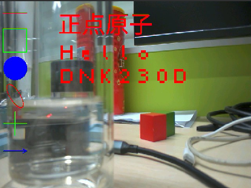

# image元素绘制实验

## 前言

在前面的章节中，我们已经了解了如何在CanMV下使用K230D的基础外设以及开发板的板载资源，从本章开始我们将介绍图像处理相关应用，所使用的功能均移植自openmv，所以功能基本一致。详情请参考 [官方文档](https://docs.openmv.io/library/omv.image.html)。

在前面的章节中我们已经提到了 image 模块的一些基本使用，本章将讲解 image 模块中的元素绘制。通过本章的学习，读者将学习到 image 模块中元素绘制的使用。

## Image模块介绍

### 概述

`Image` 类是机器视觉处理中的基础对象。此类支持从Micropython GC、MMZ、系统堆、VB 区域等内存区域创建图像对象。此外，还可以通过引用外部内存直接创建图像（ALLOC_REF）。未使用的图像对象会在垃圾回收时自动释放，也可以手动释放内存。

支持的图像格式如下：

- BINARY
- GRAYSCALE
- RGB565
- BAYER
- YUV422
- JPEG
- PNG
- ARGB8888（新增）
- RGB888（新增）
- RGBP888（新增）
- YUV420（新增）

支持的内存分配区域：

- **ALLOC_MPGC**：Micropython 管理的内存
- **ALLOC_HEAP**：系统堆内存
- **ALLOC_MMZ**：多媒体内存
- **ALLOC_VB**：视频缓冲区
- **ALLOC_REF**：使用引用对象的内存，不分配新内存

### API描述

‌Python中的Image模块是一个强大的图像处理工具，它提供了一系列函数和方法，可以用于图像元素绘制、图像滤波、图像特征检测、色块追踪、图像对比和码识别等。由于image模块功能强大，需要介绍的内容也比较多，因此本章仅介绍image模块中元素绘制的相关方法。

#### draw_line

```python
image.draw_line(x0, y0, x1, y1[, color[, thickness=1]])
```

在图像上绘制一条从 (x0, y0) 到 (x1, y1) 的直线。参数可以分别传入 x0, y0, x1, y1，也可以将这些值作为元组 (x0, y0, x1, y1)一起传递。

【参数】

- color：表示颜色的RGB888元组，适用于灰度或 RGB565 图像，默认为白色。对于灰度图像，还可以传递像素值（范围 0-255）；对于 RGB565 图像，可以传递字节翻转的 RGB565 值。
- thickness：控制线条的像素宽度，默认为 1。
- 【返回值】

该方法返回图像对象，允许通过链式调用其他方法。

注意：不支持压缩图像和 Bayer 格式图像。

#### draw_rectangle

```python
image.draw_rectangle(x, y, w, h[, color[, thickness=1[, fill=False]]])
```

在图像上绘制一个矩形。可以分别传入参数 x, y, w, h，也可以作为元组 (x, y, w, h) 一起传递。

【参数】

- color：表示颜色的RGB888元组，适用于灰度或 RGB565 图像，默认为白色。对于灰度图像，还可以传递像素值（范围 0-255）；对于 RGB565 图像，可以传递字节翻转的 RGB565 值。
- thickness：控制矩形边框的像素宽度，默认为 1。
- fill：设置为 True 时，将填充矩形内部，默认为 False。

【返回值】

该方法返回图像对象，允许通过链式调用其他方法。

注意：不支持压缩图像和 Bayer 格式图像。

#### draw_circle

```python
image.draw_circle(x, y, radius[, color[, thickness=1[, fill=False]]])
```

在图像上绘制一个圆形。参数可以分别传入 x, y, radius，也可以作为元组 (x, y, radius) 一起传递。

【参数】

- color：表示颜色的RGB888元组，适用于灰度或 RGB565 图像，默认为白色。对于灰度图像，还可以传递像素值（范围 0-255）；对于 RGB565 图像，可以传递字节翻转的 RGB565 值。
- thickness：控制圆形边框的像素宽度，默认为 1。
- fill：设置为 True 时，将填充圆形内部，默认为 False。

【返回值】

该方法返回图像对象，允许通过链式调用其他方法。

注意：不支持压缩图像和 Bayer 格式图像。

#### draw_ellipse

```python
image.draw_ellipse(cx, cy, rx, ry, rotation[, color[, thickness=1[, fill=False]]])
```

在图像上绘制椭圆。参数可以分别传入 cx, cy, rx, ry, rotation，也可以作为元组 (cx, cy, rx, ry, rotation)一起传递。

【参数】

- color：表示颜色的RGB888元组，适用于灰度或 RGB565 图像，默认为白色。对于灰度图像，还可以传递像素值（范围 0-255）；对于 RGB565 图像，可以传递字节翻转的 RGB565 值。
- thickness：控制椭圆边框的像素宽度，默认为 1。
- fill：设置为 True 时，将填充椭圆内部，默认为 False。

【返回值】

该方法返回图像对象，允许通过链式调用其他方法。

注意：不支持压缩图像和 Bayer 格式图像。

#### draw_cross

```python
image.draw_cross(x, y[, color[, size=5[, thickness=1]]])
```

在图像上绘制一个十字标记。参数可以分别传入 x, y，也可以作为元组 (x, y) 一起传递。

【参数】

- color：表示颜色的RGB888元组，适用于灰度或 RGB565 图像，默认为白色。对于灰度图像，还可以传递像素值（范围 0-255）；对于 RGB565 图像，可以传递字节翻转的 RGB565 值。
- size：控制十字标记的大小，默认为 5。
- thickness：控制十字线条的像素宽度，默认为 1。

【返回值】

该方法返回图像对象，允许通过链式调用其他方法。

注意：不支持压缩图像和 Bayer 格式图像。

#### draw_arrow

```python
image.draw_arrow(x0, y0, x1, y1[, color[, thickness=1]])
```

在图像上绘制从 (x0, y0) 到 (x1, y1)的箭头。参数可以分别传入 x0, y0, x1, y1，也可以作为元组 (x0, y0, x1, y1)一起传递。

【参数】

- color：表示颜色的RGB888元组，适用于灰度或 RGB565 图像，默认为白色。对于灰度图像，还可以传递像素值（范围 0-255）；对于 RGB565 图像，可以传递字节翻转的 RGB565 值。
- thickness：控制箭头线条的像素宽度，默认为 1。

【返回值】

该方法返回图像对象，允许通过链式调用其他方法。

注意：不支持压缩图像和 Bayer 格式图像。

#### draw_string

```python
image.draw_string(x, y, text[, color[, scale=1[, x_spacing=0[, y_spacing=0[, mono_space=True]]]]])
```

从图像的 (x, y) 位置开始绘制8x10大小的文本。参数可以分别传入x, y，也可以作为元组 (x, y) 一起传递。

【参数】

- text：要绘制的字符串，换行符 \n、\r 或 \r\n用于将光标移动到下一行。
- color：表示颜色的RGB888元组，适用于灰度或 RGB565 图像，默认为白色。对于灰度图像，还可以传递像素值（范围 0-255）；对于 RGB565 图像，可以传递字节翻转的 RGB565 值。
- scale：控制文本的缩放比例，默认为 1。只能为整数。
- x_spacing：调整字符之间的水平间距。正值表示增加间距，负值表示减少。
- y_spacing：调整行之间的垂直间距。正值表示增加间距，负值表示减少。
- mono_space：默认为True，使字符具有固定宽度。设置为False 时，字符间距将根据字符宽度动态调整。

【返回值】

该方法返回图像对象，允许通过链式调用其他方法。

注意：不支持压缩图像和 Bayer 格式图像。

#### draw_string_advanced

```python
image.draw_string_advanced(x, y, char_size, str, [color, font])
```

增强版 `draw_string`，支持中文显示，并允许用户通过font参数自定义字体。

【参数】

与 `draw_string`基本一致。

【返回值】

该方法返回图像对象，允许通过链式调用其他方法。

注意：不支持压缩图像和 Bayer 格式图像。

更多用法请阅读官方API手册：

https://developer.canaan-creative.com/k230_canmv/dev/zh/api/openmv/image.html#image

## 硬件设计

### 例程功能

1. 获取摄像头输出的图像，并使用image模块在图像上绘制一些元素，后将图像显示在LCD上。  

### 硬件资源

1. 本章实验内容，主要讲解 image 模块的使用，无需关注硬件资源。  


### 原理图

本章实验内容，主要讲解 image 模块的使用，无需关注原理图。  

## 实验代码

``` python
import time, os, sys
from media.sensor import *  #导入sensor模块，使用摄像头相关接口
from media.display import * #导入display模块，使用display相关接口
from media.media import *   #导入media模块，使用meida相关接口

try:
    sensor = Sensor() #构建摄像头对象
    sensor.reset() #复位和初始化摄像头
    sensor.set_framesize(Sensor.VGA)    #设置帧大小VGA(640x480)，默认通道0
    sensor.set_pixformat(Sensor.RGB565) #设置输出图像格式，默认通道0

    # 初始化LCD显示器，同时IDE缓冲区输出图像,显示的数据来自于sensor通道0。
    Display.init(Display.ST7701, width = 800, height = 480, to_ide = True)
    MediaManager.init() #初始化media资源管理器
    sensor.run() #启动sensor

    while True:
        os.exitpoint() #检测IDE中断
        img = sensor.snapshot() #从通道0捕获一张图

        # 绘制线段
        img.draw_line(10, 30, 70, 30, color=(255, 0, 0), thickness=2)
        # 绘制矩形
        img.draw_rectangle(10, 70, 60, 60, color=(0, 255, 0), thickness=2, fill=False)
        # 绘制圆形
        img.draw_circle(40, 170, 30, color=(0, 0, 255), thickness=2, fill=True)
        # 绘制椭圆形
        img.draw_ellipse(40, 240, 30, 15, 45, color=(255, 0, 0), thickness=2)
        # 绘制十字线
        img.draw_cross(40, 310, color=(0, 255, 0), size=30, thickness=2)
        # 绘制箭头
        img.draw_arrow(10, 380, 70, 380, color=(0, 0, 255), thickness=2)
        # 绘制字符，支持中文
        img.draw_string_advanced(150, 20, 60, "正点原子", color = (255, 0, 0))
        # 绘制字符串
        img.draw_string(150, 100, "Hello\r\nDNK230D", color=(255, 0, 0), scale=6)
        # 显示图片
        Display.show_image(img, x=round((800-sensor.width())/2),y=round((480-sensor.height())/2))

# IDE中断释放资源代码
except KeyboardInterrupt as e:
    print("user stop: ", e)
except BaseException as e:
    print(f"Exception {e}")
finally:
    # sensor stop run
    if isinstance(sensor, Sensor):
        sensor.stop()
    # deinit display
    Display.deinit()
    os.exitpoint(os.EXITPOINT_ENABLE_SLEEP)
    time.sleep_ms(100)
    # release media buffer
    MediaManager.deinit()
```

可以看到一开始是先初始化了LCD和摄像头。接着在一个循环中不断地获取摄像头输出的图像，因为获取到的图像就是Image对象，因此可以直接调用image模块为Image对象提供的各种方法，然后就是在图像时绘制各种元素，最后在LCD显示处理好后的图像。

## 运行验证

将DNK230D开发板连接CanMV IDE，并点击CanMV IDE上的“开始(运行脚本)”按钮后，可以看到LCD上实时地显示这摄像头采集到的画面，如下图所示：


