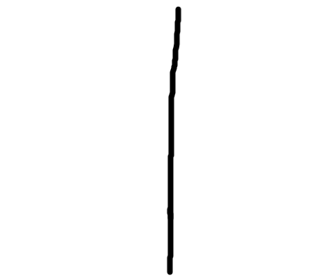
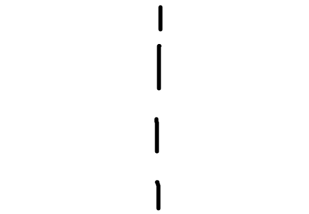
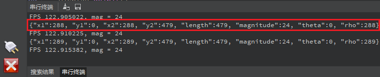
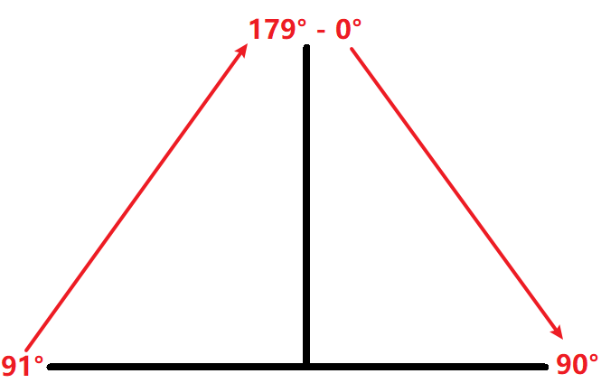

# 快速线性回归实验

## 前言

在上一章节中，已经了解了如何在CanMV下使用image模块实现矩形检测的方法，本章将通过快速线性回归实验，介绍如何使用CanMV的get_regression()方法实现快速线性回归计算的功能。在本实验中，我们将摄像头捕获的图像进行处理，查找图像中所有符合阈值的像素进行线性回归计算，并将结果绘制并显示到显示器上。快速线性回归运算用途广泛，常用于巡线应用中，可以识别黑线或白线，判断实线与虚线的轨迹，并据此给出指示，从而让机器根据这些信息做出相应的响应。通过本章的学习，读者将学习到如何在CanMV下使用get_regression()方法和实现快速线性回归的功能。

## Image模块介绍

### 概述

`Image` 类是机器视觉处理中的基础对象。此类支持从Micropython GC、MMZ、系统堆、VB区域等内存区域创建图像对象。此外，还可以通过引用外部内存直接创建图像（ALLOC_REF）。未使用的图像对象会在垃圾回收时自动释放，也可以手动释放内存。

支持的图像格式如下：

- BINARY
- GRAYSCALE
- RGB565
- BAYER
- YUV422
- JPEG
- PNG
- ARGB8888（新增）
- RGB888（新增）
- RGBP888（新增）
- YUV420（新增）

支持的内存分配区域：

- **ALLOC_MPGC**：Micropython管理的内存
- **ALLOC_HEAP**：系统堆内存
- **ALLOC_MMZ**：多媒体内存
- **ALLOC_VB**：视频缓冲区
- **ALLOC_REF**：使用引用对象的内存，不分配新内存

### API描述

‌Python中的Image模块是一个强大的图像处理工具，它提供了一系列函数和方法，可以用于图像元素绘制、图像滤波、图像特征检测、色块追踪、图像对比和码识别等。由于image模块功能强大，需要介绍的内容也比较多，因此本章仅介绍image模块中get_regression()方法和binary()方法的使用。

#### get_regression

```python
image.get_regression(thresholds[, invert=False[, roi[, x_stride=2[, y_stride=1[, area_threshold=10[, pixels_threshold=10[, robust=False]]]]]]])
```

该方法对图像中所有符合阈值的像素进行线性回归计算。该计算采用最小二乘法，速度较快，但无法处理异常值。若robust设置为True，则将使用泰尔指数计算像素间斜率的中位数。

【参数】

- thresholds：元组列表，定义要追踪的颜色范围。
- invert：布尔值，默认为False。若设置为True，则反转阈值操作。
- roi：为感兴趣区域的矩形元组(x, y, w, h)。若未指定，ROI默认为整个图像。
- x_stride：调用函数时跳过的x像素数。
- y_stride：调用函数时跳过的y像素数。
- area_threshold：若回归后的边界框区域小于该值，则返回None。
- pixels_threshold：若回归后的像素数小于该值，则返回None。

该方法返回一个 `image.line` 对象，详细使用可参见以下博文：[Linear Regression Line Following](https://openmv.io/blogs/news/linear-regression-line-following)。

注意：此功能不支持压缩图像和Bayer图像。

#### binary

```python
image.binary(thresholds[, invert=False[, zero=False[, mask=None]]])
```

根据指定的阈值列表thresholds，将图像中的所有像素转换为黑白二值图像。

【参数】

- thresholds：为一个元组列表，格式为[(lo, hi), ...]。对于灰度图像，每个元组定义一个灰度值范围（最低值和最高值）；对于RGB565图像，每个元组包含六个值，分别表示LAB空间中L、A和B通道的范围。
- invert：如果设为True，则反转阈值操作，将阈值之外的像素转换为白色。
- zero：如果设为True，则将匹配阈值的像素设置为零，而保留其余像素。
- mask：应用于二值化操作的掩码图像。掩码应为二值图像，且尺寸与目标图像相同。

返回图像对象，以便后续方法可以链式调用。

注意：此功能不支持压缩图像和Bayer图像。

更多用法请阅读官方API手册：

https://developer.canaan-creative.com/k230_canmv/dev/zh/api/openmv/image.html

## 硬件设计

### 例程功能

1. 获取摄像头输出的图像，然后先将获取的图像进行二值化处理，这样可以提高处理效果，这里我们使用binary()方法进行二值化处理，完成二值化处理后使用image模块的get_regression()方法对符合阈值的像素进行线性回归计算，最后将结果绘制到图像上并在LCD显示。

### 硬件资源

1. 本章实验内容，主要讲解image模块的使用，无需关注硬件资源。


### 原理图

本章实验内容，主要讲解image模块的使用，无需关注原理图。

## 实验代码

``` python
import time, os, sys

from media.sensor import *  #导入sensor模块，使用摄像头相关接口
from media.display import * #导入display模块，使用display相关接口
from media.media import *   #导入media模块，使用meida相关接口

THRESHOLD = (0, 100)  # 黑白图像的灰度阈值
BINARY_VISIBLE = True # 使用二值化图像你可以看到什么是线性回归。
                      # 这可能降低帧率

try:
    sensor = Sensor(width=640,height=480) #构建摄像头对象
    sensor.reset() #复位和初始化摄像头
    sensor.set_framesize(Sensor.VGA)    #设置帧大小VGA(640x480)，默认通道0
    sensor.set_pixformat(Sensor.GRAYSCALE) #设置输出图像格式，默认通道0

    # 初始化LCD显示器，同时IDE缓冲区输出图像,显示的数据来自于sensor通道0。
    Display.init(Display.ST7701, width = 800, height = 480, fps=90, to_ide = True)
    MediaManager.init() #初始化media资源管理器
    sensor.run() #启动sensor
    clock = time.clock() # 构造clock对象

    while True:
        os.exitpoint() #检测IDE中断
        clock.tick()  #记录开始时间（ms）
        img = sensor.snapshot() #从通道0捕获一张图
        img = img.binary([THRESHOLD]) if BINARY_VISIBLE else img
        # 返回一个类似于find_lines()和find_line_segments()方法返回的对象.
        # 有以下方法：x1(), y1(), x2(), y2(), length(),
        # theta() (rotation in degrees), rho(), 和 magnitude().
        #
        # magnitude() 表示线性回归的效果。范围是(0， INF]
        # 其中，0表示一个圆。INF值越大，表示线性回归效果越好。
        line = img.get_regression([(255,255) if BINARY_VISIBLE else THRESHOLD])
        if (line):
            img.draw_line(line.line(), color = 127, thickness = 5)
            print(line) # 打印结果
        print("FPS %f, mag = %s" % (clock.fps(), str(line.magnitude()) if (line) else "N/A"))
        Display.show_image(img, x=round((800-sensor.width())/2),y=round((480-sensor.height())/2))

# IDE中断释放资源代码
except KeyboardInterrupt as e:
    print("user stop: ", e)
except BaseException as e:
    print(f"Exception {e}")
finally:
    # sensor stop run
    if isinstance(sensor, Sensor):
        sensor.stop()
    # deinit display
    Display.deinit()
    os.exitpoint(os.EXITPOINT_ENABLE_SLEEP)
    time.sleep_ms(100)
    # release media buffer
    MediaManager.deinit()
```

可以看到一开始是先初始化了LCD和摄像头，我们这里设置摄像头输出灰度图像，接着在一个循环中不断地获取摄像头输出的图像，因为获取到的图像就是Image对象，因此可以直接调用image模块为Image对象提供的各种方法，这里先将摄像头输出的图像使用binary()方法进行二值化处理，因为摄像头输出的是灰度图，灰度图像的取值范围是0到255，我们设置颜色阈值为0到100，这样就能通过binary()方法将阈值以内的颜色转换为白色，阈值以外的颜色转换为黑色，然后再通过get_regression()方法进行线性回归计算，并将计算结果绘制出来，最后在LCD显示处理好后的图像。

## 运行验证

### 实现测试

实验原图如下所示：



将DNK230D开发板连接CanMV IDE，并点击CanMV IDE上的“开始(运行脚本)”按钮后，可以看到LCD上实时地显示这摄像头采集到的画面，如下图所示：


### 虚线测试

实验原图如下所示：



将DNK230D开发板连接CanMV IDE，并点击CanMV IDE上的“开始(运行脚本)”按钮后，可以看到LCD上实时地显示这摄像头采集到的画面，如下图所示：


点击左下角“串行终端”，可以看到“串行终端”窗口中输出了一系列信息，如下图所示：



串行终端打印输出`Line`类数据，包含了直线两个顶点的坐标、直线长度、霍夫变换后直线的长度、角度、以及直线的p值，其中最重要的是theta值，它是霍夫变换后直线的角度（范围：0-179度），我们可以通过下图进行理解：



从左往右依次是91°->179°、0°-> 90°变化，大家可以根据自己的应用场景去使用即可，对于巡线机器人，我们应该让它保持在0°方向行走。
