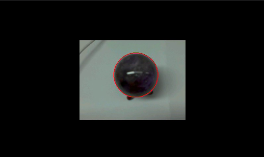

# 圆形检测实验

## 前言

在上一章节中，已经了解了如何在CanMV下使用image模块实现线段检测的方法，本章将通过圆形检测实验，介绍如何使用CanMV的find_circles()方法实现圆形检测功能。在本实验中，我们将摄像头捕获的图像进行处理，查找图像中所有的圆形，并将结果绘制并显示到显示器上。通过本章的学习，读者将学习到如何在CanMV下使用find_circles()方法实现圆形检测的功能。

## Image模块介绍

### 概述

`Image` 类是机器视觉处理中的基础对象。此类支持从Micropython GC、MMZ、系统堆、VB区域等内存区域创建图像对象。此外，还可以通过引用外部内存直接创建图像（ALLOC_REF）。未使用的图像对象会在垃圾回收时自动释放，也可以手动释放内存。

支持的图像格式如下：

- BINARY
- GRAYSCALE
- RGB565
- BAYER
- YUV422
- JPEG
- PNG
- ARGB8888（新增）
- RGB888（新增）
- RGBP888（新增）
- YUV420（新增）

支持的内存分配区域：

- **ALLOC_MPGC**：Micropython管理的内存
- **ALLOC_HEAP**：系统堆内存
- **ALLOC_MMZ**：多媒体内存
- **ALLOC_VB**：视频缓冲区
- **ALLOC_REF**：使用引用对象的内存，不分配新内存

### API描述

‌Python中的Image模块是一个强大的图像处理工具，它提供了一系列函数和方法，可以用于图像元素绘制、图像滤波、图像特征检测、色块追踪、图像对比和码识别等。由于image模块功能强大，需要介绍的内容也比较多，因此本章仅介绍image模块中find_circles()方法的使用。

#### find_circles

```python
image.find_circles([roi[, x_stride=2[, y_stride=1[, threshold=2000[, x_margin=10[, y_margin=10[, r_margin=10]]]]]]])
```

该函数使用霍夫变换在图像中查找圆形，并返回一个image.circle对象的列表。

【参数】

- roi：为感兴趣区域的矩形元组(x, y, w, h)。若未指定，ROI默认为整个图像的矩形。操作仅限于该区域内的像素。
- x_stride：为霍夫变换过程中需要跳过的x像素数量。如果已知圆较大，可增加x_stride。
- y_stride：为霍夫变换过程中需要跳过的y像素数量。如果已知圆较大，可增加y_stride。
- threshold：控制检测到的圆的大小，仅返回大于或等于该阈值的圆。合适的阈值取决于图像内容。请注意，圆的大小（magnitude）是构成圆的所有索贝尔滤波像素大小的总和。
- x_margin：为对x坐标进行合并时允许的最大像素偏差。
- y_margin：为对y坐标进行合并时允许的最大像素偏差。
- r_margin：为对半径进行合并时允许的最大像素偏差。

该方法通过在图像上应用索贝尔滤波器，并利用其幅值和梯度响应执行霍夫变换。无需对图像进行任何预处理，尽管图像的清理和过滤将会产生更为稳定的结果。

注意：此功能不支持压缩图像和Bayer图像。

更多用法请阅读官方API手册：

https://developer.canaan-creative.com/k230_canmv/dev/zh/api/openmv/image.html

## 硬件设计

### 例程功能

1. 获取摄像头输出的图像，并使用image模块的find_circles()方法查找图像上所有的圆形并绘制出来，最后将图像显示在LCD上。

### 硬件资源

1. 本章实验内容，主要讲解image模块的使用，无需关注硬件资源。


### 原理图

本章实验内容，主要讲解image模块的使用，无需关注原理图。

## 实验代码

``` python
import time, os, sys
from media.sensor import *  # 导入sensor模块，使用摄像头相关接口
from media.display import * # 导入display模块，使用display相关接口
from media.media import *   # 导入media模块，使用meida相关接口

try:
    sensor = Sensor(width=1280, height=960) # 构建摄像头对象
    sensor.reset() # 复位和初始化摄像头
    sensor.set_framesize(Sensor.QVGA)    # 设置帧大小QVGA(320x240)，默认通道0
    sensor.set_pixformat(Sensor.RGB565)  # 设置输出图像格式，默认通道0

    # 初始化LCD显示器，同时IDE缓冲区输出图像,显示的数据来自于sensor通道0。
    Display.init(Display.ST7701, width=640, height=480, fps=60, to_ide=True)
    MediaManager.init() # 初始化media资源管理器
    sensor.run() # 启动sensor
    clock = time.clock() # 构造clock对象

    while True:
        os.exitpoint() # 检测IDE中断
        clock.tick()   # 记录开始时间（ms）
        img = sensor.snapshot() # 从通道0捕获一张图
        for c in img.find_circles(threshold=3500, x_margin=10, y_margin=10,
                                  r_margin=10, r_min=6, r_max=120, r_step=2):
            # 画红色圆做指示
            img.draw_circle(c.x(), c.y(), c.r(), color=(255, 0, 0), thickness=2)
            print(c) # 打印圆形的信息
        # 显示图片
        Display.show_image(img, x=round((640 - sensor.width()) / 2), y=round((480 - sensor.height()) / 2))
        print(clock.fps()) # 打印FPS

# IDE中断释放资源代码
except KeyboardInterrupt as e:
    print("user stop: ", e)
except BaseException as e:
    print(f"Exception {e}")
finally:
    # sensor stop run
    if isinstance(sensor, Sensor):
        sensor.stop()
    # deinit display
    Display.deinit()
    os.exitpoint(os.EXITPOINT_ENABLE_SLEEP)
    time.sleep_ms(100)
    # release media buffer
    MediaManager.deinit()
```

可以看到一开始是先初始化了LCD和摄像头。接着在一个循环中不断地获取摄像头输出的图像，因为获取到的图像就是Image对象，因此可以直接调用image模块为Image对象提供的各种方法，然后将图像里所有的圆形绘制出来，最后在LCD显示处理好后的图像。

## 运行验证

将K230D BOX开发板连接CanMV IDE，并点击CanMV IDE上的“开始(运行脚本)”按钮后，可以看到LCD上实时地显示这摄像头采集到的画面，如下图所示：



