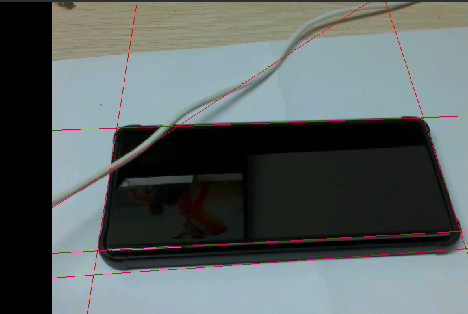

# 直线检测实验

## 前言

在前面的章节中，已经了解了如何在CanMV下使用image模块进行边缘检测的方法，本章将通过直线检测实验，介绍如何通过CanMV的find_lines函数实现直线检测功能，将摄像头捕获的图像进行处理，将图像中所有的直线绘制并显示到显示器上。通过本章的学习，读者将学习到CanMV下使用find_lines函数实现直线检测的功能。

## Image模块介绍

### 概述

`Image` 类是机器视觉处理中的基础对象。此类支持从Micropython GC、MMZ、系统堆、VB区域等内存区域创建图像对象。此外，还可以通过引用外部内存直接创建图像（ALLOC_REF）。未使用的图像对象会在垃圾回收时自动释放，也可以手动释放内存。

支持的图像格式如下：

- BINARY
- GRAYSCALE
- RGB565
- BAYER
- YUV422
- JPEG
- PNG
- ARGB8888（新增）
- RGB888（新增）
- RGBP888（新增）
- YUV420（新增）

支持的内存分配区域：

- **ALLOC_MPGC**：Micropython管理的内存
- **ALLOC_HEAP**：系统堆内存
- **ALLOC_MMZ**：多媒体内存
- **ALLOC_VB**：视频缓冲区
- **ALLOC_REF**：使用引用对象的内存，不分配新内存

### API描述

‌Python中的Image模块是一个强大的图像处理工具，它提供了一系列函数和方法，可以用于图像元素绘制、图像滤波、图像特征检测、色块追踪、图像对比和码识别等。由于image模块功能强大，需要介绍的内容也比较多，因此本章仅介绍image模块中find_lines函数的使用。

#### find_lines

```python
image.find_lines([roi[, x_stride=2[, y_stride=1[, threshold=1000[, theta_margin=25[, rho_margin=25]]]]]])
```

此函数使用霍夫变换查找图像中的所有直线，并返回一个image.line对象的列表。

【参数】

- roi：为感兴趣区域的矩形元组 (x, y, w, h)。若未指定，ROI 默认为整个图像的矩形。操作仅限于该区域内的像素。
- x_stride：为霍夫变换过程中需要跳过的x像素数量。如果已知直线较长，可增加x_stride。
- y_stride：为霍夫变换过程中需要跳过的y像素数量。如果已知直线较长，可增加y_stride。
- threshold：是包含低阈值和高阈值的二元元组。您可以通过调整该值来控制边缘质量，默认设置为 (100, 200)。
- theta_margin：控制检测到的直线的合并，若直线的角度在theta_margin范围内则进行合并。
- rho_margin: 同样控制检测到的直线的合并，若直线的rho值在rho_margin范围内则进行合并。

该方法通过在图像上应用索贝尔滤波器，并利用其幅值和梯度响应执行霍夫变换。无需对图像进行任何预处理，尽管图像的清理和过滤将会产生更为稳定的结果。

注意： 此功能不支持压缩图像和 Bayer 图像。

更多用法请阅读官方API手册：

https://developer.canaan-creative.com/k230_canmv/dev/zh/api/openmv/image.html

## 硬件设计

### 例程功能

1. 获取摄像头输出的图像，并使用image模块的find_lines函数在图像上绘制出图像中所有的直线，最后将图像显示在LCD上。

### 硬件资源

1. 本章实验内容，主要讲解 image 模块的使用，无需关注硬件资源。


### 原理图

本章实验内容，主要讲解 image 模块的使用，无需关注原理图。

## 实验代码

``` python
import time, os, sys

from media.sensor import *  #导入sensor模块，使用摄像头相关接口
from media.display import * #导入display模块，使用display相关接口
from media.media import *   #导入media模块，使用meida相关接口


min_degree = 0
max_degree = 179

try:
    sensor = Sensor(width=640, height=480) #构建摄像头对象
    sensor.reset() #复位和初始化摄像头
    sensor.set_framesize(Sensor.VGA)    #设置帧大小VGA(640x480)，默认通道0
    sensor.set_pixformat(Sensor.RGB565) #设置输出图像格式，默认通道0

    # 初始化LCD显示器，同时IDE缓冲区输出图像,显示的数据来自于sensor通道0。
    Display.init(Display.ST7701, width = 800, height = 480, fps=90, to_ide = True)
    MediaManager.init() #初始化media资源管理器
    sensor.run() #启动sensor
    clock = time.clock() # 构造clock对象

    while True:
        os.exitpoint() #检测IDE中断
        clock.tick()  #记录开始时间（ms）
        img = sensor.snapshot() #从通道0捕获一张图
        for l in img.find_lines(threshold = 1000, theta_margin = 25, rho_margin = 25):
            if (min_degree <= l.theta()) and (l.theta() <= max_degree):
                img.draw_line([v for v in l.line()], color = (255, 0, 0))
                print(l)
        Display.show_image(img, x=round((800-sensor.width())/2),y=round((480-sensor.height())/2))
        print(clock.fps()) #打印FPS

# IDE中断释放资源代码
except KeyboardInterrupt as e:
    print("user stop: ", e)
except BaseException as e:
    print(f"Exception {e}")
finally:
    # sensor stop run
    if isinstance(sensor, Sensor):
        sensor.stop()
    # deinit display
    Display.deinit()
    os.exitpoint(os.EXITPOINT_ENABLE_SLEEP)
    time.sleep_ms(100)
    # release media buffer
    MediaManager.deinit()
```

可以看到一开始是先初始化了LCD和摄像头。接着在一个循环中不断地获取摄像头输出的图像，因为获取到的图像就是Image对象，因此可以直接调用image模块为Image对象提供的各种方法，然后将图像里所有的直线绘制出来，最后在LCD显示处理好后的图像。

## 运行验证

将DNK230D开发板连接CanMV IDE，并点击CanMV IDE上的“开始(运行脚本)”按钮后，可以看到LCD上实时地显示这摄像头采集到的画面，如下图所示：



也可以在CanMV IDE看到摄像头采集的画面，如下图所示：


