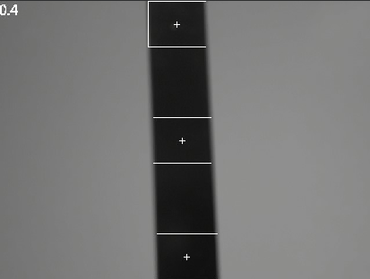
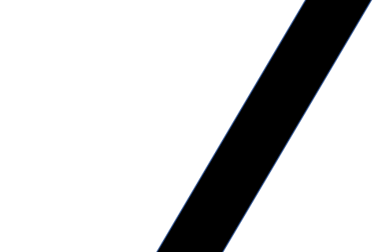
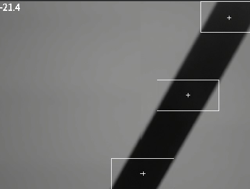
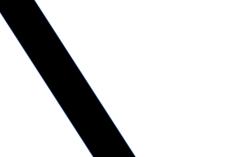
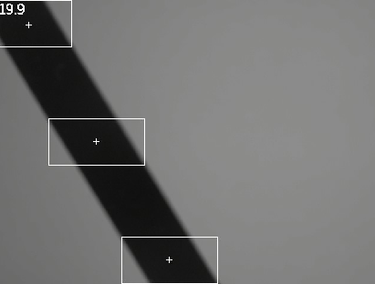
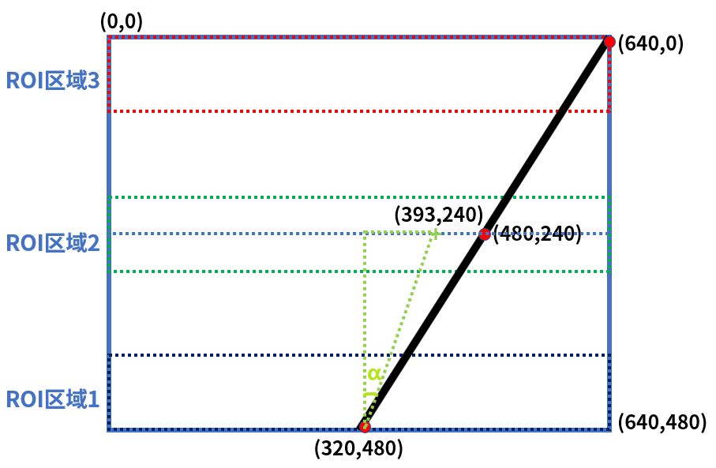

# 黑线循迹实验

## 前言

在上一章节中，已经了解了如何在CanMV下使用image模块实现色块追踪的方法，本章将通过黑线循迹实验，介绍如何使用CanMV的find_blobs()方法实现黑线循迹功能。在本实验中，我们将摄像头捕获的图像进行处理，然后将图像分为三个ROI区域，再分别在每个ROI区域查找图像中所有符合目标的色块，并进行画框和标记，然后通过计算确定直线的中心和偏移的角度，最后将结果绘制并显示到显示器上。通过本章的学习，读者将学习到如何在CanMV下使用find_blobs()方法结合数学运算实现黑线循迹的功能。

## Image模块介绍

### 概述

`Image`类是机器视觉处理中的基础对象。此类支持从Micropython GC、MMZ、系统堆、VB区域等内存区域创建图像对象。此外，还可以通过引用外部内存直接创建图像（ALLOC_REF）。未使用的图像对象会在垃圾回收时自动释放，也可以手动释放内存。

支持的图像格式如下：

- BINARY
- GRAYSCALE
- RGB565
- BAYER
- YUV422
- JPEG
- PNG
- ARGB8888（新增）
- RGB888（新增）
- RGBP888（新增）
- YUV420（新增）

支持的内存分配区域：

- **ALLOC_MPGC**：Micropython管理的内存
- **ALLOC_HEAP**：系统堆内存
- **ALLOC_MMZ**：多媒体内存
- **ALLOC_VB**：视频缓冲区
- **ALLOC_REF**：使用引用对象的内存，不分配新内存

### API描述

‌Python中的Image模块是一个强大的图像处理工具，它提供了一系列函数和方法，可以用于图像元素绘制、图像滤波、图像特征检测、色块追踪、图像对比和码识别等。由于image模块功能强大，需要介绍的内容也比较多，因此本章仅介绍image模块中find_blobs()方法的使用。

有关find_blobs()方法的介绍，请见[单颜色识别实验的find_blobs()方法介绍](single_color.md#api描述)

更多用法请阅读官方API手册：

[链接](https://www.kendryte.com/k230_canmv/zh/main/zh/api/openmv/image.html)

## 硬件设计

### 例程功能

1. 获取摄像头输出的图像，然后将图像分为三个ROI区域，接着使用image模块的find_blobs()方法在每个ROI区域查找目标色块并标记，然后根据三个色块的区域通过数学计算获取直线的中心和偏移的角度，并将结果绘制到图像上，最后将图像显示在LCD上。

### 硬件资源

1. 本章实验内容，主要讲解image模块的使用，无需关注硬件资源。


### 原理图

本章实验内容，主要讲解image模块的使用，无需关注原理图。

## 实验代码

``` python
import time, math, os, gc
from media.sensor import *  # 导入sensor模块，使用摄像头相关接口
from media.display import * # 导入display模块，使用display相关接口
from media.media import *   # 导入media模块，使用meida相关接口

# 跟踪一条黑线。使用[(128,255)]来跟踪白线。
GRAYSCALE_THRESHOLD = [(0, 64)]

# 下面是roi【区域】元组列表。每个roi用(x, y, w, h)表示的矩形。线检测算法将尝试在每个roi中找到最大blob的质心。
# 然后，质心的x位置将使用不同的权重进行平均，其中最大的权重分配给图像底部附近的roi，而较少的权重分配给下一个roi，以此类推。
# 采样图像QQVGA 160*120
#ROIS = [ # [ROI, weight]
#        (0, 100, 160, 20, 0.7), # 可以根据机器人的实际情况调整权重值。
#        (0,  50, 160, 20, 0.3),
#        (0,   0, 160, 20, 0.1)
#       ]

# 采样图像QVGA 320*240
#ROIS = [ # [ROI, weight]
#        (0, 200, 320, 40, 0.7), # 可以根据机器人的实际情况调整权重值。
#        (0,  100, 320, 40, 0.3),
#        (0,   0, 320, 40, 0.1)
#       ]

# 采样图像VGA 640*480
ROIS = [ # [ROI, weight]
        (0, 400, 640, 80, 0.7), # 可以根据机器人的实际情况调整权重值。
        (0, 200, 640, 80, 0.3),
        (0,   0, 640, 80, 0.1)
       ]

# 计算权重值（weight）的和 (结果不一定为1).
weight_sum = 0
for r in ROIS: weight_sum += r[4] # r[4] 是矩形权重值.

try:
    sensor = Sensor(width=1280, height=960) # 构建摄像头对象
    sensor.reset() # 复位和初始化摄像头
    sensor.set_framesize(Sensor.VGA)    # 设置帧大小VGA(640x480)，默认通道0
    sensor.set_pixformat(Sensor.GRAYSCALE) # 设置输出图像格式，默认通道0

    # 初始化LCD显示器，同时IDE缓冲区输出图像,显示的数据来自于sensor通道0。
    Display.init(Display.ST7701, width=640, height=480, fps=90, to_ide=True)
    MediaManager.init() # 初始化media资源管理器
    sensor.run() # 启动sensor
    clock = time.clock() # 构造clock对象

    while True:
        os.exitpoint() # 检测IDE中断
        clock.tick()   # 记录开始时间（ms）
        img = sensor.snapshot() # 从通道0捕获一张图

        centroid_sum = 0
        for r in ROIS:
            # 在灰度图中寻找黑线
            blobs = img.find_blobs(GRAYSCALE_THRESHOLD, roi=r[0:4], merge=True) # r[0:4] 是上面定义的roi元组.

            if blobs:
                # 寻找矩形中最多像素的区域.
                largest_blob = max(blobs, key=lambda b: b.pixels())

                # 对该区域进行标记.
                img.draw_rectangle([v for v in largest_blob.rect()])
                img.draw_cross(largest_blob.cx(), largest_blob.cy())
                centroid_sum += largest_blob.cx() * r[4] # r[4] 是矩形的权重值.

        center_pos = (centroid_sum / weight_sum) # 确定直线的中心。

        # 将直线中心位置转换成角度.
        # 我们用的是非线性运算所以我们离线越远响应就越强.
        deflection_angle = 0

        # 使用反正切函数计算直线中心偏离角度.
        # 角度输出到-45到45左右.（权重X坐标落在图像左半部分记作正偏，落在右边部分记为负偏）

#        deflection_angle = -math.atan((center_pos - 80) / 60) # 采用图像为QQVGA 160*120时候使用
#        deflection_angle = -math.atan((center_pos - 160) / 120) # 采用图像为QVGA 320*240时候使用
        deflection_angle = -math.atan((center_pos - 320) / 240) # 采用图像为VGA 640*480时候使用

        # 将角度x从弧度转换为度数。
        deflection_angle = math.degrees(deflection_angle)

        # 可以将偏离角度发送给机器人进行处理
#        print("Turn Angle: %f" % deflection_angle)

        # LCD显示偏移角度
        img.draw_string_advanced(0, 0, 24, str('%.1f' % deflection_angle), color=(255,255,255), thickness=4)

        # 显示图片
        Display.show_image(img)
        print(clock.fps()) # 打印FPS

# IDE中断释放资源代码
except KeyboardInterrupt as e:
    print("user stop: ", e)
except BaseException as e:
    print(f"Exception {e}")
finally:
    # sensor stop run
    if isinstance(sensor, Sensor):
        sensor.stop()
    # deinit display
    Display.deinit()
    os.exitpoint(os.EXITPOINT_ENABLE_SLEEP)
    time.sleep_ms(100)
    # release media buffer
    MediaManager.deinit()
```

可以看到一开始是先初始化了LCD和摄像头。接着在一个循环中不断地获取摄像头输出的图像，因为获取到的图像就是Image对象，因此可以直接调用image模块为Image对象提供的各种方法，首先我们将图像分为三个ROI区域，然后通过find_blobs()方法查找图像上每个ROI区域符合颜色值区间的色块，并用一个矩形框和十字标记进行标记，接着根据三个ROI区域的色块通过数学方法计算出直线的中心和偏移的角度，并将结果绘制到图像上，最后在LCD显示处理好后的图像。

## 运行验证

### 无偏移测试

实验原图如下所示：


将K230D BOX开发板连接CanMV IDE，并点击CanMV IDE上的“开始(运行脚本)”按钮后，可以看到LCD上实时地显示这摄像头采集到的画面，此时处于无偏移状态，图像左上角显示偏移角度为0.4，接近0°，如下图所示：



### 左偏测试

左偏是指机器人相对于黑线的左侧偏移，左偏时角度显示为负数。

实验原图如下所示：



将K230D BOX开发板连接CanMV IDE，并点击CanMV IDE上的“开始(运行脚本)”按钮后，可以看到LCD上实时地显示这摄像头采集到的画面，如下图所示：



### 右偏测试

右偏时角度显示为正数。

实验原图如下所示：



将K230D BOX开发板连接CanMV IDE，并点击CanMV IDE上的“开始(运行脚本)”按钮后，可以看到LCD上实时地显示这摄像头采集到的画面，如下图所示：



### 原理介绍

本实验要求摄像头采集的图像仅有一条黑色灰度线，程序将图像分为3个ROI区域，3个ROI区域大小相等分为上中下三部分，我们通过计算每个ROI区域部分黑色线的中心点X坐标，然后采用加权平均算法估算出直线的偏离位置。通常情况下越靠近底部的地方离摄像头越近，上方图像距离摄像头较远（远方线段），因此底部的图像权重高。下面是示意图解：



程序的摄像头输出图像分辨率默认是VGA：640（宽）X480（高），左上角坐标为（0,0），黑色直线在图像中的两个顶点和直线的中点坐标均可知，从上往下依次是(640,0)、(480,240)、(320,480)。上中下三个区域的权重分别为0.1、0.3、0.7（底部图像距离摄像头最近，权重最大，权重总和可以不为1），下面我们计算下线的中心点。

上图可知线的中心点的Y轴坐标就是240，X坐标加权平均值计算如下：

X = (320 * 0.7 + 480 * 0.3 + 640 * 0.1) / (0.7 + 0.3 + 0.1) = 393

那么直线偏离坐标可以认为是(393,240)，如图中绿色“+”位置。这样我们就能计算出两个直角边的长度，然后利用反正切函数可以求出偏离角度：α = atan((393-320) / (480 - 240)) = 16.9°(将弧度转换为角度值)，根据图像可知当前设备相当于实线的位置往左偏了，所以需要加一个负号，即 -16.9°，偏离角度就是这样计算出来的。得到偏离角度后就可以传输给设备控制设备的运动了，对于巡线机器人，我们应该让它保持在0°方向行走。

