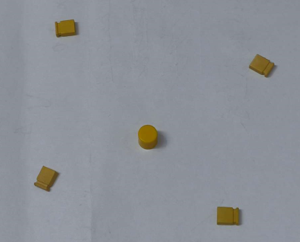
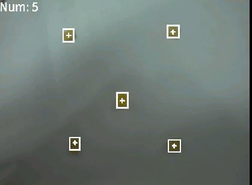

# 黑线循迹实验

## 前言

在上一章节中，已经了解了如何在CanMV下使用image模块实现色块追踪的方法，本章将通过黑线循迹实验，介绍如何使用CanMV的find_blobs()方法实现黑线循迹功能。在本实验中，我们将摄像头捕获的图像进行处理，然后将图像分为三个ROI区域，再分别在每个ROI区域查找图像中所有符合目标的色块，并进行画框和标记，然后通过计算确定偏移的角度直线的中心，最后将结果绘制并显示到显示器上。通过本章的学习，读者将学习到如何在CanMV下使用find_blobs()方法结合数学运算实现黑线循迹的功能。

## Image模块介绍

### 概述

`Image`类是机器视觉处理中的基础对象。此类支持从Micropython GC、MMZ、系统堆、VB区域等内存区域创建图像对象。此外，还可以通过引用外部内存直接创建图像（ALLOC_REF）。未使用的图像对象会在垃圾回收时自动释放，也可以手动释放内存。

支持的图像格式如下：

- BINARY
- GRAYSCALE
- RGB565
- BAYER
- YUV422
- JPEG
- PNG
- ARGB8888（新增）
- RGB888（新增）
- RGBP888（新增）
- YUV420（新增）

支持的内存分配区域：

- **ALLOC_MPGC**：Micropython管理的内存
- **ALLOC_HEAP**：系统堆内存
- **ALLOC_MMZ**：多媒体内存
- **ALLOC_VB**：视频缓冲区
- **ALLOC_REF**：使用引用对象的内存，不分配新内存

### API描述

‌Python中的Image模块是一个强大的图像处理工具，它提供了一系列函数和方法，可以用于图像元素绘制、图像滤波、图像特征检测、色块追踪、图像对比和码识别等。由于image模块功能强大，需要介绍的内容也比较多，因此本章仅介绍image模块中find_blobs()方法以及色块对象的使用。

有关find_blobs()方法的介绍，请见[单颜色识别实验的find_blobs()方法介绍](single_color.md#api描述)

更多用法请阅读官方API手册：

https://developer.canaan-creative.com/k230_canmv/dev/zh/api/openmv/image.html

## 硬件设计

### 例程功能

1. 获取摄像头输出的图像，并使用image模块的find_blobs()方法查找图像上所有的目标色块并标记，然后将色块数量也绘制到图像上，最后将图像显示在LCD上。

### 硬件资源

1. 本章实验内容，主要讲解image模块的使用，无需关注硬件资源。


### 原理图

本章实验内容，主要讲解image模块的使用，无需关注原理图。

## 实验代码

``` python
import time, math, os, gc
from media.sensor import *  # 导入sensor模块，使用摄像头相关接口
from media.display import * # 导入display模块，使用display相关接口
from media.media import *   # 导入media模块，使用meida相关接口

# 跟踪一条黑线。使用[(128,255)]来跟踪白线。
GRAYSCALE_THRESHOLD = [(0, 64)]

# 下面是roi【区域】元组列表。每个roi用(x, y, w, h)表示的矩形。线检测算法将尝试在每个roi中找到最大blob的质心。
# 然后，质心的x位置将使用不同的权重进行平均，其中最大的权重分配给图像底部附近的roi，而较少的权重分配给下一个roi，以此类推。
# 采样图像VGA 640*480
ROIS = [ # [ROI, weight]
        (0, 400, 640, 80, 0.7), # 可以根据机器人的实际情况调整权重值。
        (0, 200, 640, 80, 0.3),
        (0,   0, 640, 80, 0.1)
       ]

# 计算权重值（weight）的和 (结果不一定为1).
weight_sum = 0
for r in ROIS: weight_sum += r[4] # r[4] 是矩形权重值.

try:
    sensor = Sensor(width=640, height=480) # 构建摄像头对象
    sensor.reset() # 复位和初始化摄像头
    sensor.set_framesize(Sensor.VGA)    # 设置帧大小VGA(640x480)，默认通道0
    sensor.set_pixformat(Sensor.GRAYSCALE) # 设置输出图像格式，默认通道0

    # 初始化LCD显示器，同时IDE缓冲区输出图像,显示的数据来自于sensor通道0。
    Display.init(Display.ST7701, width=800, height=480, fps=90, to_ide=True)
    MediaManager.init() # 初始化media资源管理器
    sensor.run() # 启动sensor
    clock = time.clock() # 构造clock对象

    while True:
        os.exitpoint() # 检测IDE中断
        clock.tick()   # 记录开始时间（ms）
        img = sensor.snapshot() # 从通道0捕获一张图

        centroid_sum = 0
        for r in ROIS:
            # 在灰度图中寻找黑线
            blobs = img.find_blobs(GRAYSCALE_THRESHOLD, roi=r[0:4], merge=True) # r[0:4] 是上面定义的roi元组.

            if blobs:
                # 寻找矩形中最多像素的区域.
                largest_blob = max(blobs, key=lambda b: b.pixels())

                # 对该区域进行标记.
                img.draw_rectangle([v for v in largest_blob.rect()])
                img.draw_cross(largest_blob.cx(), largest_blob.cy())
                centroid_sum += largest_blob.cx() * r[4] # r[4] 是矩形的权重值.

        center_pos = (centroid_sum / weight_sum) # 确定直线的中心。

        # 将直线中心位置转换成角度.
        # 我们用的是非线性运算所以我们离线越远响应就越强.
        deflection_angle = 0

        # 使用反正切函数计算直线中心偏离角度.
        # 角度输出到-45到45左右.（权重X坐标落在图像左半部分记作正偏，落在右边部分记为负偏）
        deflection_angle = -math.atan((center_pos - 320) / 240) # 采用图像为VGA 640*480时候使用

        # 将角度x从弧度转换为度数。
        deflection_angle = math.degrees(deflection_angle)

        # 可以将偏离角度发送给机器人进行处理
#        print("Turn Angle: %f" % deflection_angle)

        # LCD显示偏移角度
        img.draw_string_advanced(0, 0, 24, str('%.1f' % deflection_angle), color=(255,255,255), thickness=4)

        # 显示图片
        Display.show_image(img, x=round((800 - sensor.width()) / 2), y=round((480 - sensor.height()) / 2))
        print(clock.fps()) # 打印FPS

# IDE中断释放资源代码
except KeyboardInterrupt as e:
    print("user stop: ", e)
except BaseException as e:
    print(f"Exception {e}")
finally:
    # sensor stop run
    if isinstance(sensor, Sensor):
        sensor.stop()
    # deinit display
    Display.deinit()
    os.exitpoint(os.EXITPOINT_ENABLE_SLEEP)
    time.sleep_ms(100)
    # release media buffer
    MediaManager.deinit()
```

可以看到一开始是先初始化了LCD和摄像头。接着在一个循环中不断地获取摄像头输出的图像，因为获取到的图像就是Image对象，因此可以直接调用image模块为Image对象提供的各种方法，find_blobs()方法每查找到一个符合颜色值的色块就会返回一个色块对象的列表，因此，我们只需要统计色块对象的列表数量，就能获取图像中包含目标色块的数量，然后将图像里所有符合目标的色块画框标记并进行计数，最后在LCD显示处理好后的图像。

## 运行验证

实验原图如下所示：



将DNK230D开发板连接CanMV IDE，并点击CanMV IDE上的“开始(运行脚本)”按钮后，可以看到LCD上实时地显示这摄像头采集到的画面，如下图所示：



也可以在CanMV IDE看到摄像头采集的画面，如下图所示：


