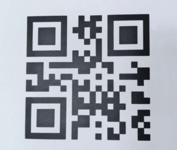
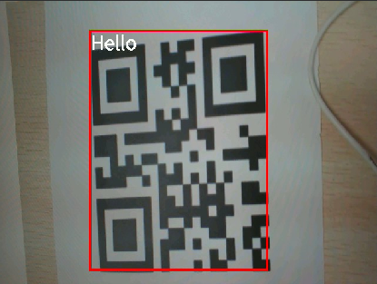

# 二维码识别实验

## 前言

在前面的章节中，已经了解了如何在CanMV下使用image模块实现颜色捕捉的一些应用，下面我们开始介绍码类识别的方法，本章将通过二维码识别实验，介绍如何使用CanMV的find_qrcodes()方法实现二维码识别的功能。在本实验中，我们将摄像头捕获的图像进行处理，查找图像中所有的二维码，并将结果绘制并显示到显示器上。通过本章的学习，读者将学习到如何在CanMV下使用find_qrcodes()方法实现二维码识别的功能。

二维码又称二维条码，常见的二维码为QR Code，QR全称Quick Response（Quick Response，反映出这种二维码具有“超高速识读”的特点。“Quick Response Code”也就是“快速响应码”），是一个近几年来移动设备上超流行的一种编码方式，它比传统的Bar Code条形码能存更多的信息，也能表示更多的数据类型。

二维条码/二维码（2-dimensional bar code）是用某种特定的几何图形按一定规律在平面（二维方向上）分布的、黑白相间的、记录数据符号信息的图形；在代码编制上巧妙地利用构成计算机内部逻辑基础的“0”、“1”比特流的概念，使用若干个与二进制相对应的几何形体来表示文字数值信息，通过图象输入设备或光电扫描设备自动识读以实现信息自动处理：它具有条码技术的一些共性：每种码制有其特定的字符集；每个字符占有一定的宽度；具有一定的校验功能等。同时还具有对不同行的信息自动识别功能、及处理图形旋转变化点。 

## Image模块介绍

### 概述

`Image`类是机器视觉处理中的基础对象。此类支持从Micropython GC、MMZ、系统堆、VB区域等内存区域创建图像对象。此外，还可以通过引用外部内存直接创建图像（ALLOC_REF）。未使用的图像对象会在垃圾回收时自动释放，也可以手动释放内存。

支持的图像格式如下：

- BINARY
- GRAYSCALE
- RGB565
- BAYER
- YUV422
- JPEG
- PNG
- ARGB8888（新增）
- RGB888（新增）
- RGBP888（新增）
- YUV420（新增）

支持的内存分配区域：

- **ALLOC_MPGC**：Micropython管理的内存
- **ALLOC_HEAP**：系统堆内存
- **ALLOC_MMZ**：多媒体内存
- **ALLOC_VB**：视频缓冲区
- **ALLOC_REF**：使用引用对象的内存，不分配新内存

### API描述

‌Python中的Image模块是一个强大的图像处理工具，它提供了一系列函数和方法，可以用于图像元素绘制、图像滤波、图像特征检测、色块追踪、图像对比和码识别等。由于image模块功能强大，需要介绍的内容也比较多，因此本章仅介绍image模块中find_qrcodes()方法的使用。

#### find_qrcodes

```python
image.find_qrcodes([roi])
```

该函数查找指定ROI内的所有二维码，并返回一个包含`image.qrcode`对象的列表。有关更多信息，请参考`image.qrcode`对象的相关文档。

为了确保该方法成功运行，图像上的二维码需尽量平展。可以通过使用sensor.set_windowing函数在镜头中心放大、使用image.lens_corr函数消除镜头的桶形畸变，或更换视野较窄的镜头，获得不受镜头畸变影响的平展二维码。部分机器视觉镜头不产生桶形失真，但其成本高于OpenMV提供的标准镜头，这些镜头为无畸变镜头。

【参数】

- roi：是用于指定感兴趣区域的矩形元组(x, y, w, h)。若未指定，ROI默认为整个图像。操作范围仅限于该区域内的像素。

注意：不支持压缩图像和Bayer格式图像。

更多用法请阅读官方API手册：

https://developer.canaan-creative.com/k230_canmv/dev/zh/api/openmv/image.html#image

## 硬件设计

### 例程功能

1. 系统会获取摄像头输出的图像，并使用image模块中的find_qrcodes()方法查找图像中所有的二维码。当识别到二维码时，系统会在二维码周围绘制一个矩形框，并在该矩形框的左上角显示二维码的识别结果。最后，处理后的图像将显示在LCD屏幕上。

### 硬件资源

1. 本章实验内容，主要讲解image模块的使用，无需关注硬件资源。  


### 原理图

本章实验内容，主要讲解image模块的使用，无需关注原理图。  

## 实验代码

``` python
import time, math, os, gc
from media.sensor import *  # 导入sensor模块，使用摄像头相关接口
from media.display import * # 导入display模块，使用display相关接口
from media.media import *   # 导入media模块，使用meida相关接口

try:
    sensor = Sensor(width=1280, height=960) # 构建摄像头对象
    sensor.reset()    # 复位和初始化摄像头
    sensor.set_framesize(Sensor.VGA)    # 设置帧大小VGA(640x480)，默认通道0
    sensor.set_pixformat(Sensor.RGB565) # 设置输出图像格式，默认通道0

    # 初始化LCD显示器，同时IDE缓冲区输出图像,显示的数据来自于sensor通道0。
    Display.init(Display.ST7701, width=640, height=480, fps=90, to_ide=True)
    MediaManager.init() # 初始化media资源管理器
    sensor.run() # 启动sensor
    clock = time.clock() # 构造clock对象

    while True:
        os.exitpoint() # 检测IDE中断
        clock.tick()   # 记录开始时间（ms）
        img = sensor.snapshot() # 从通道0捕获一张图

        # 遍历图像中的二维码
        for code in img.find_qrcodes():
            rect = code.rect()
            img.draw_rectangle([v for v in rect], color=(255, 0, 0), thickness=4)
            img.draw_string_advanced(rect[0], rect[1], 32, code.payload())
            print(code)

        # 显示图片
        Display.show_image(img)
        print(clock.fps()) # 打印FPS

# IDE中断释放资源代码
except KeyboardInterrupt as e:
    print("user stop: ", e)
except BaseException as e:
    print(f"Exception {e}")
finally:
    # sensor stop run
    if isinstance(sensor, Sensor):
        sensor.stop()
    # deinit display
    Display.deinit()
    os.exitpoint(os.EXITPOINT_ENABLE_SLEEP)
    time.sleep_ms(100)
    # release media buffer
    MediaManager.deinit()
```

可以看到一开始是先初始化了LCD和摄像头。接着在一个循环中不断地获取摄像头输出的图像，因为获取到的图像就是Image对象，因此可以直接调用image模块为Image对象提供的各种方法，然后就是对图像中的二维码进行检测和识别，并在LCD上绘制识别到二维码的信息，最后在 LCD 显示图像。

## 运行验证

实物原图如下图所示：



将K230D BOX开发板连接CanMV IDE，并点击CanMV IDE上的“开始(运行脚本)”按钮后，可以看到LCD上实时地显示这摄像头采集到的画面，如下图所示：


