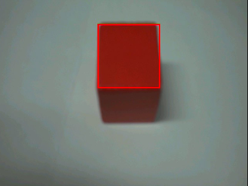

# 单颜色识别实验

## 前言

在上一章节中，已经了解了如何在CanMV下使用image模块实现快速线性回归计算的方法，本章将通过单颜色识别实验，介绍如何使用CanMV的find_blobs()方法实现单一颜色识别功能。在本实验中，我们将摄像头捕获的图像进行处理，查找图像中所有符合目标的色块，并将结果绘制并显示到显示器上。通过本章的学习，读者将学习到如何在CanMV下使用find_blobs()方法实现单一颜色识别的功能。

## Image模块介绍

### 概述

`Image` 类是机器视觉处理中的基础对象。此类支持从Micropython GC、MMZ、系统堆、VB区域等内存区域创建图像对象。此外，还可以通过引用外部内存直接创建图像（ALLOC_REF）。未使用的图像对象会在垃圾回收时自动释放，也可以手动释放内存。

支持的图像格式如下：

- BINARY
- GRAYSCALE
- RGB565
- BAYER
- YUV422
- JPEG
- PNG
- ARGB8888（新增）
- RGB888（新增）
- RGBP888（新增）
- YUV420（新增）

支持的内存分配区域：

- **ALLOC_MPGC**：Micropython管理的内存
- **ALLOC_HEAP**：系统堆内存
- **ALLOC_MMZ**：多媒体内存
- **ALLOC_VB**：视频缓冲区
- **ALLOC_REF**：使用引用对象的内存，不分配新内存

### API描述

‌Python中的Image模块是一个强大的图像处理工具，它提供了一系列函数和方法，可以用于图像元素绘制、图像滤波、图像特征检测、色块追踪、图像对比和码识别等。由于image模块功能强大，需要介绍的内容也比较多，因此本章仅介绍image模块中find_blobs()方法的使用。

#### find_blobs

```python
image.find_blobs(thresholds[, invert=False[, roi[, x_stride=2[, y_stride=1[, area_threshold=10[, pixels_threshold=10[, merge=False[, margin=0[, threshold_cb=None[, merge_cb=None]]]]]]]]]])
```

此函数用于查找图像中的所有色块，并返回一个包含每个色块对象的列表。有关`image.blob`对象的更多信息，请参阅相关文档。

【参数】

- thresholds：必须为元组列表，形式为[(lo, hi), (lo, hi), ...]，用于定义需要追踪的颜色范围。对于灰度图像，每个元组应包含两个值：最小灰度值和最大灰度值。函数将仅考虑落在这些阈值之间的像素区域。对于RGB565图像，每个元组需要包含六个值`(l_lo, l_hi, a_lo, a_hi, b_lo, b_hi)`，分别对应LAB色彩空间中的L、A和B通道的最小和最大值。该函数会自动纠正最小值和最大值的交换情况。如果元组包含超过六个值，则其余值将被忽略；若元组不足，则假定缺失的阈值为最大范围。

  **注释：**要获取目标对象的阈值，只需在IDE帧缓冲区内选择（单击并拖动）要跟踪的对象，直方图将实时更新。然后，记录下每个直方图通道中颜色分布的起始与结束位置，这些值将作为thresholds的低值和高值。建议手动确定阈值，以避免上下四分位数的微小差异。

  您还可以通过进入OpenMV IDE的“工具” -> “机器视觉” -> “阈值编辑器”，并通过GUI界面拖动滑块来确定颜色阈值。

- invert：参数用于反转阈值操作，使得仅在已知颜色范围之外的像素被匹配。

- roi：参数为感兴趣区域的矩形元组(x, y, w, h)。若未指定，ROI将默认为整个图像的矩形。操作仅限于该区域内的像素。

- x_stride：为查找色块时需要跳过的x像素数量。在找到色块后，直线填充算法将精确处理该区域。如果已知色块较大，可以增加x_stride以提高查找速度。

- y_stride：为查找色块时需要跳过的y像素数量。在找到色块后，直线填充算法将精确处理该区域。如果已知色块较大，可以增加y_stride以提高查找速度。

- area_threshold：用于过滤掉边界框区域小于此值的色块。

- pixels_threshold：用于过滤掉像素数量少于此值的色块。

- merge：若为True，则合并所有未被过滤的色块，这些色块的边界矩形互相重叠。margin可用于在合并测试中增大或减小色块边界矩形的大小。例如，边缘为1的两个重叠色块将被合并。

  合并色块可实现颜色代码的追踪。每个色块对象具有一个code值，该值为一个位向量。例如，若在`image.find_blobs`中输入两个颜色阈值，则第一个阈值对应的代码为1，第二个为2（第三个代码为4，第四个代码为8，以此类推）。合并色块时，所有的code通过逻辑或运算进行合并，以指示产生它们的颜色。这使得同时追踪两种颜色成为可能，若两个颜色得到同一个色块对象，则可能对应于某一种颜色代码。

  在使用严格的颜色范围时，可能无法完全追踪目标对象的所有像素，此时可考虑合并色块。若希望合并色块但不希望不同阈值的色块被合并，可以分别调用两次image.find_blobs。

- threshold_cb：可设置为在每个色块经过阈值筛选后调用的回调函数，以从即将合并的色块列表中过滤出特定色块。回调函数将接收一个参数：待筛选的色块对象。若希望保留色块，回调函数应返回True，否则返回False。

- merge_cb：可设置为在两个即将合并的色块间调用的回调函数，以控制合并的批准或禁止。回调函数将接收两个参数，即两个待合并的色块对象。若希望合并色块，应返回True，否则返回False。

注意：此功能不支持压缩图像和Bayer图像。

更多用法请阅读官方API手册：

https://developer.canaan-creative.com/k230_canmv/dev/zh/api/openmv/image.html

## 硬件设计

### 例程功能

1. 获取摄像头输出的图像，并使用image模块的find_blobs()方法查找图像上所有的目标色块并标记出来，最后将图像显示在LCD上。我们默认是查找红色色块，程序中也提供了绿色和蓝色的LAB值，我们可以根据自己需要设置，另外也可以使用CanMV IDE提供的阈值编辑器采集需要的LAB值，如果确定需要识别某个颜色，可以通过采集摄像头的缓存数据来采集需要的LAB值，这样识别效果会比较好。

### 硬件资源

1. 本章实验内容，主要讲解image模块的使用，无需关注硬件资源。


### 原理图

本章实验内容，主要讲解image模块的使用，无需关注原理图。

## 实验代码

``` python
import time, os, sys
from media.sensor import *  #导入sensor模块，使用摄像头相关接口
from media.display import * #导入display模块，使用display相关接口
from media.media import *   #导入media模块，使用meida相关接口

# 颜色识别阈值 (l_lo, l_hi, a_lo, a_hi, b_lo, b_hi) 即LAB模型，对应 LAB 色彩空间中的 L、A 和 B 通道的最小和最大值
# 下面的阈值元组是用来识别 红、绿、蓝三种颜色，你可以根据使用场景调整提高识别效果。
thresholds = [(0, 80, 40, 80, 10, 80), # 红色
              (0, 80, -120, -10, 0, 30), # 绿色
              (0, 80, 0, 90, -128, -20)] # 蓝色

try:
    sensor = Sensor() #构建摄像头对象
    sensor.reset() #复位和初始化摄像头
    sensor.set_framesize(Sensor.VGA)    #设置帧大小QVGA(320x240)，默认通道0
    sensor.set_pixformat(Sensor.RGB565) #设置输出图像格式，默认通道0

    # 初始化LCD显示器，同时IDE缓冲区输出图像,显示的数据来自于sensor通道0。
    Display.init(Display.ST7701, width = 800, height = 480, fps=60, to_ide = True)
    MediaManager.init() #初始化media资源管理器
    sensor.run() #启动sensor
    clock = time.clock() # 构造clock对象

    while True:
        os.exitpoint() #检测IDE中断
        clock.tick()  #记录开始时间（ms）
        img = sensor.snapshot() #从通道0捕获一张图
        blobs = img.find_blobs([thresholds[0]], pixels_threshold= 200) # 0,1,2分别表示红，绿，蓝色。
        for blob in blobs:
            img.draw_rectangle(blob[0], blob[1], blob[2], blob[3], color = (255, 0, 0),  thickness = 4)

        # 显示图片
        Display.show_image(img, x=round((800-sensor.width())/2),y=round((480-sensor.height())/2))
        print(clock.fps()) #打印FPS

# IDE中断释放资源代码
except KeyboardInterrupt as e:
    print("user stop: ", e)
except BaseException as e:
    print(f"Exception {e}")
finally:
    # sensor stop run
    if isinstance(sensor, Sensor):
        sensor.stop()
    # deinit display
    Display.deinit()
    os.exitpoint(os.EXITPOINT_ENABLE_SLEEP)
    time.sleep_ms(100)
    # release media buffer
    MediaManager.deinit()
```

可以看到一开始是先初始化了LCD和摄像头。接着在一个循环中不断地获取摄像头输出的图像，因为获取到的图像就是Image对象，因此可以直接调用image模块为Image对象提供的各种方法，然后将图像里所有符合目标的色块标记出来，最后在LCD显示处理好后的图像。

## 运行验证

将DNK230D开发板连接CanMV IDE，并点击CanMV IDE上的“开始(运行脚本)”按钮后，可以看到LCD上实时地显示这摄像头采集到的画面，如下图所示：



也可以在CanMV IDE看到摄像头采集的画面，如下图所示：


