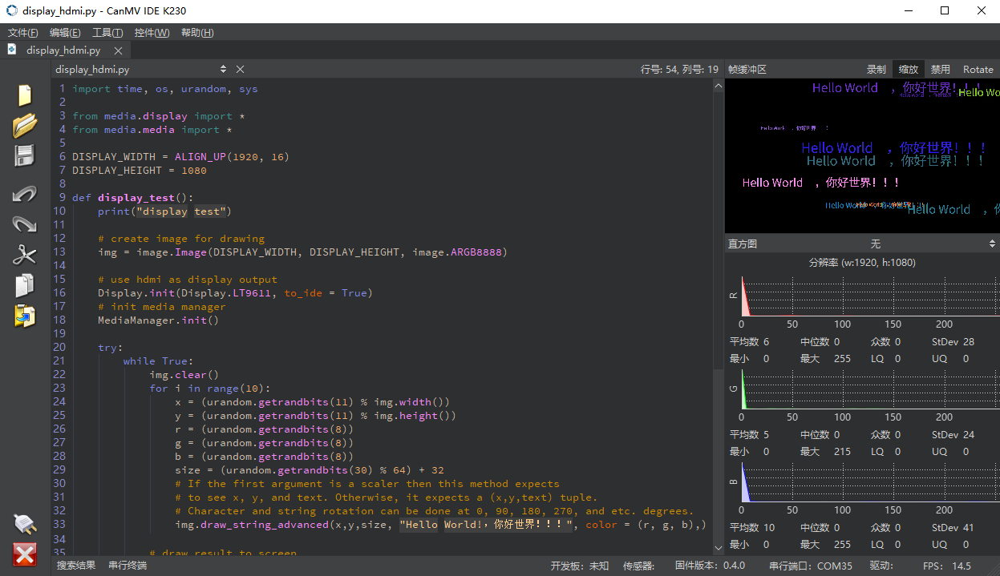

# CanMV IDE软件安装

## 概述

[**CanMV IDE**](https://github.com/kendryte/canmv_ide)是嘉楠科技官方提供的用于K230上进行CanMV应用软件开发的IDE软件。

K230上使用的CanMV IDE要求为4.0.5或以上版本，建议使用最新版本的CanMV IDE，可以通过[**这里**](https://github.com/kendryte/canmv_ide/releases/latest)下载最新版本的CanMV IDE安装包。

## 安装

双击打开下载好的CanMV IDE安装包，程序会启动CanMV IDE的安装向导。

根据安装向导的提示进行操作，即可完成CanMV IDE软件的安装。

CanMV IDE安装完成后，可通过安装程序自动在桌面创建的名为“CanMV IDE K230”的快捷方式打开CanMV IDE软件，或通过<kbd>win</kbd>+<kbd>s</kbd>搜索关键词“CanMV IDE K230”找到并打开CanMV IDE软件。

至此，CanMV IDE安装完毕。