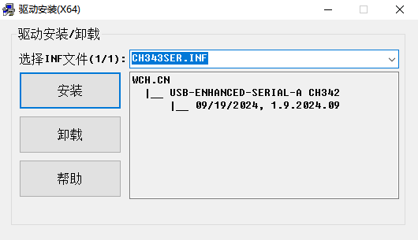
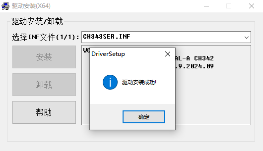
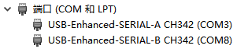

# CH342驱动安装

## 概述

[**CH342**](https://www.wch.cn/products/CH342.html) 是一个 USB 总线的转接芯片，实现 USB 转两个异步串口，可以供 K230 的两个核心同时使用。

CH342 的驱动程序可在其官网的[**资料下载**](https://www.wch.cn/search?q=CH342&t=downloads)页面进行下载，也可以通过[**这里**](https://www.wch.cn/downloads/CH343SER_EXE.html)下载最新的适用于 Windows 的一键式安装驱动程序。

## 安装

> 本章以 Windows 环境为例，介绍使用 CH342 的一键式安装驱动程序在 Windows 下安装 CH342 的驱动程序

双击打开下载好的 CH342 一键式安装驱动程序。

直接点击安装程序中的“安装”按钮，安装会自动安装 CH342 的驱动程序，并在安装成功后，进行弹窗提示。

CH342 驱动程序安装成功后，若正常连接了 CH342 设备，则能够在 Windows 的“设备管理器”中看到对应的两个端口设备。

> USB-Enhanced-SERIAL-A CH342 连接至 K230D BOX 的 UART0
>
> USB-Enhanced-SERIAL-B CH342 连接至 K230D BOX 的 UART4

至此，CH342 驱动程序安装完毕。