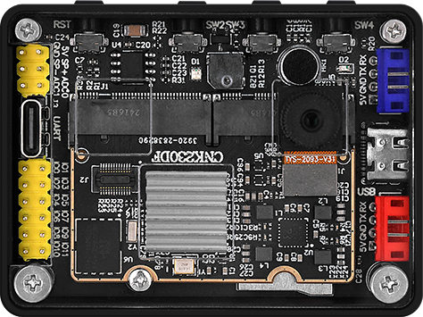

# 常见问题汇总（FAQ）

1. K230D BOX 上电后背面的电源指示灯亮度很低，是否正常？
   - 是正常的，因为电源指示灯在 K230D BOX 上电后是常亮的，且与摄像头都位于 K230D BOX 的背面，为了避免电源指示灯对摄像头成像的影响，所以将电源指示灯的亮度调低。

2. CanMV IDE 无法连接 K230D BOX?
   - 请确保 K230D BOX 的 USB 线连接正常，K230D BOX 只有侧边的 USB 口能通与 CanMV IDE 进行连接。

3. 通过 USB 口无法给 K230D BOX 供电？
   - K230D BOX 具有侧边和背面两个 USB 口，侧边的 USB 口用于供电和连接 CanMV IDE，而背面的 USB 口仅用于与上位机进行串口通讯的调试作用，背面的 USB 口无供电功能。

4. K230D BOX 运行时，整体温度较高，是否正常？
   - 是正常的，因为 K230D BOX 上搭载的 Kendryte K230D 芯片，其采用内部集成了两个 RISC-V 高能效计算核心和嘉楠的第三代自研 KPU，同时因为 K230D BOX 小巧的体积，散热条件有限，所以整体温度较高。
   - 当然，可以将产品包装盒里附带的散热片贴在 K230D 芯片上，以帮助 K230D 散热。
   