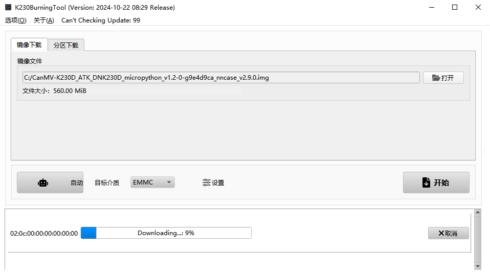

# 固件烧录

## 前言

K230D BOX 在出厂前默认都会在其内部的 SD NAND 上提前烧录好 CanMV 固件，用户无需烧录固件即可直接上手使用。

一般情况下，用户无需主动固件烧录，只有在需要更新固件或需要从 TF 卡启动等情况时，才需要进行固件烧录。

## 固件说明

用户可从 K230D BOX 的资料盘中获取编译好的 CanMV 固件，存放 CanMV 固件的目录路径为`资料盘/6，软件资料/软件/CanMV固件/`。

> 目录下存放的是固件的压缩包，需要解压后使用

在上述路径中，存放了两类 CanMV 固件，固件的描述如下：

| 固件                                                         | 描述                     |
| ------------------------------------------------------------ | ------------------------ |
| CanMV-K230D_ATK_DNK230D_micropython\_\{canmv_revision\}\_nncase\_\{nncase_version\}.img | CanMV 固件（SD NAND 启动） |
| CanMV-K230D_ATK_DNK230D_micropython\_\{canmv_revision\}\_nncase\_\{nncase_version\}\_tf.img | CanMV 固件（TF 卡启动）    |

## 固件烧录工具

本教程使用的 K230D 固件烧录工具为 **K230BurningTool**，软件是嘉楠科技官方提供的用于 K230D 固件烧录的图形化软件，有 Windows 和 Linux 两种版本可供选择，可以通过[**这里**](https://kendryte-download.canaan-creative.com/developer/common/K230BurningTool-v2.0.0/)进行下载。

### 安装

> 本章以 Windows 环境为例，介绍使用 K230BurningTool 的安装

在[**下载页面**](https://kendryte-download.canaan-creative.com/developer/common/K230BurningTool-v2.0.0/)下载 **K230BurningTool-Windows-v2.0.0-0-g0c27e7f.zip**，解压后即可直接使用，无需安装。

### 使用

嘉楠科技官方提供了 K230BurningTool 的使用说明，可以通过[**这里**](https://kendryte-download.canaan-creative.com/developer/common/K230BurningTool-v2.0.0/K230BurningTool.pdf)下载。

## 固件烧录

>  对 K230 进行固件烧录前，需先设置其进入 BootROM 模式，K230D BOX 进入 BootROM 模式的方式如下
>
>  **确保设备没有插入 TF 卡 --> 设备上电 --> 按住 KEY2 不放 --> 单击复位按键 --> 松开 KEY2**
>
>  若 K230D BOX 的 UART0 输出 “**boot failed with exit code 19**”，则说明 K230D BOX 已经成功进入 BootROM 模式，否则请重试上述步骤。
>
>  若需要将固件烧录至 TF 卡中，则在进入 BootROM 模式后，在将 TF 卡插入 K230D BOX。
>
>  > K230D BOX 的 UART0 输出可通过板载的 CH342，并借助相应的上位机软件进行观察。
>  >
>  > CH342 的驱动安装教程，请见 [CH342 驱动安装](../set-up-development-environment/ch342-driver-install)。

### 1. 打开K230BurningTool.exe

双击 K230BurningTool 安装目录下的 `bin/K230BurningTool.exe` 文件打开烧录软件

### 2. 选择固件文件

请参考[固件说明](#固件说明)在"镜像文件"一栏中选择正确的固件文件。

> 若需要烧录固件至 K230D BOX 板载的 SD NAND 中，则请选择从 SD NAND 启动的固件
>
> 若需要烧录固件至外置的 TF 卡中，则请选择从 TF 卡启动的固件

**选择错误的固件可能导致设备运行异常，甚至可能导致不可逆的硬件损坏。**

### 3. 选择目标介质

在“目标介质”下拉列表中选择对应的目标介质。

> | 目标介质 | 说明                                                 |
> | -------- | ---------------------------------------------------- |
> | EMMC     | K230D 的 MMC0 接口连接的设备，对应 K230D BOX 板载的 **SD NAND** |
> | SD Card  | K230D 的 MMC1 接口连接的设备，对应 K230D BOX 外置的 **TF 卡**    |
> | 其他     | K230D BOX 未使用                                      |

### 4. 开始烧录

> **固件烧录会损坏目标介质中的数据，如有需要，请在开始烧录前，做好目标介质中数据的备份工作。**

配置好“镜像文件”和“目标介质”后，其余的配置项保持默认，点击“开始”按钮后，即可开始对 K230D BOX 进行固件烧录。

固件烧录时，软件底部的信息框会显示固件烧录进度

固件烧录成功后，软件底部的信息框会显示固件烧录结果

### 5. 运行固件

K230D BOX 复位后默认从板载的 SD NAND 启动，

若需要从 TF 卡启动，请将正确烧录好固件的 TF 卡插入 K230D BOX，并在 KEY2 按下时，单击复位按键，即可从 TF 卡启动固件。