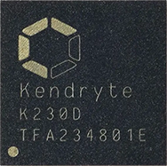
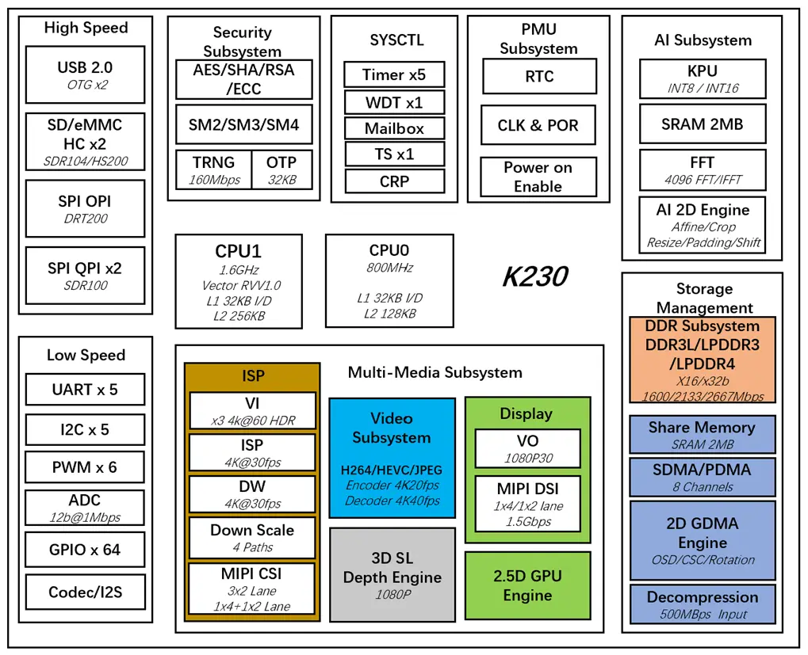

# K230D与CanMV介绍

## K230D介绍

K230D 是嘉楠科技推出的一款基于 RISC-V 架构的 AIoT 芯片，该芯片采用多异构单元加速计算架构，集成了两个 RISC-V 高能效计算核心，内置嘉楠第三代自研 KPU 智能计算单元，具备多精度 AI 算力，广泛支持通用的 AI 计算框架，部分典型网络的利用率超过了 70%。

该芯片同时具备丰富多样的外设接口，以及 2D、2.5D 等多个标量、向量、图形等专用硬件加速单元，可以对多种图像、视频、音频、AI等多样化计算任务进行全流程计算加速，具备低延迟、高性能、低功耗、快速启动、高安全性等多项特性。

### 功能框图

### 核心参数

| 参数     | 描述                                                         |
| -------- | ------------------------------------------------------------ |
| CPU      | CPU0：RISC-V处理器，0.8GHz，32KB I-Cache，32KB D-Cache，128KB L2 Cache CPU1：RISC-V处理器，1.6GHz，32KB I-Cache，32KB D-Cache，256KB L2 Cache，128bit RVV 1.0扩展 |
| KPU      | 6TOPS 等效算力，支持 INT8 和 INT16 典型网络性能： Resnet 50 ≥ 85FPS@INT8 Mobilenet_v2 ≥ 670FPS@INT8 YoloV5S ≥ 38FPS@INT8 |
| DPU      | 3D 结构光深度引擎，最大分辨率支持 1920\*1080                 |
| VPU      | H.264 和 H.265 编码器和解码器最大分辨率支持 4096\*4096 编码器性能：3840\*2160@20fps 解码器性能：3840\*2160@40fps JPEG 编解码器：支持最大 8K（8192\*8192）分辨率 |
| DDR      | 128MB LPDDR4                                                 |
| 图像输入 | 支持最大3路 MIPI CSI，1x4lane+1x2lane 或 3x2lane             |
| 显示输出 | 1路 MIPI DSI, 1x4 lane 或 1x2 lane 最大分辨率 1920\*1080@60FPS |
| 片上接口 | 5 x UART 5 x I2C 5 x PWM 50 x GPIO + 6 x PWM GPIO 1 x USB 2.0 OTG 2 x SDxC：SD 3.01，eMMC 5.0 3 x SPI：1 x OSPI + 2 x QSPI WDT /RTC / Timer |

## CanMV介绍

[**CanMV**](https://github.com/kendryte/canmv_k230) 是嘉楠科技为 K230D 提供的 SDK 之一，是嘉楠科技创建和维护的一个开源项目，其目的是通过在 K230D 上集成 MicroPython，使得开发者能过够方便快捷的使用 MicroPython 语法在 K230D 上开发和实现 AI 应用。