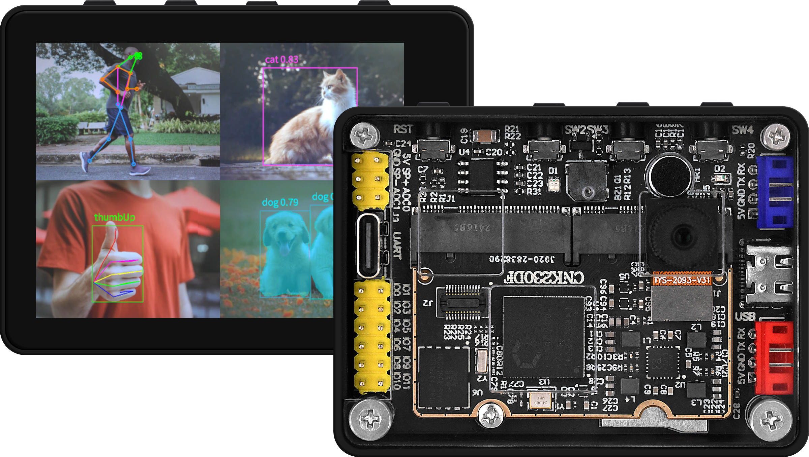
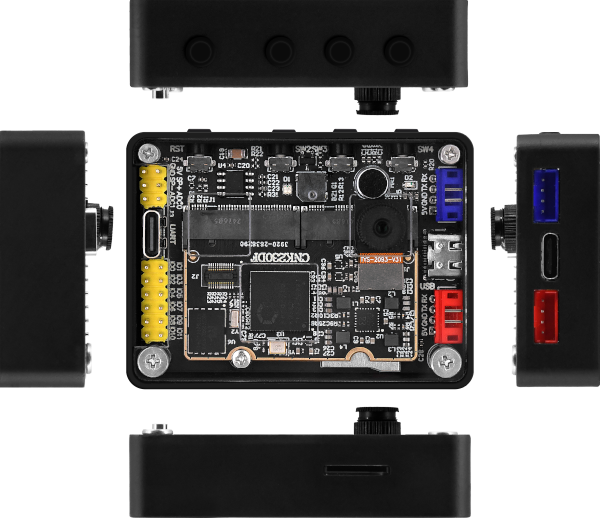
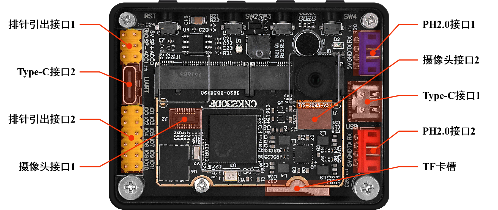
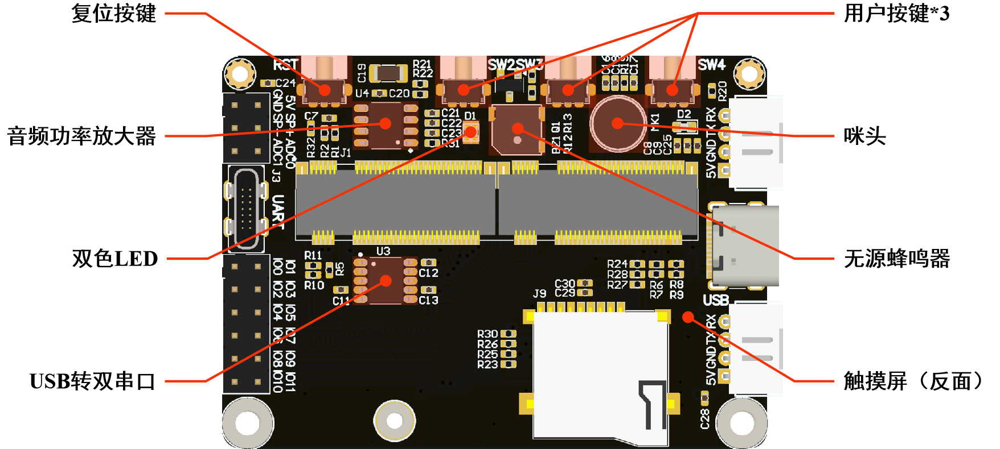
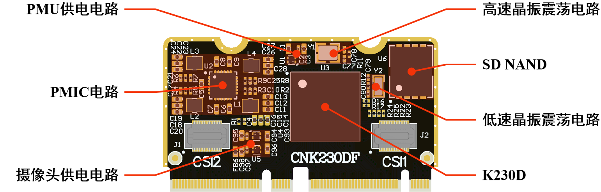

# K230D BOX介绍

K230D BOX是正点原子以K230D为核心推出的开发板，主要应用于人工智能与机器视觉等的应用开发，同时非常适合用于学习K230D芯片的开发。

## 外观

K230D BOX整体采用定制的外壳对主板以及屏幕进行固定和保护，背面是一块定制的透明亚克力，透过亚克力可以看到，K230D BOX内部主板采用了底板+核心板的形式，核心板与底板通过两对M.2进行连接，从而实现电源供给与数据交互。

K230D BOX整理小巧、美观，其与其内部的底板、核心板的三维尺寸如下

|                                       | 长（mm） | 宽（mm） | 高（mm） |
| ------------------------------------- | -------- | -------- | -------- |
| K230D BOX（不含摄像头、按键等突起物） | 64.30    | 47.60    | 15.40    |
| DNK230D（底板）                       | 60.00    | 43.30    | -        |
| CNK230DF（核心板）                    | 44.20    | 25.00    | -        |

## 接口介绍

K230D BOX引出了多种接口，方便用户开发和使用

| 接口                         | 描述                                                         |
| ---------------------------- | ------------------------------------------------------------ |
| Type-C 接口1                 | 支持 USB OTG（默认为 Device ） 主要用于设备的电源供给以及进行 USB 通讯 CanMV IDE 使用该接口与设备连接 |
| Type-C 接口2                 | USB 转双串口（不具备供电功能） 通过该接口可直接与 K230D 的 UART0 和UART4 进行通信 |
| 排针引出接口1                | 主要引出三组功能接口 1. 5V 电源和地 2. 扬声器接口 3. 两个 ADC 采集引脚（0V ~ 1.8V） |
| 排针引出接口2                | 共引出 12 个 GPIO（GPIO14 ~ GPIO25） 均已做等长处理     |
| 摄像头接口1 摄像头接口2 | 分别连接至 K230D 的 MIPI CSI1 和 MIPI CSI2，支持如下摄像头： GC2093 |
| PH2.0 接口1 PH2.0 接口2 | 可对外 5V 供电，并支持 UART、IIC、GPIO 等 PH2.0 接口1：UART1 或 IIC1 或 GPIO40 \~ 41 PH2.0 接口2：UART2 或 IIC3 或 GPIO44 \~ 45 |
| TF 卡槽                      | 用于外接 TF 卡 连接至 K230D 的 MMC1 接口                |

## 底板硬件资源

| 硬件           | 描述                                                         |
| -------------- | ------------------------------------------------------------ |
| 复位按键       | 用于对 K230D 芯片进行硬件复位                                |
| 用户按键*3     | 三个用户按键，从左到右依次定义为 KEY0、KEY1、KEY2 KEY0：有效电平为低 KEY1：有效电平为低 KEY2：有效电平为高（默认上拉） KEY2 同时作为 K230D 的启动模式配置按键（复位过程中，按住 KEY2 不放，则从 SD NAND 启动，否则从 TF 卡启动） |
| 触摸屏         | 2.4‘ 高分触摸显示屏（640*480）                               |
| 双色 LED       | 使能后发出红光和/或蓝光 有效电平为低                    |
| 无源蜂鸣器     | 可发出一定频率范围内的声音 需使用 PWM 驱动，标称震荡频率为 4KHz |
| USB 转双串口   | USB 转两路异步串口 可实现上位机通过一个 USB 同时与 K230D 的大、小核进行串口通信 两路串口连接至 K230D 的 UART0 和 UART4 |
| 咪头           | 作为 K230D 模拟音频接口的音频输入源                          |
| 音频功率放大器 | 用于将 K230D 模拟音频接口的输出进行功率放大后，驱动后级的扬声器 在驱动 4Ω 扬声器的情况下，可提供高达 3W 的功率输出 |

## 核心板硬件资源

| 硬件             | 描述                                                         |
| ---------------- | ------------------------------------------------------------ |
| K230D            | 嘉楠科技推出基于RISC-V架构的AIoT芯片 集成两个 RISC-V 高能效计算核心（1.6GHz 大核 + 0.8GHz 小核） 内置嘉楠第三代自研 KPU 智能计算单元（6TOPS等效算力） 内置 128MB LPDDR4 [**详细介绍**](./k230d-and-canmv-introduction#k230d介绍) |
| SD NAND          | 板载的存储介质，连接至 K230D 的 MMC0 接口                    |
| 低速晶振震荡电路 | 可为 K230D 提供 32.768KHz 的时钟，用于提供 K230D 内部 PMU子系统的 RTC 需要的低速时钟 |
| 高速晶振震荡电路 | 可为 K230D 提供 24MHz 的时钟，用于提供 K230D 的主系统需要的高速时钟 |
| PMU 供电电路     | 为 K230D 的 PMU 模块提供 1.8V 电压电源                       |
| PMIC 电路        | 为 K230D 的核心模块、DDR及其他外设等提供 4 路不同电压的电源  |
| 摄像头供电电路   | 可为接入的两个摄像头提供 3 路不同电压的电源                  |