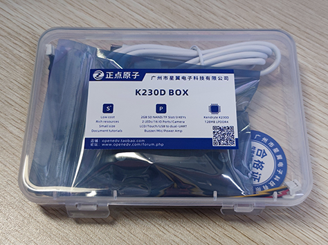
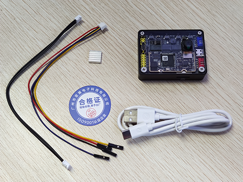
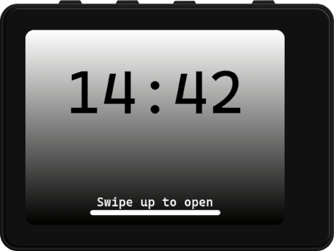

# 产品验收

在收到产品包裹后，请先根据自己的购买清单，核对收到的货物（通常情况下，产品包裹中会提供有发货单）。

## 外观检查

K230D BOX采用透明塑料盒进行包装，如下

透明塑料盒中包含了K230D BOX标配套餐中的所有物品，如还购买了其他产品，请单独验收。

在确认透明塑料盒外观误损坏后，打开透明塑料盒并取出其中的所有物品进行清点、检查

透明塑料盒中应包含如下物品

1. K230D BOX（默认含一个摄像头）
2. 散热片
3. USB线数据线（Type-A to Type-C）
4. PH2.0排线-4P
5. PH2.0转杜邦彩排线-4P
6. 合格证

请依次检查透明塑料盒中物品的数量和外观是否无异。

## 功能测试

对K230D BOX进行供电，其背面的蓝色LED微微发亮，待系统启动后，将自动运行综合例程

进入综合例程后，通过触摸的方式测试综合例程的各项功能，重点观察屏幕显示、触摸、摄像头、蜂鸣器、双色LED等功能是否正常。

如在使用过程中遇到任何问题，请与我们联系。